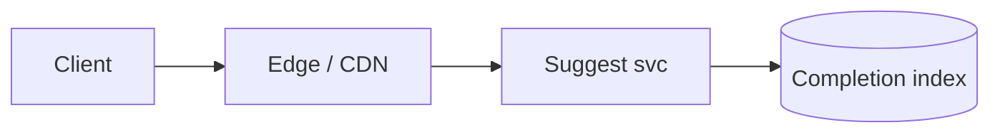
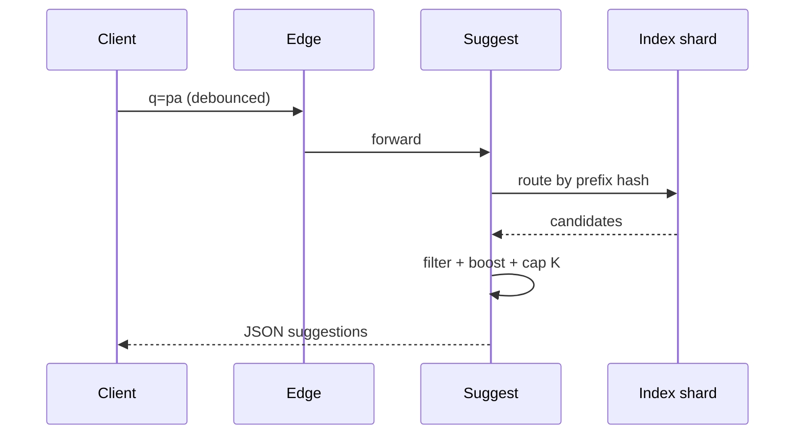

# HLD — Search Autocomplete System

> **Uber SDE-2 HLD — drive order in this doc:** **§1** clarify → FR → NFR → **§2** scale → **§3** core entities + APIs → **§4** architecture → **§5** deep dive and evolution → **§6** scaling → **§7** reliability → **§8** tradeoffs → **§9** observability and security → **§10** patterns → **Closing**. Treat **Human interaction** cue blocks (headings in this doc) as *spoken* cues—**paraphrase**; do not read every row. **Bar raiser** listens for **ownership**, **failure modes**, and **honest tradeoffs**. Canonical spine: [HLD-UBER-SDE2-INTERVIEW-SPINE.md](./HLD-UBER-SDE2-INTERVIEW-SPINE.md).

## 1. Clarify requirements

### 1.0 Live flow

#### Live voice (real interviewer room)

**Sound like you’re *deciding*, not reciting:** one idea per breath, then **pause**. Tables here are **backup**—if your eyes are down for more than a couple of seconds, you’ve slipped into reading the doc.

**Bridge phrases (mix naturally):** *“Let me **name the fork** first…”* · *“I’ll **default to X**—tell me if your bar is stricter.”* · *“The reason I ask is it changes **who owns the commit** / **what’s on the hot path**.”* · *“I’ll **over-answer** one layer, then stop—**where should I zoom**?”*

**Ping them (conversation, not monologue):** *“Does that match how you’d scope it?”* · *“If we only deep-dive one thing, is it **A** or **B**?”* (swap **A/B** for two tensions from *your* opening paragraph above.)

**This topic in one breath:** “Autocomplete is **tight p99 prefix**—dedicated **FSA/trie**, not full search per keystroke.”

**`Verbatim` / `Live` cues:** say a line **once**, then **rephrase** the next time—verbatim twice in a row reads *canned*.

**Opening (~once):** *“I’ll align **prefix vs fuzzy**, **personalization**, **abuse**, and **latency** (often **stricter** than full search); then **index shape**, **APIs**, **architecture**. **Pause after the diagram**—**Trie vs n-gram**, **ranking**, or **multi-tenant**?”*

**Thinking transitions:** *“Autocomplete is **read-only**, **prefix-biased**, and **budgeted**—**K small**.”*

**Live rule:** **Paraphrase** §1 tables; deeper rows = **only if probed**.

**Micro-pauses:** after **corpus** + **latency** answers, reflect back: *“So I can treat this as **prefix-first**, **strict p99**, and **safe corpus**—I’ll bias the index that way.”*

### 1.1 Clarify

| Topic | Say it like this in the room |
|--------------------------|-------------------------------|
| **Corpus** | “**Queries**, **places**, **SKUs**—which prefixes?” |
| **Personalization** | “**My recent** searches mixed in?” |
| **Locale** | “Per-language **normalization**?” |
| **P13n policy** | “**Safe** suggestions—block toxic strings?” |

#### Human interaction (clarify requirements — think out loud & evolve scope)

**Habit:** *“Autocomplete is **budgeted read**—I lock **corpus**, **K**, **p99**, and **abuse** before I argue trie vs n-gram.”*

**Live:** *“If you want **fuzzy** day one, I’ll say it **explicitly** costs **tail latency**—I’d rather **phase** it.”*

| Stage | Default | Evolve when… |
|-------|---------|----------------|
| **v1** | **Prefix-only**, **FSA/trie**, **small K**, **edge cache** | p99 met |
| **v2** | **Distributed** index + **rate limits** + **coalesce** | Hot prefixes |
| **v3** | **Personal overlay** + **fuzzy** (tight budget) | Product demands |

### 1.2 Functional requirements (FR) — after alignment, say this as “what we must build”

#### Human interaction (FR — how to explain after alignment)

**Habit:** *“Once scope is clear, here’s what we’re building—in plain terms.”*

**Live:** one **spoken** pass from the table below (~60–90 s); use **thinking transitions** from [§1.0](#live-flow-open) when you move **FR → NFR**.

| FR area | Say it like this |
|---------|-------------------|
| **Suggest** | “Given **prefix** + **context** (geo, user), return **≤K** completions in **order**.” |
| **Highlight** | “Optional **offsets** for UI bolding.” |
| **Handoff** | “Selecting suggestion runs **full search** (see [26-hld-restaurant-search-nearby.md](./26-hld-restaurant-search-nearby.md)).” |

### 1.3 Non-functional requirements (NFR)

#### Human interaction (NFR — how to say “how good” without drowning in numbers)

**Habit:** *“Non-functionally I’m optimizing for **latency tail**, **correctness of ordering**, and **abuse resistance**—numbers are illustrative until you correct me.”*

**Live:** hit **latency**, **determinism / index version**, **availability when a shard is sick**, **privacy** (no leaking other users’ secrets in suggestions).

| NFR | Say it like this |
|-----|------------------|
| **Latency** | “Often **p99 < 50ms**—confirm; **edge cache**.” |
| **Correctness** | “**Deterministic** given index version; **no** duplicates.” |

### 1.4 Invariants

**Invariant:** “Suggestions are drawn from an **allowlist corpus** (plus **safe** user history); **blocked** terms **never** appear.”

| Beat | Say it like this |
|------|------------------|
| **Bridge** | “**Completion index** separate from **full-text** index.” |
| **Core split** | “**Retrieve top-K** then **light rank**.” |

### Key insight (say early)

Use a **dedicated completion structure** ( **FSA / trie / edge n-grams** ) with **small K** and **hard timeouts**—do not reuse **heavy** search for **every keystroke**.

#### Key anchors

1. “**Debounced** client + **server rate limit**.”  
2. “**Popular** boosts.”  
3. “**Sharded** by **prefix head**.”

---

## 2. Estimate scale

#### Human interaction (scale — round numbers, invite correction)

**Habit:** *“I’ll use **round** numbers to find the **hot path**—happy to rescale.”*

**Live:** *“Keystrokes dominate QPS—often **an order of magnitude** above page views; **prefix cardinality** and **head vs tail** prefixes matter more than raw corpus size for **memory**.”*

| Dimension | Illustrative |
|-----------|----------------|
| QPS | **10×** page views (keystrokes) |
| Corpus | **10M–100M+** strings (tune) |

---

## 3. APIs and data model

### 3.0 Core entities (say before API tables)

| Entity | Owns / lifecycle (one line) |
|--------|-----------------------------|
| **Suggestion** | Immutable **view** built from index + rules at request time (small **K**). |
| **Completion index shard** | **Offline/online** builders own **versioned** FSA/trie segments; **read-only** at query. |
| **Corpus term** | Curated **document** in allowlist; scored for **boost** / popularity. |
| **User prefix history** (optional) | Per-user **recent safe queries**; TTL + cap; never bypasses **blocklist**. |
| **Suggest request** | Stateless; **trace_id** + **index_version** for determinism / debugging. |

#### Human interaction (API design — public contract + async telemetry)

**Live:** *“**GET** is **read-only** and **cacheable**; **`POST …/events`** is **async** select telemetry—never blocks typing path.”*

### 3.1 APIs

| API | Purpose |
|-----|---------|
| `GET /v1/suggest?q=pad&lat=&lng=` | Top-K |
| `POST /v1/suggest/events` | Selected suggestion (async) |

### 3.2 Index

- **Key:** normalized prefix bucket.  
- **Value:** list of `(text, score, type, id)` capped.  
- **FSA** (Finite State Automaton) for **compact** memory.

---

## 4. High-level architecture

#### Human interaction (architecture — one diagram pass, then pause)

**Habit:** *“I’ll walk **client → edge → service → index** once, then I’ll **pause** for where you want depth.”*

**Live:** *“**Edge** absorbs **identical** prefixes; **service** is stateless; **index** is **sharded** by prefix head; **events** are **async** so typing stays cheap.”*

### 4.1 Phases

| Phase | Ship |
|-------|------|
| **1** | In-memory trie per host + sticky routing |
| **2** | Distributed FSA + **regional** replicas |
| **3** | **Personal overlay** per user shard |

---

## 5. Deep dive: `GET /v1/suggest`

#### Human interaction (deep dive — critical flow, optimizations & evolution)

**Habit:** *“Default path: **route → retrieve → rank → cap K → respond**; I’ll flag **where** I’d add fuzzy or personalization later.”*

**Live:** narrate the **sequence diagram** once; end with: *“If you want depth: **hot prefix**, **ranking budget**, or **multi-tenant isolation**?”*

**Live (evolution):** *“**v1** in-memory trie + sticky routing. **v2** distributed **FSA** + regional replicas. **v3** personal overlay shard—**index shape** evolves, **invariants** (safe corpus, small K) don’t.”*

### 🎯 Bottleneck Anchor

“**Thundering herd** on viral prefix + **rank tail**—**cache** **popular prefixes** at **edge**.”

**Taking a stance:** *“**No fuzzy** on v1 unless interviewer insists—add **max edit distance 1** with **tight** budget later.”*

---

## 6. Scaling and bottlenecks

#### Human interaction (scaling — tie to the diagram)

**Live:** *“**Fan-in** is per **prefix**; **edge cache** + **request coalescing** beat buying more **RAM** first; **FSA** buys **memory** for **tail** terms.”*

| Risk | Mitigation |
|------|------------|
| **Hot prefix** | Edge cache + **coalesce** identical in-flight |
| **Memory** | FSA compression |

---

## 7. Reliability and failure handling

#### Human interaction (reliability — user-visible degrade)

**Live:** *“**Partial beats empty**: if a shard is late, I return **fewer** suggestions with a **stale-ok** cache slice; I **never** silently substitute **unsafe** terms.”*

- **Shard down:** shorter list from **replica**; never **500** empty if **degraded** list exists.

---

## 8. Tradeoffs and alternatives

#### Human interaction (tradeoffs — pick a default)

**Live:** *“**Default**: dedicated **FSA/trie** service for **prefix**; I’d reach for **managed search completion** only if **ops** or **multi-field** complexity dominates **tail latency** risk.”*

| Choice | Trade |
|--------|--------|
| **Trie in RAM** | Speed vs **rebuild** time |
| **OpenSearch completion suggester** | Less ops vs **tail latency** |

---

## 9. Monitoring, observability, and security

#### Human interaction (observability — SLIs tied to user pain)

**Live:** *“**SLI**: suggest **p99** and **empty rate** after degrade; **SLO** alert when **blocklist** fires spike (**abuse** or bad deploy); logs **never** contain raw **PII** prefixes at full fidelity if policy says no.”*

**Metrics:** **p99**, **cache hit**, **select rate**, **toxic block** hits.  
**Security:** **Rate limit** per IP/user; **sanitize** logging.

---

## 10. Design patterns, data structures & best practices

#### Human interaction (design patterns, data structures & best practices)

**Verbatim (say on the board, ~30s):** *“**Trie or FSA** for prefix completion on each shard, **min-heap** to merge **K** candidates across shards, **edge cache** with **stale-ok** for hot prefixes, **single-flight** so one miss doesn’t stampede origin, **rate limits** and **request coalescing** at the gateway, and a **blocklist** layer before anything hits the index.”*

**Live (tie to boxes):** *“**Trie/FSA** on the index shard; **edge cache** on the CDN; **rate limit** + **coalesce** in front of the service; **heap** when I’m **merging** shards.”*

| Pattern / DS | Where | One interview line |
|----------------|------|----------------------|
| **Trie / FSA (DAWG)** | Completion index | “Prefix lookup is **O(len)** of the prefix, not scan the corpus.” |
| **Min-heap (top-K merge)** | Shard merge | “Each shard returns **K**; I merge by score with a **bounded** heap.” |
| **Edge cache + stale-while-revalidate** | CDN | “**Partial beats empty**—I’d rather fewer suggestions than **500**.” |
| **Single-flight / coalescing** | Origin | “**Hot prefix** gets one backend fetch for the herd.” |
| **Rate limit + token bucket** | Gateway | “Stop **abuse** and **thundering herd** before the trie.” |
| **Bloom / blocklist (optional)** | Pre-filter | “Cheap **negative** path for toxic or banned prefixes.” |

**Live:** pick **five or six** rows above and **stop**—do not read the table line-by-line.

---

## Closing notes

#### Human interaction (closing — calm recap)

**Habit:** *“If we have a minute left, I’d recap **defaults** and **one** honest weakness.”*

**Live:** *“**Dedicated completion index**, **small K**, **edge + limits** for **herd**; **separate** from **full search**; **biggest risk** is **hot prefix** + **rank budget**—I’d prove it with **p99** and **cache hit** in prod.”*

| Do | Avoid |
|----|--------|
| **Dedicated completion index** | Full OpenSearch per keystroke |
| **Small K** | Returning 50 items |

---

## Bar-raiser follow-ups

#### Human interaction (bar raiser — short, confident)

**Live:** *“Happy to go deeper on **sharding**, **personal overlay**, or **fuzzy**—which is most interesting to you?”*

| They ask | Say it like this |
|----------|------------------|
| **Multi-field** | “**Union** suggestions with **round-robin** by type + **score**.” |

---

## 60-second close

#### Human interaction (60-second close — then stop)

**Habit:** *“Four sentences max, then **silence**.”*

| Beat | Say it like this |
|------|------------------|
| **Recap** | “**FSA/trie**-backed **prefix** retrieval, **K** small, **edge cache**, **rate limits**; **separate** from **full search**; **bottleneck** **hot prefixes**.” |

---

**Related:** keyword / message search — [15-hld-keyword-message-search.md](./15-hld-keyword-message-search.md).

---
