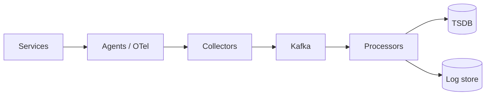
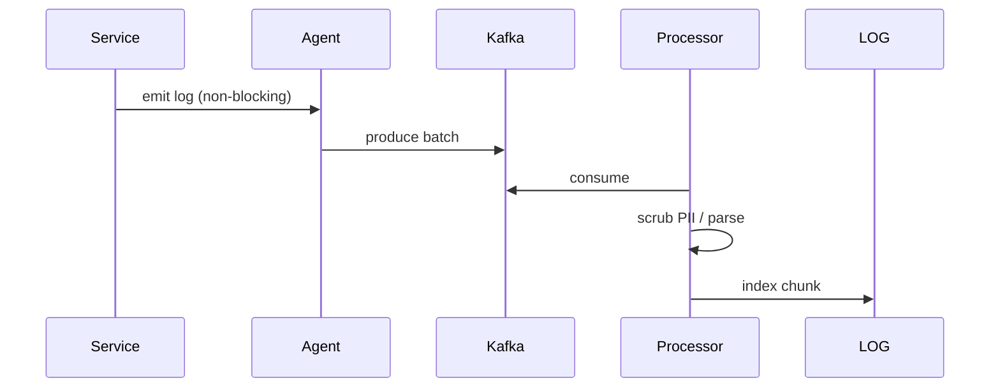

# HLD — Logging / Metrics Pipeline

> **Uber SDE-2 HLD — drive order in this doc:** **§1** clarify → FR → NFR → **§2** scale → **§3** core entities + APIs → **§4** architecture → **§5** deep dive and evolution → **§6** scaling → **§7** reliability → **§8** tradeoffs → **§9** observability and security → **§10** patterns → **Closing**. Treat **Human interaction** cue blocks (headings in this doc) as *spoken* cues—**paraphrase**; do not read every row. **Bar raiser** listens for **ownership**, **failure modes**, and **honest tradeoffs**. Canonical spine: [HLD-UBER-SDE2-INTERVIEW-SPINE.md](./HLD-UBER-SDE2-INTERVIEW-SPINE.md).

## Interview delivery (golden thread — live thinking)

Bar-raiser polish: **user-first**, **explicit consistency**, **bottleneck**, **evolution**, **UX trust**, **default opinion** (not endless “A or B”). Full template + anti–document-mode habits: **[HLD-MASTER-DELIVERY-GOLDEN-FLOW.md](./HLD-MASTER-DELIVERY-GOLDEN-FLOW.md)** (read once; reuse every mock).

| Say early (out loud) | What interviewers grade | In this guide, nail it by… |
|---------------------|---------------------------|------------------------------|
| **User journey** | Product before boxes | Opening Section 1 with who does what; separate **read / write / async** before services. |
| **Consistency model** | Strong vs eventual, where | Stating **invariants** and what is **strict vs best-effort** before API trivia. |
| **Bottleneck anchor** | What breaks first | Naming Section 5 **Bottleneck** + Section 6 hot paths + **first SLIs**. |
| **Evolution** | MVP → scale → advanced | Using **v1 / v2 / v3** (often Section 4.1 + Section 5); say **when** complexity earns its keep. |
| **UX awareness** | Trust on degrade | Saying what the user **sees** on partial failure (honest empty vs wrong vs spin forever). |
| **Strong opinion** | Defaults | *“I’d start with **X** because …; I’d switch to **Y** if …”*—lead Section 8 with a pick. |

**Do not:** read tables line-by-line · list ten patterns before a diagram · fence-sit.  
**Do:** signpost · pause · one diagram · deep dive **only** where they steer.

---

## 1. Clarify requirements

### 1.0 Live flow

#### Live voice (real interviewer room)

**Sound like you’re *deciding*, not reciting:** one idea per breath, then **pause**. Tables here are **backup**—if your eyes are down for more than a couple of seconds, you’ve slipped into reading the doc.

**Bridge phrases (mix naturally):** *“Let me **name the fork** first…”* · *“I’ll **default to X**—tell me if your bar is stricter.”* · *“The reason I ask is it changes **who owns the commit** / **what’s on the hot path**.”* · *“I’ll **over-answer** one layer, then stop—**where should I zoom**?”*

**Ping them (conversation, not monologue):** *“Does that match how you’d scope it?”* · *“If we only deep-dive one thing, is it **A** or **B**?”* (swap **A/B** for two tensions from *your* opening paragraph above.)

**This topic in one breath:** “Observability is **three signals + cardinality discipline**—I won’t block the request on Elasticsearch.”

**`Verbatim` / `Live` cues:** say a line **once**, then **rephrase** the next time—verbatim twice in a row reads *canned*.

**Opening (~once):** *“I’ll split **logs** (debugging) from **metrics** (SLIs) from **traces** (latency); align **retention**, **PII**, **cardinality**; then **ingest**, **storage**, **query**. **Pause after the diagram**—**cost**, **reliability**, or **schema**?”*

**Thinking transitions:** *“**Never** block the **request path** on **observability**—**async buffer**.”*

**Live rule:** **Paraphrase** §1 tables; go deep **only if probed**.

**Micro-pauses:** *“So logs are for **debug**, metrics are for **SLIs**, and neither may **blow cardinality** or leak **PII**—got it.”*

### 1.1 Clarify

| Topic | Say it like this in the room |
|--------------------------|-------------------------------|
| **Volume** | “**TB/day** class?” |
| **Query** | “**Keyword** log search vs **metrics** only?” |
| **Compliance** | “**PII scrub** at edge?” |
| **SLI** | “**RED/USE** metrics—**required**?” |

#### Human interaction (clarify requirements — think out loud & evolve scope)

**Verbatim:** *“I’m going to split three signals: **logs**, **metrics**, **traces**—and I want retention, PII policy, and cardinality rules before I draw Kafka boxes, because otherwise we’ll build a beautiful pipeline that bankrupts us.”*

**Verbatim (evolution):** *“**v1** agents to collectors to Kafka to TSDB + log store; **v2** add sampling + SLO dashboards; **v3** tiered storage + federated query.”*

### 1.2 Functional requirements (FR)

#### Human interaction (FR — after alignment)

**Verbatim:** *“Services emit structured telemetry; the pipeline parses, enriches, routes; operators query dashboards and logs—**never** synchronous hot-path writes to Elasticsearch.”*

| FR area | Say it like this |
|---------|-------------------|
| **Ingest** | “Agents / libs ship **logs**, **metrics**, **traces**.” |
| **Process** | “Parse, **enrich**, **sample**, **route**.” |
| **Store** | “Tiered **hot/warm/cold**.” |
| **Query** | “Dashboards + **ad-hoc** log query.” |

### 1.3 Non-functional requirements (NFR)

#### Human interaction (NFR — how it must behave)

**Verbatim:** *“At-least-once is fine if we dedupe with keys downstream; cost is controlled by **sampling**, **aggregation**, and **blocking** high-cardinality labels at ingest.”*

| NFR | Say it like this |
|-----|------------------|
| **Durability** | “**At-least-once** ingest; **dupes** ok downstream with **keys**.” |
| **Cost** | “**Sampling** + **aggregation** to control **cardinality**.” |

### 1.4 Invariants

**Invariant:** “**PII** never lands in **immutable** cold tiers **unredacted**; **high-cardinality** labels are **blocked** at **ingest**.”

| Beat | Say it like this |
|------|------------------|
| **Bridge** | “**Kafka** buffer → **stream processors** → **TSDB + log store**.” |
| **Core split** | “**Hot path** **fire-and-forget** to **local agent**.” |

### Key insight (say early)

**Unified pipeline** with **schema-on-write** for metrics and **indexed** logs—**shared** **enrichment** (service, region, trace id).

#### Key anchors

1. “**OTel**.”  
2. “**Cardinality guardrails**.”  
3. “**Tiered retention**.”

---

## 2. Estimate scale

#### Human interaction (estimate scale)

**Verbatim:** *“We’re talking **PB/day** logs and **billions** of metric samples—so partitioning, compaction, and cardinality policy are first-class design, not an afterthought.”*

| Dimension | Illustrative |
|-----------|----------------|
| Log volume | **PB-scale** discussion for big cos |
| Metric samples | **Billions**/day |

---

## 3. APIs and data model

### 3.0 Core entities (who owns what — say before interfaces)

| Entity | Owns / lifecycle (one line) |
|--------|-----------------------------|
| **LogRecord / Metric sample** | Immutable event with **bounded** labels + **trace_id**. |
| **Collector** | Authenticate + batch + backpressure. |
| **Stream partition** | Kafka ordering unit—**hash** on service/hour not raw user for metrics. |

#### Human interaction (API design)

**Verbatim:** *“Push via agents, pull via Prometheus scrape for metrics—different paths, same **enrichment** layer, same **PII** rules.”*

### 3.1 Interfaces

- **Push:** agents **HTTP/gRPC** to **collector**.  
- **Pull:** Prometheus **scrape** (metrics).  

### 3.2 Schema

- **LogRecord:** `ts, service, level, trace_id, message, attrs`.  
- **Metric:** `name, labels{bounded}, value, ts`.

---

## 4. High-level architecture

#### Human interaction (high-level architecture / HLD)

**Verbatim:** *“One sentence: services talk to local agents **non-blocking**, agents batch into Kafka, processors scrub and route into **TSDB for numbers** and **log index for strings**, and everything is correlated with **trace_id**.”*

### 4.1 Phases

| Phase | Ship |
|-------|------|
| **1** | ELK or Loki + Prometheus |
| **2** | **Sampling** + **SLO dashboards** |
| **3** | **Tiered** + **federated** query |

---

## 5. Deep dive: hot path → durable

#### Human interaction (deep dive — critical flow, optimizations & evolution)

**Verbatim:** *“Hot path is: emit structured log to agent buffer, flush batch to Kafka, processor consumes, scrubs PII, writes index chunk; if Kafka lags during an incident, we shed **debug** tiers before we drop **RED** metrics.”*

**Verbatim (evolution):** *“**v1** basic pipeline; **v2** tail sampling for traces + SLO burn alerts; **v3** tiered cold storage with export controls.”*

### 🎯 Bottleneck Anchor

“**Kafka** **consumer lag** during incidents—**back-pressure** and **drop** **debug** verbosity tiers.”

**Taking a stance:** *“**Structured JSON** logs + **trace_id** correlation—**grep**-hostile unstructured **deprecated**.”*

---

## 6. Scaling and bottlenecks

#### Human interaction (scaling & bottlenecks)

**Verbatim:** *“Cardinality explosion is the silent killer—**allowlist** metric labels, aggregate early, and partition Kafka to avoid **hot partitions** from putting **user_id** in the metric key.”*

| Risk | Mitigation |
|------|------------|
| **Cardinality explosion** | **Allowlist** labels; **aggregate** early |
| **Hot partition** | **Hash** key on `(service, hour)` not **user_id** for metrics |

---

## 7. Reliability and failure handling

#### Human interaction (reliability & failure handling)

**Verbatim:** *“Agent disk full means **spill** and **shed** lowest priority; Kafka down means bounded local buffer—**never** infinite memory pretending to be reliability.”*

- **Agent disk full:** **spill** + **shed** lowest priority.  
- **Kafka down:** **buffer** locally with **caps**—**never** infinite.

---

## 8. Tradeoffs and alternatives

#### Human interaction (tradeoffs & alternatives)

**Verbatim:** *“Full fidelity logs are amazing until the bill arrives—**sampling** and **structured** logs are how you keep debuggability without bankrupting storage.”*

| Choice | Trade |
|--------|--------|
| **Full fidelity logs** | Debuggability vs **cost** |
| **Head sampling traces** | Cost vs **coverage** |

---

## 9. Monitoring, observability, and security

#### Human interaction (monitoring, observability & security)

**Verbatim:** *“Meta-observability: monitor **ingest lag**, **drop rate**, **parse errors**; security is **RBAC** on queries and audited exports because logs are sensitive.”*

**Meta:** monitor the **pipeline** lag, **drop rate**, **parse errors**.  
**Security:** **RBAC** on log query; **audit** exports.

---

## 10. Design patterns, data structures & best practices

#### Human interaction (design patterns, data structures & best practices)

**Verbatim (say 5–6 on the board):** *“**Sidecar/agent buffering**, **Kafka as durable buffer**, **CQRS** between OLTP and observability stores, **schema-on-write** for metrics, **tail sampling** for traces, **multi-tier retention**, and **circuit breaking** noisy clients that spam logs.”*

| Pattern / DS | Where | One interview line |
|----------------|------|----------------------|
| **Async agent + ring buffer** | Node | “Never block request thread on network I/O.” |
| **Kafka partitions** | Buffer | “Durability + replay; pick keys to avoid hot partitions.” |
| **CQRS** | OLTP vs TSDB/log | “Different models for different questions.” |
| **Stream processor** | Flink/Beam | “Scrub PII + normalize schema before index.” |
| **Cardinality policy / label allowlist** | Ingest | “No `user_id` as a metric label unless you want pain.” |
| **Tiered storage (hot/warm/cold)** | Object store | “Cost control with lifecycle policies.” |

---

## Closing notes

#### Human interaction (closing notes)

**Verbatim:** *“Non-blocking emit, Kafka buffer, processors enforce **PII + cardinality**, TSDB for SLIs, log store for debug, and we monitor the **pipeline** itself.”*

| Do | Avoid |
|----|--------|
| **Structured logs** | printf in hot path sync |
| **Cardinality policy** | `user_id` as metric label |

---

## Bar-raiser follow-ups

#### Human interaction (bar-raiser follow-ups)

**Verbatim:** *“If you want depth: **eBPF** node metrics vs **app** business events, or **GDPR** delete in immutable logs—pick one.”*

| They ask | Say it like this |
|----------|------------------|
| **eBPF** | “Kernel-level **no-instrument** metrics—**great** for **node** health, not **biz** events.” |

---

## 60-second close

#### Human interaction (60-second close)

**Verbatim:** *“**OTel-shaped** ingest, **Kafka** buffer, **PII + cardinality** gates, **TSDB + logs**, monitor **lag/drops**, sample traces under cost.”*

| Beat | Say it like this |
|------|------------------|
| **Recap** | “**Non-blocking** emit → **Kafka** → **processors** → **TSDB + logs**; **PII** + **cardinality** gates; **lag** SLI on pipeline; **OTel**-shaped mental model.” |

---
