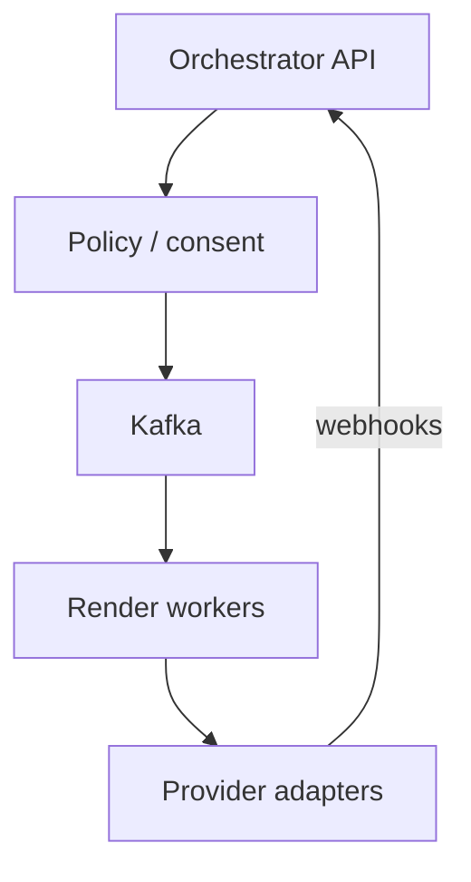
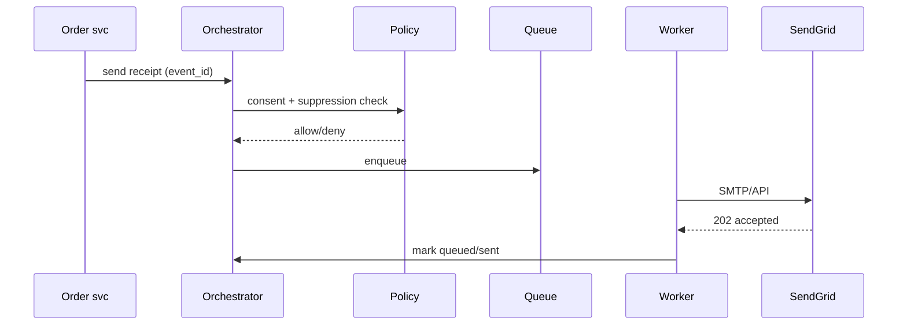

# HLD — Email / SMS Notification System

## Live interview opening (say naturally)

*“I’ll start from the **user perspective**, clarify key requirements, then design **high-level architecture** and go deeper on the **most critical** part. I’ll **pause after the diagram** in case you want to go deeper into any section.”*

## User journey (say once early)

*“From the user perspective: **(prep: one–two lines for this system)**.”*

*“So: **write path** = … ; **read path** = … ; **async path** = ….”* — fill with concrete nouns from **Section 1** and your diagram as you speak.

## Thinking transitions (use during interview)

- *“Let me think through this…”*
- *“One tradeoff here is…”*
- *“If I optimize for latency…”*
- *“This might become a bottleneck because…”*
- *“I’d start simple here and evolve later…”*

## Consistency model

*“**Strong** consistency for **(critical part)** because **(reason)** ; **eventual** for **(non-critical)** because **(reason)** . Under load we prioritize **(latency / correctness / availability)** on **(which surface)** .”* — align with **Section 1 invariants** and any dedicated consistency blocks in this guide.

## Decision (strong opinion)

*“I’d start with **X** because **(reason)** . If **(scale / requirements / signals)** change, I’d evolve to **Y**.”* — state your real default from **Section 8** in the room.

## Evolution

| Phase | Say it like this |
|-------|------------------|
| **1** | Simple implementation that ships. |
| **2** | Scaling: partitions, caches, queues, backpressure, observability. |
| **3** | Advanced / ML / global—only when metrics or product force it. |

Details: **Section 4.1 (phases)** and **Section 5** in this file.

## Bottleneck anchor

*“The main bottlenecks I expect are **(1)** and **(2)** —that’s what I’d monitor first.”* — concrete wording lives under **Section 5 — Bottleneck** in this guide.

## UX awareness

*“If this behaves badly, users see **(impact)** —so we prioritize **(trust lever)** .”* — tie to **reliability / degrade / UX** sections later in this guide.

## Driving the conversation

- *“Does this direction make sense?”*
- *“Should I go deeper on **A** or **B**?”*
- *“Would you like failure scenarios next?”*

## Mindset (before you walk in)

*“I’m not presenting a solution—I’m **designing with a teammate**.”*

**Rehearsal beats editing:** speak aloud, practice **pauses**, simulate **interruptions**. **Playbook:** [HLD-BAR-RAISER-PERFORMANCE-PACK.md](./HLD-BAR-RAISER-PERFORMANCE-PACK.md).

---

> **Uber SDE-2 HLD — drive order in this doc:** **§1** clarify → FR → NFR → **§2** scale → **§3** core entities + APIs → **§4** architecture → **§5** deep dive and evolution → **§6** scaling → **§7** reliability → **§8** tradeoffs → **§9** observability and security → **§10** patterns → **Closing**. Treat **Human interaction** cue blocks (headings in this doc) as *spoken* cues—**paraphrase**; do not read every row. **Bar raiser** listens for **ownership**, **failure modes**, and **honest tradeoffs**. Canonical spine: [HLD-UBER-SDE2-INTERVIEW-SPINE.md](./HLD-UBER-SDE2-INTERVIEW-SPINE.md).

## Interview delivery (golden thread — live thinking)

Bar-raiser polish: **user-first**, **explicit consistency**, **bottleneck**, **evolution**, **UX trust**, **default opinion** (not endless “A or B”). Full template + anti–document-mode habits: **[HLD-BAR-RAISER-PERFORMANCE-PACK.md](./HLD-BAR-RAISER-PERFORMANCE-PACK.md)** (final lines + sections) · **[HLD-MASTER-DELIVERY-GOLDEN-FLOW.md](./HLD-MASTER-DELIVERY-GOLDEN-FLOW.md)** (golden flow + anti-doc table).

| Say early (out loud) | What interviewers grade | In this guide, nail it by… |
|---------------------|---------------------------|------------------------------|
| **User journey** | Product before boxes | Opening Section 1 with who does what; separate **read / write / async** before services. |
| **Consistency model** | Strong vs eventual, where | Stating **invariants** and what is **strict vs best-effort** before API trivia. |
| **Bottleneck anchor** | What breaks first | Naming Section 5 **Bottleneck** + Section 6 hot paths + **first SLIs**. |
| **Evolution** | MVP → scale → advanced | Using **v1 / v2 / v3** (often Section 4.1 + Section 5); say **when** complexity earns its keep. |
| **UX awareness** | Trust on degrade | Saying what the user **sees** on partial failure (honest empty vs wrong vs spin forever). |
| **Strong opinion** | Defaults | *“I’d start with **X** because …; I’d switch to **Y** if …”*—lead Section 8 with a pick. |

**Do not:** read tables line-by-line · list ten patterns before a diagram · fence-sit.  
**Do:** signpost · pause · one diagram · deep dive **only** where they steer.

---

## 1. Clarify requirements

### 1.0 Live flow

#### Live voice (real interviewer room)

**Sound like you’re *deciding*, not reciting:** one idea per breath, then **pause**. Tables here are **backup**—if your eyes are down for more than a couple of seconds, you’ve slipped into reading the doc.

**Bridge phrases (mix naturally):** *“Let me **name the fork** first…”* · *“I’ll **default to X**—tell me if your bar is stricter.”* · *“The reason I ask is it changes **who owns the commit** / **what’s on the hot path**.”* · *“I’ll **over-answer** one layer, then stop—**where should I zoom**?”*

**Ping them (conversation, not monologue):** *“Does that match how you’d scope it?”* · *“If we only deep-dive one thing, is it **A** or **B**?”* (swap **A/B** for two tensions from *your* opening paragraph above.)

**This topic in one breath:** “Email/SMS is **suppression before send** and **split reputation**—compliance isn’t a footer.”

**`Verbatim` / `Live` cues:** say a line **once**, then **rephrase** the next time—verbatim twice in a row reads *canned*.

**Opening (~once):** *“I’ll align **transactional vs marketing**, **deliverability**, **unsubscribe/compliance** (CAN-SPAM, TCPA), and **template** lifecycle; then **enqueue**, **providers**, **webhooks**. **Pause after the diagram**—**throttling**, **idempotency**, or **multi-channel**?”*

**Thinking transitions:** *“SMS is **regulated** and **expensive**—**consent** and **quiet hours** are **first-class**.”*

**Live rule:** **Paraphrase** §1 tables; go deep **only if probed**.

**Micro-pauses:** *“So the invariant is **suppression wins** for marketing, transactional is **policy-gated** and **audited**—I'll draw policy → queue → render → provider.”*

### 1.1 Clarify

#### Human interaction (clarify requirements — think out loud & evolve scope)

**Verbatim:** *“I'm separating **transactional vs marketing**, **deliverability** and reputation, **unsubscribe and TCPA/CAN-SPAM**, and **template lifecycle**—because those decide **queues**, **subdomains**, and **webhook-driven** suppression.”*

**Verbatim (evolution):** *“**v1** single provider + suppression table; **v2** split IPs and warm-up; **v3** multi-provider failover with **circuit breaker**.”*

| Topic | Say it like this in the room |
|--------------------------|-------------------------------|
| **Channel** | “**Email + SMS** same pipeline or **separate** compliance?” |
| **Locale** | “**i18n** templates?” |
| **Attachments** | “Email **size** / virus scan?” |
| **Priority** | “**OTP** vs **newsletter**?” |

### 1.2 Functional requirements (FR)

#### Human interaction (FR — after alignment)

**Verbatim:** *“Send is template plus variables to a recipient, with global and per-brand suppressions, and we ingest bounces and complaints to **auto-suppress**.”*

| FR area | Say it like this |
|---------|-------------------|
| **Send** | “Template + **variables** + **recipient**.” |
| **Suppress** | “**Global** and **per-brand** unsubscribe.” |
| **Observe** | “**Bounces**, **complaints**, **delivery** webhooks.” |

**Cross-ref:** Push — [33-hld-push-notification-service.md](./33-hld-push-notification-service.md); stock alerts — [16-hld-notification-stock-alerts.md](./16-hld-notification-stock-alerts.md).

### 1.3 Non-functional requirements (NFR)

#### Human interaction (NFR — how it must behave)

**Verbatim:** *“Deliverability is **reputation** and warm-up; reliability is **at-least-once** enqueue with **idempotent** sends keyed by **business event** so retries don't double-email.”*

| NFR | Say it like this |
|-----|------------------|
| **Deliverability** | “**Reputation** IPs/domains; **warm-up**.” |
| **Reliability** | “**At-least-once** enqueue; **idempotent** sends per **business event**.” |

### 1.4 Invariants

**Invariant:** “No **marketing** email/SMS sends to an address/number on the **suppression list** for that **channel** and **brand**; **transactional** may still send per **policy** but must be **audited**.”

| Beat | Say it like this |
|------|------------------|
| **Bridge** | “**Policy gate** → **queue** → **renderer** → **provider**.” |
| **Core split** | “**Compliance** **control plane** vs **send** **data plane**.” |

### Key insight (say early)

**Unified notification orchestration** with **channel-specific adapters** and a **single consent/suppression** source of truth.

#### Key anchors

1. “**Twilio/SendGrid**-class adapters.”  
2. “**Webhook** ingestion updates **suppression**.”  
3. “**Template versioning**.”

---

## 2. Estimate scale

#### Human interaction (estimate scale)

**Verbatim:** *“Hundreds of millions of emails a day class, SMS lower volume but higher cost—so **per-tenant quotas** and **throttling** to providers are first-class.”*

| Dimension | Illustrative |
|-----------|----------------|
| Email / day | **100M+** at scale |
| SMS | **Lower volume**, higher **cost per msg** |

---

## 3. APIs and data model

### 3.0 Core entities (who owns what — say before API tables)

| Entity | Owns / lifecycle (one line) |
|--------|-----------------------------|
| **SendRequest** | Idempotent `(tenant, event_id, channel)`—**enqueue** unit. |
| **Suppression** | `(channel, address_hash, brand)`—**source of truth** for “do not contact.” |
| **TemplateVersion** | Render contract—**immutable** once published. |

#### Human interaction (API design)

**Verbatim:** *“Orchestrator exposes enqueue with an **idempotency key**, suppressions for list hygiene, and signed **webhooks** for bounce and complaint so state converges.”*

### 3.1 APIs

| API | Purpose |
|-----|---------|
| `POST /v1/send` | Enqueue (idempotent key) |
| `POST /v1/suppressions` | List management |
| `POST /v1/webhooks/bounce` | Provider callbacks |

### 3.2 Model

- **Message:** `id`, `channel`, `template_version`, `to_hash`, `payload`, `status`.  
- **Suppression:** `(channel, address_hash, reason)`.

---

## 4. High-level architecture

#### Human interaction (high-level architecture / HLD)

**Verbatim:** *“**Control plane**: policy, consent, suppression, templates. **Data plane**: queue, render workers, provider adapters—**marketing and transactional** don't share the same reputation lane.”*

### 4.1 Phases

| Phase | Ship |
|-------|------|
| **1** | Single provider + suppression table |
| **2** | **Dedicated** marketing IPs + **warm-up** |
| **3** | **Multi-provider** failover |

---

## 5. Deep dive: send request

#### Human interaction (deep dive — critical flow, optimizations & evolution)

**Verbatim:** *“Order service fires a receipt with **event_id**; orchestrator hits policy for consent and suppression, enqueues if allowed, worker renders and calls SendGrid, we accept **202** and track state—**bounce storms** mean throttle and auto-suppress.”*

**Verbatim (evolution):** *“Start one provider; split marketing vs transactional queues and subdomains; add failover when a provider is sick.”*

### 🎯 Bottleneck Anchor

“**Provider rate limits** + **bounce storms** after bad list—**throttle** + **auto-suppress**.”

**Taking a stance:** *“**Marketing** and **transactional** **different** **queues** and **subdomains**—**reputation** isolation.”*

---

## 6. Scaling and bottlenecks

#### Human interaction (scaling & bottlenecks)

**Verbatim:** *“Render CPU and list bombs—precompiled templates and **per-tenant quotas**; provider rate limits mean **adaptive concurrency**.”*

| Risk | Mitigation |
|------|------------|
| **Render CPU** | **Precompiled** templates |
| **List bombs** | **Per-tenant** quotas |

---

## 7. Reliability and failure handling

#### Human interaction (reliability & failure handling)

**Verbatim:** *“Provider 5xx gets exponential backoff and optional failover; duplicate domain events dedupe on **(tenant, event_id, channel)**—I'm explicit that's not magic exactly-once to the user’s inbox.”*

- **Provider 5xx:** **retry** with backoff; **failover** provider.  
- **Duplicate event:** **idempotency** on `(tenant, event_id, channel)`.

---

## 8. Tradeoffs and alternatives

#### Human interaction (tradeoffs & alternatives)

**Verbatim:** *“Shared IP is cheap but couples reputation; in-house MTA gives control but you own deliverability forever—I'd default to **adapters** until scale forces MTA.”*

| Choice | Trade |
|--------|--------|
| **Shared IP** | Cost vs **reputation** coupling |
| **In-house MTA** | Control vs **deliverability** burden |

---

## 9. Monitoring, observability, and security

#### Human interaction (monitoring, observability & security)

**Verbatim:** *“Watch bounce and complaint rate, queue lag, provider p99; security is minimize PII, encrypt at rest, and **verify** webhook signatures.”*

**Metrics:** **bounce/complaint** rate, **queue lag**, **provider** latency.  
**Security:** **PII** minimization; **encrypt** recipient at rest; **sign** webhooks.

---

## 10. Design patterns, data structures & best practices

#### Human interaction (design patterns, data structures & best practices)

**Verbatim (say 5–6 on the board):** *“**Transactional outbox** from OLTP, **policy gate** before queue, **template method** render pipeline, **circuit breaker** on sick providers, **priority queues** split OTP vs marketing, **idempotency store** on `(tenant, event_id, channel)`, and **signed webhooks** for state convergence.”*

| Pattern / DS | Where | One interview line |
|----------------|------|----------------------|
| **Transactional outbox** | Order → notify | “No ‘lost send’ if commit succeeded.” |
| **Policy + suppression gate** | Orchestrator | “Marketing never touches a suppressed address.” |
| **Queue + worker pool** | Data plane | “Backpressure when providers throttle.” |
| **Adapter + circuit breaker** | Providers | “Fail fast and failover, don't hammer 5xx.” |
| **Idempotency key store** | Send API | “Retries are safe at the business-event grain.” |
| **Webhook verification + DLQ** | Ingest | “Treat bounce callbacks as untrusted until verified.” |

---

## Closing notes

#### Human interaction (closing notes)

**Verbatim:** *“**Suppression before send**, split reputation for transactional vs marketing, **idempotent** enqueue, **webhooks** close the loop—push is a different doc.”*

| Do | Avoid |
|----|--------|
| **Suppression before send** | Blast then handle complaints only |
| **Separate reputation** | Mix OTP and cold marketing on one IP |

---

## Bar-raiser follow-ups

#### Human interaction (bar-raiser follow-ups)

**Verbatim:** *“Pick **TCPA consent**, **multi-region**, or **in-house MTA**—I'll go deep on one.”*

| They ask | Say it like this |
|----------|------------------|
| **TCPA** | “**Express consent** for SMS; **STOP** keyword handling.” |

---

## 60-second close

#### Human interaction (60-second close)

**Verbatim:** *“**Policy gate** → **queue** → **render** → **adapters**; **idempotent** per event; **webhooks** update suppression; **split** marketing and transactional for deliverability.”*

| Beat | Say it like this |
|------|------------------|
| **Recap** | “**Policy + suppression** gate; **queues**; **provider adapters** + **webhooks**; **idempotent** per **event**; **split** transactional/marketing for **deliverability**.” |

---
