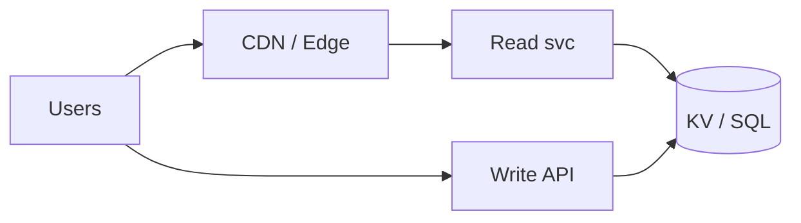
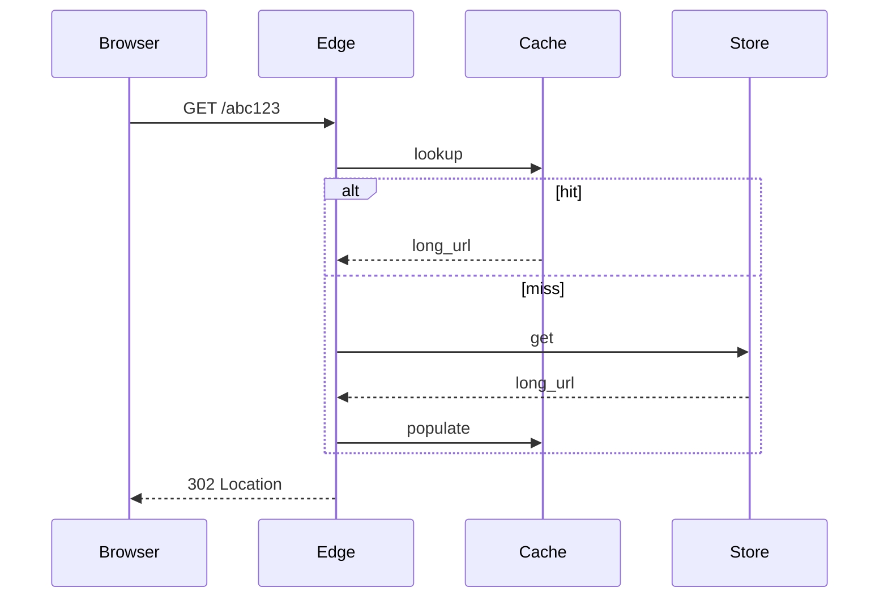

# HLD — URL Shortener (TinyURL)

## Live interview opening (say naturally)

*“I’ll start from the **user perspective**, clarify key requirements, then design **high-level architecture** and go deeper on the **most critical** part. I’ll **pause after the diagram** in case you want to go deeper into any section.”*

## User journey (say once early)

*“From the user perspective: **(prep: one–two lines for this system)**.”*

*“So: **write path** = … ; **read path** = … ; **async path** = ….”* — fill with concrete nouns from **Section 1** and your diagram as you speak.

## Thinking transitions (use during interview)

- *“Let me think through this…”*
- *“One tradeoff here is…”*
- *“If I optimize for latency…”*
- *“This might become a bottleneck because…”*
- *“I’d start simple here and evolve later…”*

## Consistency model

*“**Strong** consistency for **(critical part)** because **(reason)** ; **eventual** for **(non-critical)** because **(reason)** . Under load we prioritize **(latency / correctness / availability)** on **(which surface)** .”* — align with **Section 1 invariants** and any dedicated consistency blocks in this guide.

## Decision (strong opinion)

*“I’d start with **X** because **(reason)** . If **(scale / requirements / signals)** change, I’d evolve to **Y**.”* — state your real default from **Section 8** in the room.

## Evolution

| Phase | Say it like this |
|-------|------------------|
| **1** | Simple implementation that ships. |
| **2** | Scaling: partitions, caches, queues, backpressure, observability. |
| **3** | Advanced / ML / global—only when metrics or product force it. |

Details: **Section 4.1 (phases)** and **Section 5** in this file.

## Bottleneck anchor

*“The main bottlenecks I expect are **(1)** and **(2)** —that’s what I’d monitor first.”* — concrete wording lives under **Section 5 — Bottleneck** in this guide.

## UX awareness

*“If this behaves badly, users see **(impact)** —so we prioritize **(trust lever)** .”* — tie to **reliability / degrade / UX** sections later in this guide.

## Driving the conversation

- *“Does this direction make sense?”*
- *“Should I go deeper on **A** or **B**?”*
- *“Would you like failure scenarios next?”*

## Mindset (before you walk in)

*“I’m not presenting a solution—I’m **designing with a teammate**.”*

**Rehearsal beats editing:** speak aloud, practice **pauses**, simulate **interruptions**. **Playbook:** [HLD-BAR-RAISER-PERFORMANCE-PACK.md](./HLD-BAR-RAISER-PERFORMANCE-PACK.md).

---

> **Uber SDE-2 HLD — drive order in this doc:** **§1** clarify → FR → NFR → **§2** scale → **§3** core entities + APIs → **§4** architecture → **§5** deep dive and evolution → **§6** scaling → **§7** reliability → **§8** tradeoffs → **§9** observability and security → **§10** patterns → **Closing**. Treat **Human interaction** cue blocks (headings in this doc) as *spoken* cues—**paraphrase**; do not read every row. **Bar raiser** listens for **ownership**, **failure modes**, and **honest tradeoffs**. Canonical spine: [HLD-UBER-SDE2-INTERVIEW-SPINE.md](./HLD-UBER-SDE2-INTERVIEW-SPINE.md).

## Interview delivery (golden thread — live thinking)

Bar-raiser polish: **user-first**, **explicit consistency**, **bottleneck**, **evolution**, **UX trust**, **default opinion** (not endless “A or B”). Full template + anti–document-mode habits: **[HLD-BAR-RAISER-PERFORMANCE-PACK.md](./HLD-BAR-RAISER-PERFORMANCE-PACK.md)** (final lines + sections) · **[HLD-MASTER-DELIVERY-GOLDEN-FLOW.md](./HLD-MASTER-DELIVERY-GOLDEN-FLOW.md)** (golden flow + anti-doc table).

| Say early (out loud) | What interviewers grade | In this guide, nail it by… |
|---------------------|---------------------------|------------------------------|
| **User journey** | Product before boxes | Opening Section 1 with who does what; separate **read / write / async** before services. |
| **Consistency model** | Strong vs eventual, where | Stating **invariants** and what is **strict vs best-effort** before API trivia. |
| **Bottleneck anchor** | What breaks first | Naming Section 5 **Bottleneck** + Section 6 hot paths + **first SLIs**. |
| **Evolution** | MVP → scale → advanced | Using **v1 / v2 / v3** (often Section 4.1 + Section 5); say **when** complexity earns its keep. |
| **UX awareness** | Trust on degrade | Saying what the user **sees** on partial failure (honest empty vs wrong vs spin forever). |
| **Strong opinion** | Defaults | *“I’d start with **X** because …; I’d switch to **Y** if …”*—lead Section 8 with a pick. |

**Do not:** read tables line-by-line · list ten patterns before a diagram · fence-sit.  
**Do:** signpost · pause · one diagram · deep dive **only** where they steer.

---

## 1. Clarify requirements

### 1.0 Live flow

#### Live voice (real interviewer room)

**Sound like you’re *deciding*, not reciting:** one idea per breath, then **pause**. Tables here are **backup**—if your eyes are down for more than a couple of seconds, you’ve slipped into reading the doc.

**Bridge phrases (mix naturally):** *“Let me **name the fork** first…”* · *“I’ll **default to X**—tell me if your bar is stricter.”* · *“The reason I ask is it changes **who owns the commit** / **what’s on the hot path**.”* · *“I’ll **over-answer** one layer, then stop—**where should I zoom**?”*

**Ping them (conversation, not monologue):** *“Does that match how you’d scope it?”* · *“If we only deep-dive one thing, is it **A** or **B**?”* (swap **A/B** for two tensions from *your* opening paragraph above.)

**This topic in one breath:** “Short links are **read-heavy, write-rare**—ID generation and **abuse** are the design.”

**`Verbatim` / `Live` cues:** say a line **once**, then **rephrase** the next time—verbatim twice in a row reads *canned*.

**Opening (~once):** *“I’ll align **custom vs random** slugs, **TTL**, **analytics**, **abuse**, and **read:write ratio**; then **ID generation**, **storage**, **redirect path**. **Pause after the diagram**—**collision**, **scale**, or **security**?”*

**Thinking transitions:** *“**Reads dominate**—**cache** + **edge**; **writes** need **unique** id strategy.”*

**Live rule:** **Paraphrase** §1 tables; go deep **only if probed**.

**Micro-pauses:** *“So redirect is **read-heavy** with **immutable** slug→URL—I'll cache at edge and keep **ID generation** off the hot path.”*

### 1.1 Clarify

#### Human interaction (clarify requirements — think out loud & evolve scope)

**Verbatim:** *“I'm aligning **custom vs random** slugs, **TTL**, **analytics**, **abuse**, and **read:write ratio**—that drives **Snowflake/Base62** vs preallocated blocks and **edge** caching.”*

**Verbatim (evolution):** *“**v1** single DB; **v2** Redis cache plus sharded KV; **v3** geo edge redirects with **consistent hash**.”*

| Topic | Say it like this in the room |
|--------------------------|-------------------------------|
| **Length** | “**7-character** Base62 ok?” |
| **Private** | “**Auth** links?” |
| **Preview** | “**Unfurl** safety / malware scan?” |
| **Deletion** | “**GDPR** erase mapping?” |

### 1.2 Functional requirements (FR)

#### Human interaction (FR — after alignment)

**Verbatim:** *“Create returns a short URL, resolve does **302** to long URL, and click analytics can be **async** off the critical path.”*

| FR area | Say it like this |
|---------|-------------------|
| **Create** | “`POST /shorten` → **short URL**.” |
| **Resolve** | “`GET /{slug}` → **302** to long URL.” |
| **Optional** | “Click analytics async.” |

### 1.3 Non-functional requirements (NFR)

#### Human interaction (NFR — how it must behave)

**Verbatim:** *“Redirect p99 in milliseconds at the edge; billions of mappings mean **shard by slug** and **no** DB uniqueness retry storm on the happy path.”*

| NFR | Say it like this |
|-----|------------------|
| **Latency** | “Redirect **p99** **ms** at edge.” |
| **Scale** | “**Billions** mappings; **400M+** reads/day classic interview number.” |

### 1.4 Invariants

**Invariant:** “A published **slug** maps to **at most one** **active** long URL at a time; **redirect** is **idempotent** for readers (until **revoked**).”

| Beat | Say it like this |
|------|------------------|
| **Bridge** | “**Counter / snowflake** → **Base62** → **KV**.” |
| **Core split** | “**Generate** separate from **serve**.” |

### Key insight (say early)

**Pre-generated** blocks of random IDs from a **central allocator** OR **base62 hash** of **snowflake**—avoid **DB uniqueness retry storm**.

#### Key anchors

1. “**302** vs **301**—**analytics** vs **permanent** semantics.”  
2. “**Bloom** optional for **abuse**.”  
3. “**CDN** for **redirect** at scale.”

---

## 2. Estimate scale

#### Human interaction (estimate scale)

**Verbatim:** *“Writes are thousands per second, reads hundreds of thousands to millions—**CDN** and **cache-aside** dominate the design.”*

| Dimension | Illustrative |
|-----------|----------------|
| Writes / sec | **1k–10k** |
| Reads / sec | **100k–1M+** |
| Storage | **Billions** rows—**sharding** by **slug** |

---

## 3. APIs and data model

### 3.0 Core entities (who owns what — say before API tables)

| Entity | Owns / lifecycle (one line) |
|--------|-----------------------------|
| **UrlMapping** | `slug` → `long_url`—**immutable** while active. |
| **SlugAllocator** | Unique id generation—**single-writer** or **snowflake**. |
| **ClickEvent** | Optional async analytics—**append-only**. |

#### Human interaction (API design)

**Verbatim:** *“POST creates with optional custom slug—**409** on collision; GET resolve is **cache-first** then origin with **302** semantics explicit.”*

### 3.1 APIs

| API | Purpose |
|-----|---------|
| `POST /v1/urls` | Create `{long_url}` → `{slug}` |
| `GET /{slug}` | Redirect |

### 3.2 Model

- **UrlMapping:** `slug (PK)`, `long_url`, `owner_id?`, `created_at`, `expires_at?`, `revoked`.

---

## 4. High-level architecture

#### Human interaction (high-level architecture / HLD)

**Verbatim:** *“Users hit **CDN** for redirect reads; write path goes to API into sharded **KV**—**generate** and **serve** are intentionally separate scaling knobs.”*

### 4.1 Phases

| Phase | Ship |
|-------|------|
| **1** | Single DB + app |
| **2** | **Redis** cache + **sharded** KV |
| **3** | **Geo** **edge redirects** |

---

## 5. Deep dive: redirect

#### Human interaction (deep dive — critical flow, optimizations & evolution)

**Verbatim:** *“Browser hits edge, edge checks cache—on miss fetch from store, populate cache with **long TTL** because mapping is immutable, return **302**—hot slug gets **request coalescing** to avoid stampede.”*

**Verbatim (evolution):** *“If you need **301** for SEO permanence, call out **analytics** tradeoff explicitly.”*

### 🎯 Bottleneck Anchor

“**Cache stampede** on **hot slug**—**coalesce** + **long TTL** for **immutable** mappings.”

**Taking a stance:** *“**Base62** of **64-bit id** from **Snowflake**—**no** collision **check** on happy path.”*

---

## 6. Scaling and bottlenecks

#### Human interaction (scaling & bottlenecks)

**Verbatim:** *“Hot slug is an edge cache problem; skew across shards is **consistent hashing**—I'm not pretending uniform random slugs always balance.”*

| Risk | Mitigation |
|------|------------|
| **Hot key** | **Edge cache** |
| **Skew** | **Consistent hash** shards |

---

## 7. Reliability and failure handling

#### Human interaction (reliability & failure handling)

**Verbatim:** *“Missed slug is **404** or branded fallback; phishing means **blocklist** and optional **Safe Browsing** hook—**rate limit** creates.”*

- **Origin miss:** **404** vs **fallback** page.  
- **Phishing:** **blocklist** + **Safe Browsing** API hook.

---

## 8. Tradeoffs and alternatives

#### Human interaction (tradeoffs & alternatives)

**Verbatim:** *“Random slugs are unguessable; vanity is branded but races on **unique index**; hash-of-URL is deterministic but can leak **enumeration**—I'd pick **snowflake + Base62** for interviews.”*

| Choice | Trade |
|--------|--------|
| **Random slug** | Unguessable vs **custom** vanity |
| **Hash of URL** | Deterministic vs **enumeration** risk |

---

## 9. Monitoring, observability, and security

#### Human interaction (monitoring, observability & security)

**Verbatim:** *“Track redirect p99, cache hit, create conflicts; security is **SSRF** guard on long_url, malware scan if we unfurl, and abuse rate limits.”*

**Metrics:** **redirect p99**, **cache hit**, **create** conflict rate.  
**Security:** **Rate limit** creates; **malware** scan on **long_url**; **SSRF** guard for internal URLs.

---

## 10. Design patterns, data structures & best practices

#### Human interaction (design patterns, data structures & best practices)

**Verbatim (say 5–6 on the board):** *“**Snowflake + Base62** or **preallocated id blocks**, **sharded KV** by slug, **cache-aside** at edge, **single-flight** against stampede, optional **Bloom** for abuse, **rate limit** on create, and **unique index** for custom slugs.”*

| Pattern / DS | Where | One interview line |
|----------------|------|----------------------|
| **Time-ordered ID (Snowflake)** | Allocator | “No collision check on the happy path.” |
| **Base62 encoding** | API response | “Short URLs without guessing the whole space.” |
| **Sharded KV / consistent hash** | Store | “Scale reads with bounded blast radius.” |
| **Cache-aside + long TTL** | Edge | “Immutable mapping = cheap caching.” |
| **Single-flight / coalescing** | Hot slug | “One origin fetch for a thundering herd.” |
| **Bloom filter (optional)** | Abuse | “Cheap negative check before expensive work.” |

---

## Closing notes

#### Human interaction (closing notes)

**Verbatim:** *“**Read-heavy** redirect at edge, **write-light** create with a real **ID story**, **302** semantics explicit, **abuse** and **SSRF** called out.”*

| Do | Avoid |
|----|--------|
| **ID generation story** | Random until DB unique works |
| **Abuse** | Ignoring phishing use case |

---

## Bar-raiser follow-ups

#### Human interaction (bar-raiser follow-ups)

**Verbatim:** *“Want **collision math**, **GDPR erase**, or **geo routing**—I'll zoom on one.”*

| They ask | Say it like this |
|----------|------------------|
| **Custom slug race** | “**Unique index** + **409** or **retry**.” |

---

## 60-second close

#### Human interaction (60-second close)

**Verbatim:** *“**Write-light**, **read-heavy**; **Snowflake/Base62** or preallocated blocks; **sharded KV**; **edge cache**; **302** semantics; **abuse** controls.”*

| Beat | Say it like this |
|------|------------------|
| **Recap** | “**Write-light**, **read-heavy**; **Snowflake/Base62** or **preallocated** blocks; **KV** sharded by **slug**; **edge cache**; **302** semantics + **abuse** controls.” |

---
