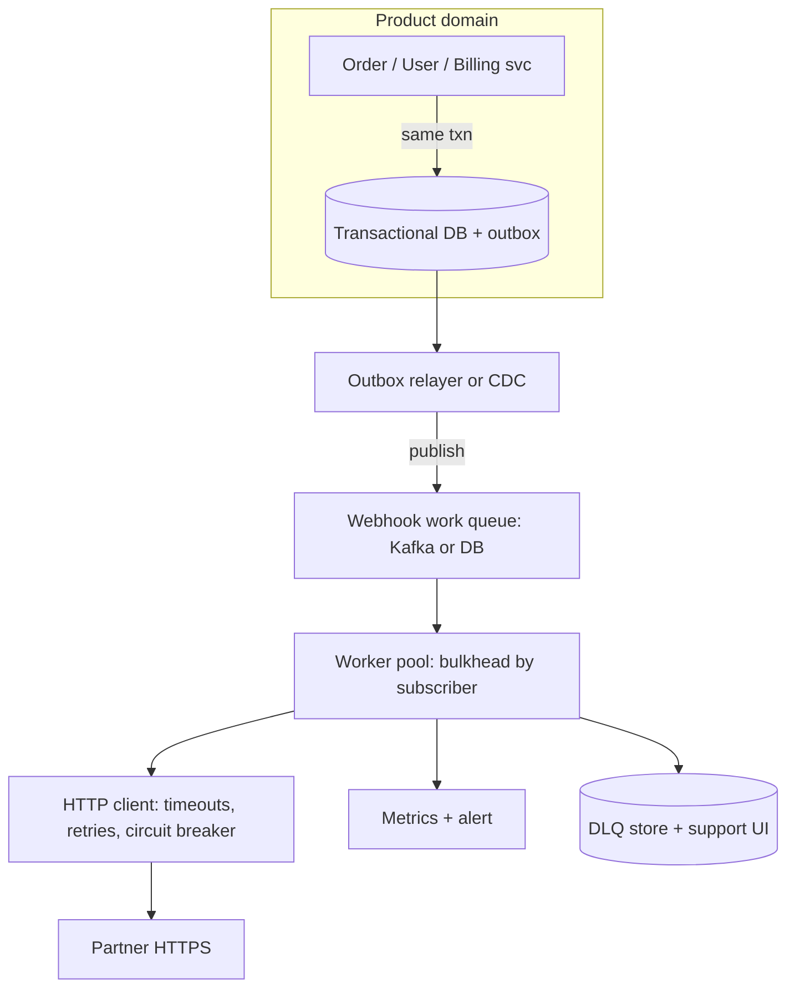
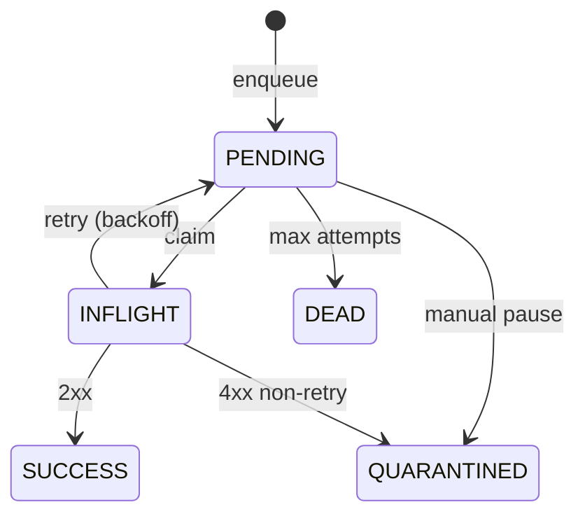

# HLD — Outgoing Webhook / Callback Delivery Platform

## Live interview opening (clarify first — bar raiser order)

*“I’ll **start by clarifying requirements**—scope, ambiguity, latency and scale expectations—then lock **FR/NFR**. **After** that, I’ll ground **user journey**, **consistency**, **commit/decision**, and **risks** so it’s clearly **derived from what we agreed**, then **scale** and **architecture**—and I’ll **pause after the diagram** for where you want depth.”*

> **Uber SDE-2 HLD — drive order in this doc:** **§1** clarify → FR → NFR → **Framing after requirements** (user journey, consistency, commit/decision anchors) → **§2** scale → **§3** core entities + APIs → **§4** architecture → **§5** deep dive and evolution → **§6** scaling → **§7** reliability → **§8** tradeoffs → **§9** observability and security → **§10** patterns → **Closing**. Treat **Human interaction** cue blocks (headings in this doc) as *spoken* cues—**paraphrase**; do not read every row. **Bar raiser** listens for **ownership**, **failure modes**, and **honest tradeoffs**. Canonical spine: [HLD-UBER-SDE2-INTERVIEW-SPINE.md](./HLD-UBER-SDE2-INTERVIEW-SPINE.md).

## Interview delivery (golden thread — live thinking)

Bar-raiser polish: **user-first**, **explicit consistency**, **bottleneck**, **evolution**, **UX trust**, **default opinion** (not endless “A or B”). Full template + habits: **[HLD-BAR-RAISER-PERFORMANCE-PACK.md](./HLD-BAR-RAISER-PERFORMANCE-PACK.md)** · **[HLD-MASTER-DELIVERY-GOLDEN-FLOW.md](./HLD-MASTER-DELIVERY-GOLDEN-FLOW.md)**.

| Say at the right time | What interviewers grade | In this guide |
|----------------------|---------------------------|---------------|
| **Opening** | Clarify before solution | **§1.0** — you **do not** assume B2B vs platform vs Stripe-scale. |
| **User journey + consistency + decisions** | Derived, not memorized | **Framing** after **FR/NFR** — [§1 after tables](#framing-after-requirements-before-scale--architecture) |
| **Bottleneck / failure** | Noisy partners, HOL | **§5–7** + [bar-raiser](#bar-raiser-follow-ups) |
| **Security ownership** | SSRF, signature replay | **§7** + **§9** |

**Do not:** `HTTP POST` to subscriber **inside** the user’s synchronous API request.  
**Do:** **outbox** (or event → durable queue) → **worker** → **signed** `POST` with **backoff** / **DLQ**.

---

## 1. Clarify requirements

### 1.0 Live flow (how to open and steer)

#### Live voice (real interviewer room)

**Sound like you’re *deciding*, not reciting:** one idea per breath, then **pause**. Tables are **backup**; if your eyes are down for more than a few seconds, you’re reading, not designing.

**Bridge phrases:** *“The fork is **B2B reliability** vs **dev-tool simplicity**—that changes SLO and whether we do **mTLS**.”* · *“I’ll default **RDBMS outbox**; push back if you need **infinite** replay and **huge** fan-in.”* · *“The reason I care about **ordering** is it determines whether **Kafka** is enough or we need **per-entity** sequence tables.”*

**This topic in one breath:** “Webhooks are **at-least-once HTTP** to a **subscriber URL**—**we** control durable **our** state and **signatures**; **they** make handling **idempotent** by `Delivery-Id`.”

**Opening (~once):** *“I’ll align on **B2B product webhooks** vs **internal** integration; **SLO** (time-to-first-attempt vs time-to-2xx); **ordering** (per-object vs none); **multi-tenant isolation**; **secret rotation**; and **P0** = no **silent** drop of a **committed** delivery. **Pause after the diagram**—**worker** **claim** pattern, **HMAC** and **replay**, or **noisy** subscriber **quarantine**?”*

**User journey (once):** before the [architecture](#4-high-level-architecture), say [👤 User journey](#user-journey-framing) in one pass so the **partner** (developer) is visible.

### 1.1 Clarify

| Topic | Say it like this in the room |
|--------------------------|-------------------------------|
| **Use case** | “**Stripe-style** public platform vs **internal** only—changes **on-call** and **SLO**.” |
| **SLA** | “P95 **enqueue** < **1s** vs P95 **partner** got **2xx**—**big** **difference**; retries for **7 days** or **cap** at **N** **attempts**?” |
| **Payload** | “**JSON** only? **Event** **type** and **api_version** in **header** to avoid **snake**/**camel** **surprises**?” |
| **Ordering** | “**No** **global** order; **per** `order_id` **monotonic** **optional**; **at-least-once** is still **default** **semantic** **to** **them**.” |
| **Security** | “**HMAC** over **raw** body, **timestamp** in **signed** string, **mTLS** for **enterprise** **tier**?” |
| **Partner abuse** | “**Callback** to **competitor**’s **URL**? **SSRF** **and** **allowlist** **in** some **tiers**?” |

**Micro-pauses:** *“I’ll **never** do **synchronous** `POST` in the **checkout** request path; I’ll **append** an **outbox** row in the **same** **DB** **txn** as **`Order`** **=** `paid` when the **data** model allows.”*

#### Human interaction (clarify — think out loud)

**Habit:** *“I separate (a) *did we commit the delivery intent* from (b) *did their server return 2xx*—(a) is in **our** store; (b) is **partners** + **SLO** wording we agree in the room.”*

| Stage | Assume in v1 | Evolve when… |
|-------|----------------|----------------|
| **1** | **Postgres** **outbox** + **CRON**/**poller** workers, **one** **region** | < few **k** **tenants** |
| **2** | **Partition** by **tenant_id**; **per-subscriber** **rate** **caps**; **DLQ** **UI** | **Noisy** **neighbor**; **SRE** on-call for **stuck** **queue** |
| **3** | **Kafka** as **durable** **spine**; **global** **by** **cell**; **OIDC**+**mTLS** **for** **enterprise** | **Replay** **petabytes**; **compliance** **region** for **data** **residency** |

### 1.2 Functional requirements (FR) — what we must build

#### Human interaction (FR — after alignment, spoken summary)

**Habit:** *“**Register**, **emit**, **deliver**, **observe**, **control**—five **verbs** for B2B **developers**.”*

| FR area | Say it like this in the room |
|---------|------------------------------|
| **Subscribers (destinations)** | “Tenant **registers** **HTTPS** **URL** + **signing** **secret**; **test** **ping** **endpoint**; **status** `active` / `paused`.” |
| **Subscriptions (events)** | “**Which** **event types** does this **URL** get—**versioned** **schema** **refs** in **docs** **or** **envelope**.” |
| **Delivery** | “`POST` **signed** **JSON** with **`X-Delivery-Id`**, **`X-Idempotency-Key`**, **`X-Timestamp`**, **signature**.” |
| **Lifecycle** | “**Retry** with **jittered** **exponential** **backoff**; **DLQ** after max **attempts**; **manual** **replay** **from** **T** or **id** **by** **support**.” |
| **Developer** **UX** | “**Log** of **last** **N** **attempts**: **status** code, **truncated** **body**, **latency**—**no** **raw** **secrets** in **logs**.” |

### 1.3 Non-functional requirements (NFR)

#### Human interaction (NFR)

**Habit:** *“**at-least-once* **to** *their* **inbox**; **idempotent* **on** *their* **side**; **isolation* **per** **subscriber* **or** *tenant**’.”*

| NFR | Say it like this |
|-----|------------------|
| **Durability** | “Once **OrderService** **commits** **‘**emit**’**, we don’t **lose** the **row** without **acknowledged** **DLQ** or **tombstone** with **audit**.” |
| **Throughput** | “Internal **events** **may** **fan** **out** to **1–N** **subscribers**; **hottest** is **N** not **1** per **order** event.” |
| **Latency to first** **attempt** | “Often **seconds**—if they want **<500ms** **first** **try**, I’ll **tighten** **worker** **count** and **separate** **SLO** **from** **partner** `timeout` (usually **5–30s**).” |
| **Security** | “**TLS 1.2+** to **public** **URL**; **optional** **IP** **allowlist**; **no** **redirect** **hops** **on** first **load** of **untrusted** **URL** **without** **SSRF** **check**.” |

### 1.4 Invariants

**Invariant:** “A **product** **commit** that should **emit** a **webhook** creates a **durable** **delivery** **intent** (outbox or **exactly**-once to **durable** **log** with **at-least**-once **workers**). **Silent** **drop** of **committed** **intent** without **quarantine** / **DLQ** is **P0** **bug**.”

#### Key anchors (any order, say confidently)

1. “**Outbox** **in** **same** **txn** as business **row** when **same** **RDB**; else **Saga** + **inbox** **on** **consumer** or **reconciliation** **job**.”  
2. “**`Delivery-Id`** **is** the **idempotency** key **our** **partner** **stores**—**we** may **POST** **duplicates**.”  
3. “**Ordering:** **at-least**-once + **unbounded** **duplicates** unless **per**-**(resource_id)** **monotonic** **seq** in **envelope**—I’ll **name** the **default**: **no** **global** order.”

### Key insight (say early, before the big diagram)

**Write path (internal):** `Order = paid` **txn** **commits** → `webhook_outbox` **row(s)** (one per **subscribed** **destination** × **event** **fan-out** rule).

**Stream path (optional):** domain event → **Kafka** `webhook.deliveries` **partitioned** by **`subscriber_id`** to avoid **HOL** **across** **unrelated** **partners**.

**Delivery path (always async):** worker **claims** row / **message** → **build** **canonical** **JSON** → **HMAC** → `POST` → record **outcome** → **schedule** **next** or **DLQ**.

---

## Framing after requirements (before scale + architecture)

**Placement:** **after** **FR + NFR** spoken pass—not **immediately** after the first **clarify** question.

**Out loud:** *“From what we **locked**: **our** **job** is **durable** **intent** + **signed** **at-least-once** **POST**; **their** **job** is **2xx** **+** **dedupe** on **`Delivery-Id`**. I’ll size **QPS** next, then **entities** and the **one** **diagram**.”*

---

## User journey (say once)

*“**Developer** in **Acme** **tenant** **saves** **URL** in **our** **dashboard** → we **test** with **`ping`** **event** → their **ops** **confirms** **2xx** → we **turn** on **`payment.completed`** for **that** **URL**. **End** **user** of **our** product **pays** → we **append** to **outbox** → **worker** **tries** **retries** until **2xx** or **policy** **gives** **up** and **emails** the **dev** with **link** to **DLQ** **payload** (redacted) **+** **replay** **button**.”*

So:

- **write** path = **CRUD** **subscribers** + **business** **event** that **enqueues** **deliveries**.  
- **read** path = **dev** **dashboard** **sees** **status** (queued / delivering / **dead** / **succeeded**).  
- **async** path = **workers** **only**; **no** user **latency** on **this** line.

## Consistency model

| Concern | Semantics in one line |
|---------|------------------------|
| **Our** **delivery** **state** | **Durable** **(at-least**-once **processing** of our **outbox** **by** **workers**). |
| **Their** **side** | **Idempotent** **by** `Delivery-Id` **or** **fingerprint**; **we** do **not** **claim** **exactly**-**once** **effect** **at** their **DB**. |
| **Ordering** | **Best**-**effort** by **`occurred_at`**; **if** we **promise** **per-**`order_id` **order**, I need **a** **sequence** **number** in **envelope** **(extra** **complexity**). |

## Commit boundary

**“Committed to deliver”** = **durable** **outbox** row (or **Kafka** **record** with **ack** to **broker**) **at** the **time** the **product** event **is** **accepted**.

**“Delivered to partner”** (product language) = **our** **worker** received **2xx** **(or** **2xx** **in** your **stricter** **SLO** **definition** for **B2B**). **4xx** **on** **signature** = **no** **retry** **(bad** **secret)**, **4xx** **on** **payload** **schema** = **treat** as **non**-**transient** **(alert** + **quarantine** **or** **schema** **drift** **playbook**).

## Decision (strong opinion)

- **I’d** start with **RDBMS** `webhook_deliveries` (or outbox + **separate** **read** model) in **one** **region** + **SKIP** **LOCKED** **or** **lease**-**based** **claim**.  
- **HMAC:** e.g. `HMAC-SHA256(secret, timestamp + "." + raw_body)`; **`t=`** in **header**; **reject** if **skew** **>5m** to **mitigate** **replay** **(with** **partner** **clock** **NTP**).  
- **Because** **dropping** or **uncontrolled** **double**-firing **breaks** B2B **trust** **faster** than **+50ms** in the user path.

## Bottleneck / evolution (preview)

| Watch first | If they steer here |
|-------------|---------------------|
| **Slow** / **failing** **URL** | **Quarantine** + **isolated** **thread** **pool** / **queue** **per** `subscriber_id` **(bulkhead)**. |
| **HOL** in **one** **queue** | **Partition** **work**; **separate** **SQS** / **topic** per **big** **tenant** **if** **needed**. |

(Deep dive: [§5](#5-deep-dive-one-delivery-end-to-end), [§6](#6-scaling-and-tenant-isolation), [§7](#7-reliability--failure-modes).)

## UX awareness (developer trust)

- **Visible** **attempt** **log**; **one**-**click** **replay**; **redacted** **secrets**; **actionable** **4xx/5xx** in **UI**.  
- **Mystery** “**webhook** **failing** for **2** **days**” = **on-call** **paged** (not just **user**-**visible** error).

**Playbook:** [HLD-BAR-RAISER-PERFORMANCE-PACK.md](./HLD-BAR-RAISER-PERFORMANCE-PACK.md).

---

## 2. Estimate scale

#### Human interaction (order-of-magnitude)

**Live:** *“I’ll **sanity**-**check**—**events** **/s** **on** our **side**, **fan-out** **multiplier** to **N** **URLs** **per** **event**, **P99** **partner** **latency** **(5s?** **30s?)** to **size** **in-flight** **HTTP** and **backoff** **horizon**.”*

| Dimension | Illustrative (interview) |
|-----------|-------------------------|
| Internal product events / sec | **10²–10⁵+** (invite **steer** from **interviewer**) |
| Webhook attempts / sec | = **internal** **×** **N** **subscribers** (often **1–5**, sometimes **50** **for** **SaaS** **hub**) |
| Subscribers (destinations) | **10²–10⁵** **URLs** **(tenant**-scoped) |
| SLO: first attempt | Often **1–30s**; **ms**-**class** is **rare** unless they say **synchronous** (then **I’d** still **outbox** + **priority** **lane**) |

**Tie-in:** *“**Skew** = **a** few **huge** **SaaS** **customers** with **thousands** of **end**-**user** **events** **×** many **endpoints**—I **partition** **or** **rate**-**cap** per **sub** before **I** add **CPU**.”*

---

## 3. APIs and data model

#### Human interaction (before API table)

**Habit:** *“**Subscriber** **(who)**; **webhook** **(what** **+** **state** **machine**); **attempt** **(append**-**only)”—three** **tables** **I** can **query** in **a** **support** **triage**.”*

### 3.0 Core entities

| Entity | Owns (one line) |
|--------|-----------------|
| **Tenant / org** | **Quota**, **mTLS** **certs** **(optional)**, **billing** **plan**. |
| **Subscriber (destination)** | `url` **(validated)**, `secret` **ref** **(KMS)**, `status` **(active/paused)**, `failure_policy` **(retry/DLQ)**. |
| **EventSubscription** | **Which** **event** **types** **(and** **filter** **exprs)** go to **which** `subscriber_id`. |
| **WebhookDelivery** | FSM: `PENDING` → `SENDING` or `IN_FLIGHT` → `SUCCESS` or `DEAD` or `QUARANTINED`; `payload_ref` or `json`, `next_attempt_at`, `idempotency_key` (our re-emit idempotency), `delivery_id` (stable UUID for partner). |
| **DeliveryAttempt** | `attempt`, `http_status`, `response_snippet` **(truncated)**, `latency_ms`, `error_class` (timeout / TLS / 5xx). |
| **DeadLetterItem** | **Final** state + **link** to **raw** in **S3** **(encrypted)** **if** **payloads** are **huge**. |

**Sketch row (deliveries):**  
`id, tenant_id, subscriber_id, event_id, event_type, api_version, body_json OR s3_key, state, next_attempt_at, attempt_count, created_at, updated_at, last_error_code`.

**Unique (emit):** `(event_id, subscriber_id, event_type)` or an explicit key so the **outbox** handler is **idempotent** on re-play and crash.

### 3.1 Control-plane APIs (developer)

| API | Notes |
|-----|--------|
| `POST /v1/subscribers` | **Validate** `url` (scheme **https**, **SSRF** **pre**-**check**); **store** **secret**; **return** `subscriber_id`. |
| `PUT /v1/subscribers/{id}` | **Rotate** **URL**; **bump** **secret** **(two**-**key** **grace** **if** **needed**). |
| `POST /v1/subscribers/{id}:test` | **Enqueue** **synthetic** **`ping`**. |
| `GET /v1/deliveries?...` | **List** for **filtering** **DLQ** **(support)**, **paged** **by** time. |
| `POST /v1/deliveries/{id}:replay` | **Re**-**enqueue** **(auth** **+** **audit** **log)**, **or** **clone** to **new** `delivery_id` with **`replayed_from`** (say **one** and **be** **consistent**). |

### 3.2 On-the-wire (what the partner sees)

| Header | Purpose |
|--------|---------|
| `X-Delivery-Id` | **Stable** id **for** **idempotent** **apply** **on** **receiver**. |
| `X-Idempotency-Key` | Optional **(often** same **as** **our** business **idempotency** for **this** **emit)**, **or** `delivery_id`. |
| `X-Hub-Signature` **or** `X-Webhook-Signature` | `t=timestamp,v1=...` (document **and** version). |
| `X-Request-Id` | **Trace** **id** for **us**-**to**-**them** **and** **them**-**to**-**us** **(support)**, **(optional) User-Agent: YourProduct-Webhooks/1.2.3. |

**Signing string (say on board one variant):** `HMAC-SHA256(secret, t + "." + body_bytes)`; **UTF-8**; **no** key **normalization** **mismatch**; **if** you **add** **JSON** **canonical** **(sorted** **keys)**, **say** it **(many** **bugs** **here)`.

---

## 4. High-level architecture

#### Human interaction (before drawing)

| Moment | Say in the room |
|--------|-----------------|
| **User** **story** | “Same as [user journey](#user-journey-framing): **event** in **our** system → **durable** **row** (or **Kafka** **record**) → **async** `POST` to **URL** with **backoff**.” |
| **Steer** | “Deeper: **(A)** outbox+SQL **vs** **Kafka** **(B)**; **(C)** **quarantine** **(D)** **SSRF** / **HMAC**?” |

### 4.1 Phases (if they say “MVP to scale”)

| Phase | What ships | Bar-raiser one-liner |
|-------|------------|------------------------|
| **1** | **RDBMS** + **outbox** table; **one** **worker** **type**; **HMAC** v1; **basic** **retry** (exp backoff + jitter) | *“Durable* **first**; **I** **don’t** *optimize* **RPS* **before* **I** *prove* *no* **drops** *of* *committed* **rows**.”* |
| **2** | **Per-sub** **concurrency** **+** **rate**; **quarantine** **(pause)** **on** **repeated** **5xx/timeout**; **DLQ** with **UI**; **KMS** **for** **secrets** | *“*Noisy* *neighbor* *kills* *a* *shared* *queue* *without* *bulkhead* *or* *per-sub* *caps*.”* |
| **3** | **Kafka**-**native** for **huge** **fan**-**in**; **separate** **sending** **cells**; **mTLS** **+** **IP** **egress** **control**; **SLO** **per** **plan** **tier** | *“*Enterprise* *tickets* *want* *audit* *lines* *and* *RPO* *on* *replay*.”* |

**Taking a stance:** *“I’d* **ship* **HMAC* *and* *`*Delivery-Id`*** *before* *I* *add* *cute* *routing* *or* *edge* *workers*; *trust* *on* *the* *wire* *is* *P0*.”*

---

## 5. Deep dive: one delivery (end to end)

#### Human interaction (the walk you rehearse)

**Live:** *“I’ll trace one `delivery_id` from `PENDING` to either `SUCCESS` or `DEAD`.”*

| Step | What actually happens (say) |
|------|----------------------------|
| **1. Emit** | **Order** service (or event **saga**) ends in `order.paid`. **Handler** or **outbox** trampoline inserts one row per **(event, destination)** with `state = PENDING`. **Idempotent** on `(event_id, subscriber_id)`. |
| **2. Claim** | **Workers** use `SELECT … FOR UPDATE SKIP LOCKED` or a **dequeue** lease (SQS-style visibility timeout). **Never** unbounded in-memory queue in the app **pod**. |
| **3. Build** | **Load** `secret` **from** **cache**+**KMS** **(miss** **=** **pay**). **Render** **JSON**; **if** > **N** **MB** **(say** 256), **S3** **+** **reference** in **POST** (or **two**-**part** - **rare**). |
| **4. Sign** | **HMAC** of **agreed** **string**; **put** `t=`. **Clock** on **our** **side** **(NTP)**. |
| **5. HTTP** | **5–30s** **timeout**; **follow** **redirects**? **I’d** **not** by **default** **(SSRF**; **3xx** to **new** **host** **=** **re**-**validate**). **HTTP/2** **/** keep‑alive **(careful** **on** **pool** per **sub**). |
| **6. Outcome** | **2xx** **→** **`SUCCESS`**, **emit** **metric** **`webhook_deliveries_success_total`**. **429** with **`Retry-After` **→** **respect**; **4xx** **(except** 429) **on** **signature**? **if** 401-403 **treat** as **quarantine** **(secret**). **4xx** **on** **validation**? **quarantine** **(schema)**. **5xx,** **network,** **timeout** **→** `next_attempt_at` **(with** cap). |
| **7. Terminal** | **`attempt` **≥** `max` **or** **non**-**retry** **4xx** **→** `DEAD` **(and** **alert/notify**). |

**Why not sync from API:** *“*Our* *API* *P99* *stays* *tight*; *I* *don’t* *couple* *us* *to* *a* *hung* *or* *slow* *partner* *during* *the* *customer* *facing* *path* *unless* *they* *explicitly* *want* *a* *blocking* *integration* *and* *accept* *SLO* *bleed*.”

---

## 6. Scaling and tenant isolation

| Risk | How you **say** the fix |
|------|------------------------|
| **HOL** (one **slow** URL **blocks** **all**) | **Separate** **queue** **/ partition** by **`subscriber_id`**; **independent** **worker** **pools** **(bulkhead)**. |
| **Spiky** **fan-out** (one event → **500** **subs**) | **Fan-out** **in** **emit** path **(many** **rows** **/ messages)** **BEFORE** **HTTP** **workers**; **or** **fan-out** **on** `event` **topic** **(Kafka)** **per** **sub** **(expensive—usually** many **outbox** **rows** is **simpler** **for** **SQL**-**first**). |
| **DB** **hot** **outbox** **row** | **Partition** by **tenant**; **(optional)** **Citus**-style **sharding**; **mature** **moves** **to** **Kafka**-**only** **+** **state** **in** **Rocks/Redis** **(say** *when* *metrics* *force* *it*). |
| **HTTP** **egress** **concurrency** | **Global** `max` **+** per-**tenant** **+** per-**sub**; **(optional)** **static** **IP** **huge** **partners** **require** **(NAT** **+** **EIP**). |

---

## 7. Reliability & failure modes

| Failure | What a bar raiser wants to hear |
|----------|---------------------------------|
| **At-least**-once **emit** of **outbox** **(crash** after **insert)** | **Idempotent** **outbox** **handler**; **(event_id,** sub)** **unique** **(partial)** **index**. |
| **We** **POST** **2xx** **but** **our** **DB** **fails** **before** **marking** **SUCCESS** | **re**-**delivery**; **accept** at-least**-once* **on** *their* **side**; **(or** *claim* *then* *commit* *with* *transactional* *out* *- say* *carefully* *which* *stores* *participate* *in* *2PC*). |
| **They** return **2xx** **on** **wrong** **write** to **their** **DB** | *Their* *bug*; *we* *surface* *replay* *and* *idempotency*; *in* *B2B* *contracts* *we* *sometimes* *offer* *reconciliation* *exports*. |
| **SSRF** **(callback** **to** **metadata** **/** **private** **IP**)** | **Parse** **URL**; **block** **rfc** **1918,** **link-local,** **metadata** **hosts;** **optional** **egress** **proxy** with **deny** **by** default. |
| **Signature** **replay** **(old** **POST** **replayed**)** | **Timestamp** **+** **skew** **window**; **(optional** **) nonce** (harder) **+** **Redis** set **per** `delivery_id` on **partner** (their job). **Our** job: **include** `t=`. |
| **Poison** **(always** **5xx** **for** **valid** **payload**)** | **Exponential** **backoff,** then **DLQ,** then **support** and **(maybe)** **quarantine** **+** **schema** **bump** **(versioned** event). |

**Delivery state machine (say once):** `PENDING` → `IN_FLIGHT` (optional) → `SUCCESS`, or `RETRY` (implicit: stay `PENDING` with `next_attempt_at`), or `QUARANTINED` (manual), or `DEAD`.

---

## 8. Tradeoffs

| Option A | Option B | When to pick B |
|----------|----------|----------------|
| **RDBMS** outbox (same **txn** as business) | **Domain** event → **Kafka** first | You need **massive** **replay** **/** **fan-in** and **RDB** **is** the **bottleneck**; **(you** take **Saga** **/ ordering** **complexity**). |
| **Fire-and-forget** in **async** on **app** **thread** | Durable **queue** **(always** **queue)** | *Never* **(for** P0) **: memory** **loss** **=** **silent** **drop** **(unless** *explicit* *best*-*effort* *product*). |
| **Retry** **on** all **4xx** | **Only** on **5xx+timeout;** quarantine on **4xx** **(except** 429) | *Default* is **B**; **(some** 408 **edge** *cases*). |
| **Per-subscriber** **partition** in **Kafka** | **DB**-**as**-**queue** | *Small* *scale* *or* *one* *region* *+ strong* *SQL* *invariants*; *Kafka* *when* *RPS* *and* *replay* *huge* |

**Strong opinion:** *“*I* *reach* *for* *RDB* *outbox* *when* *I* *can* *co*-*locate* *with* *the* *business* *row*; *I* *reach* *for* *Kafka* *as* *the* *spine* *when* *I* *need* *durable* *re*-*play* *at* *Pbyte* *scale* *or* *many* *downstream* *consumers* *including* *this* *webhook* *fan*-*out* *service*.”

---

## 9. Monitoring, security, and compliance (say together or split with steer)

| SLI / metric | Why |
|-------------|-----|
| **time** `enqueue` **→** `first_attempt` | *Product* **SLI** for **B2B** “we’re **not** **stuck**” |
| **per** `subscriber_id` **: success** **rate,** p95 **lat** **(to** **2xx)**, **attempts** to **success** | **Isolates** **bad** **partner**; **(alert** on **drop** **in** **success** **%** with **hysteresis** to **avoid** **flap**). |
| **4xx/5xx** **histogram** **(from** our **client**’s view) | Triage: **our** **TLS?** **their** **500?** |
| **ssrf** block count, **signature** failures (this guide is **outbound** `POST` only) | Security + abuse |

**Compliance (one line if asked):** *“*Payload* *may* *contain* *PII* *- we* *encrypt* *at* *rest* *KMS* *for* *stored* *bodies* *- minimize* *retention* *- delete* *on* *account* *close* *per* *DPA*.”* 

---

## 10. Design patterns, data structures & best practices

| Pattern | Where in this design | One line for the room |
|---------|----------------------|------------------------|
| **Outbox** | Durable handoff | “Same order as the business **txn**, or **Saga** if not the same **DB**.” |
| **Bulkhead** | Isolation | “A **noisy** `subscriber` cannot **exhaust** our **egress** / **FDs** for **all** tenants (separate pool / queue / WAF).” |
| **Circuit breaker** | Egress to partner | “**5xx** / **timeout** storm → **quarantine** (pause) with an optional **heal** probe before resume.” |
| **Jittered** **exponential** **backoff** | Retry schedule | “Avoid **thundering** herd: everyone re-**trying** the same second.” |
| **HMAC** (they **verify** with constant-time **compare** on their side) | Integrity | “We **document** the string; offer **SDKs** in Node/Java if we are serious.” |
| **SKIP** **LOCKED** (Postgres) | Worker claim | “**Horizontal** **workers** **don’t** **duel** **(mostly)** **on** the **same** **row**.” |

---

## Closing

**60-second close (verbatim-ish once per prep session, then rephrase in room):**

*“*Internal* *event* *commits* *→* *durable* *delivery* *intent* *(outbox* *or* *queue)*. *Workers* *claim* *independently* *rows* *per* *subscriber* *or* *partition* *- bulkhead* *- sign* *HMAC* *POST* *2xx* *or* *classify* *4xx* *vs* *retryable* *- DLQ* *with* *ops* *visibility*; *at-least-once* *to* *partner*; *`Delivery-Id`* *on* *their* *side* *is* *how* *we* *sleep* *at* *night* *.*”*

**One line:** *“*Durable* *our* *intent*;* *signed* *at-least-once* *HTTP*;* *idempotent* *theirs* *.*”*

## Bar-raiser follow-ups

| They ask | You say (shape, not a script) |
|----------|--------------------------------|
| “**Exactly**-**once** **delivery?**” | *“*HTTP* *isn*’*t* *- we* *document* *at*-*least* *-*once* *;* *`Delivery-Id`* *+ idempotent* *receiver* *;* *we* *may* *duplicate* *POST* *.*”* |
| “**Ordering**” | *“*No* *global* *- optional* *per* *resource* *monotonic* *seq* *in* *envelope* *if* *we* *need* *strong* *in-order* *processing* *- costs* *in* *partition* *tuning* *.*”* |
| “**SSRF?**” | *“*Validate* *url* *host* *resolves* *to* *not* *RFC1918*;* *block* *link-local* *and* *metadata*;* *optional* *mTLS* *+ static* *egress* *per* *plan* *.*”* |
| “**We** `POST` 2**xx** but **our** state **=** PENDING (crash) | *“*At*-*least* *-*once* *- they* *dedupe*;* *we* *retry* *on* *safe* *paths*;* *or* *I* *design* *claim* *transaction* *with* *durable* *outcome* *table* *if* *I* *have* *2PC* *- rare* *.*”* |
| “**Regulated** (finance / health) **payload**” | *“*Encrypt* *at* *rest*;* *region* *pin* *+ subprocessor* *list*;* *BAA* *- not* *the* *same* *as* *HMAC* *signing* *- both* *matter* *.*”* |

**Related in repo:** [16-hld-notification-stock-alerts.md](./16-hld-notification-stock-alerts.md) (outbox to **channels**); [35-hld-email-sms-notification.md](./35-hld-email-sms-notification.md) (outbound to **providers**); [29-hld-distributed-job-scheduler.md](./29-hld-distributed-job-scheduler.md) (retries, leases).

---

## 11. Mermaid: delivery FSM (optional on whiteboard)

(Use this **if** the interviewer **likes** state machines; **paraphrase** the **transitions** **in** **prose** **if** the **room** is **tired** of **graphics**.)
