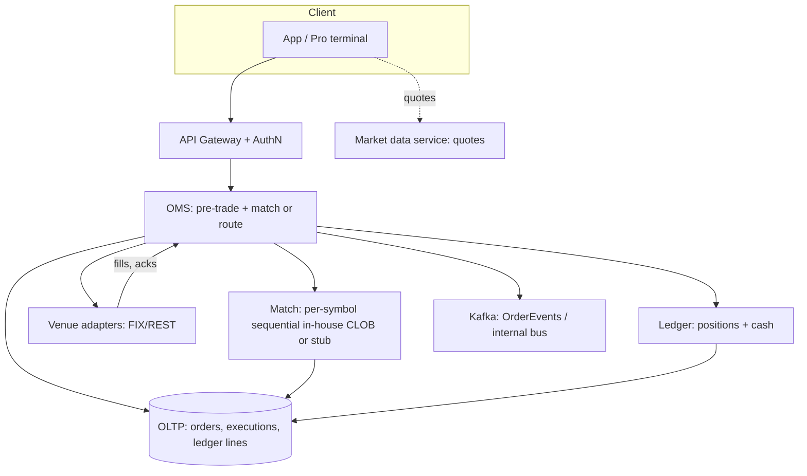
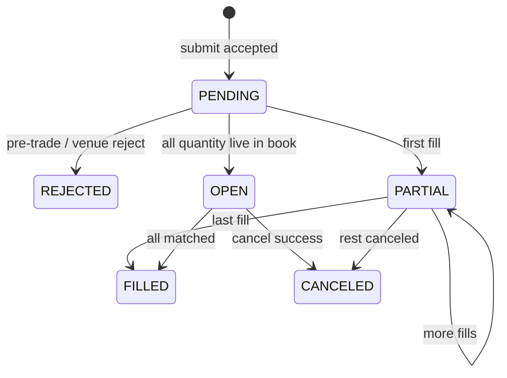

# HLD — Stock Broker (Order, Match, Positions, Ledger)

## Live interview opening (clarify first — bar raiser order)

*“I’ll **clarify** scope, latency, and consistency, then **FR/NFR**; then **user journey**, **consistency**, and **commit**; then **scale** and **architecture**—**pause after the diagram** for depth.”*

> **§1** clarify → FR/NFR → **Framing** (journey, consistency, commit) → **§2** scale → **§3** APIs + data → **§4** architecture → **§5** deep dive → **§6** scaling → **§7** reliability → **§8** tradeoffs → **§9** observability + security → **§10** patterns. Paraphrase. [HLD-UBER-SDE2-INTERVIEW-SPINE.md](./HLD-UBER-SDE2-INTERVIEW-SPINE.md)

## Interview delivery (golden thread)

[HLD-BAR-RAISER-PERFORMANCE-PACK.md](./HLD-BAR-RAISER-PERFORMANCE-PACK.md) · [HLD-MASTER-DELIVERY-GOLDEN-FLOW.md](./HLD-MASTER-DELIVERY-GOLDEN-FLOW.md)

| Show | Point to |
|------|----------|
| Trading ≠ market-data (NBBO, charts) | [§1](#1-clarify), [§4](#4-high-level-architecture) |
| No oversell + `ClientOrderId` | [§1.4](#14-invariants), [§5](#5-deep-dive) |
| **Not** building a full public exchange in 45m | [§8](#8-tradeoffs-and-out-of-scope) |

**Not** [16-hld-notification-stock-alerts.md](./16-hld-notification-stock-alerts.md) (alerts). **This** is OMS, executions, ledger.

---

## 1. Clarify

### 1.0 Live voice

**Decide, don’t recite** (tables = backup). **Bridges:** market **data** (read) vs **trading** (ack + **risk** + **executions**). **CLOB** + HFT + co-lo = different round—default **retail** and **routed** orders. **Reg** = name the **category** (order handling, best ex), do not invent **cross-venue** NMS.

**One breath:** order → pre-trade **risk** → **match** in-house *or* **send** to exchange **adapter** → **append** **executions** → **ledger** (shares, cash). Quotes are usually a **separate** read path.

**Opening (once):** *“Equity in v1? CLOB in-house vs lit only? P0: no oversell, idempotent `ClientOrderId`; P1: durable order + execution trail. Pause after the diagram: hot symbol, ledger concurrency, or match-node disaster recovery.”*

**Before the diagram, say the [journey](#user-journey) once.**

### 1.1 Clarify (backup table)

| Area | Say it like this |
|------|------------------|
| **Asset** | US equity in v1? Options multiplies margin and surfaces. |
| **CLOB** | Full internal book vs **smart router** to venues only. |
| **Orders** | limit, market, stop; TIF; partial fills; cancel/replace. |
| **Short / margin** | locate, PDT, **buying power**—or explicitly out of v1. |
| **SLO** | submit→ack p99, often < few hundred ms (retail). |

**Micro-pause:** *“I default one logical **sequencer** per **symbol** for the in-house **match** step (thread, actor, or one partition).”*

#### Human interaction (clarify + evolution)

**Habit:** *“**Oversell** is impossible: open sells (plus any reserved open sells, if you model them) must never exceed available. The same `ClientOrderId` yields at most one **accepted** new order—see **§1.4**.”*

| Phase | v1 | v2+ |
|--------|-----|-----|
| 1 | Monolith or 3 **services** (API, OMS, ledger), Postgres, pre-trade on submit | **Shard** OMS by **symbol**; **shard** **ledger** by **account**; read replicas |
| 2 | Kafka `OrderEvents` for **read** models, analytics; market-data service | Deeper reg / **routing** if they steer |
| 3 | HFT co-located C++ book—*not* default; **name and stop** | (only if pushed) |

### 1.2 Functional requirements (FR)

| FR | Say it like this |
|----|------------------|
| **Submit** | `ClientOrderId` is **idempotent**; versioned **replace**; **cancel** per **adapter/venue** rules. |
| **State** | pending / open / partial / filled, canceled, or **rejected**. |
| **Executions** | **Append-only**: qty, px, time, **venue** or **internal** id. |
| **Positions** | Derived from executions + **cash** in the ledger; T+n **settlement** often **async** / other service. |
| **View** | open orders, positions, optional **buying power**; **quotes** from market-data, not the trade **ack** path. |

**Spoken FR:** *“Submit, match or route, durable executions, ledger, then read models.”*

### 1.3 Non-functional requirements (NFR)

| NFR | In the room |
|-----|-------------|
| **Correctness** | No oversell; order + execution trail for audit. |
| **Audit** | Immutable `Order` and `Execution` rows. |
| **Degrade** | If broken: read-only, block new **risky** **writes**—not silent wrong **state**. |
| **Latency** | Tight SLO for submit→**ack**; **looser** for charts / quotes. |

### 1.4 Invariants

**Invariant 1 (no oversell):** A sell (or any action that reduces long inventory) is rejected if committed sells plus any modeled reserves would exceed what the account may legally sell (include locate / Reg SHO if shorts are in scope—say in clarify).

**Invariant 2 (idempotent submit):** The same `ClientOrderId` results in at most one accepted new order. Retries with the same key return the same outcome; conflicting replays of the same key with a different body return 409 (or your chosen policy—name it in the contract).

### Key insight (say early)

**Pre-trade risk** → **match** (in-house per-**symbol** **sequential** path) *or* **route** to **venue** via **adapter** → **append** **durable** **Execution** **rows** → **update** **ledger** (cash, positions) → optional **`OrderEvents`** to **Kafka** for **read** **models** / **analytics**—**quotes** stay on a **separate** read path, not the **trade** **ack** line.

**Anchors (say in any order):**

1. **`ClientOrderId`** is **idempotent** at the **first** **transaction** that **creates** the **order** (unique constraint or **conditional** **insert**).  
2. **In-house** **CLOB:** at most **one** **sequential** **commit** path per **symbol** (thread, **actor,** or **one** **Kafka** **partition** for **match**).  
3. **Ledger** is the **source** of **truth** for **shares** and **cash** **after** **append-only** **executions**; **read** **models** **can** **lag** with **a** **named** **policy**.  

---

## Framing after requirements (before scale + architecture)

**Placement in the room:** only after you have spoken **FR** and **NFR**—not right after a single clarify question.

**Out loud:** *“We have locked FR/NFR; next I’ll do rough order of magnitude in §2, name entities and APIs in §3, one architecture in §4, then pause for your steer on the deep dive in §5.”*

### Thinking transitions

- *“Trading is **ack** + **executions** + **ledger**—not the same problem as market-data **charts**.”*  
- *“Contention is usually per-`symbol` on the match path and per-`account_id` on the ledger path.”*  

## User journey (after FR/NFR)

1. Client submits with `ClientOrderId` + side, symbol, qty, type (limit, market, etc.).  
2. Gateway auths; OMS runs pre-trade (limits, buying power, locate, halts as in scope).  
3. In-house book: sequential match for that `symbol`, or route child orders via exchange adapters (smart router).  
4. Fills append to `executions`; ledger applies deltas (shares, cash, fees).  
5. User sees submit ack and subsequent fills on read APIs (or a stream, if in product).  

Read path for positions can be eventually consistent if you name the lag; write-path **money invariants** are not “best effort.”

## Consistency model

| Concern | Semantics |
|----------|------------|
| **Order** + **`ClientOrderId`** | At most one *accepted* order per `(account_id, ClientOrderId)`; enforced in **OLTP**. |
| **Executions** | Append-only; do not rewrite past trades (void/bust = new event per policy—clarify if reg requires it). |
| **Ledger** (cash / position) | Serialize applies per `account` (or partition). Read replicas may lag; name whether reads are monotonic or versioned. |
| **Quotes** / **NBBO** (if separate market-data service) | Eventually consistent; do not conflate a quote with the execution *fill* you report for compliance. |

## Commit boundary

- **Order accepted** (2xx) = a durable `orders` row (or idempotent replay of the same) after pre-trade passes at that moment.  
- A **fill** = at least one `executions` row (or a durable terminal reject), not a ghost in-memory only state.  
- **Ledger** movement lines up with execution: same DB transaction in v1, or explicit 2PC/Saga when `orders` and `ledger` split across services.  

## Decision (strong opinion)

- v1 **retail** US **equity:** monolith or 2–3 services (API, OMS, **ledger**) + **Postgres**; one **sequential** path per `symbol` for the match line; `Kafka` for `OrderEvents` or execution outbox if you need fanout.  
- If you are **not** in-house CLOB, you still need a **durable, idempotent** “router + venue submit” path so **retries** are not **double** sends.  
- You are not building a public exchange **SIP** or co-located **HFT** in 45 minutes—say it explicitly in **§8**.  

## Evolution

| Phase | What |
|--------|------|
| **1** | Monolith + RDB; per-`symbol` match; idempotent submit; append-only `executions` |
| **2** | Shard OMS by `symbol`, ledger by `account`; read replicas; read models from events |
| **3** | Deeper reg (e.g. CAT, archive), **smarter** routers, co-lo book—only if forced |

## Bottleneck anchor

- **Hot** `symbol` (e.g. a mega-cap) + HOL in match queue or on the single-sequencer path.  
- **Hot** `account` (e.g. market maker) on ledger + position **lines**.  
- Venue **adapter** backpressure, reconnect **storms** after an outage: at-least-once sends, venue-side idempotency.

## Backpressure / UX under stress

- Prefer read-only and block risky **writes** over **wrong** state.  
- Clients get honest delayed-ack and idempotent **retry** semantics, not **duplicate** live **orders** for the same `ClientOrderId`.  

**Playbook:** [HLD-BAR-RAISER-PERFORMANCE-PACK.md](./HLD-BAR-RAISER-PERFORMANCE-PACK.md).  

---

## 2. Estimate scale

| Dimension | Illustrative (tune) |
|------------|------------------------|
| **Submits** | **10²–10⁵** /s per **region** (retail **vs** pro) **—** **invite** **steer** |
| **Symbols** in **hot** | **1** path **/symbol** in **CLOB,** or **N** **venues** **routed** |
| **Read** (positions, PnL) | **Heavier** than **raw** **orders**; **separate** **SLOs** from **ack** path |
| **Reg** / **compliance** **events** | **Not** the **same** as **RPS,** but **affects** **storage** and **immutability** **cost** |

**Tie-in:** *“I **shard** **contention** **by** **`symbol` **on** **the** **match** **line** and **`account` **on** the **ledger** line—**same** **as** the **bottleneck** **story**.”*  

---

## 3. APIs and data model

#### Human interaction

**Habit:** *“**Idempotent** **submit;** **append** **only** **fills;** **one** **ledger** **row** **stream** per **account** (conceptually).”*  

| Entity | Owns |
|--------|------|
| **Account** | **Settings,** **limits,** **entitlements** |
| **Order** | **ClientOrderId,** **side,** **symbol,** **qty,** **type,** **TIF,** **state,** **version** |
| **Execution** | **(order_id,** **ts,** **px,** **qty,** **venue_exec_id,** **fees) **—** **append** **only** |
| **Ledger line** (or **position** + **cash** **buckets) | **Derived** **or** **materialized;** **must** **reconcile** **to** **executions** **+** **funding** |
| **MarketData** (optional) | **Quotes,** **NBBO,** **not** **in** the **ack** path |

| API (sketch) | Notes |
|--------------|--------|
| `POST /v1/orders` | **Body** `ClientOrderId`, **idempotency** key **(same) **+** order **params**; **replays** return **200** with **same** `order_id` or **409** on **mismatch** |
| `GET /v1/orders/{id} ` | **State** and **permalinks** to **child** **executions** |
| `POST /v1/orders/{id}/cancel` | **Cancel** **/** **replace** with **version** or **Etag** |
| `GET /v1/accounts/{id}/positions` | **Read** **path**; **served** from **RDB** **replica** or **read** model |
| **Internal** `ProcessFill` / **adapter** | Ingest from router or FIX/REST exchange session—not a public REST; name the **seam** in the room. |

**Idempotency:** `ClientOrderId` is **(account_id,** **id)** **or** **(client,** key) **in** a **UNIQUE** **index**; **all** **retries** from **the** **same** **key** must **converge**.  

---

## 4. High-level architecture

#### Human interaction

| Moment | Say in the room |
|--------|------------------|
| **Hot path** | *“**Submit** **→** **pre-trade** **→** **match/ route** **→** **Executions** **+** **ledger** **(same** **consistency** **island** **v1) **. **Orders** are **durable,** not **a** **cache** **entry**.”* |
| **Not** in **scope** (unless **pushed) | *“I’m** **not** **rebuilding** **OPRA,** **NBBO,** or **HFT** **in** **C++;** I’m** **a** **broker** **backend** for **ack**+**compliance** **trail**.”* |

**Read** **replicas** **(optional) **on** the **right** of **the** **diagram,** not **in** the **ack** path.  

---

## 5. Deep dive: submit, match, idempotency

**Where** the **interviewer** will **press:** **`ClientOrderId`**, **double** **submit,** **partial** **fills,** and **per-symbol** **ordering**.

### 5.1 Idempotent submit (end-to-end)

1. Client sends `ClientOrderId` + order body.  
2. In one transaction: `UNIQUE(account_id, client_order_id)` on `orders`; on conflict, return existing row (200) or 409 if body does not match.  
3. Pre-trade: margin / buying power, symbol halt, short locate, etc.  
4. Route to in-house book or to venue adapter with a **durable** idempotent outbox key (venue + `cl_ord_id`) on the wire.  
5. First `executions` row (or reject) is append-only; then apply **ledger** in the same transaction for v1.  

### 5.2 Why “one path per symbol” in-house

Crossing a book in **order** is a classic in-memory or single-node-per-`symbol` problem (or one actor / one partition). In the interview, **correctness** and a **clear** **sequential** **commit** story beat micro-optimizing a **Fenwick** tree.

### 5.3 Partial fills, cancels, replaces

- Fills `0..n`; order is open / partial / filled / canceled.  
- Cancel and replace are **new** **durable** **intents**; you do not rewrite past `executions`.  

---

## 6. Scaling and sharding

- Shard OMS+book by `symbol`, ledger by `account` at growth; watch hot symbols.  
- Kafka + consumer groups for per-account ledger appliers if the write path splits.  
- SLOs: p99 submit→ack, venue adapter latency, reconciliation gap—not a vanity RPS counter.  

---

## 7. Reliability and failure modes

| Failure | Behavior |
|----------|----------|
| **Venue** **outage** | **Stop** **routing**; **reconcile** when **up;** **at-least-once** **submits** **+** **venue** **dedupe** |
| **Duplicate** **HTTP** **(client** **retries) **| **Handled** **by** **`ClientOrderId` **(see** **§5.1) **. |
| **DB** **partial** **commit** | **v1** **favor** **one** **small** **transaction**; **Saga** **+** **outbox** if **you** **split** **orders** and **ledger** |
| **Catastrophe** | **Read** **switches** to **read-only,** **block** **new** **risk,** not **false** **balances** **in** the **app** |  

**Audit:** **WORM** **or** **append-only** **+** **immutable** **S3** for **compliance** **(say** if **they** care).  

---

## 8. Tradeoffs (and out-of-scope)

| Topic | A | B | Default |
|--------|---|---|---------|
| **CLOB** | In-house | Router-only to lit venues | **Router+** small **in-house** **or** **router** **if** you **fear** **CLOB** **time**—**name** in **clarify** |
| **Latency** of **ack** | **Synchronous** **2PC** to **DB** | **Outbox+** **async** **(complex) **| **Synchronous** **RDB** **v1** |
| **Saga** | One **DB** | Many **svcs,** many **Sagas** | **one** **DB** **v1,** **split** **only** with **Saga** **story** |
| **HFT** | C++ at **co-lo** | Not in **scope** for **our** 45m | **Explicitly** **out** of **MVP** |

**Bar raiser** may ask if you assumed a **full public exchange**. **Answer:** *“Retail **broker** OMS + **ledger** + **venue** **adapters**—not **SIP**, not **HFT** co-lo, not an **NMS** design.”*  

---

## 9. Observability, security, and compliance (say together with steer)

- Traces: one per `POST /v1/orders` + (sampled) spans per per-`symbol` match loop.  
- Metrics: risk rejects, idempotent **replay** hits, fill rate, venue adapter p99, reconciliation **gap**, ledger build lag.  
- No secrets in logs; PII in tickets vs internal IDs—follow your retention and sec policy.  
- If US / FINRA-adjacent comes up: mention **immutability** and reporting categories (WORM, CAT-style)—high level, not a legal talk.  

---

## 10. Design patterns (short)

| Pattern | Where |
|---------|--------|
| **Idempotency** **keys** | `ClientOrderId` and **outbound** **cl_ord_id** to **venue** |
| **Append** **log** of **trades** | `Execution` as **immut** **source** of **price**+**qty** |
| **Saga** / **2PC** | If **order** and **ledger** are **separate** **databases** |
| **Sequencer** / **per-partition** **order** | One **in-order** **consumer** **per** **`symbol` **(match) |
| **CQRS**-**lite** | `OrderEvents` **+** read **DB** for **UIs,** not **in** the **ack** line |

---

## 11. Mermaid: order + execution (optional)

(Adjust states to your product: GTC, iceberg, market vs limit, etc. The `OPEN` node is “resting on book” when applicable.)  

---

## Closing

**One line:** *“**`ClientOrderId` **+** no **oversell,** **append** **only** **Execution,** **ledger** **=** **truth,** **per**`-symbol` **match,** not **HFT** **SIP** **in** **one** **diagram**.”*  

## Bar-raiser follow-ups

- **Late / out-of-order venue fills?** Inbox, reconcile, bust/adjust with explicit policy—name one concrete pattern (chronology buffer or venue sequence numbers).  
- **Reg NMS (etc.):** name the *category* of broker obligation; do not invent a full national market system.  
- **Options** / **Greeks** are a follow-on round, not the same 45m **stock** OMS story.  
