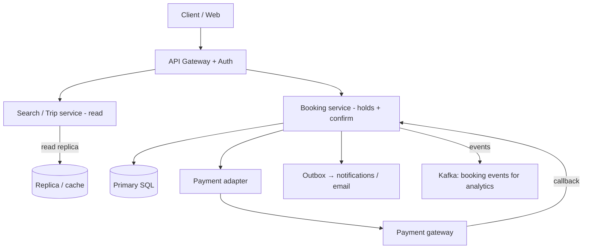

# HLD — Intercity / Long-Haul Bus Ticketing and Booking

## Live interview opening (clarify first — bar raiser order)

*“I’ll **start by clarifying requirements**—scope, ambiguity, latency and scale expectations—then lock **FR/NFR**. **After** that, I’ll ground **user journey**, **consistency**, **commit/decision**, and **risks** so it’s clearly **derived from what we agreed**, then **scale** and **architecture**—and I’ll **pause after the diagram** for where you want depth.”*

> **Uber SDE-2 HLD — drive order in this doc:** **§1** clarify → FR → NFR → **Framing after requirements** (user journey, consistency, commit/decision anchors) → **§2** scale → **§3** core entities + APIs → **§4** architecture → **§5** deep dive and evolution → **§6** scaling → **§7** reliability → **§8** tradeoffs → **§9** observability and security → **§10** patterns → **Closing**. Treat **Human interaction** cue blocks (headings in this doc) as *spoken* cues—**paraphrase**; do not read every row. **Bar raiser** listens for **ownership**, **failure modes**, and **honest tradeoffs**. Canonical spine: [HLD-UBER-SDE2-INTERVIEW-SPINE.md](./HLD-UBER-SDE2-INTERVIEW-SPINE.md).

## Interview delivery (golden thread — live thinking)

Bar-raiser polish: **user-first**, **explicit consistency**, **bottleneck**, **evolution**, **UX trust**, **default opinion** (not endless “A or B”). Full template + habits: **[HLD-BAR-RAISER-PERFORMANCE-PACK.md](./HLD-BAR-RAISER-PERFORMANCE-PACK.md)** · **[HLD-MASTER-DELIVERY-GOLDEN-FLOW.md](./HLD-MASTER-DELIVERY-GOLDEN-FLOW.md)**.

| Say at the right time | What interviewers grade | In this guide |
|----------------------|---------------------------|---------------|
| **Opening** | Clarify before solution | **Above** — you **do not** assume **seat map** or **refund** rules. |
| **User journey + consistency + decisions** | Derived, not memorized | **After Section 1**, **Framing after requirements** — **before Section 2**. |
| **Bottleneck / evolution / UX** | Ops + trust | Same **Framing** block; **§5–7** for numbers. |
| **Strong opinion** | Defaults | **Section 8** — *“I’d start with **hold + pay** in **Saga**…”* |

**Do not:** read tables line-by-line · put user journey **before** clarify.  
**Do:** clarify → FR/NFR → grounded journey → diagram → deep dive where steered.

---

## 1. Clarify requirements

### 1.0 Live flow

#### Live voice

**This topic in one breath:** “Bus booking is **schedule + inventory (seats) + pay + issue ticket**—**double-book** is the bug; I’ll use **hold TTL** and **idempotent** payment **callback**.”

**Opening (~once):** *“I’ll align on **open vs intercity only**, **seat map** (fixed bus layout vs unassigned), **cancellations**, and **P0** = **no two confirmed passengers** on the **same** **seat**; then **search**, **hold**, **Saga** to **ticket**. **Pause after the diagram**—**inventory**, **payment**, or **ops** (manifests)?”*

### 1.1 Clarify

| Topic | Say it like this |
|-------|------------------|
| **Geography** | “**One** country/region? **Cross-border** changes **KYC** and **currency**—out of v1 unless you need it.” |
| **Search** | “**Origin–destination** + **date**; **direct** only or **transfers**?” |
| **Inventory** | “**Per-seat** map vs **capacity** only (first-come **pool**).” |
| **Payment** | “**Card** + **PG**; **UPI/QR**; **refund** policy **T+**?” |
| **Offline / conductor** | “**Strictly** app-only, or **POS** / **kiosk** at stand?” |

**Micro-pauses:** *“I **never** `UPDATE seats` from the **browsing** request—**hold** row or **version**-checked **row lock** in **one** **txn** for **the** **seat**.”*

### 1.2 Functional requirements (FR)

| FR | Say it like this |
|----|------------------|
| **Search** | “Trips matching **O/D**, **date**, **filters** (AC, time window).” |
| **Select** | “**Seat** selection from **map**; **hold** (minutes).” |
| **Book** | “**Pay** → **confirm**; **e-ticket** (QR) + **email**.” |
| **After** | “**Cancel/change** per **policy**; **waitlist** optional v2.” |
| **Ops** | “**Conductor** manifest for **departure**; **no-shows** optional.” |

### 1.3 Non-functional requirements (NFR)

| NFR | Say it like this |
|-----|------------------|
| **Correctness** | “**At most one** **confirmed** **reservation** per **physical** **seat** **on** a **trip** (or per **pool** if unassigned).” |
| **Latency** | “**Search** p99 **< few hundred ms**; **hold/confirm** can be **seconds** if we’re honest with **3DS**.” |
| **Audit** | “**Immutable** **after** **ticket** **issued**; **refund** = **new** **ledger** **event**.” |

### 1.4 Invariants

**Invariant:** “You **cannot** **move** a seat from **available** to **confirmed** without passing **hold** (or **single** **strong** **txn** that **fails** on **stale** **read**).”

### Key insight (say early)

**Trip** and **Route** (master data) are **rare** **writes**; **per-trip seat inventory** is the **contention** surface. **Outbox** + **webhook** for **PG** (pattern like [38-hld-webhook-delivery-platform.md](./38-hld-webhook-delivery-platform.md)) is fine for **notifying** and **reconciliation**—**ticket** state still **owned** in **our** DB.

#### Key anchors

1. “**Hold** = `seat_id+trip_id` in **`HELD` state** with **`expires_at`** + **idempotency key** on **confirm**.”  
2. “**Confirm** = **payment** **captured** **then** (or in **Saga**) **seat** → **SOLD** + **Ticket** **row**.”  
3. “**Search** is **read-heavy**; **source of** **truth** for **availability** is not **only** **cache**.”

---

## Framing after requirements (before scale + architecture)

**Placement in the room:** not right after clarify-only; earn this after **FR + NFR**.

**Out loud:** *“We’ve **clarified** scope and I’ve stated **FR/NFR**—**based on that**, here’s the **journey**, **consistency**, and **commit** before I size **Section 2** and draw **Section 4**.”*

### Thinking transitions (use during interview)

- *“Let me think through this…”*
- *“The tricky part is **concurrent** **seat** **clicks**…”*
- *“I’d start with **pessimistic** on **one** **row** (seat) and evolve…”*

## User journey (after FR/NFR)

**Traveler** searches → picks **trip** → **seat** map → **hold** (countdown) → **pay** → **ticket** + QR.

**System:** **read** path for **search** and **map**; **write** path **hold** (short **txn**) → **external** **pay** → **webhook** / **callback** **idempotent** → **ticket** **commit**.

## Consistency model

**Search / browse:** **eventual** (slight **stale** on **seats** **left** is OK if you **re-check** on **map** load or **revalidate** before **hold**).

**Hold and confirm:** **strong** for **“this seat is mine to buy”**—**either** **pessimistic lock** on **(trip_id, seat_id)** or **version** with **optimistic** **retry** on **conflict**.

**Payment** callback: **at-least-once**; **idempotency** on `payment_id` or **idempotency key** so you **do not** **double-issue** **ticket**.

## Commit boundary

**Ticket** is **issued** when: **(a)** **payment** **captured** (or **Saga** step **satisfied**) and **(b)** **inventory** **state** = **SOLD** for that **seat** in **one** **atomic** **transition** (or **2PC** / **Saga** with **compensation** to **release** on **pay** **failure**).

**Hold expiry:** **background** **job** **frees** **HELD** → **AVAILABLE** if unpaid.

## Decision (strong opinion)

- **v1:** **SQL** for **Trips, Seats, Reservations, Tickets, Payments**; **Redis** only for **rate limit** and **ephemeral** **hold** **mirror** (optional) — **source of** **truth** in **DB**.  
- **Saga:** **Create hold** → **initiate** **payment** (async) → **on success** **finalize** **ticket**; **on failure** **release** **hold**; **pay** **timeout** **=** **release**.

## Evolution

| Phase | Say it like this |
|-------|------------------|
| **1** | **Monolith** + **single** **DB** + **pessimistic** **per-seat** during **hold**. |
| **2** | **Read** **replica** for **search**; **sharding** by **operator** or **region** if data grows. |
| **3** | **Event** **sourcing** for **audit** and **replays**; **dedicated** **search** (OpenSearch) if **fuzzy** **city** **names** matter. |

## Bottleneck anchor

**Hot** **trip** + **sprint** **sale** → **thousands** of **concurrent** **select-seat**; **one** **row** **per** **seat** is **granular**; **no** **global** **lock** on **entire** **bus**.

## Backpressure handling

**Queue** **checkouts** at high load (soft “try again”); **rate limit** **search**; **degrade** **recommendations** not **core** **availability** **view**.

## UX awareness

- **Hold** **countdown** **clear**; on **stale** **map**, **re-seat** with **apology** copy.  
- **Double** **charge** **paranoia**—show **idempotent** **“already paid”** **if** they **refresh** **after** **success**.  

### Driving the conversation

- *“**Seat** **map** in scope, or only **count**-based?”*  
- *“**Deep** on **payment** **Saga** or **inventory** **locking**?”*

**Playbook:** [HLD-BAR-RAISER-PERFORMANCE-PACK.md](./HLD-BAR-RAISER-PERFORMANCE-PACK.md).

---

## 2. Estimate scale

| Dimension | Notes |
|-----------|--------|
| QPS (search) | **10^2–10^4** typical regional **peak** (order-of-magnitude **talk**) |
| Writes | **Spiky** on **new** **schedule** **drops** |

---

## 3. APIs and data model

| Entity | One line |
|--------|----------|
| **Route, Trip, Bus layout** | **Template** of **stops** + **time**; **instance** = **one** **departure** |
| **Seat** | **Rows** in **`trip_seats`** with **state** |
| **Reservation** | **Hold** or **confirmed**; **user**, **idempotency** key |
| **Ticket** | **PAX** + **barcode/QR** **secret**; **void** = **new** event |

| API | Purpose |
|-----|---------|
| `GET /trips?from&to&date` | **Search** |
| `GET /trips/{id}/seats` | **Map** (with **ETag** / **version**) |
| `POST /reservations` | **Start hold** (returns **reservation_id**) |
| `POST /reservations/{id}/pay` | **Kick** **off** **payment** |
| `POST /webhooks/payment` | **Idempotent** **capture** (internal) |

---

## 4. Architecture

---

## 5. Deep dive: double-booking

**Stance:** “**(trip_id, seat_id)** has **row** with **version**; **HELD** has **`until`**; **confirm** **UPDATE … WHERE** **state=HELD** **AND** **version=?**; **0 rows** = **someone** **else** **won**; **return** **409** **and** **refresh** **map**.”

**Saga** on **pay:** **orchestrate** in **our** service; **never** **trust** **client** to **order** **steps** **reliably**.

---

## 6–7. Scale / Reliability

- **Read** path: **replica** + **short** **cache** of **“seats** **left** **count**” (invalidate on **any** **hold** for **trip**).  
- **Partition** by **operator** for **isolation**; **multi-tenant** **SaaS** = **row-level** `operator_id` everywhere.  
- **Reconcile** **payment** **vs** **ticket** **daily** **batch** (reconciliation table).

---

## 8. Tradeoffs

| A | B |
|----|---|
| **Pessimistic** **row** **lock** on **seat** | **Optimistic** + **user** **retry** on **contention** |
| **In-house** pay | **Stripe/Adyen** **first**—**faster** **Saga** to **proven** **idempotency** |
| **Strong** **real-time** **availability** | **Approximate** **+** **fixup** on **map** (cheaper) |

---

## 9. Observability

- **book_success_rate**, **hold_to_confirm_latency**, **409_conflict_rate**, **reconciliation** **drift**.  
- **No** **PII** in **logs** for **full** **PAN**—**tokenized** only.

---

## 10. Links to other problems

- **Dispatch**-shaped: [24-hld-food-delivery-order-dispatch.md](./24-hld-food-delivery-order-dispatch.md) (different **constraints**; **not** 1:1).  
- **Rides** lifecycle: [18-hld-uber-ride-sharing-backend.md](./18-hld-uber-ride-sharing-backend.md) — **no** **seat** **map**.  
- **Outbox** / **callbacks**: [38-hld-webhook-delivery-platform.md](./38-hld-webhook-delivery-platform.md).  
- **Train/PNR** food: [23-hld-uber-eats-train-pnr-delivery.md](./23-hld-uber-eats-train-pnr-delivery.md) (adjacent **domain**).

## Closing

**One line:** *“**Per-seat** **row** or **pessimistic** at **hold**; **Saga** around **pay**; **idempotent** **webhook**; **ticket** **only** after **inventory** **wins** the **commit**.”*

## Bar-raiser

- **What** if **PG** **callback** **succeeds** but **our** **DB** **is** **down**? (Outbox, **reconcile**, **compensate** to **void** on **duplicated** **capture** *only* if you model **it**; usually **reconciliation** and **customer** **support** play.)  
- **Dynamic** **pricing** per **seat**—**changes** **version** and **re-search**.
