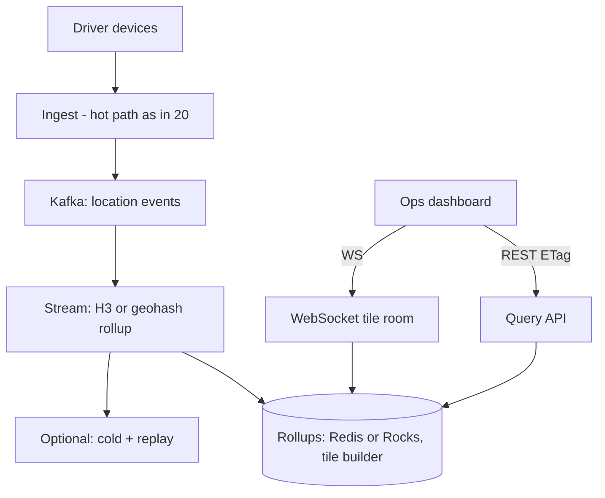

# HLD — Driver Density / Operations Heatmap Dashboard (Read Heavy)

## Live interview opening (clarify first — bar raiser order)

*“I’ll **start by clarifying requirements**—scope, ambiguity, latency and scale expectations—then lock **FR/NFR**. **After** that, I’ll ground **user journey**, **consistency**, **commit/decision**, and **risks** so it’s clearly **derived from what we agreed**, then **scale** and **architecture**—and I’ll **pause after the diagram** for where you want depth.”*

> **Uber SDE-2 HLD — drive order in this doc:** **§1** clarify → FR → NFR → **Framing after requirements** (user journey, consistency, commit/decision anchors) → **§2** scale → **§3** core entities + APIs → **§4** architecture → **§5** deep dive and evolution → **§6** scaling → **§7** reliability → **§8** tradeoffs → **§9** observability and security → **§10** patterns → **Closing**. Treat **Human interaction** cue blocks (headings in this doc) as *spoken* cues—**paraphrase**; do not read every row. **Bar raiser** listens for **ownership**, **failure modes**, and **honest tradeoffs**. Canonical spine: [HLD-UBER-SDE2-INTERVIEW-SPINE.md](./HLD-UBER-SDE2-INTERVIEW-SPINE.md).

## Interview delivery (golden thread — live thinking)

Bar-raiser polish: **user-first**, **explicit consistency**, **bottleneck**, **evolution**, **UX trust**, **default opinion** (not endless “A or B”). Full template + habits: **[HLD-BAR-RAISER-PERFORMANCE-PACK.md](./HLD-BAR-RAISER-PERFORMANCE-PACK.md)** · **[HLD-MASTER-DELIVERY-GOLDEN-FLOW.md](./HLD-MASTER-DELIVERY-GOLDEN-FLOW.md)**.

| Say at the right time | What interviewers grade | In this guide |
|----------------------|---------------------------|---------------|
| **Opening** | Clarify before solution | **Above** — you **separate** **ingest** from **aggregate** **before** Redis. |
| **User journey + consistency** | Derived | **Framing** **after** **FR/NFR** — not **ingest** **tech** first. |
| **Redis** **trap** | You **don’t** **pub/sub** **every** **GPS** | “**Read** **buckets**; **durable** **ingest** **elsewhere**.” |
| **Opinion** | **Kafka** (or log) for **flow**; **Redis** for **rollups** or **not** for **durable** **fan-out** | **§5, §8** |

**Do not:** propose **Redis** **Pub/Sub** to **broadcast** **200k/s** **raw** **per-driver** **moves** to “the dashboard.” **Do:** **aggregate** → **throttled** **WebSocket** **tile** or **H3** **cell** **counts**.

---

## 1. Clarify requirements

### 1.0 Live flow

#### Live voice

**This topic in one breath:** “**Ops** **heatmap** = **read** many **pre-aggregated** **buckets**—I **ingest** **location** with **durable** **stream**, then **roll up**; **I don’t** use **pub/sub** as **reliable** **data** **plane**.”

**Opening (~once):** *“I’ll align on **viewers** (ops vs all-hands), **geography** (city, bbox), **time** **window** (60s, 5m, 1d), and **P0** = **usable** at **hundreds of k** **drivers** **online**; then **ingest**, **rollups**, and **read** **API** / **WebSocket** **by** **room**. **Pause after the diagram**—**aggregation** **job**, **Redis** **role**, or **map** **tiles**?”*

### 1.1 Clarify

| Topic | Say it like this |
|-------|------------------|
| **Use case** | “**Real-time** **situational** **awareness** (supply) vs **analytics** (historical)?” |
| **Recency** | “**1-minute** **granularity** OK, or need **per-second** **paint**?” |
| **Privacy** | “**City**-level only vs **anonymized** **cells**—**no** **PII** in **log** for **v1**?” |
| **Scope** | “**Online** = **has** **app** + **on** **session**, or **last** **N** **minutes**?” |
| **Global** | “**Single** **region** **MVP** vs **federated** **dashboard**.” |

**Micro-pauses:** *“I **treat** **ingest** as **Kafka**; **Redis** is **for** **hot** **rollups** and **throttled** **latest**—**not** **at-least-once** **ingest** **bus** if they ask **durable** **semantics**.”*

### 1.2 Functional requirements (FR)

| FR | Say it like this |
|----|------------------|
| **Map** | “**Bbox** + **zoom** → **heatmap** **intensity** (count per **cell** / **tile**).” |
| **Drill** | “Click **cell** → **rough** **count** + **breakdown** (e.g. by **vehicle** **class**) if **allowed**.” |
| **Live** | “**Auto-refresh** **map**; **stale** **n** **seconds** **acceptable**.” |
| **Ops** | “**Filters**: **on-trip** / **available**; **anomaly** **halo** (optional v2).” |

### 1.3 Non-functional requirements (NFR)

| NFR | Say it like this |
|-----|------------------|
| **Ingest** | “**Durable**; **reprocess**; **tolerate** **bursty** **GPS**.” |
| **Read** | “**P95** for **map** **tile** < **hundreds** **ms**; **thousands** of **concurrent** **ops** **users** **lower** than **rider** **scale** but **heavier** per **view** (large **bbox**).” |
| **Cost** | “**Don’t** **O(N)** **broadcast** all **moves** to all **browsers**.” |

### 1.4 Invariants

**Invariant:** “**Ingested** event has **taxi** **or** **driver** **id**; **exposed** **map** is **aggregated**—**no** **arbitrary** **PII** **sweep** from this **read** path.”

### Key insight (say early)

**Separate:** (1) **durable** **ingest** (**Kafka** / Pulsar / Kinesis) → (2) **stream** **job** (Flink, Spark, or **self**-**hosted** **consumers**) **increments** `H3_cell+window` or **precomputed** **vector** **tile**; (3) **API** / **WebSocket** serves **buckets** **only**; (4) **WebSocket** **room** = **geohash** **prefix** or **tile** **id**—**not** “**all** **drivers**.”

#### Key anchors

1. “**Redis** **Pub/Sub** = **at-most-once** **fan-out**; **ephemeral**—**bad** as **the** only **reliable** **ingest**.”  
2. “**Redis** **INCR** / **HLL** / **GEO** can **back** **fast** **rollups** with **TTL**; **or** **pre-materialized** **tiles** in **object** **store** for **larger** **history**.”  
3. “**Rider** **map** in **20**; **this** is **ops**-**scale** **aggregate** view—**same** **ingest** **line**, **different** **read** **path** **shape**.”

---

## Framing after requirements (before scale + architecture)

**Out loud:** *“We **locked** **FR/NFR**; **journey** is **ops** opens **map** → **server** **streams** **tile** or **cell** **updates**—**not** **raw** **per-driver** **deltas** **to** **the** **client** at **Uber** **RPS**.”*

### Thinking transitions

- *“**Ingest** scale ≠ **read** **fan-out**—I **coalesce** **first**.”*
- *“If the interviewer **pushes** **Redis** **Pub/Sub**—I’ll **contrast** **durable** **log** and **recompute** from **log** on **outage**.”*

## User journey (after FR/NFR)

**Ops** opens **web** **dashboard** → **browser** **subscribes** to **map** **views** (bbox changes load **new** **tiles** / **H3** **range**) → **server** **pushes** **aggregated** **heat** for **visible** **cells** at **1–3** **s** or **5** **s** **interval**; **no** need for **per-driver** **socket** **in** the **ops** **UI** **at** full **RPS**.

## Consistency model

**Eventual** for **“how** **many** in **cell** **now**” — **tens** to **hundreds** **ms** **lag** vs **truth** in **ingest** **is** **OK** for **this** product.

**Strong** not required for **heatmap** **painting**; **correct** **ordering** of **increments** is **per-partition** in **the** **stream** **job**.

## Commit boundary

**There is** no **end-user** “**commit**” in **classic** **ACID**—the **useful** **analog** is: “**in** **at** `T` the **rollups** had **ingested** **all** **events** with **watermark** `≤ T` (minus **late** data **if** you allow).”

## Decision (strong opinion)

- **v1:** **Ingest** = location **topic** in **Kafka**; **Flink** (or **KStreams**) **increments** `cell_id` key in **Rocks/Redis/DB** with **TTL** or **window** **chaining**; **read** = `GET` plus **optional** `WS` on **tile** id.  
- **Not:** **Every** **micro-batch** to **all** **dashboards** over **Pub/Sub**.

## Evolution

| Phase | Say it like this |
|-------|------------------|
| **1** | **5**-**minute** **batch** **rebuild** **from** **S3** **(cheap**, **higher** **staleness**). |
| **2** | **Streaming** **+** **Redis** **buckets**. |
| **3** | **Vector** **tile** **server**; **H3** **hierarchical** **rollup** for **drill** **down**; **cross-region** **replication** of **read** path. |

## Bottleneck anchor

**N²**-style **mistake** = **fan-out** of **all** **updates** to all **viewers**; **fix** = **hierarchical** **buckets** + **subscription** to **subsets**.

## Backpressure

**Drop** / **coalesce** **painter** **updates** (max **1/s** per **cell** on **UI**); **larger** **buckets** when **zoomed** **out** (H3 **resolution** by **zoom** level).

## UX awareness

- **Staleness** **label**; **skeleton** **on** **pan** **zoom**; **empty** when **ingest** **degraded** not **0**—show **degraded** **state**.

### Driving the conversation

- *“Is **5s** **refresh** **OK**? That **changes** **if** I **batch** or **stream** **micro**.”*

**Playbook:** [HLD-BAR-RAISER-PERFORMANCE-PACK.md](./HLD-BAR-RAISER-PERFORMANCE-PACK.md).

---

## 2. Estimate scale

| Dimension | Notes |
|-----------|--------|
| **Ingest** | **10^2–10^5** **events/s** **per** **city** (order-of-magnitude) |
| **Ops** | **10^1–10^3** **concurrent** **dashboards**; **read** is **buckets** not **raw** per-driver **streams** (no PII in heatmap) |

---

## 3. APIs and data model

| Surface | One line |
|---------|----------|
| **Cell / tile** | `cell_id` = **H3** (or **geohash+precision**) or **raster** **vector** **tile** `z/x/y` |
| **Window** | **Rolling** **1m/5m**; **TTL** in **store** |
| **View** | **Bbox** → list **of** **cells** **+** **weights** for **painting** |

| API | Purpose |
|-----|---------|
| `GET /heatmap?bbox&zoom&window&filters` | **One-shot** or **ETag** |
| `WS /v1/heatmap/tiles?tile_ids=…` | **Deltas** **on** **bucket** **change** (throttled) |
| (internal) `POST /ingest` | Usually **not** *public*—**devices** use **ingest** from **20**’s path |

**Hot phrasing in interview:** “I **read** `GET` **on** **pan**; I **WebSocket** **only** the **subscribed** **H3** **res** and **throttle**.”

---

## 4. Architecture

---

## 5. Deep dive: “Why not Redis pub/sub for everything?”

**Verbatim (short):** “**Pub/Sub** = **no** **durable** **redelivery**; **if** a **worker** is **down**, **it** **misses**; **I** use **it** for **throttled** **in-process** **signal** to **a** **small** **set** of **feeds** **after** the **durable** **rollups** **exist**—or **I** use **WebSocket** **from** a **stateful** **sub** **service** **that** **itself** **polls** **Redis/KV** on **a** **timer** for **deltas**.”

**Durable** **ingest** = **Kafka** (or **Kinesis**); **Redis** = **materialized** **counters** + **optional** **fan-out** to **a** **bounded** set.

---

## 6–7. Scale / Reliability

- **Key** by **`cell_id+window`** so **all** **writes** to **a** **hot** **downtown** **cell** are **on** one **key** (still **hundreds** of **K/s** **at** **city** scale—**shard** **ingest** **and** **partition** **Kafka** by **geoshard** or **hash(driver)**).  
- **Replay** from **log** to **rebuild** **counters** after **Redis** **loss**; **RPO** = **min** of **log** **retention**.  
- **Multi-AZ** **read**; **stale** **replica** **on** **Redis** = **stale** **map** (acceptable with **SLO**).

---

## 8. Tradeoffs

| A | B |
|----|---|
| **H3** + **in-memory** **KV** | **Vector** **tiles** in **S3+CDN** for **huge** **geos** |
| **1s** **refresh** (expensive) | **5s** + **bigger** **cells** (cheaper) |
| **Flink** **(managed)** | **Self** **KStreams** **(ops** **burden**) |

---

## 9. Observability

- **ingest_lag**, **rollup** **lag** **to** **Redis/tile** **by** **region**; **ws_push_rate** **per** **room**.  
- **Alert** when **divergence** from **sampling** **raw** count **(audit)** in **low** **rate**—not in **request** path.

---

## 10. Links to other problems

- **Ingest** and **rider** **track**: [20-hld-real-time-driver-tracking.md](./20-hld-real-time-driver-tracking.md) — this guide is **read**-**shape** and **ops**-**UI**.  
- **Cache** and **Pub/Sub** **semantics**: [32-hld-distributed-cache.md](./32-hld-distributed-cache.md).  
- **Time-series** and **alerts** on **metrics**: [30-hld-logging-metrics-pipeline.md](./30-hld-logging-metrics-pipeline.md), [31-hld-monitoring-alerting.md](./31-hld-monitoring-alerting.md).  
- **Eats** / **geospatial** **index** patterns: [11-hld-uber-eats-homepage.md](./11-hld-uber-eats-homepage.md).

## Closing

**One line:** *“**Durable** **ingest** → **rollups** in **buckets** → **throttled** **read**; **not** **Pub/Sub** **at** full **RPS** to **browsers**.”*

## Bar-raiser

- **H3** **resolution** vs **zoom** level.  
- **Double-count** on **rebalance** in **Flink**—**idempotent** **increments** (watermark) or **at-least-once** **+** **dedup** in **keyed** state (say **idempotence** is **nontrivial**; **name** the **problem**).
