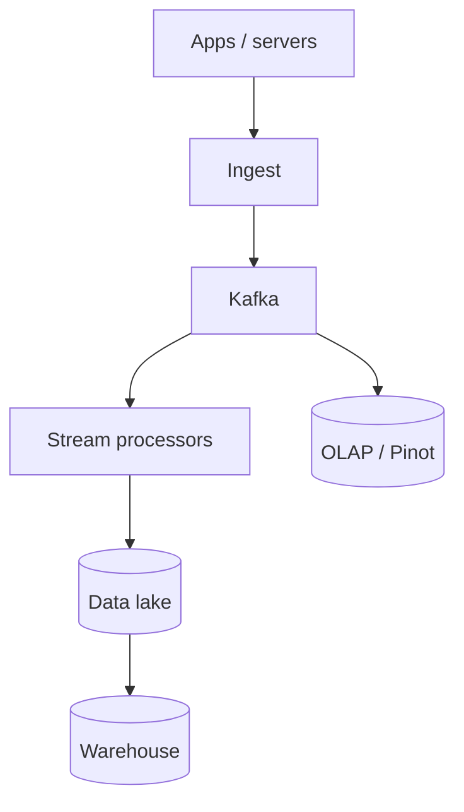
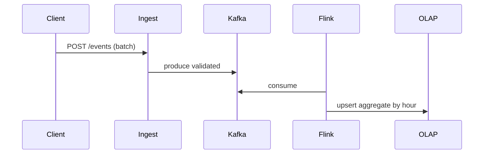

# HLD — Analytics Event Pipeline

## 1. Clarify requirements

### 1.0 Live flow

**Opening (~once):** *“I’ll align **event schema**, **delivery semantics** (at-least-once), **real-time vs batch**, and **privacy**; then **ingest**, **stream**, **warehouse**, **serving** for **metrics/dashboards**. **Pause after the diagram**—**Kafka**, **Lakehouse**, or **real-time OLAP**?”*

**Thinking transitions:** *“Same spine as browse **signals** in [12-hld-ecommerce-product-browsing.md](./12-hld-ecommerce-product-browsing.md)—here **generalized**.”*

### 1.1 Clarify

| Topic | Say it like this in the room |
|--------------------------|-------------------------------|
| **Volume** | “**Trillion** events/year class?” |
| **Latency** | “**Minutes** batch ok vs **sub-minute** KPI?” |
| **Schema** | “**Avro/Protobuf** registry?” |
| **PII** | “**Hash** user_id in raw stream?” |

### 1.2 Functional requirements (FR)

| FR area | Say it like this |
|---------|-------------------|
| **Ingest** | “Clients/servers emit **typed events**.” |
| **Process** | “Validate, **enrich**, **sessionize**, **aggregate**.” |
| **Serve** | “BI tools, **metrics**, **ML** features.” |

### 1.3 Non-functional requirements (NFR)

| NFR | Say it like this |
|-----|------------------|
| **Durability** | “**No silent drop**—**DLQ** for poison.” |
| **Cost** | “**Tiered** storage; **columnar** formats.” |

### 1.4 Invariants

**Invariant:** “Every **event** has **`(event_id or idempotency key, source, occurred_at)`** such that **replays** do not **double-count** **business metrics** that require **exactly-once** semantics—achieved via **idempotent sinks** or **dedupe** windows.”

| Beat | Say it like this |
|------|------------------|
| **Bridge** | “**Kafka** **log** is **source** for **stream**; **S3** **lake** for **batch**.” |
| **Core split** | “**Lambda** or **Kappa**—pick one sentence.” |

### Key insight (say early)

**Immutable append-only log** + **deterministic processing** + **idempotent sinks** = practical **analytics correctness** at scale.

#### Key anchors

1. “**Schema registry**.”  
2. “**Bronze/silver/gold** medallion (Databricks idiom) if interviewer knows it.”  
3. “**OLAP** for **serving** aggregates.”

---

## 2. Estimate scale

| Dimension | Illustrative |
|-----------|----------------|
| Events / sec | **Millions** |
| Storage | **PB** lake |

---

## 3. APIs and data model

### 3.1 Event envelope

- `event_name`, `event_id`, `occurred_at`, `user_id?`, `props` (bounded), `schema_version`.

### 3.2 APIs

| API | Purpose |
|-----|---------|
| `POST /v1/events` | Beacon batch |
| *internal* | **Mirror** to warehouse loaders |

---

## 4. High-level architecture

### 4.1 Phases

| Phase | Ship |
|-------|------|
| **1** | Kafka + S3 + daily Spark |
| **2** | **Streaming** aggregates to **OLAP** |
| **3** | **Feature store** for **ML** online |

---

## 5. Deep dive: event → metric

### 🎯 Bottleneck Anchor

“**Small file problem** in lake + **consumer lag**—**compaction** + **partition** discipline.”

**Taking a stance:** *“**At-least-once** Kafka + **Flink** **checkpointing** + **OLAP** **primary key** dedupe for **hourly** rollups.”*

---

## 6. Scaling and bottlenecks

| Risk | Mitigation |
|------|------------|
| **Hot partition** | **Salt** keys in Kafka partitioning carefully |
| **Schema drift** | **Registry** + **compatibility** checks |

---

## 7. Reliability and failure handling

- **Poison message:** **DLQ** + **alert**.  
- **Backfill:** **idempotent** batch jobs with **watermarks**.

---

## 8. Tradeoffs and alternatives

| Choice | Trade |
|--------|--------|
| **Real-time OLAP** | Freshness vs **cost** |
| **Lambda** | Two code paths vs **simplicity** |

---

## 9. Monitoring, observability, and security

**Metrics:** **ingest lag**, **parse error** %, **sink** freshness.  
**Security:** **PII** separation; **lineage**; **access** RBAC on warehouse.

---

## 10. Design patterns, data structures & best practices

| Pattern | Map |
|---------|-----|
| **Append-only log** | Kafka |
| **Medallion** | Bronze/Silver/Gold |
| **Idempotent sink** | Merge keys |

**Live:** max **four** patterns.

---

## Closing notes

| Do | Avoid |
|----|--------|
| **Exactly-once** definition | Hand-wavy “Kafka is exact” |
| **Schema discipline** | Unbounded JSON chaos |

---

## Bar-raiser follow-ups

| They ask | Say it like this |
|----------|------------------|
| **GDPR delete** | “**Tombstone** events + **purge** pipelines; **hard** in **ML** features.” |

---

## 60-second close

| Beat | Say it like this |
|------|------------------|
| **Recap** | “**Ingest** → **Kafka** → **stream + lake**; **idempotent** sinks; **OLAP** for **low-latency** KPIs; **schema registry**; **watch lag** + **hot partitions**.” |

---
