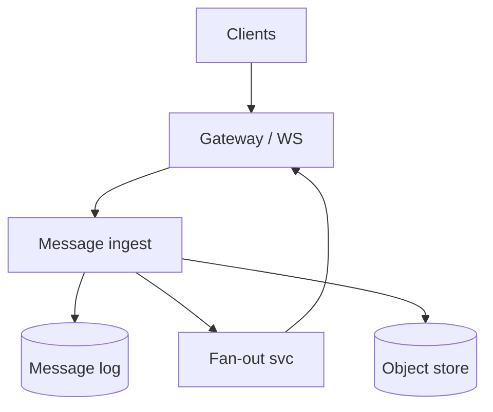
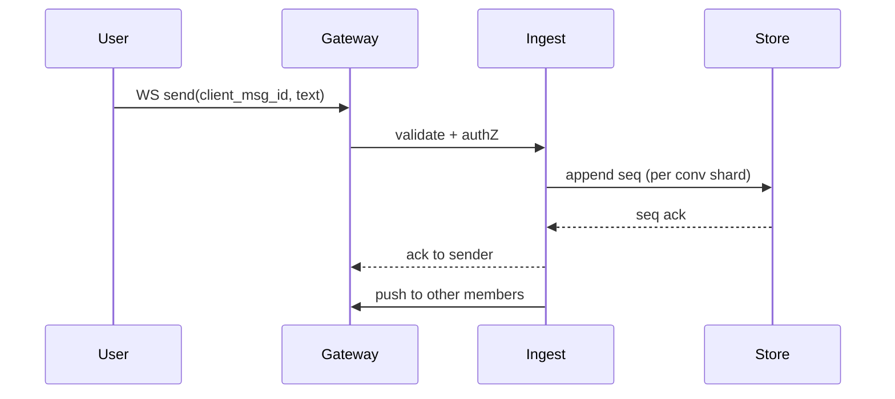

# HLD — Chat Messaging Platform

## 1. Clarify requirements

### 1.0 Live flow

**Opening (~once):** *“I’ll align **1:1 vs groups**, **ordering**, **delivery receipts**, **E2E encryption** scope, and **media**; then **sessions**, **storage**, **sync protocol**. **Pause after the diagram**—**fan-out**, **presence**, or **search**?”*

**Thinking transitions:** *“**WhatsApp-shaped** details live in [14-hld-whatsapp-web-messaging.md](./14-hld-whatsapp-web-messaging.md)—here I’ll keep a **generic platform** spine.”*

### 1.1 Clarify

| Topic | Say it like this in the room |
|--------------------------|-------------------------------|
| **Ordering** | “**Per conversation** total order vs **causal**?” |
| **Size** | “**Message** max size; **media** offload?” |
| **Search** | “Server-side **full text** or **client** only?” |
| **Compliance** | “**Legal hold** / **export**?” |

### 1.2 Functional requirements (FR)

| FR area | Say it like this |
|---------|-------------------|
| **Send** | “Client sends **message** to **conversation**.” |
| **Sync** | “**Online** push; **offline** pull since **cursor**.” |
| **State** | “**Delivered/read** if product requires.” |
| **Groups** | “**Membership** + **fan-out** policy.” |

### 1.3 Non-functional requirements (NFR)

| NFR | Say it like this |
|-----|------------------|
| **Latency** | “**Low p99** for send ack; **global** users.” |
| **Durability** | “**At-least-once** server receive; **dedupe** client `msg_id`.” |

### 1.4 Invariants

**Invariant:** “Within a **conversation**, messages have a **monotonic server sequence** (or **Lamport**-style ordering) visible to readers; **duplicates** from **retries** collapse to **one** logical message.”

| Beat | Say it like this |
|------|------------------|
| **Bridge** | “**Ingest** path **fast ack**; **fan-out** **async**.” |
| **Core split** | “**Session gateway** vs **message store** vs **media blob**.” |

### Key insight (say early)

**Partition by conversation_id** for **write locality**; **replicate** for **HA**; **separate hot path** (**WS gateway**) from **cold storage** (**object store** for media).

#### Key anchors

1. “**Client-generated UUID** + **server seq**.”  
2. “**WS/MQTT** + **missed message sync**.”  
3. “**Presence** **ephemeral**.”

---

## 2. Estimate scale

| Dimension | Illustrative |
|-----------|----------------|
| Messages / day | **Billions** at scale |
| Group size | **Cap** (e.g. 256) for **fan-out** predictability |

---

## 3. APIs and data model

### 3.1 APIs

| API | Purpose |
|-----|---------|
| `POST /v1/conversations/{id}/messages` | Send |
| `GET /v1/conversations/{id}/messages?cursor=` | History |
| `WS /v1/connect` | Live stream |

### 3.2 Model

- **Message:** `(conversation_id, server_seq, client_msg_id, sender_id, body_ref, ts)`.  
- **Conversation:** metadata, **member_ids**.

---

## 4. High-level architecture

### 4.1 Phases

| Phase | Ship |
|-------|------|
| **1** | Single region, 1:1 |
| **2** | Groups + **sharded** conversations |
| **3** | **Global** with **regional** home for conversation |

---

## 5. Deep dive: send message

### 🎯 Bottleneck Anchor

“**Large group fan-out**—**precomputed** recipient shards or **gossip** style **fan-out tree**.”

**Taking a stance:** *“**Write** to **log** first; **push** **best-effort**; **client** **sync** heals gaps.”*

---

## 6. Scaling and bottlenecks

| Risk | Mitigation |
|------|------------|
| **Hot conversation** | **Shard** by hash(conversation_id) |
| **WS memory** | **Horizontal** gateway + **sticky** sessions |

---

## 7. Reliability and failure handling

- **Duplicate send:** **unique** `(conversation_id, client_msg_id)`.  
- **Push miss:** **cursor** replay on reconnect.

---

## 8. Tradeoffs and alternatives

| Choice | Trade |
|--------|--------|
| **Server E2E** | Privacy vs **search** / **moderation** |
| **CRDT** | Offline elegance vs **complexity** |

---

## 9. Monitoring, observability, and security

**Metrics:** **send p99**, **fan-out lag**, **WS reconnect** rate.  
**Security:** **TLS**; **spam** rate limits; **content** policy hooks.

---

## 10. Design patterns, data structures & best practices

| Pattern | Map |
|---------|-----|
| **Append-only log** | Per conversation |
| **CQRS** | Read models for inbox |
| **Pub/sub** | Fan-out |

**Live:** max **four** patterns.

---

## Closing notes

| Do | Avoid |
|----|--------|
| **Dedupe story** | At-least-once without client id |
| **Deep link to 14** | Re-derive Signal protocol in hour |

---

## Bar-raiser follow-ups

| They ask | Say it like this |
|----------|------------------|
| **Global ordering** | “Usually **per conversation** order—**not** global wall clock.” |

---

## 60-second close

| Beat | Say it like this |
|------|------------------|
| **Recap** | “**WS gateway** + **append log** per **conversation**; **async fan-out**; **client_msg_id** dedupe; **groups** need **fan-out** plan; **see 14** for **WhatsApp** depth.” |

---
