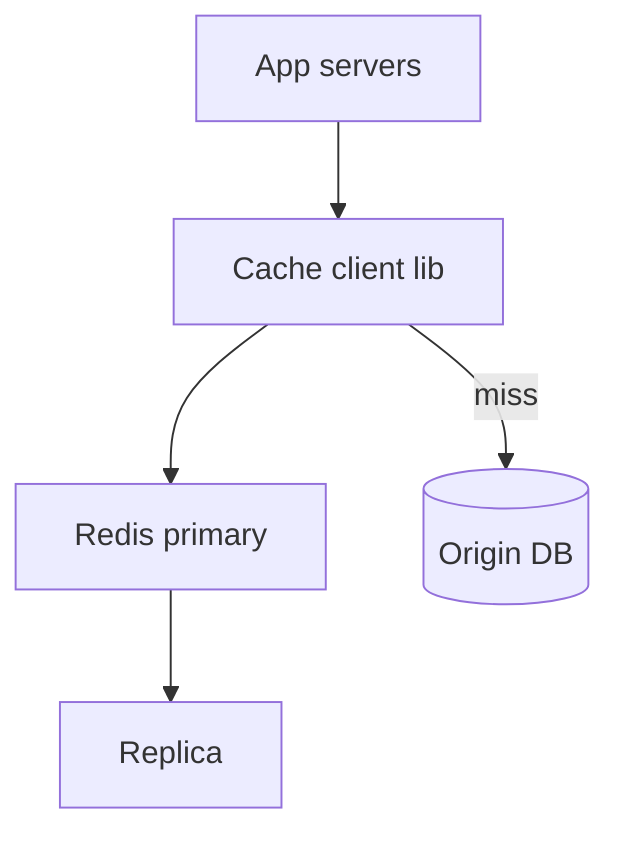
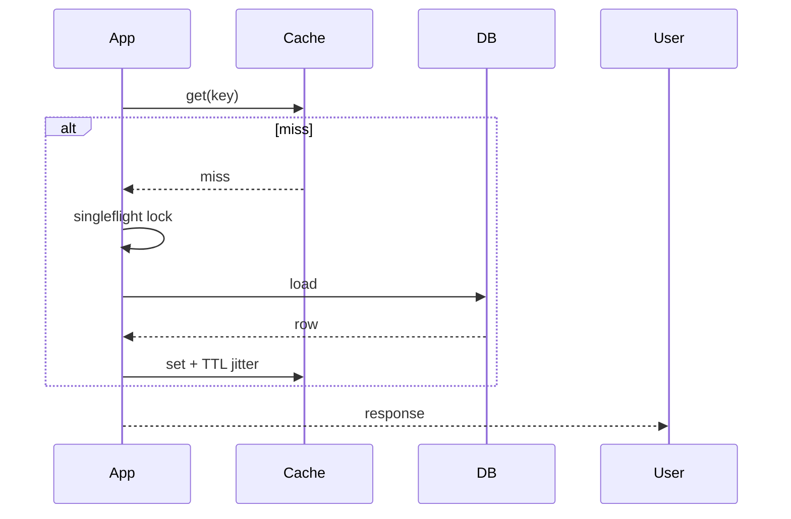

# HLD — Distributed Cache

## 1. Clarify requirements

### 1.0 Live flow

**Opening (~once):** *“I’ll align **read vs write-through**, **consistency** (eventual vs strong), **eviction**, and **stampede**; then **client library**, **cluster topology**, **failure modes**. **Pause after the diagram**—**Redis cluster**, **invalidation**, or **multi-region**?”*

**Thinking transitions:** *“Cache is **not** a **source of truth**—I’ll say what **owns** truth.”*

### 1.1 Clarify

| Topic | Say it like this in the room |
|--------------------------|-------------------------------|
| **Workload** | “**Hot key** social graph vs **session**?” |
| **TTL** | “Default **staleness** tolerance?” |
| **Size** | “**MB** values ok?” |
| **Multi-region** | “**Active-active** writes?” |

### 1.2 Functional requirements (FR)

| FR area | Say it like this |
|---------|-------------------|
| **KV** | “Get/set/del with **TTL**.” |
| **Collections** | “Sets, sorted sets, hashes if Redis-shaped.” |
| **Optional** | “Pub/sub **invalidation** hints.” |

### 1.3 Non-functional requirements (NFR)

| NFR | Say it like this |
|-----|------------------|
| **Latency** | “**Sub-ms** in-AZ typical.” |
| **Availability** | “**Degrade** to **origin** on miss/outage.” |

### 1.4 Invariants

**Invariant:** “**Mutations** to **authoritative** state go through **primary store** first (or **write-through** with **acknowledged** consistency model); **cache** never **silently** invents **commits**.”

| Beat | Say it like this |
|------|------------------|
| **Bridge** | “**Cache-aside** + **TTL** + **jitter** for **most** reads.” |
| **Core split** | “**Client** owns **coalescing** / **circuit breaker**.” |

### Key insight (say early)

**Solve thundering herd** with **singleflight / request coalescing**, **probabilistic early refresh**, and **TTL jitter**—not bigger machines alone.

#### Key anchors

1. “**Consistent hashing** + **replicas**.”  
2. “**Hot key** **split** logical keys.”  
3. “**LRU** + **maxmemory policy**.”

---

## 2. Estimate scale

| Dimension | Illustrative |
|-----------|----------------|
| QPS | **Millions** aggregate |
| Memory | **TB** cluster |

---

## 3. APIs and data model

### 3.1 Client API (conceptual)

- `get(key)`, `set(key, val, ttl)`, `del(key)`  
- **CAS** optional (`SET NX`, versioned **ETag** pattern)

---

## 4. High-level architecture

### 4.1 Phases

| Phase | Ship |
|-------|------|
| **1** | Single shard Redis + replicas |
| **2** | **Cluster** + **client-side** routing |
| **3** | **Global** **active-passive** with **conflict** rules |

---

## 5. Deep dive: cache-aside read

### 🎯 Bottleneck Anchor

“**Thundering herd** on **popular key expiry**—**coalesce** + **stale-while-revalidate**.”

**Taking a stance:** *“**Write-through** when **read-after-write** must be **fresh**; **aside** for **most** denormalized reads.”*

---

## 6. Scaling and bottlenecks

| Risk | Mitigation |
|------|------------|
| **Hot key** | **Subkey sharding** in app |
| **Big payload** | **Compression** + **chunking** policy |
| **Failover** | **Replica** promotion with **fencing** if strong consistency needed |

---

## 7. Reliability and failure handling

- **Cluster split:** prefer **availability** + **stale** vs **split-brain writes**—define.  
- **Origin slow:** **bulkhead** threads fetching DB.

---

## 8. Tradeoffs and alternatives

| Choice | Trade |
|--------|--------|
| **Redis vs Memcached** | Rich ops vs **simplicity** |
| **Local L1** | Speed vs **invalidation** complexity |

---

## 9. Monitoring, observability, and security

**Metrics:** **hit rate**, **latency**, **evictions**, **connections**.  
**Security:** **TLS**, **ACL** per prefix; **no secrets** in values.

---

## 10. Design patterns, data structures & best practices

| Pattern | Map |
|---------|-----|
| **Cache-aside** | Most web reads |
| **Write-through** | Strong read-your-writes |
| **SWR** | Stale-while-revalidate |

**Live:** max **four** patterns.

---

## Closing notes

| Do | Avoid |
|----|--------|
| **Stampede story** | “We’ll set a TTL” only |
| **Ownership of truth** | Cache as database |

---

## Bar-raiser follow-ups

| They ask | Say it like this |
|----------|------------------|
| **Near-cache** | “**Per-process** L1 + **pub/sub** invalidation—**complex**.” |

---

## 60-second close

| Beat | Say it like this |
|------|------------------|
| **Recap** | “**Cache-aside** default; **TTL+jitter**; **singleflight**; **Redis cluster** + **replicas**; **hot key** patterns; **never** sole **source of truth** for **commits**.” |

---
