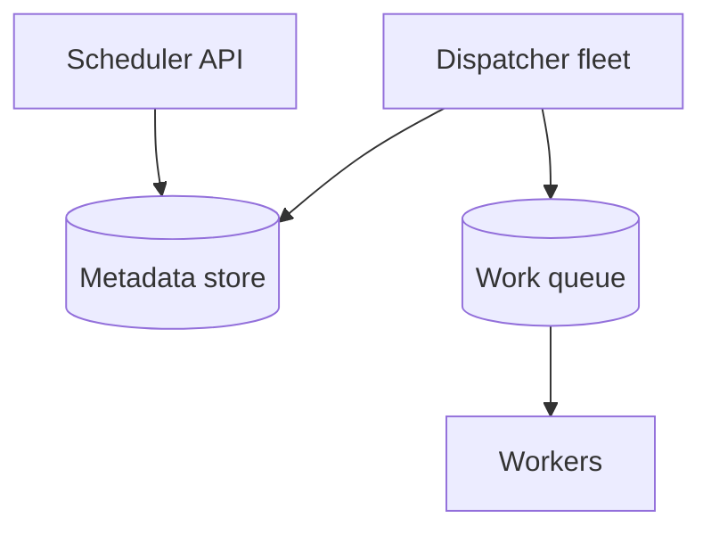
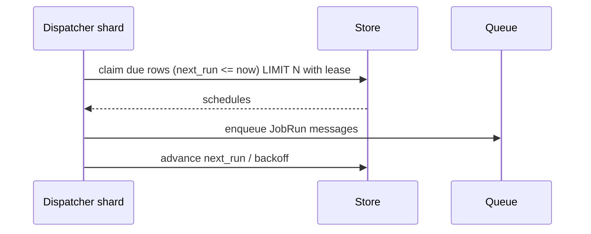

# HLD — Distributed Job Scheduler

## 1. Clarify requirements

### 1.0 Live flow

**Opening (~once):** *“I’ll align **once vs recurring**, **at-least-once vs exactly-once**, **timezone/DST**, and **fairness** across tenants; then **leader election**, **persistence**, **worker execution**. **Pause after the diagram**—**storage**, **misfire**, or **multi-region**?”*

**Thinking transitions:** *“Schedulers are **databases + clocks**—I’ll be explicit about **skew** and **lease**.”*

### 1.1 Clarify

| Topic | Say it like this in the room |
|--------------------------|-------------------------------|
| **Semantics** | “**At-least-once** delivery ok with **idempotent** jobs?” |
| **Precision** | “**Second** vs **minute** granularity?” |
| **Priority** | “**VIP** queues?” |
| **DAG** | “**Dependencies** between jobs—**Airflow**-class or **simple** timer?” |

### 1.2 Functional requirements (FR)

| FR area | Say it like this |
|---------|-------------------|
| **Schedule** | “Create/update/delete **triggers**.” |
| **Execute** | “Fire → **enqueue** work item → **workers** consume.” |
| **Observe** | “History, **next run**, **missed** policy.” |

### 1.3 Non-functional requirements (NFR)

| NFR | Say it like this |
|-----|------------------|
| **Scale** | “**Many** schedules; **horizontal** dispatchers.” |
| **Durability** | “No **silent drop** on **restart**.” |

### 1.4 Invariants

**Invariant:** “Every **due** trigger generates **at least one** execution attempt **or** a **recorded** **suppressed** reason (disabled, misfire policy); **no** silent **loss**.”

| Beat | Say it like this |
|------|------------------|
| **Bridge** | “**Placer** puts **due** rows in **queue**; **workers** **ack**.” |
| **Core split** | “**Control plane** (CRUD) vs **data plane** (tick dispatch).” |

### Key insight (say early)

**Time-indexed lease** on schedule shards + **idempotent job execution**—**exactly-once** end-to-end is **business-level**, not **network-level**.

#### Key anchors

1. “**Leader** or **sharded time ranges**.”  
2. “**Catch-up** vs **coalesce** misfire policy.”  
3. “**Outbox** to **queue**.”

---

## 2. Estimate scale

| Dimension | Illustrative |
|-----------|----------------|
| Triggers | **100M+** |
| Firings / sec | **Spiky**—**partition** by **time bucket** |

---

## 3. APIs and data model

### 3.1 APIs

| API | Purpose |
|-----|---------|
| `POST /v1/schedules` | Create cron / one-shot |
| `DELETE /v1/schedules/{id}` | Cancel |
| *worker* | `POST /v1/jobs/{id}/ack` |

### 3.2 Model

- **Schedule:** `id`, `cron`, `tz`, `next_run_at`, `owner`, `enabled`.  
- **JobRun:** `schedule_id`, `run_id`, `status`, `lease_until`.

---

## 4. High-level architecture

### 4.1 Phases

| Phase | Ship |
|-------|------|
| **1** | Leader dispatcher + SQL index on `next_run_at` |
| **2** | Sharded dispatchers + **lease** |
| **3** | **Multi-region** active-passive |

---

## 5. Deep dive: tick → dispatch

### 🎯 Bottleneck Anchor

“**Scanning** all schedules each tick—need **time-bucket index** + **lease** to avoid **double fire**.”

**Taking a stance:** *“**At-least-once** to queue + **idempotent** **job_id** = `(schedule_id, fire_time)`.”*

---

## 6. Scaling and bottlenecks

| Risk | Mitigation |
|------|------------|
| **Hot minute** | **Coalesce** windows; **shard** dispatchers |
| **DB write amp** | **Append** fire log + **async** advance |

---

## 7. Reliability and failure handling

- **Worker crash:** **visibility timeout** / **redelivery**.  
- **Dispatcher split-brain:** **lease** + **fencing token** to workers (if supported).

---

## 8. Tradeoffs and alternatives

| Choice | Trade |
|--------|--------|
| **Cron in SQL** | Simple vs **scale** ceiling |
| **Kafka timed topics** | Clever vs **complexity** |

---

## 9. Monitoring, observability, and security

**Metrics:** **misfire** count, **lag** (due→enqueue), **duplicate** execution rate, **queue depth**.  
**Security:** **AuthZ** on schedule CRUD; **no arbitrary code** string—**registered job types** only.

---

## 10. Design patterns, data structures & best practices

| Pattern | Map |
|---------|-----|
| **Leader election** | Single dispatcher |
| **Lease + fencing** | Exactly-once-ish side effects |
| **Outbox** | Durable enqueue |

**Live:** max **four** patterns.

---

## Closing notes

| Do | Avoid |
|----|--------|
| **Idempotent job key** | “Exactly-once” without definition |
| **Misfire policy** | Silent skip |

---

## Bar-raiser follow-ups

| They ask | Say it like this |
|----------|------------------|
| **DST** | “Store **tz** + use **Olson**; **test** spring forward/back.” |

---

## 60-second close

| Beat | Say it like this |
|------|------------------|
| **Recap** | “**Time-indexed** claim with **lease**; **enqueue** to **workers**; **at-least-once** + **idempotent** keys; **misfire** policy; **metrics** on **lag**.” |

---
