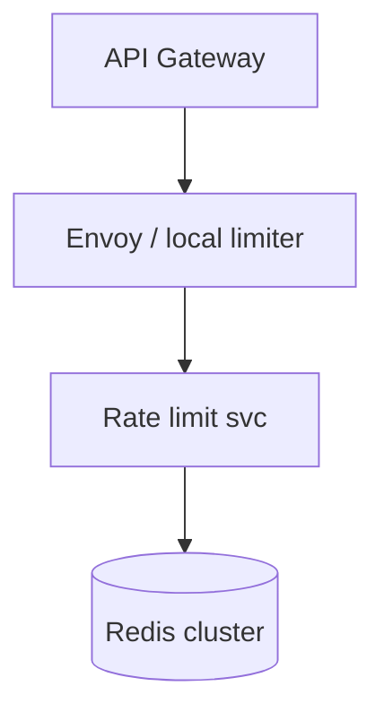
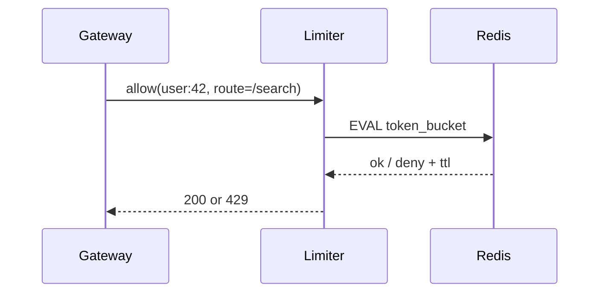

# HLD — Distributed Rate Limiter

## 1. Clarify requirements

### 1.0 Live flow

**Opening (~once):** *“I’ll align **algorithm** (token bucket vs sliding window), **scope** (user/IP/route), **sync vs local approx**, and **burst** behavior; then **data plane**, **architecture**. **Pause after the diagram**—**correctness**, **Redis**, or **edge**?”*

**Thinking transitions:** *“Distributed limiter trades **exactness** for **latency**—I’ll state **over-admission** bounds.”*

### 1.1 Clarify

| Topic | Say it like this in the room |
|--------------------------|-------------------------------|
| **Fairness** | “**Per tenant** fairness vs **global** cap?” |
| **Burst** | “Allow **burst** of **B**?” |
| **Failure mode** | “**Fail open** vs **closed** under store outage?” |
| **Hierarchy** | “**Global** then **per-route** nested?” |

### 1.2 Functional requirements (FR)

| FR area | Say it like this |
|---------|-------------------|
| **Decide** | “Given **key** + **limit rule**, return **allow** / **deny** + optional **Retry-After**.” |
| **Dynamic** | “Rules from **config** / **API**.” |
| **Obs** | “Emit **metrics** per key prefix (cardinality-safe).” |

### 1.3 Non-functional requirements (NFR)

| NFR | Say it like this |
|-----|------------------|
| **Latency** | “**Microseconds–low ms** on hot path—**local** decision preferred.” |
| **Accuracy** | “**Centralized** ‘exact’ vs **Gossip** approximate—pick and defend.” |

### 1.4 Invariants

**Invariant:** “A **deny** response is **always safe**; an **allow** may be **slightly over** quota under **distributed races**—bounded by design.”

| Beat | Say it like this |
|------|------------------|
| **Bridge** | “**Token bucket** in **Redis** + **local leash**.” |
| **Core split** | “**Data plane** (fast) vs **control plane** (rules).” |

### Key insight (say early)

**Hierarchical limits** + **token bucket** at edge with **async central reconciliation** for **abuse**—pure distributed counting is either **slow** or **fuzzy**.

#### Key anchors

1. “**Lua script** atomicity in Redis.”  
2. “**Epoch + counter** sliding window approximation.”  
3. “**Fail closed** on **payments**; **fail open** on **optional** reads if product says so.”

---

## 2. Estimate scale

| Dimension | Illustrative |
|-----------|----------------|
| Checks / sec | **Same as gateway QPS** |
| Key cardinality | **Huge**—**hash** tags, **sample** metrics |

---

## 3. APIs and data model

### 3.1 APIs

| API | Purpose |
|-----|---------|
| `allow(key, cost)` | Internal sync call from gateway |
| `PUT /v1/limits/{tenant}` | Control plane |

### 3.2 Rules model

- **LimitRule:** `key_template`, `rate`, `burst`, `algorithm`, `priority`.

---

## 4. High-level architecture

### 4.1 Phases

| Phase | Ship |
|-------|------|
| **1** | Single-region Redis + Lua |
| **2** | **Local token bucket** + **async sync** |
| **3** | **Global** quotas with **hierarchical** aggregation |

---

## 5. Deep dive: allow check

### 🎯 Bottleneck Anchor

“**Redis hot key** per **viral user**—**shard** keyspace or **local** burst absorption.”

**Taking a stance:** *“**Token bucket** for **smooth bursts**; **sliding log** only when **hard** audit window needed (more storage).”*

---

## 6. Scaling and bottlenecks

| Risk | Mitigation |
|------|------------|
| **Hot key** | **Sharding** + **local** limit |
| **Cross-region** | **Sticky** routing; **CRDT-ish** counters (rare) |

---

## 7. Reliability and failure handling

- **Redis partial fail:** **degrade** to **local** only with **lower** cap.  
- **Clock skew:** rely on **Redis TIME** or **server** time authority.

---

## 8. Tradeoffs and alternatives

| Choice | Trade |
|--------|--------|
| **Central Redis** | Accuracy vs **RTT** |
| **Gossip** | No single point vs **overcount** |

---

## 9. Monitoring, observability, and security

**Metrics:** **429 rate** by route, **sync lag**, **Redis** latency.  
**Security:** **Keys** must not leak **PII** in logs; **bypass** only for **break-glass** audit.

---

## 10. Design patterns, data structures & best practices

| Pattern | Map |
|---------|-----|
| **Token bucket** | Smooth rate |
| **Leaky bucket** | Strict output rate |
| **Bulkhead** | Isolate noisy neighbors |

**Live:** max **four** patterns.

---

## Closing notes

| Do | Avoid |
|----|--------|
| **State over-admission** | “Exactly once global” hand-wave |
| **Lua atomic** | Racey read-modify-write |

---

## Bar-raiser follow-ups

| They ask | Say it like this |
|----------|------------------|
| **Distributed consensus** | “Usually **overkill**—**central** store + **edge** **approx** wins.” |

---

## 60-second close

| Beat | Say it like this |
|------|------------------|
| **Recap** | “**Token bucket** + **Redis Lua**; **hierarchy** user/route/tenant; **hot key** mitigations; **fail-open/closed** explicit; **429** + **Retry-After**.” |

---
