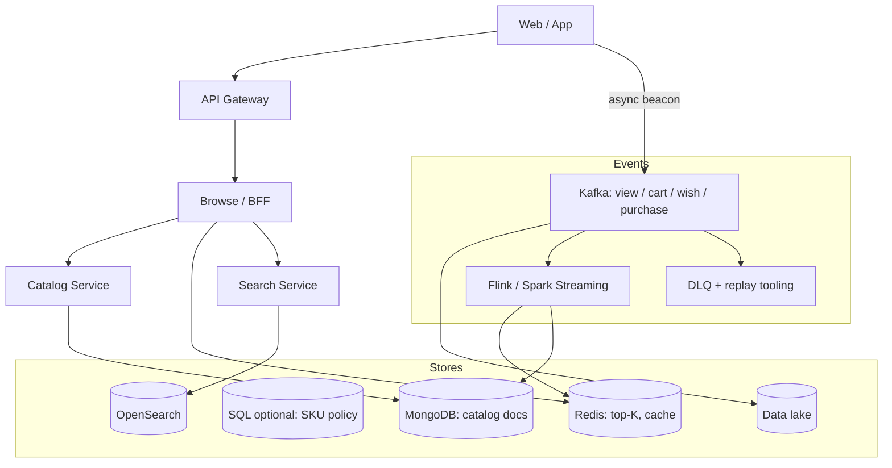
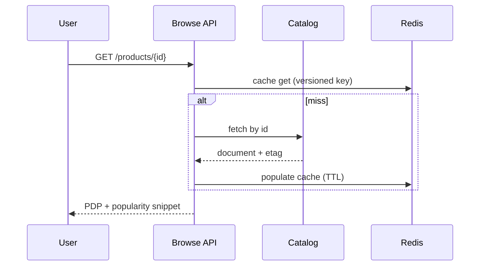

# HLD — E-Commerce Product Browsing (No Checkout)

> **GitHub README style** — diagrams render on GitHub. Pair with [HLD-README.md](./HLD-README.md).

| | |
|--|--|
| **Round** | 45–60 min |
| **Uber-style signal** | Read-heavy catalog + **firehose events** + **AP** browse vs **CP** money path + **clear Mongo payload** |

---

## Table of contents

**Prep**

- [Interview plan](#interview-plan)
- [SDE-2 drive kit (Senior interviewer)](#sde-2-drive-kit-senior-interviewer)
- [Strong-hire signals](#strong-hire-signals)
- [Coverage map](#coverage-map)

**Interview spine (nine steps)**

- [Interview spine (nine steps)](#interview-spine-nine-steps)
- [1. Clarify requirements](#1-clarify-requirements)
- [2. Estimate scale](#2-estimate-scale)
- [3. APIs and data model](#3-apis-and-data-model)
- [4. High-level architecture](#4-high-level-architecture)
- [5. Deep dive: critical flow](#5-deep-dive-critical-flow)
- [6. Scaling and bottlenecks](#6-scaling-and-bottlenecks)
- [7. Reliability and failure handling](#7-reliability-and-failure-handling)
- [8. Tradeoffs and alternatives](#8-tradeoffs-and-alternatives)
- [9. Monitoring, observability, and security](#9-monitoring-observability-and-security)

**Wrap-up**

- [Bar-raiser follow-ups](#bar-raiser-follow-ups)
- [Strong Hire room checklist](#strong-hire-room-checklist)
- [60-second close](#60-second-close)

---

## Interview plan

> “Scope is **browse only**—no checkout—but we still ingest **purchase** as a **strong signal**. I’ll clarify identity and freshness, outline **Kafka → stream agg → Redis** for popularity, **Mongo** (or docs elsewhere) for flexible catalog reads, and **search** as its own index. I’ll deep dive **event ingestion + idempotency**, then **CAP** for browse vs money. Pause me after the diagram if you want more on **storage** or **pipeline**.”

---

## SDE-2 drive kit (Senior interviewer)

### A. Lock the agenda (30–45 sec)

Say: plan = clarify → scale → APIs/model → architecture → **(PDP path + separate event path)** → bottlenecks → reliability → tradeoffs → monitoring/security. Then: **“Does that sequencing work?”** If they care about **compliance** or **fraud**, star it for §9.

### B. Questions to ask — **this order**

| # | Ask (intent) |
|---|----------------|
| 1 | “Confirm **browse only**—but do **purchase events** still exist as signals from elsewhere?” |
| 2 | “**Guest** vs logged-in events—do we need **merge** across devices?” |
| 3 | “How stale can **trending** be—**seconds vs minutes**—and do we label it?” |
| 4 | “**p99** for PDP vs PLP—different budgets?” |
| 5 | “**Search**—first-class here or separate team/service?” |
| 6 | “**GDPR** delete / retention on behavioral stream?” |
| 7 | “**Bots**—should invalid traffic hit Kafka or get dropped at edge?” |
| 8 | “**‘Bestseller’** semantics—must equal **purchase counts** only?” |

**After each:** “So I’ll treat that as **…** in the design.”

### C. What to explain — **sentence per spine step**

| Step | Winning line |
|------|----------------|
| 1 | “**Serving path** never blocks on Kafka; **firehose** is parallel.” |
| 2 | “**100×–1000×** more views than purchases ⇒ **async aggregation**.” |
| 3 | “**Mongo** = **read-optimized product doc** + denormalized popularity; **purchases** stay **OLTP**.” |
| 4 | “Diagram: **BFF → Catalog/Search/Cache** + parallel **beacon → Kafka → Flink → Redis/doc patch**.” |
| 5 | “Deep dive: **PDP cache-aside** and **event path**: validate → partition → dedupe → aggregate → sink.” |
| 6 | “Bottlenecks: **Kafka lag**, **hot SKU**, **stampede**, enrichment misses.” |
| 7 | “**DLQ + replay**; PDP **degrades** without trending block if Redis down.” |
| 8 | “**AP** on browse scores; **CP** only on financial truth if extended.” |
| 9 | “Lag, duplicates, **p99 PDP**; **rate limits** + **PII hygiene** on `/events`.” |

### D. Whiteboard order

1. Two parallel pipes: **Read** vs **Ingest** (explicitly decoupled).  
2. Boxes: Gateway → Browse → **Catalog Mongo** + **Search** + **Redis**.  
3. Below: **Kafka → Stream job → Redis / doc denorm**.  
4. Sequence: **GET PDP** OR **POST events**—pick **one** sequence first, ask for second.

### E. Senior probes → crisp answers

| Probe | Answer |
|-------|--------|
| “Why Kafka not write straight to Mongo?” | “**Replay**, **fan-out** to multiple consumers, **backpressure**; Mongo isn’t the unified log.” |
| “CAP?” | “**AP** for trending/read cache; **CP** where money/inventory commits live (out of scope or handoff).” |
| “Exactly-once events?” | “Usually **at-least-once** + **idempotent** sinks + **event_id** dedupe.” |
| “‘What’s in Mongo?’” | Walk through [§3.4](#34-mongodb-document-example-interviewer-favorite) JSON; say **shard key** (product vs seller tradeoff). |
| “Purchase disagrees with trending?” | “Separate **labels** and score pipelines; purchase-**weighted** channel for ‘bestseller’.” |

### F. Time crunched → pick **two** deep dives

**PDP read path** + **event dedupe/idempotency**. Say it aloud.

### G. Anti-patterns

- Blocking PDP on **sync** Kafka produce.  
- Trending = Redis with **no** OLAP truth story.  
- Search blended into **Mongo** “because easy.”

---

## Strong-hire signals

- You separate **beacon ingest** from **serving path** (never block PDP on Kafka).  
- You answer **“what’s in Mongo?”** with a **concrete document** and **shard key** reasoning.  
- You state **at-least-once** + **dedupe keys** explicitly.  
- You compare **SQL catalog** vs **document catalog** honestly for **this** workload.

---

## Coverage map

- [ ] Walk the [nine-step spine](#interview-spine-nine-steps) in order  
- [ ] Event types: view, cart, wishlist, purchase  
- [ ] **Kafka** topics, partitioning, **DLQ**  
- [ ] **Stream processor** rollups (windows)  
- [ ] **Redis** top-K / UV approximations  
- [ ] **Mongo** vs SQL — document example  
- [ ] **OpenSearch** for text  
- [ ] **CAP** answer tailored to browse  
- [ ] **Observability:** lag, duplicates, PDP latency  

---

## Interview spine (nine steps)

| Step | What you deliver | Section |
|------|------------------|---------|
| **1** | Clarify requirements | [§1](#1-clarify-requirements) |
| **2** | Estimate scale | [§2](#2-estimate-scale) |
| **3** | APIs / data model | [§3](#3-apis-and-data-model) |
| **4** | High-level architecture | [§4](#4-high-level-architecture) |
| **5** | Deep dive critical flow | [§5](#5-deep-dive-critical-flow) |
| **6** | Scaling / bottlenecks | [§6](#6-scaling-and-bottlenecks) |
| **7** | Reliability / failure handling | [§7](#7-reliability-and-failure-handling) |
| **8** | Tradeoffs / alternatives | [§8](#8-tradeoffs-and-alternatives) |
| **9** | Monitoring / security | [§9](#9-monitoring-observability-and-security) |

---

## 1. Clarify requirements

### 1.1 Questions to ask first

| Question | Why it matters |
|----------|----------------|
| Guest vs logged-in events? | Identity, merge, attribution |
| Cross-device identity? | Deduping same human |
| GDPR delete / retention on events? | Pipeline, legal |
| Regional catalog / pricing? | Sharding, CDN |
| Is **checkout** truly out of scope—but **purchase events** exist? | Source of truth for “bestseller” |
| **Real-time** trending vs **minutes** lag acceptable? | Stream windows, Redis TTL |
| Bot / fraudulent traffic? | Validation before Kafka |

### 1.2 Functional requirements (FR)

**Catalog browsing**

- **Category tree** (or faceted navigation): list categories, subcategories, counts optional.  
- **PLP** (`product list`): filter by category, seller, attributes; **cursor** pagination.  
- **PDP** (`product detail`): title, description, attributes, media gallery, price display, seller, **popularity/trending** snippet.  
- **Search**: keyword + filters—typically **delegated** to OpenSearch (or equivalent).

**Popularity and highlights**

- **Trending / top-K** rails on home or category pages driven by **aggregated** signals.  
- Clear **UX labels** (“trending in last 24h”) when data is **lagging**.

**Behavioral events (ingestion)**

- Ingest at high volume: **product viewed**, **added to cart**, **wishlisted**, **purchased** (purchase may come from order service).  
- Support **batch** client beacons and **server-side** events where applicable.

**Out of scope (unless extended)**

- **Payment, cart checkout, inventory reservation**—acknowledge and define **handoff** for consistency if interviewer expands.

### 1.3 Non-functional requirements (NFR)

**Performance**

- **PDP/PLP p99** within product SLO; **never** block read path on Kafka **produce**.  
- Stream processing may lag seconds/minutes—define acceptable **staleness** for “trending.”

**Throughput and elasticity**

- **Event write rate** ≫ catalog update rate; **horizontal** consumers on Kafka.  
- **Autoscale** browse tier on CPU/latency; **autoscale** Flink/k8s workers on **lag**.

**Availability**

- **AP** bias on browse and trending aggregates; **degrade** to stale scores vs hard fail.  
- Catalog read path **highly available** via replicas + cache.

**Consistency**

- **Browse**: eventual for popularity; **purchase counts** for “bestseller” must trace to **order facts** when shown as such.  
- If **inventory** enters scope: **stronger** checks at cart/checkout (outside pure browse).

**Durability and correctness**

- **Raw events** durable in **Kafka** + **lake** for replay.  
- **Idempotent** consumers (`event_id` or idempotent sink).

**Security and compliance**

- **PII** minimization in event payloads; **retention** and **delete** path for GDPR.  
- **Rate limits** on `/events` and browse APIs.

### 1.4 Invariant

**Invariant:** “We never label something **‘bestseller from purchases’** unless that signal is **grounded in purchase facts**; **views** may drive **‘trending’** if we label it honestly.”

---

## 2. Estimate scale

| Dimension | Illustrative | Implication |
|-----------|----------------|-------------|
| Event : purchase ratio | **100×–1000×** | Kafka partitioning, aggregation, not synchronous PDP |
| Catalog reads | **Very high** QPS at peak | Cache, CDN, read replicas |
| PDP payload | KB-scale document | Mongo/JSON friendly |
| Hot SKUs | Few products drive huge view volume | Hot key mitigation in Redis / combine in partition |

**Talk track:** “PLP/PDP are **cache-shaped**; the firehose is **Kafka-shaped**; we **decouple** them so a spike in views never **blocks** a product read.”

---

## 3. APIs and data model

### 3.1 Public APIs (sketch)

| API | Purpose |
|-----|---------|
| `GET /v1/categories` | Category tree |
| `GET /v1/products?category=&cursor=` | PLP |
| `GET /v1/products/{id}` | PDP |
| `GET /v1/trending?window=` | Trending rail |
| `POST /v1/events` | Batch beacon → **async** accept (**202**) → Kafka |

**Headers:** `Authorization`, **`Idempotency-Key`** on sensitive writes if any; **`If-None-Match`** on PDP.

### 3.2 Core entities

**Product**, **Category**, **Seller**, **ProductMedia**, **Event** (immutable), optional **AggregateScore** (materialized).

### 3.3 Storage by access pattern

| Data | Store | Rationale |
|------|-------|-----------|
| Raw events | Kafka + data lake | Replay, cheap |
| Hot popularity | Redis (ZSET, HLL for UV) | Sub-ms reads |
| Catalog read model | MongoDB or SQL+JSON | Flexible attributes per vertical |
| Keyword search | OpenSearch | Inverted index |
| Purchases / orders (canonical) | OLTP SQL | ACID when checkout exists |

### 3.4 MongoDB document example (interviewer favorite)

**Read model** per product—not the purchase ledger:

```json
{
  "product_id": "p_123",
  "title": "Running Shoe",
  "description": "…",
  "attributes": { "color": "blue", "sizes": ["8", "9", "10"] },
  "category_path": ["footwear", "running"],
  "media": [{ "url": "https://cdn.example/…", "type": "image" }],
  "seller_id": "s_9",
  "price_display": { "amount": 129.99, "currency": "USD", "as_of": "2026-04-21T12:00:00Z" },
  "popularity_denorm": { "score": 88.2, "updated_at": "2026-04-21T12:05:00Z", "window": "24h" }
}
```

**Shard key:** e.g. `product_id` or `seller_id`—state **why** (even distribution vs seller-local queries).

---

## 4. High-level architecture



**Narration:** “**Serving** is cache + catalog + search; **signals** are append-only in Kafka, **aggregated** asynchronously into Redis and **denormalized** doc fields.”

---

## 5. Deep dive: critical flow

### 5.1 Browse read (PDP)



**Steps:** auth/rate limit → **cache-aside** → batch nothing extra for single id → attach **popularity_denorm** from doc or side Redis key → **ETag**.

### 5.2 Event write path (parallel, must not block PDP)

1. Validate schema, **drop** obvious bots, bound **clock skew**.  
2. Partition Kafka by `product_id` or `user_id` hash.  
3. Consumers **enrich** from local catalog cache; **aggregate** (windows, weighted: purchase &gt; cart &gt; view).  
4. Sink: `ZINCRBY`, **HyperLogLog** for UV, OLAP for BI; **optional** patch to Mongo `popularity_denorm`.

**Idempotency:** `event_id` uniqueness or **Redis SETNX** + TTL for best-effort dedupe.

### 5.3 Consistency story (CAP, in one place)

- **Browse + trending:** favor **availability** + **eventual** scores with honest labels.  
- **Money path** (if added): **CP** where financial truth lives.

---

## 6. Scaling and bottlenecks

| Risk | Mitigation |
|------|------------|
| Kafka **consumer lag** | Autoscale consumers; prioritize topics; shed analytics |
| **Hot product** key | Combine in partition; secondary aggregation; rate limit per key |
| **Poison** events | Schema validation + **DLQ** + replay tooling |
| **Cache stampede** on viral PDP | Single-flight, TTL **jitter**, early refresh |
| Enrichment **misses** | Default category; repair job from DLQ |
| OpenSearch **hot queries** | Cache top queries; separate **read** replicas |

**Optimizations (bundle):** partition Kafka for hot SKUs; **coalesce** beacons; **HLL** for UV; **downsample** ultra-hot keys in Flink.

---

## 7. Reliability and failure handling

- **Never** synchronous **Kafka** on critical PDP—use **async buffer** or fire-and-forget with client retry.  
- **Retries** with jitter on stream sinks; **idempotent** writes to Redis/Mongo.  
- **Dead-letter** path for bad payloads; **replay** after fix.  
- **Degradation:** serve PDP **without** trending block if Redis down.  
- **Backpressure:** drop **noncritical** enrichment under load.

**Runbooks:** lag SLO breach, DLQ spike, duplicate rate anomaly.

---

## 8. Tradeoffs and alternatives

### 8.1 Product tradeoffs

| Choice | Upside | Downside |
|--------|--------|----------|
| Mongo catalog | Flexible schema | Cross-entity reporting harder |
| SQL catalog | Constraints, joins | Rigidity for verticals |
| Large trending windows | Smooth | Slow spike detection |
| Tiny windows | Responsive | Noisy |

### 8.2 Alternatives

| Instead of… | Consider… | When |
|-------------|-----------|------|
| Kafka for everything | Kinesis / Pulsar | Org standard |
| Mongo for catalog | Postgres JSONB | Team SQL-first |
| Redis top-K only | Pure OLAP + async materialized view | Lower ops, higher latency OK |
| Client beacons only | Server logs from PDP | Fraud resistance |

---

## 9. Monitoring, observability, and security

**SLIs / SLOs:** PDP **p99**, PLP **p99**, **Kafka consumer lag**, **duplicate event rate**, null `product_id` rate, **search** latency.

**Tracing:** span per `GET /products/{id}` and per **event batch** accept path.

**Security:** authenticate **trending** APIs if personalized; **rate limit** `/events` and PLP; **WAF** on edge; **no secrets** in URLs; scrub PII in logs.

**Dashboards:** trending freshness vs wall clock, top lagging partitions, Redis memory.

---

## Bar-raiser follow-ups

**Q: “Why not write events straight to Mongo?”**  
A: “**Write amplification**, harder **replay**, fewer consumers; Kafka gives **backpressure** and **fan-out** to search/BI/fraud.”

**Q: “Purchase disagrees with trending?”**  
A: “**Separate scores** and labels—**bestseller** vs **trending**; purchases **weight** more in combined score if product wants one number.”

---

## Strong Hire room checklist

- [ ] Spine **1→9** in order  
- [ ] **Decouple** beacon path from PDP  
- [ ] **Concrete** Mongo doc + shard rationale  
- [ ] **At-least-once** + dedupe story  
- [ ] **CAP** articulated for browse vs money  

---

## 60-second close

“**Browse** is **cache + document catalog** + **OpenSearch**; **beacons** hit **Kafka**, **Flink-style** jobs roll up to **Redis** and **denormalized** catalog fields. We bias **AP** on read surface with honest **staleness**; **purchase-based** claims tie to **OLTP/lake**, not Redis definitions.”
