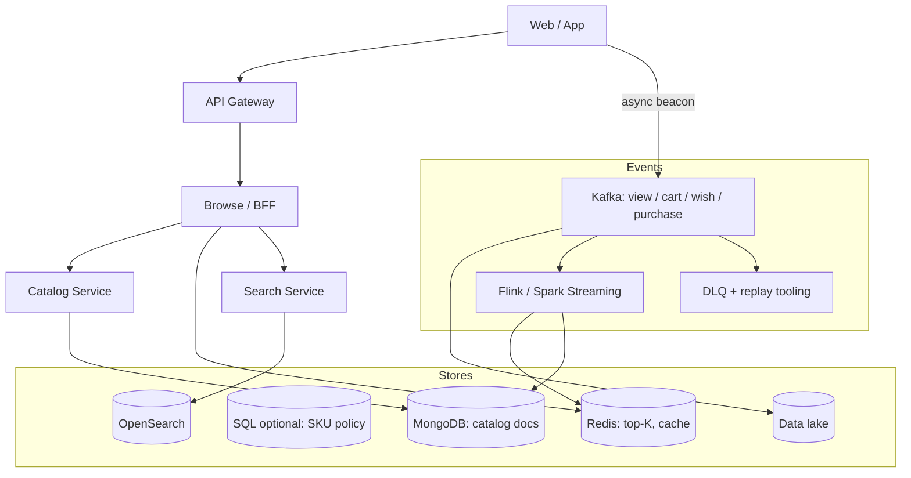
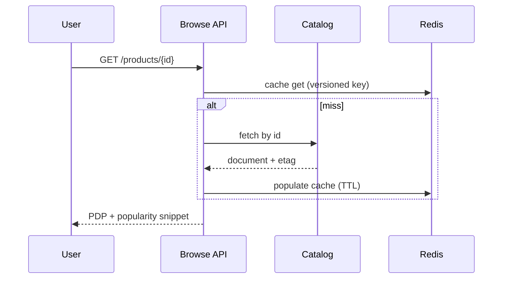

# HLD — E-Commerce Product Browsing (No Checkout)

<a id="interview-spine-nine-steps"></a>

## 1. Clarify requirements

<a id="say-1-questions-human"></a>
### 1.1 Clarify 

| Topic | Say it like this in the room |
|--------------------------|-------------------------------|
| **Browse vs purchase signal** | “We’re **browse only**—but **purchase events** still exist as signals from the order path, right?” |
| **Identity** | “**Guest** vs logged-in—do we need **merge** across devices for attribution?” |
| **Freshness** | “How stale can **trending** be—**seconds vs minutes**—and do we **label** it in the UI?” |
| **Latency** | “Different **p99** for **PDP** vs **PLP**, or one budget?” |
| **Search** | “Is **search** in my box or a **separate** index team—I’ll treat OpenSearch as **delegated** if separate.” |
| **Compliance** | “**GDPR** delete / retention on the **behavioral** stream—anything I must wire now?” |
| **Abuse** | “Should bad traffic hit **Kafka** or get **dropped** at the edge?” |
| **Semantics** | “If we say **bestseller**, does that **have** to mean **purchase counts** only?” |

**Micro-pauses:** *“So I’ll never block **PDP** on Kafka; purchase-backed labels trace to **order facts**.”*

### 1.2 Functional requirements (FR) — after alignment, say this as “what we must build”

<a id="say-fr-human"></a>
#### Human interaction (FR — how to explain after alignment)

**Habit:** *“Once scope is clear—**catalog reads** plus a parallel **signal** pipe.”*

| FR area | Say it like this in the room |
|---------|-------------------------------|
| **Catalog** | “**Categories**, **PLP** with filters and **cursor** pagination, **PDP** with media, price, seller, and a **popularity** snippet.” |
| **Trending** | “Rails on home or category from **aggregated** signals—**honest labels** when data lags.” |
| **Events** | “**View / cart / wishlist / purchase** at high volume—**batch** beacons ok; they feed ranking and BI, not the hot read path.” |
| **Search** | “Keyword + filters go to **OpenSearch** (or equivalent)—not `LIKE` in the catalog store.” |
| **Out of scope** | “**Checkout / inventory** stay out unless you extend—I only mention **handoff**.” |

**Catalog browsing**

- **Category tree** (or faceted navigation): list categories, subcategories, counts optional.  
- **PLP** (`product list`): filter by category, seller, attributes; **cursor** pagination.  
- **PDP** (`product detail`): title, description, attributes, media gallery, price display, seller, **popularity/trending** snippet.  
- **Search**: keyword + filters—typically **delegated** to OpenSearch (or equivalent).

**Popularity and highlights**

- **Trending / top-K** rails on home or category pages driven by **aggregated** signals.  
- Clear **UX labels** (“trending in last 24h”) when data is **lagging**.

**Behavioral events (ingestion)**

- Ingest at high volume: **product viewed**, **added to cart**, **wishlisted**, **purchased** (purchase may come from order service).  
- Support **batch** client beacons and **server-side** events where applicable.

**Out of scope (unless extended)**

- **Payment, cart checkout, inventory reservation**—acknowledge and define **handoff** for consistency if interviewer expands.

### 1.3 Non-functional requirements (NFR) — say as “how it must behave”

<a id="say-nfr-human"></a>
#### Human interaction (NFR — how to say “how it must behave”)

**Habit:** *“Browse can be **soft**; **p99** and **truth for labels** are **hard**.”*

| NFR area | Say it like this in the room |
|----------|-------------------------------|
| **p99** | “Explicit **latency budget** for PDP/PLP; **stream lag** for trending is a **different** SLO.” |
| **Decouple** | “**Serving never blocks** on Kafka produce—**202** accept or async client path.” |
| **CAP** | “**AP** on browse scores and cache; **CP** only where money commits—out of scope or **handoff**.” |
| **Durability** | “Raw events live in the **log + lake**; workers are **at-least-once** with **idempotent** sinks.” |
| **Compliance** | “Minimal **PII** in beacons; **retention** and delete path for GDPR.” |

**Performance**

- **PDP/PLP p99** within product SLO; **never** block read path on Kafka **produce**.  
- Stream processing may lag seconds/minutes—define acceptable **staleness** for “trending.”

**Throughput and elasticity**

- **Event write rate** ≫ catalog update rate; **horizontal** consumers on Kafka.  
- **Autoscale** browse tier on CPU/latency; **autoscale** Flink/k8s workers on **lag**.

**Availability**

- **AP** bias on browse and trending aggregates; **degrade** to stale scores vs hard fail.  
- Catalog read path **highly available** via replicas + cache.

**Consistency**

- **Browse**: eventual for popularity; **purchase counts** for “bestseller” must trace to **order facts** when shown as such.  
- If **inventory** enters scope: **stronger** checks at cart/checkout (outside pure browse).

**Durability and correctness**

- **Raw events** durable in **Kafka** + **lake** for replay.  
- **Idempotent** consumers (`event_id` or idempotent sink).

**Security and compliance**

- **PII** minimization in event payloads; **retention** and **delete** path for GDPR.  
- **Rate limits** on `/events` and browse APIs.

### 1.4 Invariants (one sentence you repeat under pressure)

**Invariant:** “We never label something **‘bestseller from purchases’** unless that signal is **grounded in purchase facts**; **views** may drive **‘trending’** if we label it honestly.”

<a id="say-voice-1"></a>

**Purpose:** no second clarify lecture—only **handoff** from answers → boxes.

| Beat | Say it like this |
|------|------------------|
| **Bridge** | “If trending can lag, I’ll use **Kafka → Flink → Redis** and denorm on the doc; I still won’t fake **purchase-backed** labels.” |
| **Core split** | “**Read** = BFF + catalog + search + cache; **write signals** = beacon → log → aggregate—**never** coupled on the critical path.” |

---

## 2. Estimate scale

<a id="say-voice-2"></a>
#### Human interaction (estimate scale)

**Habit:** *“Round numbers—correct me if your model’s different.”*

| Topic | Say it like this in the room |
|-------|-------------------------------|
| **Read vs write** | “Views are **100×–1000×** purchases—PDP is **cache-shaped**, firehose is **Kafka-shaped**.” |
| **Hot SKU** | “A few SKUs eat the stream—I need **partition** + **aggregation** story, not one hot Redis key.” |
| **Invite correction** | “If your ratio is off by 10×, I change **partitions** and cache—not the **two-pipe** architecture.” |

| Dimension | Illustrative | Implication |
|-----------|----------------|-------------|
| Event : purchase ratio | **100×–1000×** | Kafka partitioning, aggregation, not synchronous PDP |
| Catalog reads | **Very high** QPS at peak | Cache, CDN, read replicas |
| PDP payload | KB-scale document | Mongo/JSON friendly |
| Hot SKUs | Few products drive huge view volume | Hot key mitigation in Redis / combine in partition |

**Talk track:** “PLP/PDP are **cache-shaped**; the firehose is **Kafka-shaped**; we **decouple** them so a spike in views never **blocks** a product read.”

**Tie it in one line:** “Optimize **read latency** and **bounded** stream work; **never** sync-block catalog on Kafka.”

---

## 3. APIs and data model

<a id="say-voice-3"></a>
#### Human interaction (APIs & data model)

**Habit:** *“Thin API contract; honest data ownership.”*

| Topic | Say it like this in the room |
|-------|-------------------------------|
| **APIs** | “**GET** categories, PLP, PDP, trending; **POST /events** is **async** accept into the log.” |
| **Stores** | “**Mongo** (or doc) for flexible catalog reads; **Redis** for rollups; **OpenSearch** for text; **orders** stay **OLTP** for truth.” |
| **Mongo story** | “I can walk the **document**—shard by **product_id** vs **seller_id** is a real tradeoff.” |
| **Metrics** | “**Bestseller** is defined from **order facts** in the warehouse; Redis **mirrors** with known lag.” |

### 3.1 Public APIs (sketch)

| API | Purpose |
|-----|---------|
| `GET /v1/categories` | Category tree |
| `GET /v1/products?category=&cursor=` | PLP |
| `GET /v1/products/{id}` | PDP |
| `GET /v1/trending?window=` | Trending rail |
| `POST /v1/events` | Batch beacon → **async** accept (**202**) → Kafka |

**Headers:** `Authorization`, **`Idempotency-Key`** on sensitive writes if any; **`If-None-Match`** on PDP.

### 3.2 Core entities

**Product**, **Category**, **Seller**, **ProductMedia**, **Event** (immutable), optional **AggregateScore** (materialized).

### 3.3 Storage by access pattern

| Data | Store | Rationale |
|------|-------|-----------|
| Raw events | Kafka + data lake | Replay, cheap |
| Hot popularity | Redis (ZSET, HLL for UV) | Sub-ms reads |
| Catalog read model | MongoDB or SQL+JSON | Flexible attributes per vertical |
| Keyword search | OpenSearch | Inverted index |
| Purchases / orders (canonical) | OLTP SQL | ACID when checkout exists |

### 3.4 MongoDB document example (interviewer favorite)

**Read model** per product—not the purchase ledger:

```json
{
  "product_id": "p_123",
  "title": "Running Shoe",
  "description": "…",
  "attributes": { "color": "blue", "sizes": ["8", "9", "10"] },
  "category_path": ["footwear", "running"],
  "media": [{ "url": "https://cdn.example/…", "type": "image" }],
  "seller_id": "s_9",
  "price_display": { "amount": 129.99, "currency": "USD", "as_of": "2026-04-21T12:00:00Z" },
  "popularity_denorm": { "score": 88.2, "updated_at": "2026-04-21T12:05:00Z", "window": "24h" }
}
```

**Shard key:** e.g. `product_id` or `seller_id`—state **why** (even distribution vs seller-local queries).

---

## 4. High-level architecture

<a id="say-voice-4"></a>
#### Human interaction (high-level architecture / HLD)

**Habit:** *“Walk it like two parallel pipes, not one blob.”*

| Moment | Say it like this in the room |
|--------|------------------------------|
| **Read path** | “**Gateway → BFF → catalog + Redis + search**—that’s the user-facing **PDP/PLP**.” |
| **Signal path** | “**Beacon → Kafka → stream job → Redis + optional doc patch**—parallel to reads.” |
| **Checkpoint** | “Pause here—does this **split** match how you’d **shard teams**?” |



**Narration:** “**Serving** is cache + catalog + search; **signals** are append-only in Kafka, **aggregated** asynchronously into Redis and **denormalized** doc fields.”

---

## 5. Deep dive: critical flow

<a id="say-voice-5"></a>
#### Human interaction (deep dive — critical flow)

**Habit:** *“Pick **one** path like a debugger—usually **GET PDP** then **POST events**.”*

| Step | Say it like this in the room |
|------|-------------------------------|
| **PDP** | “**Cache-aside** with **ETag**; on miss, one **document** fetch—no **N+1**.” |
| **Events** | “Validate → **partition** → **dedupe** (`event_id`) → **aggregate** with weights **purchase > cart > view** → sink Redis / denorm.” |
| **Idempotency** | “**At-least-once** Kafka ⇒ **idempotent** consumers and keys.” |
| **Anchor** | “First thing I’d instrument: **Kafka lag**, **hot SKU partition**, or **cache stampede** on a viral PDP.” |

This is **step 5** of the [spine](#interview-spine-nine-steps)—where most Bar Raiser time should go.

### 5.1 Browse read (PDP)



**Steps:** auth/rate limit → **cache-aside** → batch nothing extra for single id → attach **popularity_denorm** from doc or side Redis key → **ETag**.

### 5.2 Event write path (parallel, must not block PDP)

1. Validate schema, **drop** obvious bots, bound **clock skew**.  
2. Partition Kafka by `product_id` or `user_id` hash.  
3. Consumers **enrich** from local catalog cache; **aggregate** (windows, weighted: purchase &gt; cart &gt; view).  
4. Sink: `ZINCRBY`, **HyperLogLog** for UV, OLAP for BI; **optional** patch to Mongo `popularity_denorm`.

**Idempotency:** `event_id` uniqueness or **Redis SETNX** + TTL for best-effort dedupe.

### 5.3 Consistency story (CAP, in one place)

- **Browse + trending:** favor **availability** + **eventual** scores with honest labels.  
- **Money path** (if added): **CP** where financial truth lives.

---

## 6. Scaling and bottlenecks

<a id="say-voice-6"></a>
#### Human interaction (scaling & bottlenecks)

**Habit:** *“Name what breaks first—then the fix sounds obvious.”*

| Topic | Say it like this in the room |
|-------|-------------------------------|
| **Kafka lag** | “Scale **consumers**, shed **analytics**, watch **partition** skew.” |
| **Hot SKU** | “**Coalesce** in partition, secondary agg, **rate limit** per key.” |
| **Stampede** | “**Single-flight**, **TTL jitter**, warm keys on deploy.” |

| Risk | Mitigation |
|------|------------|
| Kafka **consumer lag** | Autoscale consumers; prioritize topics; shed analytics |
| **Hot product** key | Combine in partition; secondary aggregation; rate limit per key |
| **Poison** events | Schema validation + **DLQ** + replay tooling |
| **Cache stampede** on viral PDP | Single-flight, TTL **jitter**, early refresh |
| Enrichment **misses** | Default category; repair job from DLQ |
| OpenSearch **hot queries** | Cache top queries; separate **read** replicas |

**Optimizations (bundle):** partition Kafka for hot SKUs; **coalesce** beacons; **HLL** for UV; **downsample** ultra-hot keys in Flink.

---

## 7. Reliability and failure handling

<a id="say-voice-7"></a>
#### Human interaction (reliability & failure handling)

**Habit:** *“Degrade rails before you degrade the whole PDP.”*

| Topic | Say it like this in the room |
|-------|-------------------------------|
| **PDP vs Kafka** | “**Never** sync **ack** Kafka on the critical PDP path.” |
| **Retries** | “**Jitter**, **cap**, only where **idempotent**.” |
| **Partial** | “Drop **trending** block before failing the whole page if Redis is sick.” |

- **Never** synchronous **Kafka** on critical PDP—use **async buffer** or fire-and-forget with client retry.  
- **Retries** with jitter on stream sinks; **idempotent** writes to Redis/Mongo.  
- **Dead-letter** path for bad payloads; **replay** after fix.  
- **Degradation:** serve PDP **without** trending block if Redis down.  
- **Backpressure:** drop **noncritical** enrichment under load.

**Runbooks:** lag SLO breach, DLQ spike, duplicate rate anomaly.

---

## 8. Tradeoffs and alternatives

<a id="say-voice-8"></a>
#### Human interaction (tradeoffs & alternatives)

**Habit:** *“Name the trade, pick a side, say what flips it.”*

| Topic | Say it like this in the room |
|-------|-------------------------------|
| **Mongo vs SQL** | “**Flex** for catalog vs **joins** for reporting—pick for **this** workload.” |
| **Windows** | “Bigger trending window = **smooth**; tiny = **noisy**.” |
| **Kafka vs direct write** | “Direct to Mongo loses **replay** and **fan-out**; Kafka is the **log**.” |

### 8.1 Product tradeoffs

| Choice | Upside | Downside |
|--------|--------|----------|
| Mongo catalog | Flexible schema | Cross-entity reporting harder |
| SQL catalog | Constraints, joins | Rigidity for verticals |
| Large trending windows | Smooth | Slow spike detection |
| Tiny windows | Responsive | Noisy |

### 8.2 Alternatives

| Instead of… | Consider… | When |
|-------------|-----------|------|
| Kafka for everything | Kinesis / Pulsar | Org standard |
| Mongo for catalog | Postgres JSONB | Team SQL-first |
| Redis top-K only | Pure OLAP + async materialized view | Lower ops, higher latency OK |
| Client beacons only | Server logs from PDP | Fraud resistance |

---

## 9. Monitoring, observability, and security

<a id="say-voice-9"></a>
#### Human interaction (monitoring, observability & security)

**Habit:** *“Prove the story with traces and a few SLIs.”*

| Topic | Say it like this in the room |
|-------|-------------------------------|
| **Traces** | “Span per **GET PDP** and per **event batch** accept.” |
| **Dashboards** | “**Lag**, **duplicate rate**, **p99 PDP**, Redis memory.” |
| **Security** | “**Rate limit** `/events` and PLP; **no secrets** in URLs; scrub **PII** in logs.” |

**SLIs / SLOs:** PDP **p99**, PLP **p99**, **Kafka consumer lag**, **duplicate event rate**, null `product_id` rate, **search** latency.

**Tracing:** span per `GET /products/{id}` and per **event batch** accept path.

**Security:** authenticate **trending** APIs if personalized; **rate limit** `/events` and PLP; **WAF** on edge; **no secrets** in URLs; scrub PII in logs.

**Dashboards:** trending freshness vs wall clock, top lagging partitions, Redis memory.

---

## 10. Design patterns, data structures & best practices

Uber **HLD** rewards tying **patterns** to **boxes** on the board—not a laundry list.

### 10.1 Distributed / architectural patterns

| Pattern | Where | Why |
|---------|--------|-----|
| **Event-driven** + **log** | Kafka as append-only event bus | Replay, fan-out to BI/search/fraud |
| **CQRS-lite** | Catalog **read model** vs order **write model** | Different shapes; scale reads |
| **Idempotent consumer** | Stream workers | **At-least-once** Kafka + safe sinks |
| **Outbox** (if cross-service) | Publish after DB commit | Reliable cross-system events |
| **Circuit breaker** | Flink sink to Redis, OpenSearch | Fail fast; don’t retry-storm |
| **Bulkhead** | Separate consumer groups per topic | Isolate hot **view** topic from **purchase** |
| **Cache-aside** | PDP Redis + ETag | Control staleness explicitly |
| **API Gateway / BFF** | Browse tier | Auth, rate limits, response shaping |
| **Strategy** | Weighted scoring (purchase &gt; cart &gt; view) | Swap weights without redeploying all code |
| **Anti-corruption layer** | Beacon validation before Kafka | Bad payloads never poison core |

### 10.2 Classic patterns (service internals)

| Pattern | Map |
|---------|-----|
| **Template method** | Validate → enrich → aggregate → sink pipeline |
| **Chain of responsibility** | Validation filters on `/events` |
| **Observer** | Webhooks / internal subscribers (optional) |

### 10.3 Data structures

| Use | Structure | Why |
|-----|-----------|-----|
| Trending / top-K | **Redis ZSET** (sorted set) | O(log N) increments, range by score |
| Unique visitors | **HyperLogLog** | Memory-bounded cardinality |
| Partitioning | **Hash** of `product_id` / `user_id` | Balance Kafka partitions |
| Catalog doc | **JSON document** / BSON | Flexible attributes |
| Search | **Inverted index** + BKD/geo | Keyword + filter queries |

### 10.4 Best practices

- **Never** block PDP on Kafka **ack**.  
- **event_id** dedupe; **DLQ** + replay.  
- **Coalesce** beacons client-side when possible.  
- **Label** stale trending in UX.

### 10.5 Trade-offs

| Choice | Trade |
|--------|--------|
| Mongo vs SQL catalog | Flex vs joins/reporting |
| Big vs small aggregation windows | Smooth vs responsive |
| Strong sync trending | Correctness vs **latency** |

<a id="say-voice-10"></a>
#### Human interaction (design patterns, data structures & best practices)

**Habit:** *“One pattern per hop—**event log**, **CQRS-lite**, **cache-aside**, **idempotent consumer**.”*

| You mean… | Say it like this in the room |
|-----------|-------------------------------|
| **Distributed** | “**Kafka** = replay + fan-out; **CQRS-lite** = fat read model vs OLTP orders; **cache-aside** PDP; **breaker** on flaky sinks.” |
| **DS** | “**ZSET** top-K, **HLL** UV, **inverted index** in OpenSearch, **hash partition** Kafka.” |
| **Trade** | “More **sync** aggregation = fresher, worse **tail**; more **async** = calmer reads, **staleness**.” |

---

## Closing notes (where wrap-up human interaction lives)

Endgame is **short** and **conversational**: use **`#### Human interaction`** under [Bar-raiser](#bar-raiser-follow-ups) and [60-second close](#60-second-close)—not a second full design pass.

---

## Bar-raiser follow-ups

<a id="say-voice-bar"></a>
#### Human interaction (bar-raiser)

**Habit:** two–four sentences, then **stop**—let them steer.

| They ask | Say it like this |
|----------|------------------|
| **Why not Mongo for events?** | “**Write amp**, weak **replay**, no **fan-out** to BI/fraud—Kafka is the **unified log**.” |
| **Purchase vs trending** | “**Separate labels** and pipelines; **bestseller** weights purchases; **trending** can be view-heavy if we **say so**.” |

---

## 60-second close

<a id="say-voice-close"></a>
#### Human interaction (60-second close)

**Habit:** one **net-net** pass—stretch or compress to the clock.

| Beat | Say it like this in the room |
|------|------------------------------|
| **Recap** | “**Browse** = cache + **document catalog** + **OpenSearch**; **beacons** → **Kafka** → stream agg → **Redis** + denorm fields. **AP** on browse with honest **staleness**; **purchase** claims come from **OLTP/lake**, not Redis **definitions**.” |

---
