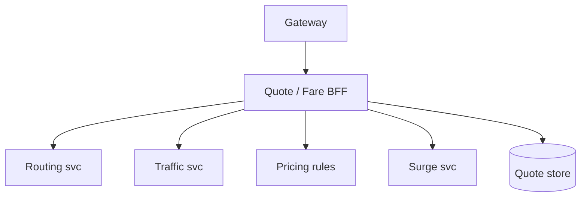
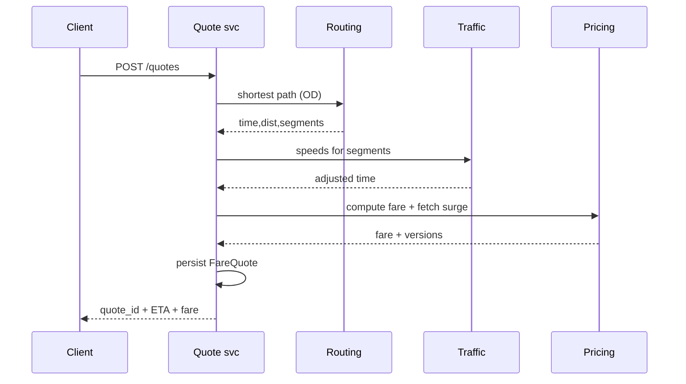

# HLD — ETA Calculation (Fare Estimation System)

## 1. Clarify requirements

### 1.0 Live flow

**Opening (~once):** *“I’ll split **ETA** (time-to-pickup, trip duration) from **fare** (rules + surge + tolls); align on **accuracy vs p99**, **pre-match vs post-match**, and **quote immutability**; then **data**, **APIs**, **architecture**. **Pause after the diagram**—**routing graph**, **ML**, or **pricing rules**?”*

**Thinking transitions:** *“**Fare quote** is a **first-class artifact** with **TTL**—not just a function call.”*

### 1.1 Clarify

| Topic | Say it like this in the room |
|--------------------------|-------------------------------|
| **ETA types** | “**Pickup ETA** with **which** driver snapshot vs **trip duration** before match?” |
| **Traffic** | “**Live traffic** feed vs **historical** percentiles?” |
| **Fare** | “**Upfront** locked vs **metered** end?” |
| **Tolls** | “In scope for **estimate**?” |
| **Multi-stop** | “**Waypoints**?” |

### 1.2 Functional requirements (FR)

| FR area | Say it like this |
|---------|-------------------|
| **ETA** | “Given **OD** (+ traffic model), return **distributions** or point estimate + **confidence**.” |
| **Fare estimate** | “Apply **base + distance/time + fees + surge + tolls** per **pricing rules** version.” |
| **Quote** | “Persist **FareQuote** with **inputs fingerprint** + **TTL**.” |

**Core**

- **Routing engine**: graph + weights (distance, time, turn penalties).  
- **Traffic service**: live + predicted speeds by **segment**.  
- **Pricing engine**: rule evaluation + **surge** (see [21-hld-surge-pricing.md](./21-hld-surge-pricing.md)).  
- **Quote store** for **compliance** and **trip attachment**.

### 1.3 Non-functional requirements (NFR)

| NFR | Say it like this |
|-----|------------------|
| **Latency** | “**p99** budget for **estimate** RPC—often **tens–low hundreds ms**; **degrade** to **haversine + factors**.” |
| **Accuracy** | “Measure **MAPE** / **lateness rate**—product tradeoff.” |

### 1.4 Invariants

**Invariant:** “A **committed upfront fare** references a **quote id** whose **rule_version** and **surge_version** are **immutable**; **metered** trips log **rate card** version instead.”

| Beat | Say it like this |
|------|------------------|
| **Bridge** | “**Route** gives **time/distance**; **pricing** is **pure function** of **inputs**.” |
| **Core split** | “**Heavy graph** offline/precomputed; **online** **contraction hierarchies** or **cached** paths.” |

### Key insight (say early)

Treat **ETA** and **fare** as **composed services** with a **stable quote artifact**—decouples **ML traffic** experiments from **legal pricing** rules.

#### Key anchors

1. “**Conflate** segments for **speed**.”  
2. “**Graceful degradation** ladder.”  
3. “**Quote TTL**.”

---

## 2. Estimate scale

| Dimension | Illustrative |
|-----------|----------------|
| Estimate QPS | **Very high** at peak |
| Graph size | **Billions** of segments (global)—**partitioned** by region |

---

## 3. APIs and data model

### 3.1 APIs

| API | Purpose |
|-----|---------|
| `POST /v1/quotes` | OD + product → ETA + fare + `quote_id` |
| `GET /v1/quotes/{id}` | Retrieve if still valid |
| `POST /v1/routing/eta` | Internal batch ETAs for matching |

### 3.2 Model

- **FareQuote:** `quote_id`, `inputs_hash`, `pickup`, `dropoff`, `est_time`, `est_dist`, `fare_low/high`, `rule_version`, `surge_version`, `expires_at`.  
- **RouteResult:** polyline ref, **segment** list with **ETA breakdown**.

---

## 4. High-level architecture

### 4.1 Phases

| Phase | Ship |
|-------|------|
| **1** | Single-region CH / A* + static surge |
| **2** | ML traffic + quote persistence |
| **3** | **Multi-modal** + **probabilistic** ETAs |

---

## 5. Deep dive: `POST /v1/quotes`

### 🎯 Bottleneck Anchor

“**Routing + traffic** fan-out dominates **p99**; **pricing** is cheap once **time/distance** known.”

**Taking a stance:** *“**Parallel** routing alternatives (fast vs accurate) under **deadline**—return **range** if needed.”*

---

## 6. Scaling and bottlenecks

| Risk | Mitigation |
|------|------------|
| **Hot corridors** | **Precomputed** common OD pairs |
| **Traffic service** SLO | **Staleness** bounds + **fallback** |
| **Quote DB** | **TTL** + **partition** by time |

---

## 7. Reliability and failure handling

- **Routing timeout:** widen to **haversine** × **city factor** + **disclaimer**.  
- **Surge stale:** embed **max_age** in UX.  
- **Idempotent** `POST /quotes` with **client key**.

---

## 8. Tradeoffs and alternatives

| Choice | Trade |
|--------|--------|
| **Upfront lock** | Trust vs **risk** on traffic |
| **ML ETA** | Accuracy vs **explainability** |

---

## 9. Monitoring, observability, and security

**Metrics:** ETA error by **corridor**, quote **use rate**, **fare delta** quote vs actual, **degradation** tier usage.  
**Security:** **Auth** quotes to **user**; **no** PII in **polyline** logs.

---

## 10. Design patterns, data structures & best practices

| DS/Pattern | Map |
|------------|-----|
| **CH / MLD** | Fast shortest path |
| **TTL cache** | Hot OD |
| **Strategy** | Pricing rules engine |

**Live:** max **four** patterns.

---

## Closing notes

| Do | Avoid |
|----|--------|
| **Quote artifact** | Ephemeral fare with no audit |
| **Degradation ladder** | Hard fail whole marketplace |

---

## Bar-raiser follow-ups

| They ask | Say it like this |
|----------|------------------|
| **Pool fare** | “**Leg allocation** from **simulated** orderings—**heavy** offline, **light** online.” |
| **Map provider** | “Abstract behind **RoutingPort**; **cache** tiles vs **compute**.” |

---

## 60-second close

| Beat | Say it like this |
|------|------------------|
| **Recap** | “**Routing** + **traffic** → **time/distance**; **pricing** + **surge** → **money**; **persist** **FareQuote** with **versions**; **p99** on **graph+traffic**; **degrade** gracefully.” |

---
