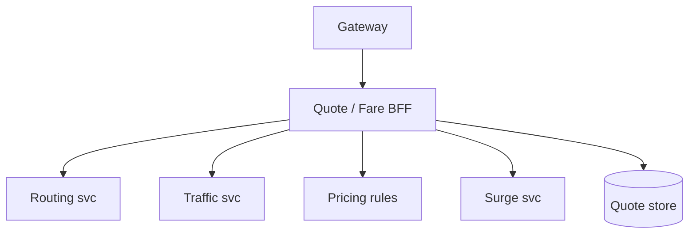
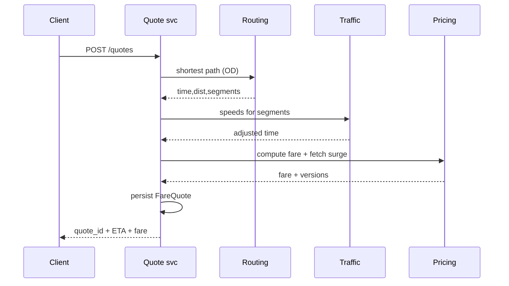

# HLD — ETA Calculation / Fare Estimation System

## 1. Clarify requirements

### 1.0 Live flow

**Opening (~once):** *“I’ll split **ETA** (time-to-pickup, trip duration) from **fare** (rules + surge + tolls); align on **accuracy vs p99**, **pre-match vs post-match**, and **quote immutability**; then **data**, **APIs**, **architecture**. **Pause after the diagram**—**routing graph**, **ML**, or **pricing rules**?”*

**Thinking transitions:** *“**Fare quote** is a **first-class artifact** with **TTL**—not just a function call.”*

**Live rule:** Paraphrase tables; deep on **routing** or **consistency** only if steered.

**User journey (once):** say [👤 User journey](#user-journey-framing) **before** the architecture diagram.

### 1.1 Clarify

| Topic | Say it like this in the room |
|--------------------------|-------------------------------|
| **ETA types** | “**Pickup ETA** with **which** driver snapshot vs **trip duration** before match?” |
| **Traffic** | “**Live traffic** feed vs **historical** percentiles?” |
| **Fare** | “**Upfront** locked vs **metered** end?” |
| **Tolls** | “In scope for **estimate**?” |
| **Multi-stop** | “**Waypoints**?” |

### 1.2 Functional requirements (FR)

| FR area | Say it like this |
|---------|-------------------|
| **ETA** | “Given **OD** (+ traffic model), return **distributions** or point estimate + **confidence**.” |
| **Fare estimate** | “Apply **base + distance/time + fees + surge + tolls** per **pricing rules** version.” |
| **Quote** | “Persist **FareQuote** with **inputs fingerprint** + **TTL**.” |

**Core**

- **Routing engine**: graph + weights (distance, time, turn penalties).  
- **Traffic service**: live + predicted speeds by **segment**.  
- **Pricing engine**: rule evaluation + **surge** (see [21-hld-surge-pricing.md](./21-hld-surge-pricing.md)).  
- **Quote store** for **compliance** and **trip attachment**.

### 1.3 Non-functional requirements (NFR)

| NFR | Say it like this |
|-----|------------------|
| **Latency** | “**p99** budget for **estimate** RPC—[🚦 deadlines + fallback + partial](#latency-backpressure-control), not just ‘try hard’.” |
| **Accuracy** | “Measure **MAPE** / **lateness rate**—product tradeoff.” |

### 1.4 Invariants

**Invariant:** “A **committed upfront fare** references a **quote id** whose **rule_version** and **surge_version** are **immutable**; **metered** trips log **rate card** version instead—full **traffic-after-quote** story in [⚖️ Consistency Model](#consistency-model-anchor).”

| Beat | Say it like this |
|------|------------------|
| **Bridge** | “**Route** gives **time/distance**; **pricing** is **pure function** of **inputs**.” |
| **Core split** | “**Heavy graph** offline/precomputed; **online** **contraction hierarchies** or **cached** paths.” |

### Key insight (say early)

Treat **ETA** and **fare** as **composed services** with a **stable quote artifact**—decouples **traffic experiments** from **legal pricing** rules; **ship rule-based ETA + heuristics first**, layer **ML traffic** when **signals** and **pipelines** are **reliable** ([§4.1](#41-phases), [👤 UX](#ux-awareness)).

#### Key anchors

1. “**Conflate** segments for **speed**.”  
2. “**Graceful degradation** ladder—[🚦 deadlines + fallback](#latency-backpressure-control).”  
3. “**Quote TTL** + **immutable** shown quote ([⚖️ consistency](#consistency-model-anchor)).”  
4. “**Rule/heuristic ETA first**; **ML** on traffic **after** we trust the **feed**.”

---

## 2. Estimate scale

| Dimension | Illustrative |
|-----------|----------------|
| Estimate QPS | **Very high** at peak |
| Graph size | **Billions** of segments (global)—**partitioned** by region |

---

## 3. APIs and data model

### 3.1 APIs

| API | Purpose |
|-----|---------|
| `POST /v1/quotes` | OD + product → ETA + fare + `quote_id` |
| `GET /v1/quotes/{id}` | Retrieve if still valid |
| `POST /v1/routing/eta` | Internal batch ETAs for matching |

### 3.2 Model

- **FareQuote:** `quote_id`, `inputs_hash`, `pickup`, `dropoff`, `est_time`, `est_dist`, `fare_low/high`, `rule_version`, `surge_version`, `expires_at`.  
- **RouteResult:** polyline ref, **segment** list with **ETA breakdown**.

---

## 👤 User Journey (say once early)

**Say it once early** (before or right after the [architecture diagram](#4-high-level-architecture)):

*“From the **rider** side:

**User enters pickup + dropoff** → the system **computes ETA + fare** → returns a **quote** (`quote_id`, versions, TTL) → user **confirms** → the **trip attaches** to that **same `quote_id`** (for **upfront** / locked models).

So:
- **Compute path** = **routing** + **traffic** + **pricing** (+ surge)
- **Persistence** = **FareQuote** artifact (what we **showed**)
- **Correctness** = **versioned quote** (`rule_version`, `surge_version`, inputs fingerprint)—not a one-off RPC result”*

👉 **Product-first**, then draw **Quote BFF** / **Routing** / **Traffic** / **Pricing**.

---

## ⚖️ Consistency Model

**Bar Raiser:** *“What if **traffic changes** after the **quote**?”*

**Say clearly:**

- **Live ETA** on the map is **eventually consistent**—traffic moves, models refresh.  
- The **fare quote** the user **accepted** ( **upfront** model) is **immutable** once issued/shown: **`surge_version`**, **`rule_version`**, and priced **inputs snapshot** are **locked** on the artifact.  
- **Actual** drive time may **differ** from **estimated** time; **billing** follows the **product contract**—for **upfront**, the **quote governs** what was **promised**; for **metered**, you log **rate card** / meter rules at trip start and **explicitly** separate “**estimate UX**” from “**metered fare**.”

**One-liner:** *“**Traffic** can move; **the receipt story** can’t **silently** rewrite without a **new** quote or **disclosed** meter rules.”*

---

## 🚦 Latency / Backpressure Control

**To hit `POST /quotes` p99:**

- **Strict deadlines** per downstream (**routing**, **traffic**, **pricing fetch**) inside a **global budget**—**cancel** stragglers.  
- **Fallback ladder**: e.g. **cached** route chunk → **simpler** graph query → **haversine** × **city factor** for **time/distance bounds** + honest **confidence** / **range**.  
- Prefer **partial** response (e.g. **fare band** + **wider ETA range**) over **hard 500** when a **non-critical** leg is slow—**degrade** a dimension, not the whole **quote** surface if product allows.

👉 **Production** signal: **timeboxed** dependency fan-out, not unbounded **parallel** RPC.

---

## 👤 UX Awareness

If **ETA** **jumps** on every **refresh**, **trust** drops—so we **smooth** displayed estimates (and **label** uncertainty) rather than **chasing every** traffic tick on the **UI**, while the **stored quote** stays **stable** until **TTL** or **new** quote—see [⚖️ Consistency Model](#consistency-model-anchor).

---

## 4. High-level architecture

#### Human interaction (high-level architecture)

| Moment | Say it like this in the room |
|--------|------------------------------|
| **User journey** | “[👤 OD → quote → confirm → trip holds `quote_id`](#user-journey-framing).” |
| **Consistency** | “[⚖️ Traffic moves; quote versions don’t ‘sneak’](#consistency-model-anchor).” |
| **p99** | “[🚦 Per-dependency deadlines + fallback ladder](#latency-backpressure-control).” |
| **ML** | “[Rules/heuristics first](#key-insight-say-early); ML when **traffic** data **earns** it.” |

### 4.1 Phases

| Phase | Ship |
|-------|------|
| **1** | Single-region **CH / A\*** + **rule/heuristic** traffic factors + static surge + **quote store** |
| **2** | **Harden** traffic ingest + **deadline/fallback** path; then **ML** traffic layer **on top** |
| **3** | **Multi-modal** + **probabilistic** ETAs where product wants distributions |

---

## 5. Deep dive: `POST /v1/quotes`

#### Human interaction (deep dive)

**Habit:** *“Sequence the **RPCs** under a **single deadline**; land on [⚖️ immutable quote](#consistency-model-anchor) + [🚦 fallback](#latency-backpressure-control).”*

### 🎯 Bottleneck Anchor

“**Routing + traffic** fan-out dominates **p99**; **pricing** is cheap once **time/distance** known.”

**Taking a stance:** *“**Parallel** routing/traffic calls with **per-hop timeouts** and a **global budget**—[🚦 fallback ladder](#latency-backpressure-control); return **range** or **tier-B** estimate rather than **fail** the whole quote when possible.”*

---

## 6. Scaling and bottlenecks

| Risk | Mitigation |
|------|------------|
| **Hot corridors** | **Precomputed** common OD pairs |
| **Traffic service** SLO | **Staleness** bounds + **fallback** ([🚦 latency control](#latency-backpressure-control)) |
| **Quote DB** | **TTL** + **partition** by time |

---

## 7. Reliability and failure handling

- **Routing timeout:** widen to **haversine** × **city factor** + **disclaimer**—part of [🚦 fallback](#latency-backpressure-control).  
- **Surge stale:** embed **max_age** in UX.  
- **Idempotent** `POST /quotes` with **client key**.  
- **Traffic moved after quote:** billing/UX follows [⚖️ Consistency Model](#consistency-model-anchor)—no **silent** rewrite of accepted artifact.

---

## 8. Tradeoffs and alternatives

| Choice | Trade |
|--------|--------|
| **Upfront lock** | Trust vs **risk** on traffic |
| **ML ETA (add later)** | Accuracy vs **explainability**—**default** [rules + heuristics](#key-insight-say-early) until traffic **signals** are **trusted** |
| **Instant reactive ETA vs smoothed UX** | Flicker vs [👤 trust](#ux-awareness) |

---

## 9. Monitoring, observability, and security

**Metrics:** ETA error by **corridor**, quote **use rate**, **fare delta** quote vs actual, **degradation** tier usage.  
**Security:** **Auth** quotes to **user**; **no** PII in **polyline** logs.

---

## 10. Design patterns, data structures & best practices

| DS/Pattern | Map |
|------------|-----|
| **CH / MLD** | Fast shortest path |
| **TTL cache** | Hot OD |
| **Strategy** | Pricing rules engine |

**Live:** max **four** patterns.

---

## Closing notes

| Do | Avoid |
|----|--------|
| **Quote artifact** | Ephemeral fare with no audit |
| **Degradation ladder** | Hard fail whole marketplace |
| **[⚖️ Silent post-quote changes](#consistency-model-anchor)** | “Traffic changed so we **retro-priced**” with no artifact |
| **[👤 ETA flicker](#ux-awareness)** | Raw model tick on every poll with no smoothing |

---

## Bar-raiser follow-ups

| They ask | Say it like this |
|----------|------------------|
| **Pool fare** | “**Leg allocation** from **simulated** orderings—**heavy** offline, **light** online.” |
| **Map provider** | “Abstract behind **RoutingPort**; **cache** tiles vs **compute**.” |
| **Traffic after quote** | “[⚖️ Upfront: artifact immutable; metered: disclose meter story](#consistency-model-anchor).” |
| **p99 miss** | “[🚦 Deadlines, cancel stragglers, partial/range](#latency-backpressure-control).” |

---

## 60-second close

| Beat | Say it like this |
|------|------------------|
| **Recap** | “**User journey**: **pickup+drop → ETA+fare quote → confirm → trip → `quote_id`**. **Compute** = routing + traffic + pricing; **persistence** = **FareQuote**; **correctness** = **versions**. [⚖️ **ETA eventual**](#consistency-model-anchor); **quote** **immutable** once shown (**upfront**); **metered** = explicit contract. [🚦 **p99**](#latency-backpressure-control): **deadlines**, **fallback ladder**, **partial** over **500**. **Default**: **rule-based ETA**; **ML traffic** when **signals** earn it. [👤 **Smooth**](#ux-awareness) display ETA for trust.” |

---
