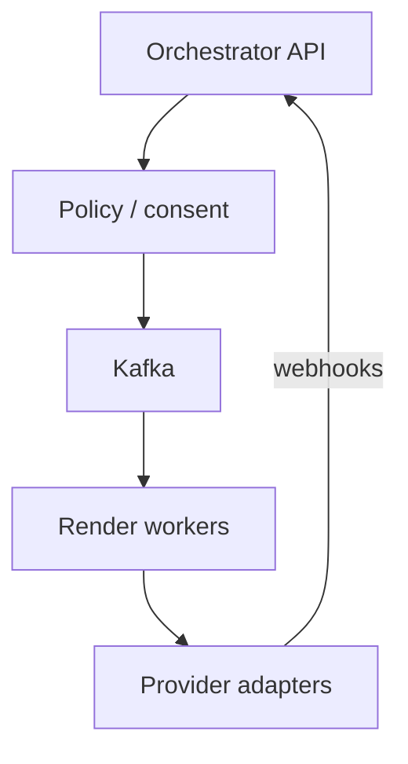
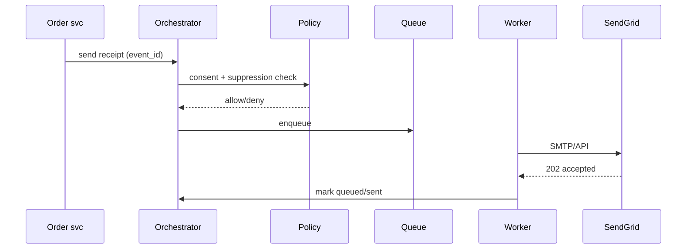

# HLD — Email SMS Notification System

## 1. Clarify requirements

### 1.0 Live flow

**Opening (~once):** *“I’ll align **transactional vs marketing**, **deliverability**, **unsubscribe/compliance** (CAN-SPAM, TCPA), and **template** lifecycle; then **enqueue**, **providers**, **webhooks**. **Pause after the diagram**—**throttling**, **idempotency**, or **multi-channel**?”*

**Thinking transitions:** *“SMS is **regulated** and **expensive**—**consent** and **quiet hours** are **first-class**.”*

### 1.1 Clarify

| Topic | Say it like this in the room |
|--------------------------|-------------------------------|
| **Channel** | “**Email + SMS** same pipeline or **separate** compliance?” |
| **Locale** | “**i18n** templates?” |
| **Attachments** | “Email **size** / virus scan?” |
| **Priority** | “**OTP** vs **newsletter**?” |

### 1.2 Functional requirements (FR)

| FR area | Say it like this |
|---------|-------------------|
| **Send** | “Template + **variables** + **recipient**.” |
| **Suppress** | “**Global** and **per-brand** unsubscribe.” |
| **Observe** | “**Bounces**, **complaints**, **delivery** webhooks.” |

**Cross-ref:** Push — [33-hld-push-notification-service.md](./33-hld-push-notification-service.md); stock alerts — [16-hld-notification-stock-alerts.md](./16-hld-notification-stock-alerts.md).

### 1.3 Non-functional requirements (NFR)

| NFR | Say it like this |
|-----|------------------|
| **Deliverability** | “**Reputation** IPs/domains; **warm-up**.” |
| **Reliability** | “**At-least-once** enqueue; **idempotent** sends per **business event**.” |

### 1.4 Invariants

**Invariant:** “No **marketing** email/SMS sends to an address/number on the **suppression list** for that **channel** and **brand**; **transactional** may still send per **policy** but must be **audited**.”

| Beat | Say it like this |
|------|------------------|
| **Bridge** | “**Policy gate** → **queue** → **renderer** → **provider**.” |
| **Core split** | “**Compliance** **control plane** vs **send** **data plane**.” |

### Key insight (say early)

**Unified notification orchestration** with **channel-specific adapters** and a **single consent/suppression** source of truth.

#### Key anchors

1. “**Twilio/SendGrid**-class adapters.”  
2. “**Webhook** ingestion updates **suppression**.”  
3. “**Template versioning**.”

---

## 2. Estimate scale

| Dimension | Illustrative |
|-----------|----------------|
| Email / day | **100M+** at scale |
| SMS | **Lower volume**, higher **cost per msg** |

---

## 3. APIs and data model

### 3.1 APIs

| API | Purpose |
|-----|---------|
| `POST /v1/send` | Enqueue (idempotent key) |
| `POST /v1/suppressions` | List management |
| `POST /v1/webhooks/bounce` | Provider callbacks |

### 3.2 Model

- **Message:** `id`, `channel`, `template_version`, `to_hash`, `payload`, `status`.  
- **Suppression:** `(channel, address_hash, reason)`.

---

## 4. High-level architecture

### 4.1 Phases

| Phase | Ship |
|-------|------|
| **1** | Single provider + suppression table |
| **2** | **Dedicated** marketing IPs + **warm-up** |
| **3** | **Multi-provider** failover |

---

## 5. Deep dive: send request

### 🎯 Bottleneck Anchor

“**Provider rate limits** + **bounce storms** after bad list—**throttle** + **auto-suppress**.”

**Taking a stance:** *“**Marketing** and **transactional** **different** **queues** and **subdomains**—**reputation** isolation.”*

---

## 6. Scaling and bottlenecks

| Risk | Mitigation |
|------|------------|
| **Render CPU** | **Precompiled** templates |
| **List bombs** | **Per-tenant** quotas |

---

## 7. Reliability and failure handling

- **Provider 5xx:** **retry** with backoff; **failover** provider.  
- **Duplicate event:** **idempotency** on `(tenant, event_id, channel)`.

---

## 8. Tradeoffs and alternatives

| Choice | Trade |
|--------|--------|
| **Shared IP** | Cost vs **reputation** coupling |
| **In-house MTA** | Control vs **deliverability** burden |

---

## 9. Monitoring, observability, and security

**Metrics:** **bounce/complaint** rate, **queue lag**, **provider** latency.  
**Security:** **PII** minimization; **encrypt** recipient at rest; **sign** webhooks.

---

## 10. Design patterns, data structures & best practices

| Pattern | Map |
|---------|-----|
| **Outbox** | OLTP → notify |
| **Template method** | Render pipeline |
| **Circuit breaker** | Sick provider |

**Live:** max **four** patterns.

---

## Closing notes

| Do | Avoid |
|----|--------|
| **Suppression before send** | Blast then handle complaints only |
| **Separate reputation** | Mix OTP and cold marketing on one IP |

---

## Bar-raiser follow-ups

| They ask | Say it like this |
|----------|------------------|
| **TCPA** | “**Express consent** for SMS; **STOP** keyword handling.” |

---

## 60-second close

| Beat | Say it like this |
|------|------------------|
| **Recap** | “**Policy + suppression** gate; **queues**; **provider adapters** + **webhooks**; **idempotent** per **event**; **split** transactional/marketing for **deliverability**.” |

---
