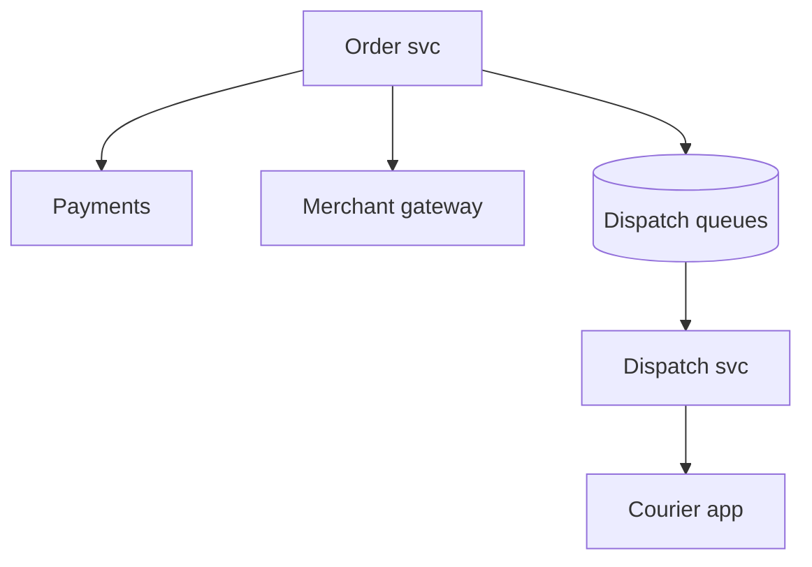
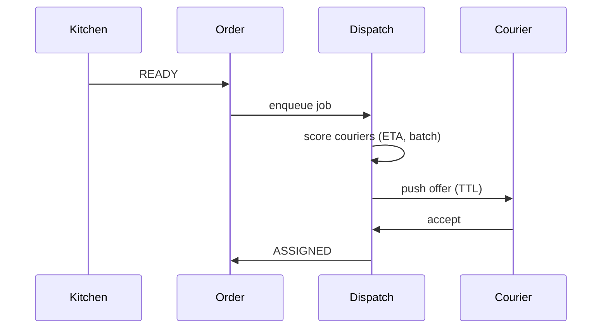

# HLD — Food Delivery (Restaurant Order Dispatching System)

## 1. Clarify requirements

### 1.0 Live flow

**Opening (~once):** *“I’ll align **merchant accept**, **prep time**, **courier assignment**, and **batching**; then **state machine**, **APIs**, **architecture**, and **dispatch deep dive**. **Pause after the diagram**—**courier matching**, **SLA**, or **failures**?”*

**Thinking transitions:** *“Three clocks: **customer promise**, **kitchen prep**, **courier travel**—dispatch **ties** them.”*

### 1.1 Clarify

| Topic | Say it like this in the room |
|--------------------------|-------------------------------|
| **Promise** | “**ETA** shown at checkout—**hard** or **soft**?” |
| **Merchant** | “Auto-accept vs **manual confirm**?” |
| **Pooling** | “**Stacked** orders per courier?” |
| **Refund** | “Who owns **compensation** rules?” |

### 1.2 Functional requirements (FR)

| FR area | Say it like this |
|---------|-------------------|
| **Order** | “Cart → **place** → pay → **Order** `CREATED`.” |
| **Restaurant** | “**Accept/reject**; **prep** signals **READY**.” |
| **Dispatch** | “Assign **courier**, **pickup → dropoff** navigation.” |
| **Delivery** | “**Handoff** proof (PIN/photo) if product requires.” |

**Core**

- Durable **order** with lines, fees, **promise window**.  
- **Restaurant tablet / POS** integration for **accept** and **prep**.  
- **Courier lifecycle**: offer → accept → at store → picked up → delivered.

### 1.3 Non-functional requirements (NFR)

| NFR | Say it like this |
|-----|------------------|
| **Latency** | “**Place order** **synchronous** minimal; **dispatch** **async** workers.” |
| **Consistency** | “**One courier** **committed** per assignment policy; **idempotent** webhooks.” |

### 1.4 Invariants

**Invariant:** “**Inventory / price** at **charge** time matches **captured snapshot** on the **order**; **dispatch commit** never assigns **same courier** to **conflicting** overlapping **pickups** without **stacking rules**.”

| Beat | Say it like this |
|------|------------------|
| **Bridge** | “**OLTP order** + **async dispatch** **orchestration**.” |
| **Core split** | “**Restaurant path** and **courier path** **converge** at **pickup**.” |

### Key insight (say early)

**Orchestrated saga** with **timeouts** per party—**explicit** **compensation** (refund, re-offer courier, extend ETA).

#### Key anchors

1. “**Idempotent** merchant callbacks.”  
2. “**Dispatch queue** per **zone**.”  
3. “**READY** event triggers **courier offer**.”

---

## 2. Estimate scale

| Dimension | Illustrative |
|-----------|----------------|
| Orders / day / metro | **100k+** large market |
| Dispatch decisions / sec | **High**—partition by **zone** |

---

## 3. APIs and data model

### 3.1 APIs

| API | Purpose |
|-----|---------|
| `POST /v1/orders` | Place (idempotent) |
| `POST /v1/orders/{id}/merchant/accept` | Webhook |
| `POST /v1/orders/{id}/prep/ready` | Kitchen signal |
| `POST /v1/dispatch/assign` | Internal |

### 3.2 Model

- **Order:** state, `promise_latest`, `restaurant_id`, `courier_id`, `pricing_snapshot`.  
- **DispatchJob:** `order_id`, attempts, `courier_offer_ttl`.

---

## 4. High-level architecture

### 4.1 Phases

| Phase | Ship |
|-------|------|
| **1** | Single courier, no batch |
| **2** | Stack + **prep-aware** dispatch |
| **3** | **ML** ETA + **global** load balancing |

---

## 5. Deep dive: READY → courier offer

### 🎯 Bottleneck Anchor

“**Courier supply** in **cell** at **rush** + **merchant READY jitter**—optimize **wait at store** vs **lateness**.”

**Taking a stance:** *“**Send-to-store** timing—courier **not** dispatched **too early** before **READY** unless **batch** efficiency wins.”*

---

## 6. Scaling and bottlenecks

| Risk | Mitigation |
|------|------------|
| **Hot zone** | Shard dispatchers; **courier** caps |
| **Webhook dupes** | **Idempotency keys** |

---

## 7. Reliability and failure handling

- **No courier:** **escalate** fee, **expand radius**, **customer comms**.  
- **Merchant ghost:** **timeout** → cancel path.

---

## 8. Tradeoffs and alternatives

| Choice | Trade |
|--------|--------|
| **Early assign courier** | Wait time vs **courier utilization** |
| **Central dispatch** | Global optimum vs **latency** |

---

## 9. Monitoring, observability, and security

**Metrics:** **ready-to-assign** lag, **assign-to-pickup**, **lateness %**, **stack rate**.  
**Security:** **AuthZ** on **order** events; **anti-tamper** on **proof** of delivery.

---

## 10. Design patterns, data structures & best practices

| Pattern | Map |
|---------|-----|
| **Saga** | Order + pay + dispatch |
| **State machine** | Order + courier |
| **Priority queue** | Jobs by **promise** time |

**Live:** max **four** patterns.

---

## Closing notes

| Do | Avoid |
|----|--------|
| **Prep-aware dispatch** | Courier idle at store always |
| **Promise artifact** | Moving ETA with no audit |

---

## Bar-raiser follow-ups

| They ask | Say it like this |
|----------|------------------|
| **Robot / locker** | “Different **terminal state** + **PIN** handoff—same **saga** shape.” |

---

## 60-second close

| Beat | Say it like this |
|------|------------------|
| **Recap** | “**Order OLTP** + **async dispatch**; **READY** triggers **offers**; **timeouts** + **compensation**; scale **per zone**; **metrics** on **ready→assign**.” |

---
