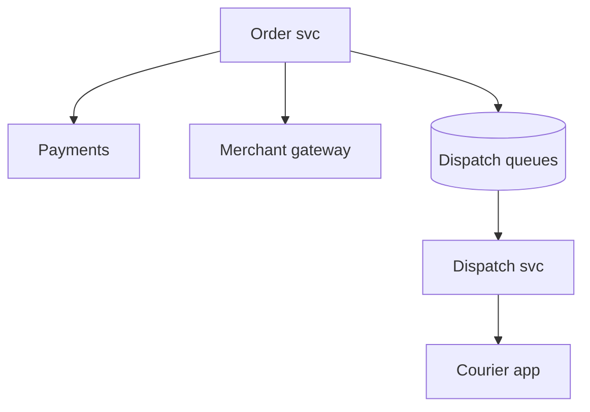
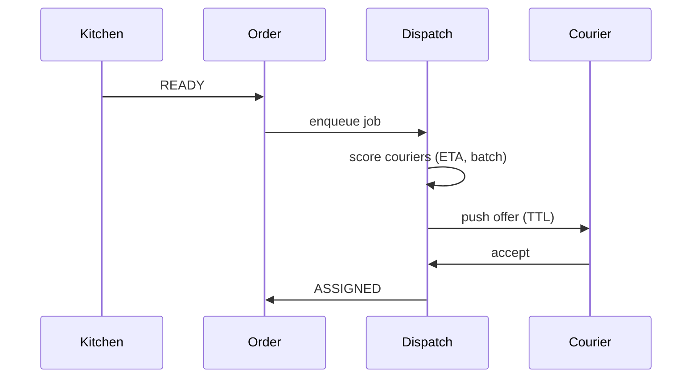

# HLD — Food Delivery / Restaurant Order Dispatching System

## 1. Clarify requirements

### 1.0 Live flow (how to open and steer)

**Opening (~once):** *“I’ll align **merchant accept**, **prep time**, **courier assignment**, and **batching**; then **state machine**, **APIs**, **architecture**, and **dispatch deep dive**. **Pause after the diagram**—**courier matching**, **SLA**, or **failures**?”*

**Thinking transitions:** *“Three clocks: **customer promise**, **kitchen prep**, **courier travel**—dispatch **ties** them.”*

**Live rule:** **Paraphrase** §1–2 tables; don’t read every row. Go deep **only if they probe**.

**When (HLD clock):** the **full user-journey script** lives **[just above §4](#user-journey-food-dispatch)**—say it **once out loud** immediately **before** the architecture diagram so the room is **user-first**. Optional: **one clause** in clarify if you opened systems-heavy; don’t read the **whole** block twice.

### 1.1 Clarify

| Topic | Say it like this in the room |
|--------------------------|-------------------------------|
| **Promise** | “**ETA** shown at checkout—**hard** or **soft**?” |
| **Merchant** | “Auto-accept vs **manual confirm**?” |
| **Pooling** | “**Stacked** orders per courier?” |
| **Refund** | “Who owns **compensation** rules?” |

**Micro-pauses:** *“So **order** is **OLTP + pay**; **dispatch** is **async**; both paths **meet** at **pickup**—got it.”*

### 1.2 Functional requirements (FR) — after alignment, say this as "what we must build"

| FR area | Say it like this |
|---------|-------------------|
| **Order** | “Cart → **place** → pay → **Order** `CREATED`.” |
| **Restaurant** | “**Accept/reject**; **prep** signals **READY**.” |
| **Dispatch** | “Assign **courier**, **pickup → dropoff** navigation.” |
| **Delivery** | “**Handoff** proof (PIN/photo) if product requires.” |

**Core**

- Durable **order** with lines, fees, **promise window**.  
- **Restaurant tablet / POS** integration for **accept** and **prep**.  
- **Courier lifecycle**: offer → accept → at store → picked up → delivered.

### 1.3 Non-functional requirements (NFR) — say as "how it must behave"

| NFR | Say it like this |
|-----|------------------|
| **Latency** | “**Place order** **synchronous** minimal; **dispatch** **async** workers.” |
| **Consistency** | “**One courier** **committed** per assignment policy; **idempotent** webhooks.” |

### 1.4 Invariants

**Invariant:** “**Inventory / price** at **charge** time matches **captured snapshot** on the **order**; **dispatch commit** never assigns **same courier** to **conflicting** overlapping **pickups** without **stacking rules**.”

## 🔒 Commit Boundary

Bar-raiser thread: *“**When** is courier assignment **final**?”*

Say it like this:

*“**Dispatch proposes** offers, but **assignment commits** only when:

- **Courier accepts** within **offer TTL**.  
- **No conflicting** assignment exists for that courier (or stacking rules **explicitly** allow overlap).  
- **Order** (and courier) **state** transitions to **`ASSIGNED`** **atomically** with the **winning** offer—**not** on push alone.”*

## 🚗 Courier State Consistency

Bar-raiser thread: *“What if **courier availability** is **stale**?”*

Say it like this:

*“**Availability** is **eventually consistent** in the index, but we **re-validate** at **accept**:

- **TTL** on offers—stale proposals **expire**.  
- **Accept** path checks **capacity** / **conflicts** again against **authoritative dispatch** rules (not only **client cache**).  
- **Dispatch service** owns **final** consistency for **who is committed** to **which** orders; **courier app** is a **best-effort** view until **ack**.”*

**Purpose:** no second “clarify lecture”—only the **handoff** from answers → design.

| Beat | Say it like this |
|------|------------------|
| **Bridge** | “**OLTP order** + **async dispatch** **orchestration**.” |
| **Core split** | “**Restaurant path** and **courier path** **converge** at **pickup**.” |

### Key insight (say early)

**Orchestrated saga** with **timeouts** per party—**explicit** **compensation** (refund, re-offer courier, extend ETA).

#### Key anchors

1. “**Idempotent** merchant callbacks.”  
2. “**Dispatch queue** per **zone**.”  
3. “**READY** event triggers **courier offer**.”

---

## 2. Estimate scale

| Dimension | Illustrative |
|-----------|----------------|
| Orders / day / metro | **100k+** large market |
| Dispatch decisions / sec | **High**—partition by **zone** |

---

## 3. APIs and data model

### 3.1 APIs

| API | Purpose |
|-----|---------|
| `POST /v1/orders` | Place (idempotent) |
| `POST /v1/orders/{id}/merchant/accept` | Webhook |
| `POST /v1/orders/{id}/prep/ready` | Kitchen signal |
| `POST /v1/dispatch/assign` | Internal |

### 3.2 Model

- **Order:** state, `promise_latest`, `restaurant_id`, `courier_id`, `pricing_snapshot`.  
- **DispatchJob:** `order_id`, attempts, `courier_offer_ttl`.

---

### 👤 User journey (say once—before this diagram)

*“**User places order** → **merchant accepts** → **kitchen prepares** → **READY** → system **assigns courier** → **pickup** → **delivery**.

So:

- **order path** = **OLTP** + **payment**  
- **dispatch path** = **async** matching / offers  
- **convergence** = **pickup** (restaurant and courier **meet** there).”*

---

## 4. High-level architecture

### 4.1 Phases

| Phase | Ship |
|-------|------|
| **1** | Single courier, no batch |
| **2** | Stack + **prep-aware** dispatch |
| **3** | **ML** ETA + **cross-zone** signals (still **shard** dispatch **writes** by **zone**) |

---

## 👤 UX Awareness

If **dispatch** slips (no courier, queue depth, kitchen delay), **proactively** **push** an updated **ETA** / honest status and **notify** the customer—**not** a **silent** slip past the **promise** artifact. Pair with **compensation** policy when you cross a **hard** threshold.

---

## 5. Deep dive: READY → courier offer

### 🎯 Bottleneck Anchor

“**Courier supply** in **cell** at **rush** + **merchant READY jitter**—optimize **wait at store** vs **lateness**.”

**Taking a stance:** *“**Send-to-store** timing—courier **not** dispatched **too early** before **READY** unless **batch** efficiency wins.”*

---

## 6. Scaling and bottlenecks

| Risk | Mitigation |
|------|------------|
| **Hot zone** | Shard dispatchers; **courier** caps |
| **Webhook dupes** | **Idempotency keys** |

## 🚦 Backpressure Handling

If **dispatch** load **spikes** (rush, incident, bad deploy):

- **Cap** **concurrent offers** per **courier** and per **zone**—protect the **courier app** and **matching** workers.  
- **Prioritize** jobs by **promise deadline** (e.g. **priority queue** / **weighted** fair queue)—closest-to-breach **first**.  
- **Degrade** **batching** complexity (drop **stack** optimization before you drop **assignability** or **silence** users—see [UX awareness](#ux-awareness-food-dispatch)).

---

## 7. Reliability and failure handling

- **No courier:** **escalate** fee, **expand radius**, **customer comms**.  
- **Merchant ghost:** **timeout** → cancel path.

---

## 8. Tradeoffs and alternatives

| Choice | Trade |
|--------|--------|
| **Early assign courier** | Wait time vs **courier utilization** |
| **Central vs zone dispatch** | **I’d default zone-based distributed dispatch** for **latency** + **blast radius**; **central** optimizer only if product proves **global** wins justify **RTT** and **single choke point**—otherwise **shard** by **geo** and **sync aggregates async**. |

---

## 9. Monitoring, observability, and security

**Metrics:** **ready-to-assign** lag, **assign-to-pickup**, **lateness %**, **stack rate**.  
**Security:** **AuthZ** on **order** events; **anti-tamper** on **proof** of delivery.

---

## 10. Design patterns, data structures & best practices

| Pattern | Map |
|---------|-----|
| **Saga** | Order + pay + dispatch |
| **State machine** | Order + courier |
| **Priority queue** | Jobs by **promise** time |

**Live:** max **four** patterns.

---

## Closing notes (where wrap-up human interaction lives)

Endgame is **short**, **confident**, and **conversational**: drive the wrap from [Bar-raiser](#bar-raiser-follow-ups), [Communication (do vs avoid)](#communication-do-vs-avoid), and [60-second close](#60-second-close)—not a second full design pass.

### Communication (do vs avoid)

| Do (sounds senior) | Avoid (sounds rehearsed) |
|--------------------|---------------------------|
| **Prep-aware dispatch** | Courier idle at store always |
| **Promise artifact** | Moving ETA with no audit |

---

## Bar-raiser follow-ups

| They ask | Say it like this |
|----------|------------------|
| **Robot / locker** | “Different **terminal state** + **PIN** handoff—same **saga** shape.” |
| **When is assignment final?** | “[Commit boundary](#commit-boundary-food-dispatch): **accept + TTL + atomic ASSIGNED**.” |
| **Stale courier GPS** | “[Courier state](#courier-state-food-dispatch): **re-check at accept**, **TTL offers**, **dispatch authoritative**.” |

---

## 60-second close

| Beat | Say it like this |
|------|------------------|
| **Recap** | “**Journey**: order → accept → prep → **READY** → assign → pickup → deliver. **Commit**: **ASSIGNED** only on **accept + TTL + no conflict**. **Dispatch**: **zone-based** default; **backpressure** on offers; **stale** courier → **re-validate** at accept. **UX**: **proactive** ETA when late.” |

---
