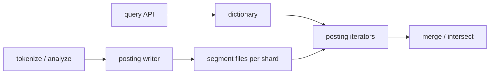

# HLD — Keyword Index for Billions of Messages

> **GitHub README style** — pair with [HLD-README.md](./HLD-README.md).

| | |
|--|--|
| **Round** | 30–45 min (+ optional small coding) |
| **Strong-hire hooks** | **Inverted index on disk**, **no RAM materialization** of huge posting sets, **rarest-first intersection** |

---

## Table of contents

**Prep**

- [Interview plan](#interview-plan)
- [SDE-2 drive kit (Senior interviewer)](#sde-2-drive-kit-senior-interviewer)
- [Why the naive trie approach fails](#why-the-naive-trie-approach-fails)
- [Strong-hire signals](#strong-hire-signals)
- [Coverage map](#coverage-map)

**Interview spine (nine steps)**

- [Interview spine (nine steps)](#interview-spine-nine-steps)
- [1. Clarify requirements](#1-clarify-requirements)
- [2. Estimate scale](#2-estimate-scale)
- [3. APIs and data model](#3-apis-and-data-model)
- [4. High-level architecture](#4-high-level-architecture)
- [5. Deep dive: critical flow](#5-deep-dive-critical-flow)
- [6. Scaling and bottlenecks](#6-scaling-and-bottlenecks)
- [7. Reliability and failure handling](#7-reliability-and-failure-handling)
- [8. Tradeoffs and alternatives](#8-tradeoffs-and-alternatives)
- [9. Monitoring, observability, and security](#9-monitoring-observability-and-security)
- [10. Design patterns, data structures & best practices](#10-design-patterns-data-structures--best-practices)

**Wrap-up**

- [Bar-raiser follow-ups](#bar-raiser-follow-ups)
- [Optional coding sketch](#optional-coding-sketch)
- [Strong Hire room checklist](#strong-hire-room-checklist)
- [60-second close](#60-second-close)

---

## Interview plan

> “Billions of messages with monotonic `msg_seq`. I’ll use a **disk-backed inverted index**: **sorted posting lists** per term with **compression**. Single keyword: **stream** postings with pagination; multi-keyword **AND**: **intersect** without loading all ids—**rarest term first** plus **galloping** / **skipTo**. I’ll cover **sharding** by inbox/chat for **privacy** and **Compaction** for writes. I can sketch **intersect** pseudocode if you want.”

---

## SDE-2 drive kit (Senior interviewer)

### A. Lock the agenda

Clarify → scale → APIs/index layout → architecture → **query paths** (single + multi AND) → scaling/compaction → reliability → tradeoffs → monitoring/security. **Pause:** “Do you want **coding** on intersect or **design** only?”

### B. Questions — **this order**

| # | Ask |
|---|-----|
| 1 | “Default multi-keyword is **AND** or **OR**?” |
| 2 | “Need **phrase** / proximity search?” |
| 3 | “Index **per user**, **per chat**, or **global** public?” |
| 4 | “Messages **immutable** or edits/tombstones?” |
| 5 | “**Top-K** only or full iterator?” |
| 6 | “Latency **p99** target for search?” |

**Mirror:** “So postings must be **on-disk streamable**, not giant in-memory sets.”

### C. Winning line per spine

| Step | Sentence |
|------|----------|
| 1 | “**Inverted index**: term → **sorted** posting lists by `msg_seq`.” |
| 2 | “Billions ⇒ **shard** + **compression** + **segments**.” |
| 3 | “API returns **pages** with `after_seq`; index stores **deltas**.” |
| 4 | “Writer tokenizes → append postings; reader **iterators** merge/intersect.” |
| 5 | “Single term: **stream** list; AND: **rarest-first** + `skipTo`—no full materialize.” |
| 6 | “Compaction, **tiered** storage, **hot shard** risk.” |
| 7 | “Checksum segments; **tombstone** on delete; partial query policy.” |
| 8 | “Managed ES vs custom—trade **velocity vs control**.” |
| 9 | “**AuthZ** on shard; **redact** logs; postings scanned metric.” |

### D. Whiteboard order

1. **Dictionary + postings file** sketch.  
2. **Single-keyword** read arrow.  
3. **Multi-keyword** with **short list outer loop**.  
4. Sharding box “**tenant scope**”.

### E. Senior probes

| Probe | Answer |
|-------|--------|
| “Trie on messages?” | “Trie doesn’t remove **postings**; can’t RAM **billions of ids**—use **disk postings** + **intersect**.” |
| “RAM map keyword → all ids?” | “Same failure—**stream** intersection.” |
| “Updates?” | “**Tombstone** + append new postings; **merge** segments async.” |

### F. Time crunched

**Inverted index + rarest-first AND** + **one** complexity sentence on compression.

### G. Anti-patterns

- O(all messages) scan per query at “billions” scale.  
- Ignoring **shard for privacy**.  
- No **pagination** contract.

---

## Why the naive trie approach fails

Building `Map<Keyword, Set<msg_id>>` by scanning every message against a trie of keywords might work for **offline batch**, but at **query** time you **cannot** materialize **billions of ids** per term in RAM. A **keyword trie** helps **prefix completion**, not replacing **compressed on-disk postings**.

**Pivot:** **streaming intersection** + **segmented postings**.

---

## Strong-hire signals

- **Inverted index** + **delta compression** + **segments**.  
- **Rarest-first AND** with **skipTo**.  
- **Shard** by tenant for privacy and parallelism.

---

## Coverage map

- [ ] [Nine-step spine](#interview-spine-nine-steps)  
- [ ] Tokenization / normalization  
- [ ] Postings **sorted** by `msg_seq`  
- [ ] Single-keyword + pagination  
- [ ] Multi-keyword **AND** cost  
- [ ] Sharding / privacy  
- [ ] Updates / tombstones  

---

## Interview spine (nine steps)

| Step | What you deliver | Section |
|------|------------------|---------|
| **1** | Clarify requirements | [§1](#1-clarify-requirements) |
| **2** | Estimate scale | [§2](#2-estimate-scale) |
| **3** | APIs / data model | [§3](#3-apis-and-data-model) |
| **4** | High-level architecture | [§4](#4-high-level-architecture) |
| **5** | Deep dive critical flow | [§5](#5-deep-dive-critical-flow) |
| **6** | Scaling / bottlenecks | [§6](#6-scaling-and-bottlenecks) |
| **7** | Reliability / failure handling | [§7](#7-reliability-and-failure-handling) |
| **8** | Tradeoffs / alternatives | [§8](#8-tradeoffs-and-alternatives) |
| **9** | Monitoring / security | [§9](#9-monitoring-observability-and-security) |

---

## 1. Clarify requirements

### 1.1 Questions to ask first

| Question | Why it matters |
|----------|----------------|
| **AND** vs **OR** for multi-keyword default? | Intersect vs union |
| **Phrase** search (“exact phrase”)? | Positional index |
| Messages **immutable** or editable? | Tombstones, reindex |
| Index scope: **per user**, **per chat**, **global** public? | Sharding + privacy |
| **Language** / tokenization rules? | Analyzer choice |
| **Top-K** only vs full result iterator? | WAND / early termination |
| **p99** latency target for search? | Caching, max postings scanned |

### 1.2 Functional requirements (FR)

**Index build**

- Ingest messages (unique `msg_seq`); **tokenize**; append postings to **per-term** sorted lists (on disk).  
- Support **incremental** updates and **deletes** (tombstone).

**Search**

- **Single keyword:** return message ids (or seqs) containing term, **paginated**.  
- **Multi keyword:** return messages containing **all** terms (default AND) with efficient intersection.

**Access control**

- Results **scoped** to authorized chats/users—no cross-tenant leakage.

### 1.3 Non-functional requirements (NFR)

**Scale**

- **Billions** of postings; **disk-backed** structures; **streaming** iterators.

**Performance**

- Bounded work per query via **rarest-first**, **caps**, **early exit** for top-K.

**Storage efficiency**

- **Delta encoding**, VarInt, **Roaring** bitmaps for dense ranges; **segment merge**.

**Durability**

- Index files **durable**; **WAL** or replicated log for index writer if needed.

**Security / privacy**

- **AuthZ** on every query; **encrypt at rest** for regulated tenants; **audit** access.

### 1.4 Invariant

**Invariant:** “We never return a message the caller is **not authorized** to see; index partitions are **isolated** by tenant/chat policy.”

---

## 2. Estimate scale

| Dimension | Illustrative |
|-----------|----------------|
| Messages | **10⁹+** total |
| Posting list length per rare term | Still huge—must **stream** |
| Hot terms | Millions of hits—need **top-K** or **time bounds** |
| Index size | **Many TB** → sharding + **tiered** storage |

---

## 3. APIs and data model

### 3.1 APIs (sketch)

| API | Purpose |
|-----|---------|
| `GET /search?q=foo&after_seq=&limit=` | Single term |
| `GET /search?terms=foo,bar&mode=and&after_seq=` | Multi-term |
| `POST /internal/index/rebuild` | Admin/repair (authz heavy) |

### 3.2 Data structures (logical model)

- **Dictionary:** `term → (offset, len, doc_freq)` in memory or mmap.  
- **Postings:** sorted `msg_seq` (optional positions for phrases).  
- **Segments:** immutable files + **merge** (Lucene-like).

### 3.3 Physical layout

- Shard by **`user_id` / `chat_id` / org_id`** — align with **privacy** and query filters.

---

## 4. High-level architecture



**Narration:** “**Writes** append postings into **segments**; **reads** open **iterators** on compressed blocks; **queries** never load full lists into RAM.”

---

## 5. Deep dive: critical flow

### 5.1 Single keyword

1. Dictionary lookup for term.  
2. **Stream** postings in order; **page** with `(after_seq, limit)`.  
3. Optional **WAND/MaxScore** if scoring for top-K only.

### 5.2 Multi-keyword AND

- **Naive:** merge all lists — bad when one list is huge.  
- **Strong:** sort terms by **ascending df**; outer loop on **rarest** list; **`skipTo(seq)`** on others (**galloping** / binary search in block).  
- **Dense:** **Roaring AND**.

### 5.3 Phrase queries

- Store **positions** in postings or **secondary** positional structure; verify adjacency after candidate AND.

### 5.4 Index build path

- Tokenize message → for each term emit `(term, msg_seq)` → append to **segment buffer** → periodic **flush** + **merge**.

---

## 6. Scaling and bottlenecks

| Risk | Mitigation |
|------|------------|
| **Huge posting reads** | Rarest-first + skip pointers + block max scores |
| **Hot shard** | Further partition by time or hash within tenant |
| **Compaction backlog** | Throttle writes; dedicated compactor pool |
| **Memory pressure** | mmap; small block cache; avoid loading full lists |

**Techniques table:** sharding; delta+VarInt; block skips; Bloom per block; **tiered** cold storage; **segment** limit.

---

## 7. Reliability and failure handling

- **Replica** index shards; **failover** read path.  
- **Corrupt segment:** checksum; **rebuild** from source of truth messages.  
- **Partial query failure:** return **partial page** with error flag vs fail—product choice.  
- **Backpressure:** limit max postings scanned per query.

---

## 8. Tradeoffs and alternatives

| Option | Good | Bad |
|--------|------|-----|
| In-memory map | Simple | **Does not scale** |
| Disk inverted index | Scales | Ops complexity |
| Central global index | One stack | **Privacy blast radius** |
| Elasticsearch managed | Faster to ship | Cost; less control |

**Alternatives:** **Elasticsearch** for full stack vs custom postings; **ngram** for substring vs token index tradeoffs.

---

## 9. Monitoring, observability, and security

**Metrics:** query **p99**, **postings scanned** per query, **merge** queue depth, **index lag** behind message log.

**Security:** enforce **tenant** on every shard route; **no** cross-shard fan-in without auth; log **redacted** queries.

**Compliance:** retention on **search logs**; right-to-erasure → **tombstone** + async scrub.

---

## 10. Design patterns, data structures & best practices

### 10.1 Search / distributed patterns

| Pattern | Where | Why |
|---------|--------|-----|
| **Inverted index** | Term → postings on disk | Standard IR at scale |
| **Sharding** | By `user_id` or hash range | Isolation + parallelism |
| **CQRS-lite** | Message log vs index projector | Rebuild index from source of truth |
| **Outbox** | After message commit emit index job | Consistent indexing |
| **Idempotent indexer** | `(message_id, version)` | Safe retries |
| **Circuit breaker** | Downstream object store / ES | Protect query path |

### 10.2 Classic patterns

| Pattern | Map |
|---------|-----|
| **Iterator** | Merge **sorted** posting streams (AND/OR) |
| **Strategy** | **rarest-first** vs fixed order intersection |
| **Template method** | Query pipeline: tokenize → fetch → merge → rank snippet |
| **Anti-corruption** | Normalize encodings / language before tokenize |

### 10.3 Data structures

| Need | Structure |
|------|-----------|
| Posting list | **Sorted** `message_id` arrays or **skiplist** segments on disk |
| Vocabulary | **Lexicon** (term → term_id) |
| Hot terms | **Block max** / skip ahead in merge |
| Phrase / proximity | **Positional** postings or **bigram** table |

### 10.4 Best practices

- **Never** load full posting list into RAM for hot terms.  
- **Cap** `max_postings_scan` and return partial + cursor.  
- **Tenant** isolation on every shard lookup.

### 10.5 Trade-offs

| Pick | Trade |
|------|--------|
| Managed search (ES/OpenSearch) | Speed to ship vs **cost** + less control |
| Custom on-disk index | Control vs **engineering** burden |

---

## Bar-raiser follow-ups

**Q: “Message edited?”**  
A: “**Tombstone** old postings; append new; **merge** cleans; query filters deleted.”

**Q: “Too many rare terms?”**  
A: “**min df**, stopwords, cap index size per user.”

---

## Optional coding sketch

```text
intersect(lists):
  lists.sort_by(estimated_length)
  for seq in lists[0]:
    if all(L.skip_to(seq) for L in lists[1:]):
      yield seq
```

---

## Strong Hire room checklist

- [ ] Spine **1→9**  
- [ ] **Inverted index** + compression + segments  
- [ ] **Rarest-first** + **skipTo**  
- [ ] **Shard** + **authz**  
- [ ] **Trie mistake** addressed  

---

## 60-second close

“**Disk-backed inverted index**, **sorted compressed postings**, **single-term** streaming pagination, **multi-term AND** via **rarest-first intersection** and **skipTo**—never materialize **billions of ids** in RAM. **Shard** for scale and **privacy**; **compaction** for write throughput; **monitor** scanned postings and **p99**.”
