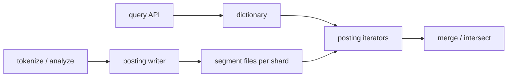

# HLD — Keyword Index for Billions of Messages

<a id="interview-spine-nine-steps"></a>

## 1. Clarify requirements

<a id="say-1-questions-human"></a>
### 1.1 Clarify 

| Topic | Say it like this in the room |
|--------------------------|-------------------------------|
| **Boolean default** | “Multi-keyword default is **AND** or **OR**?” |
| **Phrase** | “Do you need **phrase** / proximity—or token **AND** is enough?” |
| **Scope** | “Index **per user**, **per chat**, or **global** public—drives **shard + authz**.” |
| **Mutability** | “Messages **immutable** or **edits**—I’ll use **tombstones** + reindex if edits exist.” |
| **Result shape** | “**Top-K** only vs full iterator—changes early-termination.” |
| **SLO** | “Rough **p99** for search so I can cap **postings scanned**.” |

**Micro-pauses:** *“So postings are **on-disk streamable** lists—never **RAM** materialize billions of ids.”*

### 1.2 Functional requirements (FR) — after alignment, say this as “what we must build”

<a id="say-fr-human"></a>
#### Human interaction (FR — how to explain after alignment)

**Habit:** *“**Index build** + **query** + **authz scope**.”*

| FR area | Say it like this in the room |
|---------|-------------------------------|
| **Build** | “Ingest by **`msg_seq`**; **tokenize**; append **sorted postings** per term on **disk**; **tombstone** deletes.” |
| **Search** | “Single term: **stream** postings with **pagination**; multi-term **AND**: **intersect** without loading full lists.” |
| **Access** | “Results always **scoped** to what the caller may see—**no cross-tenant** reads.” |

**Index build**

- Ingest messages (unique `msg_seq`); **tokenize**; append postings to **per-term** sorted lists (on disk).  
- Support **incremental** updates and **deletes** (tombstone).

**Search**

- **Single keyword:** return message ids (or seqs) containing term, **paginated**.  
- **Multi keyword:** return messages containing **all** terms (default AND) with efficient intersection.

**Access control**

- Results **scoped** to authorized chats/users—no cross-tenant leakage.

### 1.3 Non-functional requirements (NFR) — say as “how it must behave”

<a id="say-nfr-human"></a>
#### Human interaction (NFR — how to say “how it must behave”)

**Habit:** *“**Disk + stream**; cap **work per query**.”*

| NFR area | Say it like this in the room |
|----------|-------------------------------|
| **Scale** | “**Billions** of postings—**inverted index on disk**, **segments**, **compression**.” |
| **Latency** | “**Rarest-first AND**, **skipTo**, **caps** on postings scanned.” |
| **Privacy** | “**AuthZ** on shard route every time; **redact** queries in logs.” |

**Scale**

- **Billions** of postings; **disk-backed** structures; **streaming** iterators.

**Performance**

- Bounded work per query via **rarest-first**, **caps**, **early exit** for top-K.

**Storage efficiency**

- **Delta encoding**, VarInt, **Roaring** bitmaps for dense ranges; **segment merge**.

**Durability**

- Index files **durable**; **WAL** or replicated log for index writer if needed.

**Security / privacy**

- **AuthZ** on every query; **encrypt at rest** for regulated tenants; **audit** access.

### 1.4 Invariants (one sentence you repeat under pressure)

**Invariant:** “We never return a message the caller is **not authorized** to see; index partitions are **isolated** by tenant/chat policy.”

<a id="say-voice-1"></a>

**Purpose:** handoff → **dictionary + postings + iterators** sketch.

| Beat | Say it like this |
|------|------------------|
| **Bridge** | “A **RAM** `Map<term, Set<id>>` or trie-of-messages doesn’t fix **query**—you still can’t materialize **billions of ids**.” |
| **Pivot** | “**Streaming intersection** on **sorted compressed postings** plus **shard** for privacy.” |

---

## 2. Estimate scale

<a id="say-voice-2"></a>
#### Human interaction (estimate scale)

**Habit:** *“Billions ⇒ **shard + segment + cap**.”*

| Topic | Say it like this in the room |
|-------|-------------------------------|
| **Volume** | “**10⁹+** messages; posting lists stay **huge**—must **stream**.” |
| **Hot term** | “Head terms need **top-K**, **time bounds**, or **WAND**—not full enumeration.” |

| Dimension | Illustrative |
|-----------|----------------|
| Messages | **10⁹+** total |
| Posting list length per rare term | Still huge—must **stream** |
| Hot terms | Millions of hits—need **top-K** or **time bounds** |
| Index size | **Many TB** → sharding + **tiered** storage |

**Tie it in one line:** “**Shard** for privacy and parallelism; **never** load a full hot posting list into RAM.”

---

## 3. APIs and data model

<a id="say-voice-3"></a>
#### Human interaction (APIs & data model)

**Habit:** *“**Dictionary** in memory/mmap; **postings** on disk; **shard key** = tenant scope.”*

| Topic | Say it like this in the room |
|-------|-------------------------------|
| **API** | “**GET** search with `after_seq` **pagination**; multi-term **mode=and**.” |
| **Layout** | “**Segments** are immutable; **merge** in the background like Lucene-style engines.” |

### 3.1 APIs (sketch)

| API | Purpose |
|-----|---------|
| `GET /search?q=foo&after_seq=&limit=` | Single term |
| `GET /search?terms=foo,bar&mode=and&after_seq=` | Multi-term |
| `POST /internal/index/rebuild` | Admin/repair (authz heavy) |

### 3.2 Data structures (logical model)

- **Dictionary:** `term → (offset, len, doc_freq)` in memory or mmap.  
- **Postings:** sorted `msg_seq` (optional positions for phrases).  
- **Segments:** immutable files + **merge** (Lucene-like).

### 3.3 Physical layout

- Shard by **`user_id` / `chat_id` / org_id`** — align with **privacy** and query filters.

---

## 4. High-level architecture

<a id="say-voice-4"></a>
#### Human interaction (high-level architecture / HLD)

**Habit:** *“**Write path** appends segments; **read path** opens **iterators**.”*

| Moment | Say it like this in the room |
|--------|------------------------------|
| **Write** | “Tokenize → **posting writer** → **segment files** per shard.” |
| **Read** | “Dictionary lookup → **iterators** → **merge/intersect**—bounded work.” |



**Narration:** “**Writes** append postings into **segments**; **reads** open **iterators** on compressed blocks; **queries** never load full lists into RAM.”

---

## 5. Deep dive: critical flow

<a id="say-voice-5"></a>
#### Human interaction (deep dive — critical flow)

**Habit:** *“**Single term** = stream; **AND** = **rarest-first** + **`skipTo`**.”*

| Step | Say it like this in the room |
|------|-------------------------------|
| **Single** | “Dictionary → **stream** sorted `msg_seq` with **`after_seq`** cursor.” |
| **AND** | “Order terms by **df**; walk the **shortest** list; **`skipTo`** on the others—**galloping** inside blocks.” |
| **Phrase** | “Need **positions**—verify adjacency after AND narrows candidates.” |
| **Anti-trie** | “Trie helps **prefix completion**; it doesn’t replace **compressed postings** at billions scale.” |

This is **step 5** of the [spine](#interview-spine-nine-steps)—where most Bar Raiser time should go.

### 5.1 Single keyword

1. Dictionary lookup for term.  
2. **Stream** postings in order; **page** with `(after_seq, limit)`.  
3. Optional **WAND/MaxScore** if scoring for top-K only.

### 5.2 Multi-keyword AND

- **Naive:** merge all lists — bad when one list is huge.  
- **Strong:** sort terms by **ascending df**; outer loop on **rarest** list; **`skipTo(seq)`** on others (**galloping** / binary search in block).  
- **Dense:** **Roaring AND**.

### 5.3 Phrase queries

- Store **positions** in postings or **secondary** positional structure; verify adjacency after candidate AND.

### 5.4 Index build path

- Tokenize message → for each term emit `(term, msg_seq)` → append to **segment buffer** → periodic **flush** + **merge**.

---

## 6. Scaling and bottlenecks

<a id="say-voice-6"></a>
#### Human interaction (scaling & bottlenecks)

**Habit:** *“**Postings scanned** is your money metric.”*

| Topic | Say it like this in the room |
|-------|-------------------------------|
| **Huge lists** | “**Rarest-first**, skip pointers, block **max scores**.” |
| **Compaction** | “Dedicated **merger** pool; throttle writes if backlog grows.” |

| Risk | Mitigation |
|------|------------|
| **Huge posting reads** | Rarest-first + skip pointers + block max scores |
| **Hot shard** | Further partition by time or hash within tenant |
| **Compaction backlog** | Throttle writes; dedicated compactor pool |
| **Memory pressure** | mmap; small block cache; avoid loading full lists |

**Techniques table:** sharding; delta+VarInt; block skips; Bloom per block; **tiered** cold storage; **segment** limit.

---

## 7. Reliability and failure handling

<a id="say-voice-7"></a>
#### Human interaction (reliability & failure handling)

**Habit:** *“**Checksum segments**; **tombstones**; **rebuild** story.”*

| Topic | Say it like this in the room |
|-------|-------------------------------|
| **Corruption** | “Detect bad blocks; **rebuild** shard from message log.” |
| **Partial** | “Return **partial page** + flag vs hard fail—product call.” |

- **Replica** index shards; **failover** read path.  
- **Corrupt segment:** checksum; **rebuild** from source of truth messages.  
- **Partial query failure:** return **partial page** with error flag vs fail—product choice.  
- **Backpressure:** limit max postings scanned per query.

---

## 8. Tradeoffs and alternatives

<a id="say-voice-8"></a>
#### Human interaction (tradeoffs & alternatives)

**Habit:** *“Managed ES vs custom—**velocity vs control**.”*

| Topic | Say it like this in the room |
|-------|-------------------------------|
| **RAM map** | “Doesn’t scale—same failure mode as naive trie story.” |
| **Managed** | “OpenSearch/ES ships faster; **cost** and less **low-level** control.” |

| Option | Good | Bad |
|--------|------|-----|
| In-memory map | Simple | **Does not scale** |
| Disk inverted index | Scales | Ops complexity |
| Central global index | One stack | **Privacy blast radius** |
| Elasticsearch managed | Faster to ship | Cost; less control |

**Alternatives:** **Elasticsearch** for full stack vs custom postings; **ngram** for substring vs token index tradeoffs.

---

## 9. Monitoring, observability, and security

<a id="say-voice-9"></a>
#### Human interaction (monitoring, observability & security)

**Habit:** *“Watch **postings scanned** as much as **p99**.”*

| Topic | Say it like this in the room |
|-------|-------------------------------|
| **Metrics** | “Query **p99**, **postings scanned**, **index lag**, merge **depth**.” |
| **Security** | “**Tenant** on every route; **redacted** query logs.” |

**Metrics:** query **p99**, **postings scanned** per query, **merge** queue depth, **index lag** behind message log.

**Security:** enforce **tenant** on every shard route; **no** cross-shard fan-in without auth; log **redacted** queries.

**Compliance:** retention on **search logs**; right-to-erasure → **tombstone** + async scrub.

---

## 10. Design patterns, data structures & best practices

Tie **inverted index**, **sharding**, **CQRS-lite** to the diagram.

### 10.1 Search / distributed patterns

| Pattern | Where | Why |
|---------|--------|-----|
| **Inverted index** | Term → postings on disk | Standard IR at scale |
| **Sharding** | By `user_id` or hash range | Isolation + parallelism |
| **CQRS-lite** | Message log vs index projector | Rebuild index from source of truth |
| **Outbox** | After message commit emit index job | Consistent indexing |
| **Idempotent indexer** | `(message_id, version)` | Safe retries |
| **Circuit breaker** | Downstream object store / ES | Protect query path |

### 10.2 Classic patterns

| Pattern | Map |
|---------|-----|
| **Iterator** | Merge **sorted** posting streams (AND/OR) |
| **Strategy** | **rarest-first** vs fixed order intersection |
| **Template method** | Query pipeline: tokenize → fetch → merge → rank snippet |
| **Anti-corruption** | Normalize encodings / language before tokenize |

### 10.3 Data structures

| Need | Structure |
|------|-----------|
| Posting list | **Sorted** `message_id` arrays or **skiplist** segments on disk |
| Vocabulary | **Lexicon** (term → term_id) |
| Hot terms | **Block max** / skip ahead in merge |
| Phrase / proximity | **Positional** postings or **bigram** table |

### 10.4 Best practices

- **Never** load full posting list into RAM for hot terms.  
- **Cap** `max_postings_scan` and return partial + cursor.  
- **Tenant** isolation on every shard lookup.

### 10.5 Trade-offs

| Pick | Trade |
|------|--------|
| Managed search (ES/OpenSearch) | Speed to ship vs **cost** + less control |
| Custom on-disk index | Control vs **engineering** burden |

<a id="say-voice-10"></a>
#### Human interaction (design patterns, data structures & best practices)

**Habit:** *“**Iterator** merge, **Strategy** for intersect order, **CQRS-lite** from message log.”*

| You mean… | Say it like this in the room |
|-----------|-------------------------------|
| **Patterns** | “**Inverted index** on disk; **shard** by tenant; **idempotent indexer**; **breaker** on heavy deps.” |
| **DS** | “Sorted **postings**, **dictionary**, **skip lists** in blocks, optional **Roaring**.” |

---

## Closing notes (where wrap-up human interaction lives)

Optional: [coding sketch](#optional-coding-sketch) if they ask for pseudocode.

---

## Bar-raiser follow-ups

<a id="say-voice-bar"></a>
#### Human interaction (bar-raiser)

**Habit:** two–four sentences, then **stop**.

| They ask | Say it like this |
|----------|------------------|
| **Edits** | “**Tombstone** old postings; append new; **merge** compacts; queries filter deleted.” |
| **Rare terms** | “**min df**, stopwords, caps per user—control **noise** and **size**.” |

---

## 60-second close

<a id="say-voice-close"></a>
#### Human interaction (60-second close)

**Habit:** one **net-net** pass.

| Beat | Say it like this in the room |
|------|------------------------------|
| **Recap** | “**Inverted index** on disk—**sorted compressed postings**; single term **stream** + **pagination**; multi-term **AND** via **rarest-first** + **`skipTo`**; **shard** for **privacy** and scale; **compaction**; monitor **postings scanned** and **p99**.” |

---

### Optional coding sketch

```text
intersect(lists):
  lists.sort_by(estimated_length)
  for seq in lists[0]:
    if all(L.skip_to(seq) for L in lists[1:]):
      yield seq
```

---
