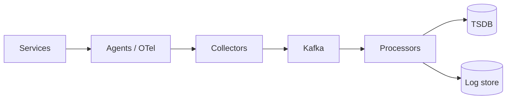
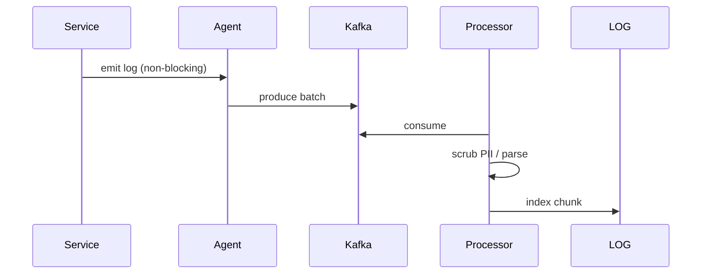

# HLD — Logging (Metrics Pipeline)

## 1. Clarify requirements

### 1.0 Live flow

**Opening (~once):** *“I’ll split **logs** (debugging) from **metrics** (SLIs) from **traces** (latency); align **retention**, **PII**, **cardinality**; then **ingest**, **storage**, **query**. **Pause after the diagram**—**cost**, **reliability**, or **schema**?”*

**Thinking transitions:** *“**Never** block the **request path** on **observability**—**async buffer**.”*

### 1.1 Clarify

| Topic | Say it like this in the room |
|--------------------------|-------------------------------|
| **Volume** | “**TB/day** class?” |
| **Query** | “**Keyword** log search vs **metrics** only?” |
| **Compliance** | “**PII scrub** at edge?” |
| **SLI** | “**RED/USE** metrics—**required**?” |

### 1.2 Functional requirements (FR)

| FR area | Say it like this |
|---------|-------------------|
| **Ingest** | “Agents / libs ship **logs**, **metrics**, **traces**.” |
| **Process** | “Parse, **enrich**, **sample**, **route**.” |
| **Store** | “Tiered **hot/warm/cold**.” |
| **Query** | “Dashboards + **ad-hoc** log query.” |

### 1.3 Non-functional requirements (NFR)

| NFR | Say it like this |
|-----|------------------|
| **Durability** | “**At-least-once** ingest; **dupes** ok downstream with **keys**.” |
| **Cost** | “**Sampling** + **aggregation** to control **cardinality**.” |

### 1.4 Invariants

**Invariant:** “**PII** never lands in **immutable** cold tiers **unredacted**; **high-cardinality** labels are **blocked** at **ingest**.”

| Beat | Say it like this |
|------|------------------|
| **Bridge** | “**Kafka** buffer → **stream processors** → **TSDB + log store**.” |
| **Core split** | “**Hot path** **fire-and-forget** to **local agent**.” |

### Key insight (say early)

**Unified pipeline** with **schema-on-write** for metrics and **indexed** logs—**shared** **enrichment** (service, region, trace id).

#### Key anchors

1. “**OTel**.”  
2. “**Cardinality guardrails**.”  
3. “**Tiered retention**.”

---

## 2. Estimate scale

| Dimension | Illustrative |
|-----------|----------------|
| Log volume | **PB-scale** discussion for big cos |
| Metric samples | **Billions**/day |

---

## 3. APIs and data model

### 3.1 Interfaces

- **Push:** agents **HTTP/gRPC** to **collector**.  
- **Pull:** Prometheus **scrape** (metrics).  

### 3.2 Schema

- **LogRecord:** `ts, service, level, trace_id, message, attrs`.  
- **Metric:** `name, labels{bounded}, value, ts`.

---

## 4. High-level architecture

### 4.1 Phases

| Phase | Ship |
|-------|------|
| **1** | ELK or Loki + Prometheus |
| **2** | **Sampling** + **SLO dashboards** |
| **3** | **Tiered** + **federated** query |

---

## 5. Deep dive: hot path → durable

### 🎯 Bottleneck Anchor

“**Kafka** **consumer lag** during incidents—**back-pressure** and **drop** **debug** verbosity tiers.”

**Taking a stance:** *“**Structured JSON** logs + **trace_id** correlation—**grep**-hostile unstructured **deprecated**.”*

---

## 6. Scaling and bottlenecks

| Risk | Mitigation |
|------|------------|
| **Cardinality explosion** | **Allowlist** labels; **aggregate** early |
| **Hot partition** | **Hash** key on `(service, hour)` not **user_id** for metrics |

---

## 7. Reliability and failure handling

- **Agent disk full:** **spill** + **shed** lowest priority.  
- **Kafka down:** **buffer** locally with **caps**—**never** infinite.

---

## 8. Tradeoffs and alternatives

| Choice | Trade |
|--------|--------|
| **Full fidelity logs** | Debuggability vs **cost** |
| **Head sampling traces** | Cost vs **coverage** |

---

## 9. Monitoring, observability, and security

**Meta:** monitor the **pipeline** lag, **drop rate**, **parse errors**.  
**Security:** **RBAC** on log query; **audit** exports.

---

## 10. Design patterns, data structures & best practices

| Pattern | Map |
|---------|-----|
| **CQRS** | Metrics vs OLTP |
| **Buffering** | Kafka |
| **Sampling** | Tail-based optional |

**Live:** max **four** patterns.

---

## Closing notes

| Do | Avoid |
|----|--------|
| **Structured logs** | printf in hot path sync |
| **Cardinality policy** | `user_id` as metric label |

---

## Bar-raiser follow-ups

| They ask | Say it like this |
|----------|------------------|
| **eBPF** | “Kernel-level **no-instrument** metrics—**great** for **node** health, not **biz** events.” |

---

## 60-second close

| Beat | Say it like this |
|------|------------------|
| **Recap** | “**Non-blocking** emit → **Kafka** → **processors** → **TSDB + logs**; **PII** + **cardinality** gates; **lag** SLI on pipeline; **OTel**-shaped mental model.” |

---
