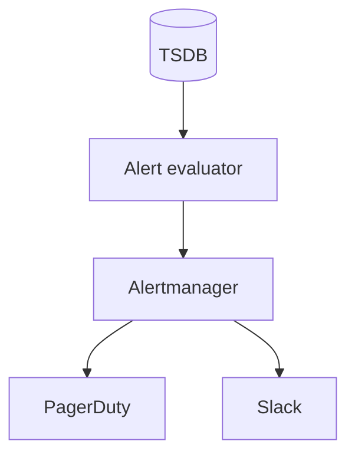
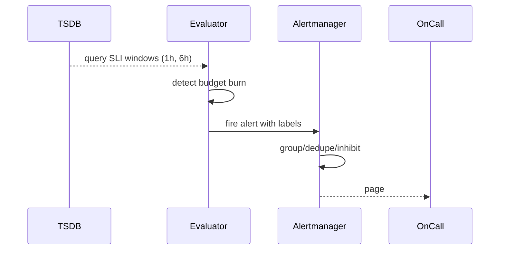

# HLD — Monitoring Alerting System

## 1. Clarify requirements

### 1.0 Live flow

**Opening (~once):** *“I’ll connect **SLI → SLO → error budget → alert policy**; align **symptoms vs causes**, **noise**, and **on-call**; then **data sources**, **evaluation**, **notification**. **Pause after the diagram**—**SLO math**, **runbooks**, or **multi-tenant**?”*

**Thinking transitions:** *“**Alert on user pain**, not **CPU**—unless CPU **is** user pain.”*

### 1.1 Clarify

| Topic | Say it like this in the room |
|--------------------------|-------------------------------|
| **Consumers** | “**PagerDuty** class vs **email** dashboards?” |
| **SLO** | “**99.9%** monthly for which **SLI**?” |
| **Windows** | “**Burn rate** alerts?” |
| **Multi-tenant** | “Per-tenant **noise** isolation?” |

### 1.2 Functional requirements (FR)

| FR area | Say it like this |
|---------|-------------------|
| **Collect** | “Ingest **metrics**, **logs**, **traces**, **synthetic** probes.” |
| **Define** | “SLOs, **alert rules**, **silences**, **routes**.” |
| **Notify** | “Pages, chat, tickets.” |
| **Visualize** | “Dashboards, **SLO** views.” |

### 1.3 Non-functional requirements (NFR)

| NFR | Say it like this |
|-----|------------------|
| **Reliability** | “**Monitoring** must stay up during **partial** outages—**federation**.” |
| **Latency** | “**Alert evaluation** near **real-time** (tens of seconds).” |

### 1.4 Invariants

**Invariant:** “Every **page** maps to a **runbook** entry and **severity**; **no page** without **owner** and **rollback/mitigation** path.”

| Beat | Say it like this |
|------|------------------|
| **Bridge** | “**SLI queries** in **TSDB** → **burn** detectors → **router**.” |
| **Core split** | “**Symptom-based** alerts vs **cause** dashboards.” |

### Key insight (say early)

**Multi-window multi-burn-rate** on **error budget** consumption beats static thresholds for **noise** (Google SRE style).

#### Key anchors

1. “**RED** metrics.”  
2. “**SLO** not **SLA** in the room unless legal.”  
3. “**Synthetic** **canaries** for **critical** journeys.”

---

## 2. Estimate scale

| Dimension | Illustrative |
|-----------|----------------|
| Evaluation QPS | **High**—**pre-aggregated** counters help |
| Cardinality | **Guard** same as metrics pipeline ([30-hld-logging-metrics-pipeline.md](./30-hld-logging-metrics-pipeline.md)) |

---

## 3. APIs and data model

### 3.1 Concepts

- **SLI:** `good_events / valid_events` over window.  
- **AlertRule:** `expr`, `for`, `labels`, `annotations`.  
- **Route:** matcher → **receiver** (PagerDuty, Slack).

---

## 4. High-level architecture

### 4.1 Phases

| Phase | Ship |
|-------|------|
| **1** | Threshold alerts + dashboards |
| **2** | **SLO** + burn + routing |
| **3** | **Auto-triage** + **incident** bot |

---

## 5. Deep dive: burn rate alert

### 🎯 Bottleneck Anchor

“**Flapping** when **small** windows see **noise**—**multi-window** **AND** guards.”

**Taking a stance:** *“**Inhibit** **node** alerts when **cluster** alert fires—**cause** hierarchy.”*

---

## 6. Scaling and bottlenecks

| Risk | Mitigation |
|------|------------|
| **Query cost** | **Recording rules** precompute SLIs |
| **Storm** | **Grouping** + **rate limits** on notifications |

---

## 7. Reliability and failure handling

- **Evaluator down:** **missed** pages—**HA** pair; **dead man’s snitch** meta-alert.

---

## 8. Tradeoffs and alternatives

| Choice | Trade |
|--------|--------|
| **Many fine alerts** | Coverage vs **noise** |
| **SLO-only** | Miss **non-SLO** defects |

---

## 9. Monitoring, observability, and security

**Dogfood:** monitor **alert pipeline** itself.  
**Security:** **RBAC** on silence; **audit** who ack’d.

---

## 10. Design patterns, data structures & best practices

| Pattern | Map |
|---------|-----|
| **Hysteresis** | Flap control |
| **Inhibition graph** | Dependency-aware paging |

**Live:** max **four** patterns.

---

## Closing notes

| Do | Avoid |
|----|--------|
| **Runbook link** in alert | “CPU high” with no user impact |
| **Error budget** language | 500 meaningless thresholds |

---

## Bar-raiser follow-ups

| They ask | Say it like this |
|----------|------------------|
| **Toil** | “**Automate** remediation for **safe** actions; **measure** on-call hours.” |

---

## 60-second close

| Beat | Say it like this |
|------|------------------|
| **Recap** | “**SLI/SLO** + **multi-window burn**; **Alertmanager** **group/dedupe/inhibit**; **symptom** pages; **synthetic** canaries; **ties** to **metrics pipeline**.” |

---
