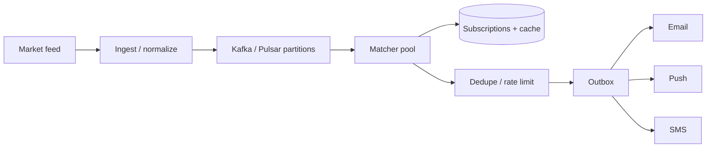
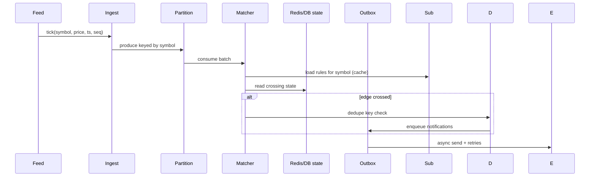

# HLD — Notification System (Stock Price Alerts)

## 1. Clarify requirements

### 1.0 Live flow (how to open and steer)

**Opening (~once):** *“I’ll align on **edge vs level** alerts, **channels + cost**, **quiet hours**, **tick→notify SLO**; then **scale**, **APIs + state**, **architecture**, and **one tick** through **match → dedupe → outbox**. I’ll **pause after the diagram**—depth on **hot symbols**, **dedupe**, or **provider failure**?”*

**Thinking transitions:** *“The dedupe key is …”* · *“If SMS is money I’d …”* · *“Let me sanity-check …”* · *“One tradeoff: coalesce vs precision …”*

**Live rule:** **Paraphrase** §1–2 tables; don’t read every row. Go deep **only if they probe**.

### 1.1 Clarify 

| Topic | Say it like this in the room |
|--------------------------|-------------------------------|
| **Semantics** | “**Edge-triggered** once per **cross** vs **every tick** while true—dedupe lives on the **crossing**, right?” |
| **Channels** | “**Push vs email vs SMS**—priority and **cost** caps?” |
| **Quiet hours** | “**Timezone** per user—queue vs suppress?” |
| **Disclosure** | “Any **market data delay** we show in copy?” |
| **Anti-flap** | “**Cooldown** / hysteresis so we don’t spam?” |
| **Rules in flight** | “If a user **edits** a rule mid-tick, is there a **version** story?” |

**Micro-pauses:** *“So I’ll **partition** by symbol, **edge-detect**, then **outbox** with **dedupe** and **rate limits**—especially before SMS.”*

### 1.2 Functional requirements (FR) — after alignment, say this as “what we must build”

#### Human interaction (FR — how to explain after alignment)

**Habit:** *“**Rules**, **ticks**, **match**, **deliver**—four verbs.”*

**Live:** one **spoken** FR pass (~60–90 s); use [§1.0](#live-flow-open) when you move **FR → NFR**.

| FR area | Say it like this in the room |
|---------|-------------------------------|
| **Rules** | “Users define **symbol**, comparator, threshold, optional **%**, **cooldown**, **channels**.” |
| **Ticks** | “Ingest **`symbol, price, ts, seq`** normalized from vendors.” |
| **Match** | “Detect **threshold crossing** with hysteresis if needed.” |
| **Deliver** | “Notify on **email/push/SMS**; optional **history** of fired alerts.” |

**Subscriptions**

- User creates **rules**: symbol, comparator, threshold, optional **percent change**, **cooldown**, channel preferences.

**Ingestion**

- Consume **market ticks**: `{symbol, price, ts, seq}` normalized to internal schema.

**Matching**

- Determine **crossing** of threshold with **hysteresis** if needed.

**Delivery**

- Send notifications via **email**, **push**, **SMS** with templates; **history** of fired alerts optional.

### 1.3 Non-functional requirements (NFR) — say as “how it must behave”

#### Human interaction (NFR — how to say “how it must behave”)

**Habit:** *“**At-least-once** ticks; **at-most-once per crossing** to users; **SMS** = money.”*

| NFR area | Say it like this in the room |
|----------|-------------------------------|
| **Semantics** | “**At-least-once** through the log; **dedupe** + **cooldown** so UX isn’t spam.” |
| **Latency** | “Tick→notify **SLO**—sub-second vs seconds, align in room.” |
| **Cost** | “**Rate limit** and **shape** SMS; **circuit breaker** on providers.” |
| **Security** | “**Auth** on rule APIs; **vault** for provider secrets.” |

#### UX on alerts (say with NFR)

- **Flapping price:** **cooldown** + copy that doesn’t blame the user (“**still above** your alert—no new crossing”).  
- **Quiet hours:** **queue** with **morning digest** or **suppress**—pick one and say it.  
- **Delayed market data:** **disclose** in template if compliance/product requires it.

**Throughput**

- Very high tick rate on **liquid** symbols; **horizontal** matchers.

**Latency**

- Soft real-time: tick → notify within **SLO** (e.g. sub-second to seconds—align in room).

**Delivery semantics**

- **At-least-once** processing; **at-most-once per crossing** via **dedupe** + policy.

**Availability**

- **Partitioned** log survives broker failures; **outbox** for durable handoff to channels.

**Cost**

- SMS expensive—**rate limit** and **batch** where possible.

**Security**

- **AuthN** on rule APIs; **no** leaking other users’ rules; **secrets** for providers in vault.

### 1.4 Invariants (one sentence you repeat under pressure)

**Invariant:** “No **unbounded** duplicate notifications for the **same logical crossing** without an explicit **repeat** / **cooldown** policy.”

#### Key anchors (say these confidently—any order)

1. “**Partition** ticks by **`symbol`**—skew is the design.”  
2. “**Dedupe** on **crossing**, not every raw tick.”  
3. “**Outbox** before **SMS**—**breaker** + **retry** on providers.”  
4. “**Rule version** or snapshot—no silent **mid-flight** behavior changes.”  
5. “**At-least-once** pipeline; **at-most-once per crossing** to the user.”

**Purpose:** handoff → **partition → match → dedupe → outbox → channel**.

| Beat | Say it like this |
|------|------------------|
| **Bridge** | “Dedupe is keyed on **crossing**, not every raw tick.” |
| **Skew** | “Hot symbols get **dedicated partitions** or lanes so matchers don’t melt.” |

---

## 2. Estimate scale

#### Human interaction (estimate scale)

**Habit:** *“**Skew** is the story—mega-cap symbols.”*

**Live:** *“Let me sanity-check…”* **ticks/sec hot symbol**, **rules per symbol**, **channel mix**—**invite correction**.

| Topic | Say it like this in the room |
|-------|-------------------------------|
| **Skew** | “Rules and ticks **clump** on liquid names—**partition by symbol**.” |
| **CPU** | “Optional **coalesce** window (e.g. **100ms**) if product accepts less precision.” |

| Dimension | Notes |
|-----------|--------|
| Symbols | Thousands liquid; **skewed** to mega caps |
| Rules | Millions total; **concentrated** on AAPL-like names |
| Ticks | High **QPS** per hot symbol—**partition** mandatory |
| Coalesce window | Optional **100ms** batching to cut CPU |

**Tie it in one line:** “**Horizontal matchers** + **symbol partitions** + **backpressure** before expensive channels.”

---

## 3. APIs and data model

#### Human interaction (APIs & data model)

**Habit:** *“**Rules** in DB; **state** for FSM; **outbox** for delivery.”*

| Topic | Say it like this in the room |
|-------|-------------------------------|
| **APIs** | “CRUD **rules**; internal **tick produce** keyed by **symbol**.” |
| **State** | “**last_price** / FSM per **(user, rule)** in Redis or SQL.” |
| **Outbox** | “Rows with **`dedupe_key`**, channel, status—workers **retry** safely.” |
| **Core split (once)** | Same as [Key insight / invariant](#key-insight-say-early)—**match** idempotently, **deliver** through **outbox**. |

### 3.1 APIs (sketch)

| API | Purpose |
|-----|---------|
| `POST /v1/rules` | Create alert |
| `DELETE /v1/rules/{id}` | Remove |
| `GET /v1/rules` | List |
| Internal: **produce tick** from vendor adapter | Ingestion service |

### 3.2 Data model

**Rule:** `rule_id, user_id, symbol_id, comparator, threshold, cooldown_sec, channels, version, created_at`.

**State:** `last_price`, `last_side`, or **FSM** state per `(user, rule)` in Redis/DB.

**Notification outbox:** `id, user_id, channel, payload_ref, status, dedupe_key`.

---

## 4. High-level architecture

#### Human interaction (high-level architecture / HLD)

**Habit:** *“**Ingest → partitioned log → matcher → dedupe → outbox → channels**.”*

| Moment | Say it like this in the room |
|--------|------------------------------|
| **Log** | “Ticks land in **Kafka/Pulsar** keyed by **`symbol`**.” |
| **Match** | “Matchers pull **rules** for that symbol, run **edge FSM**, then **dedupe**.” |
| **Send** | “**Outbox** per channel with **breakers** on Twilio/FCM/etc.” |
| **Steer** | “**Deeper** on **hot symbol**, **dedupe keys**, or **DLQ / replay** next?” |

**Partition:** `hash(symbol) % N`; optional **dedicated** partitions for **top 10** symbols.

### 4.1 How we’d evolve this (if they ask “phases / MVP”)

| Phase | Ship | Why |
|-------|------|-----|
| **1 — MVP** | **Single region**, **partitioned log**, **edge FSM**, **email/push** first, basic **dedupe** | Learn semantics + cost |
| **2 — Growth** | **SMS** with **strict** rate limits + **quiet hours**, **hot-symbol** lanes, **coalesce** option | Cost + skew |
| **3 — Scale** | **Dedicated** mega-cap partitions, **advanced** anti-flap, **multi-region** ingest | Tail + compliance |

**Taking a stance:** *“I’d ship **email/push** before **SMS**; I’d treat **dedupe on crossing** as non-negotiable the day we pay per segment.”*

---

## 5. Deep dive: tick to notify

#### Human interaction (deep dive — critical flow)

**Habit:** *“Walk **one tick** through **partition → state → dedupe → outbox**.”*

| Step | Say it like this in the room |
|------|-------------------------------|
| **Ingest** | “Normalize **`seq`**; produce to **symbol partition**.” |
| **Match** | “Load rules; read **state**; **edge detect**; apply **cooldown**.” |
| **Deliver** | “**Dedupe key** per crossing; enqueue **outbox**; channel worker **retries** with **breaker**.” |
| **Production voice** | “**Market open** thundering herd—**stagger** matchers; **Twilio 5xx**—**DLQ** not duplicate SMS; **gap** in **seq**—**replay** vendor window.” |
| **Anchor** | “Watch **tick→notify p99**, **matcher lag**, **SMS $/hour**, **dedupe hit rate**.” |

This is **step 5** of the [spine](#interview-spine-nine-steps)—where most Bar Raiser time should go.

**Taking a stance:** *“I’d default **Kafka keyed by symbol** + **stateful matcher** per partition + **outbox per channel**; I’d add **coalesce** only if the room trades precision for **CPU** explicitly.”*

**Rule evaluation:** compare price to threshold; **edge detect** (was below, now above); apply **cooldown**.

**Dedupe key:** e.g. `(user_id, rule_id, crossing_bucket)` with bucket = **direction** + coarse time window.

**Channels:** **outbox** workers per channel with **provider** circuit breakers.

---

## 6. Scaling and bottlenecks

#### Human interaction (scaling & bottlenecks)

**Habit:** *“**Hot symbol** first.”*

| Topic | Say it like this in the room |
|-------|-------------------------------|
| **Hot symbol** | “Dedicated **partitions** / pools; **pre-filter** empty rule sets.” |
| **SMS** | “**Queue** + **shape** sends; **tier** priorities.” |

| Risk | Mitigation |
|------|------------|
| **Hot symbol** | Dedicated partitions; **local** rule index per matcher shard |
| **CPU** on matchers | **Coalesce** ticks; **short-circuit** empty rule sets |
| **SMS provider** limits | Queue + **shaped** send; prioritize tiers |
| **Thundering herd** on market open | Stagger + rate limit |

**Optimizations:** inverted index **symbol → rules** in memory; **batch** consume; **pre-filter** impossible rules.

---

## 7. Reliability and failure handling

#### Human interaction (reliability & failure handling)

**Habit:** *“**DLQ**, **replay**, **gap detect** on feed.”*

| Topic | Say it like this in the room |
|-------|-------------------------------|
| **Gaps** | “Detect missing **seq**; **replay** from vendor; honest **stale** UX if needed.” |
| **Providers** | “**DLQ** + delayed retry; don’t drop **crossing intent** until channel **acks**.” |
| **Incident tone** | “**Duplicate SMS** after provider timeout—**idempotent** send keys; **matcher** stuck—**partition lag**; **bad rule**—**version** + **kill switch**.” |

**UX tie-in (say aloud):** *“**Cooldown** is a product feature, not an implementation detail—users feel **spam** faster than **5s extra latency**.”*

- **Feed gap:** gap detector; **replay** request to vendor; user-visible **stale** banner if needed.  
- **Poison message:** **DLQ**; fix and **replay**.  
- **Provider outage:** **DLQ** + delayed retry; **never** lose crossing intent in **outbox** until acknowledged.  
- **Clock skew:** trust **exchange timestamp** for ordering.

---

## 8. Tradeoffs and alternatives

#### Human interaction (tradeoffs & alternatives)

**Habit:** *“**Precision vs CPU**; **fresh rules vs cache**.”*

| Topic | Say it like this in the room |
|-------|-------------------------------|
| **Coalesce** | “Batch ticks—cheaper, less **precise**.” |
| **Pull rules** | “DB each tick—**fresh**; cache+TTL—**fast** but **staler**.” |
| **My default (ticks)** | “**Append-only log** + **horizontal matchers**—never **lossy** silent drops.” |
| **My default (notify)** | “**Outbox** + **channel breakers**; **SMS** last-class citizen behind **caps**.” |

| Choice | Good | Bad |
|--------|------|-----|
| Per-tick evaluate | Simple | CPU heavy |
| Coalesce ticks | Cheaper | Less precise |
| DB pull each tick | Fresh | Slow |
| Local cache + TTL | Fast | Staleness |

**Alternatives:** **Kinesis** vs Kafka; **rules engine** SaaS vs in-house; **push-only** vs email for cost.

---

## 9. Monitoring, observability, and security

#### Human interaction (monitoring, observability & security)

**Habit:** *“**tick→notify p99** and **$ per hour** on SMS.”*

| Topic | Say it like this in the room |
|-------|-------------------------------|
| **Metrics** | “**Lag**, dedupe **hit rate**, provider **errors**, **SMS spend**.” |
| **Security** | “**Audit** high-volume rule creators; **encrypt** PII.” |

**Metrics:** tick→notify **p99**, matcher **lag**, dedupe hit rate, **provider error** rate, **SMS $/hour**.

**Alerts:** sustained **DLQ** growth, **gap** in tick sequence, **quota** exhaustion.

**Security:** authenticate rule changes; **rate limit** API; **encrypt** PII at rest; **audit** who created high-volume rules (abuse).

---

## 10. Design patterns, data structures & best practices

Name **partitioned stream**, **FSM**, **outbox**, **breaker** on the diagram.

### 10.1 Event / delivery patterns

| Pattern | Where | Why |
|---------|--------|-----|
| **Partitioned stream** | Ticks or price updates by symbol | Parallel matchers |
| **Edge-triggered FSM** | Rule: armed → triggered → cooldown | Avoid spam on every tick |
| **Dedupe + rate limit** | Per user + rule + channel | Cost + UX |
| **Outbox** | After rule persist enqueue notify job | Reliable side effects |
| **Saga / compensation** | Multi-channel send (push + email) | Partial failure handling |
| **Circuit breaker** | SMS / push provider APIs | Fail fast when provider down |

### 10.2 Classic patterns

| Pattern | Map |
|---------|-----|
| **State machine** | Subscription lifecycle |
| **Strategy** | **Edge** vs **level** crossing detection |
| **Chain of responsibility** | Quiet hours → dedupe → throttle → channel adapter |
| **Adapter** | Normalize FCM / APNs / Twilio behind one interface |

### 10.3 Data structures

| Need | Structure |
|------|-----------|
| Symbol → subscribers | **Inverted** map: symbol → list of rule_ids (sharded) |
| Hot symbol fan-out | **Bloom** optional prefilter before heavy work |
| Cooldown | **TTL** key per (user, rule) in Redis |
| Scheduled quiet hours | **Time-range** index or TZ-aware queue |

### 10.4 Best practices

- **Idempotent** delivery keys per (tick_id, rule_id).  
- **Version** rules; matcher uses snapshot or reconciles post-send.  
- **Cost guardrails:** max alerts per user per hour.

### 10.5 Trade-offs

| Pick | Trade |
|------|--------|
| Evaluate every tick | Simple vs **CPU** at scale |
| Coalesce ticks | Cheaper vs **precision** |

#### Human interaction (design patterns, data structures & best practices)

**Habit:** *“**Edge-triggered FSM**, **dedupe**, **outbox**, **adapter** per channel.”*

**Live:** **at most four** patterns on the pipeline; then stop.

| You mean… | Say it like this in the room |
|-----------|-------------------------------|
| **Patterns** | “**Partitioned** tick log; **state machine** per rule; **outbox** for reliable send; **chain** quiet hours→dedupe→throttle.” |
| **DS** | “Inverted **symbol→rule_ids**; **TTL** cooldown keys; **priority queue** for scheduled sends.” |

---

## Closing notes (where wrap-up human interaction lives)

Use **`#### Human interaction`** under [Bar-raiser](#bar-raiser-follow-ups), [Communication (do vs avoid)](#communication-do-vs-avoid), and [60-second close](#60-second-close).

### Communication (do vs avoid)

| Do (sounds senior) | Avoid (sounds rehearsed) |
|--------------------|---------------------------|
| **Define crossing vs tick** early | 10 minutes on Kafka internals first |
| **Name cost** for SMS | Ignoring provider limits |
| **Checkpoint** after diagram | One linear script |
| **Default dedupe policy** | “We’ll handle duplicates somehow” |
| **Time-box** | Every channel deep dive |

**60-minute sketch (flex):** clarify+FR+NFR ~8–12 · scale+APIs ~8–12 · architecture ~8–12 · **deep dive ~15–22** · scale→monitoring ~10–15 · patterns+close ~5–8.

---

## Bar-raiser follow-ups

#### Human interaction (bar-raiser)

**Habit:** two–four sentences, then **stop**.

| They ask | Say it like this |
|----------|------------------|
| **TZ / quiet hours** | “**Per-user TZ**; **queue** or suppress during quiet window.” |
| **Rule updates** | “**Version** rules; matcher uses **snapshot** or reconciles after send.” |

---

## 60-second close

#### Human interaction (60-second close)

**Habit:** one **net-net** pass.

| Beat | Say it like this in the room |
|------|------------------------------|
| **Recap** | “**Ticks** → **partitioned log** by **symbol** → **matchers** + **FSM** → **dedupe/rate limit** → **outbox** → **channel workers** with **retry/DLQ**; **hot symbols** isolated; **SMS** cost-aware.” |

---
