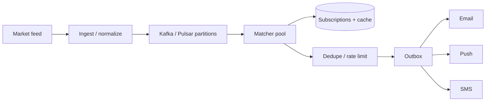
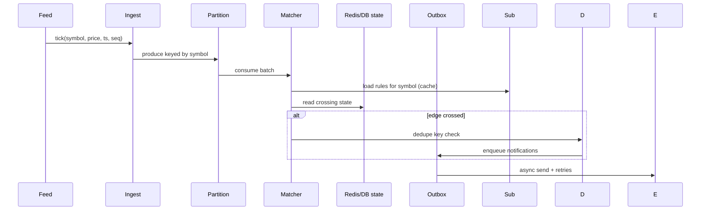

# HLD — Notification System (Stock Price Alerts)

> **GitHub README style** — pair with [HLD-README.md](./HLD-README.md).

| | |
|--|--|
| **Round** | 35–45 min |
| **Strong-hire hooks** | **Partitioned event stream**, **edge-triggered state**, **dedupe + rate limit**, **outbox to channels** |

---

## Table of contents

**Prep**

- [Interview plan](#interview-plan)
- [SDE-2 drive kit (Senior interviewer)](#sde-2-drive-kit-senior-interviewer)
- [Strong-hire signals](#strong-hire-signals)
- [Coverage map](#coverage-map)

**Interview spine (nine steps)**

- [Interview spine (nine steps)](#interview-spine-nine-steps)
- [1. Clarify requirements](#1-clarify-requirements)
- [2. Estimate scale](#2-estimate-scale)
- [3. APIs and data model](#3-apis-and-data-model)
- [4. High-level architecture](#4-high-level-architecture)
- [5. Deep dive: tick to notify](#5-deep-dive-tick-to-notify)
- [6. Scaling and bottlenecks](#6-scaling-and-bottlenecks)
- [7. Reliability and failure handling](#7-reliability-and-failure-handling)
- [8. Tradeoffs and alternatives](#8-tradeoffs-and-alternatives)
- [9. Monitoring, observability, and security](#9-monitoring-observability-and-security)
- [10. Design patterns, data structures & best practices](#10-design-patterns-data-structures--best-practices)

**Wrap-up**

- [Bar-raiser follow-ups](#bar-raiser-follow-ups)
- [Strong Hire room checklist](#strong-hire-room-checklist)
- [60-second close](#60-second-close)

---

## Interview plan

> “I’ll clarify **alert semantics** (edge vs level), **channels**, quiet hours, and **repeat** policy. Ingest ticks into a **partitioned durable log** keyed by symbol; **stateless matchers** load rules, run a **small state machine**, then **outbox** to channel workers with **dedupe** and **rate limits**. I’ll deep dive **one tick** end-to-end.”

---

## SDE-2 drive kit (Senior interviewer)

### A. Lock the agenda

Clarify → scale → rules API/model → architecture → **tick→match→outbox→channel** → hot symbols → failures → tradeoffs → monitoring/security. **Pause:** “Depth on **matching state**, **delivery**, or **cost (SMS)**?”

### B. Questions — **this order**

| # | Ask |
|---|-----|
| 1 | “**Edge-triggered** once per cross vs **every tick** while true?” |
| 2 | “**Cooldown** / anti-flapping policy?” |
| 3 | “Channel priority: **SMS vs push vs email**?” |
| 4 | “**Quiet hours** / timezone per user?” |
| 5 | “Market data **delay** we disclose?” |
| 6 | “Rule edits **versioned** while ticks in flight?” |

**Mirror:** “So dedupe is defined per **crossing**, not per tick.”

### C. Winning line per spine

| Step | Sentence |
|------|----------|
| 1 | “**Invariant**: bounded duplicates per crossing.” |
| 2 | “Skewed symbols ⇒ **partition** by symbol.” |
| 3 | “Rules in DB; **hot cache** symbol→rules in matcher.” |
| 4 | “Ingest → **Kafka keyed by symbol** → matchers → **outbox**.” |
| 5 | “**FSM** on last price + threshold + hysteresis/cooldown.” |
| 6 | “Dedicated lane for **mega-cap**; **coalesce** ticks if allowed.” |
| 7 | “DLQ, provider **circuit breaker**, **gap** detection on feed.” |
| 8 | “Coalesce vs precision; cache vs fresh rules.” |
| 9 | “tick→notify **p99**; **$ SMS**; auth on rule APIs.” |

### D. Whiteboard order

1. Feed → normalize → **partitioned log**.  
2. Matcher → **state** → dedupe → **outbox** → channels.  
3. One **sequence** for tick.

### E. Senior probes

| Probe | Answer |
|-------|--------|
| “Hot symbol?” | “**Isolate partitions** + optional **dedicated** consumer pool; **pre-filter** rules.” |
| “At-least-once ticks?” | “Matchers **idempotent** with **dedupe key** on `(user,rule,crossing)`.” |

### F. Time crunched

**Partition + edge detect + outbox** only.

### G. Anti-patterns

- SMS without **rate limit / cost** awareness.  
- No **dedupe** story on duplicate ticks/consumers.

---

## Strong-hire signals

- **Hot symbols** isolated (**partition** / dedicated lane).  
- **Edge-triggered** vs spammy **level** alerts clarified.  
- **Dedupe keys** + **cooldown**.  
- **Backpressure** before expensive SMS.

---

## Coverage map

- [ ] [Nine-step spine](#interview-spine-nine-steps)  
- [ ] Market ingest + normalization  
- [ ] Pub/sub partitioning  
- [ ] Subscription index  
- [ ] Matcher state machine  
- [ ] Outbox + DLQ  
- [ ] Multi-channel priorities  
- [ ] CAP / rule staleness  

---

## Interview spine (nine steps)

| Step | What you deliver | Section |
|------|------------------|---------|
| **1** | Clarify requirements | [§1](#1-clarify-requirements) |
| **2** | Estimate scale | [§2](#2-estimate-scale) |
| **3** | APIs / data model | [§3](#3-apis-and-data-model) |
| **4** | High-level architecture | [§4](#4-high-level-architecture) |
| **5** | Deep dive critical flow | [§5](#5-deep-dive-tick-to-notify) |
| **6** | Scaling / bottlenecks | [§6](#6-scaling-and-bottlenecks) |
| **7** | Reliability / failure handling | [§7](#7-reliability-and-failure-handling) |
| **8** | Tradeoffs / alternatives | [§8](#8-tradeoffs-and-alternatives) |
| **9** | Monitoring / security | [§9](#9-monitoring-observability-and-security) |

---

## 1. Clarify requirements

### 1.1 Questions to ask first

| Question | Why it matters |
|----------|----------------|
| **Edge-triggered** (fire once on cross) vs **while true** (every tick)? | Spam, dedupe |
| **Channels:** push, email, SMS—in **priority** order? | Mixer, cost |
| **Quiet hours** / user timezone? | Queue vs suppress |
| **Market data delay** disclosure? | UX copy |
| **Cooldown** per rule? | Flapping |
| **International** SMS cost caps? | Product guardrails |
| **User edits rule** while tick in flight? | Versioning |

### 1.2 Functional requirements (FR)

**Subscriptions**

- User creates **rules**: symbol, comparator, threshold, optional **percent change**, **cooldown**, channel preferences.

**Ingestion**

- Consume **market ticks**: `{symbol, price, ts, seq}` normalized to internal schema.

**Matching**

- Determine **crossing** of threshold with **hysteresis** if needed.

**Delivery**

- Send notifications via **email**, **push**, **SMS** with templates; **history** of fired alerts optional.

### 1.3 Non-functional requirements (NFR)

**Throughput**

- Very high tick rate on **liquid** symbols; **horizontal** matchers.

**Latency**

- Soft real-time: tick → notify within **SLO** (e.g. sub-second to seconds—align in room).

**Delivery semantics**

- **At-least-once** processing; **at-most-once per crossing** via **dedupe** + policy.

**Availability**

- **Partitioned** log survives broker failures; **outbox** for durable handoff to channels.

**Cost**

- SMS expensive—**rate limit** and **batch** where possible.

**Security**

- **AuthN** on rule APIs; **no** leaking other users’ rules; **secrets** for providers in vault.

### 1.4 Invariant

**Invariant:** “No **unbounded** duplicate notifications for the **same logical crossing** without an explicit **repeat** / **cooldown** policy.”

---

## 2. Estimate scale

| Dimension | Notes |
|-----------|--------|
| Symbols | Thousands liquid; **skewed** to mega caps |
| Rules | Millions total; **concentrated** on AAPL-like names |
| Ticks | High **QPS** per hot symbol—**partition** mandatory |
| Coalesce window | Optional **100ms** batching to cut CPU |

---

## 3. APIs and data model

### 3.1 APIs (sketch)

| API | Purpose |
|-----|---------|
| `POST /v1/rules` | Create alert |
| `DELETE /v1/rules/{id}` | Remove |
| `GET /v1/rules` | List |
| Internal: **produce tick** from vendor adapter | Ingestion service |

### 3.2 Data model

**Rule:** `rule_id, user_id, symbol_id, comparator, threshold, cooldown_sec, channels, version, created_at`.

**State:** `last_price`, `last_side`, or **FSM** state per `(user, rule)` in Redis/DB.

**Notification outbox:** `id, user_id, channel, payload_ref, status, dedupe_key`.

---

## 4. High-level architecture

**Partition:** `hash(symbol) % N`; optional **dedicated** partitions for **top 10** symbols.

---

## 5. Deep dive: tick to notify

**Rule evaluation:** compare price to threshold; **edge detect** (was below, now above); apply **cooldown**.

**Dedupe key:** e.g. `(user_id, rule_id, crossing_bucket)` with bucket = **direction** + coarse time window.

**Channels:** **outbox** workers per channel with **provider** circuit breakers.

---

## 6. Scaling and bottlenecks

| Risk | Mitigation |
|------|------------|
| **Hot symbol** | Dedicated partitions; **local** rule index per matcher shard |
| **CPU** on matchers | **Coalesce** ticks; **short-circuit** empty rule sets |
| **SMS provider** limits | Queue + **shaped** send; prioritize tiers |
| **Thundering herd** on market open | Stagger + rate limit |

**Optimizations:** inverted index **symbol → rules** in memory; **batch** consume; **pre-filter** impossible rules.

---

## 7. Reliability and failure handling

- **Feed gap:** gap detector; **replay** request to vendor; user-visible **stale** banner if needed.  
- **Poison message:** **DLQ**; fix and **replay**.  
- **Provider outage:** **DLQ** + delayed retry; **never** lose crossing intent in **outbox** until acknowledged.  
- **Clock skew:** trust **exchange timestamp** for ordering.

---

## 8. Tradeoffs and alternatives

| Choice | Good | Bad |
|--------|------|-----|
| Per-tick evaluate | Simple | CPU heavy |
| Coalesce ticks | Cheaper | Less precise |
| DB pull each tick | Fresh | Slow |
| Local cache + TTL | Fast | Staleness |

**Alternatives:** **Kinesis** vs Kafka; **rules engine** SaaS vs in-house; **push-only** vs email for cost.

---

## 9. Monitoring, observability, and security

**Metrics:** tick→notify **p99**, matcher **lag**, dedupe hit rate, **provider error** rate, **SMS $/hour**.

**Alerts:** sustained **DLQ** growth, **gap** in tick sequence, **quota** exhaustion.

**Security:** authenticate rule changes; **rate limit** API; **encrypt** PII at rest; **audit** who created high-volume rules (abuse).

---

## 10. Design patterns, data structures & best practices

### 10.1 Event / delivery patterns

| Pattern | Where | Why |
|---------|--------|-----|
| **Partitioned stream** | Ticks or price updates by symbol | Parallel matchers |
| **Edge-triggered FSM** | Rule: armed → triggered → cooldown | Avoid spam on every tick |
| **Dedupe + rate limit** | Per user + rule + channel | Cost + UX |
| **Outbox** | After rule persist enqueue notify job | Reliable side effects |
| **Saga / compensation** | Multi-channel send (push + email) | Partial failure handling |
| **Circuit breaker** | SMS / push provider APIs | Fail fast when provider down |

### 10.2 Classic patterns

| Pattern | Map |
|---------|-----|
| **State machine** | Subscription lifecycle |
| **Strategy** | **Edge** vs **level** crossing detection |
| **Chain of responsibility** | Quiet hours → dedupe → throttle → channel adapter |
| **Adapter** | Normalize FCM / APNs / Twilio behind one interface |

### 10.3 Data structures

| Need | Structure |
|------|-----------|
| Symbol → subscribers | **Inverted** map: symbol → list of rule_ids (sharded) |
| Hot symbol fan-out | **Bloom** optional prefilter before heavy work |
| Cooldown | **TTL** key per (user, rule) in Redis |
| Scheduled quiet hours | **Time-range** index or TZ-aware queue |

### 10.4 Best practices

- **Idempotent** delivery keys per (tick_id, rule_id).  
- **Version** rules; matcher uses snapshot or reconciles post-send.  
- **Cost guardrails:** max alerts per user per hour.

### 10.5 Trade-offs

| Pick | Trade |
|------|--------|
| Evaluate every tick | Simple vs **CPU** at scale |
| Coalesce ticks | Cheaper vs **precision** |

---

## Bar-raiser follow-ups

**Q: “Global users, US hours?”**  
A: “**Quiet hours** per TZ; **queue** sends.”

**Q: “Rule update mid-flight?”**  
A: “**Version** on rule; matcher uses **consistent snapshot** or post-delivery reconcile.”

---

## Strong Hire room checklist

- [ ] Spine **1→9**  
- [ ] **Edge** vs level + **dedupe**  
- [ ] **Partition** hot symbols  
- [ ] **Outbox** + retries + DLQ  
- [ ] Cost + security on SMS  

---

## 60-second close

“**Ticks** on a **partitioned durable log** by **symbol**; **matchers** load **rules**, run **edge detection** with **state**, then **dedupe + rate limit** into an **outbox**; **channel workers** send with **retries/DLQ**. **Scale** = horizontal matchers, **symbol isolation**, optional **tick coalescing**.”
