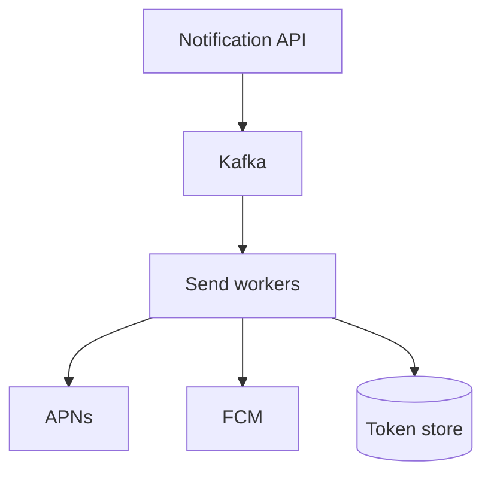
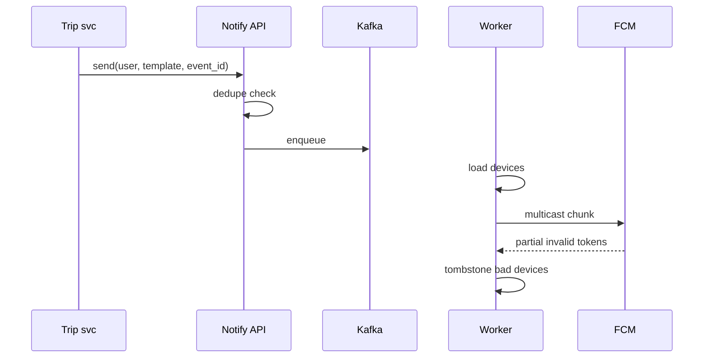

# HLD — Push Notification Service

## 1. Clarify requirements

### 1.0 Live flow

**Opening (~once):** *“I’ll align **transactional vs marketing**, **device tokens**, **priority**, and **delivery guarantees**; then **API**, **queue**, **provider adapters** (APNs/FCM). **Pause after the diagram**—**fan-out**, **privacy**, or **throttling**?”*

**Thinking transitions:** *“Push is **at-most-once** from the provider’s POV—**idempotency** at **our** boundary for **transactional**.”*

### 1.1 Clarify

| Topic | Say it like this in the room |
|--------------------------|-------------------------------|
| **Volume** | “**Marketing blast** vs **trip updates**?” |
| **Personalization** | “Deep links + **payload** size limits?” |
| **Quiet hours** | “**Compliance** by locale?” |
| **Web** | “**Web Push** in scope?” |

### 1.2 Functional requirements (FR)

| FR area | Say it like this |
|---------|-------------------|
| **Register** | “Device **token** per **user** + **platform**.” |
| **Send** | “Single user, **topic**, or **segment**.” |
| **Track** | “Delivered/opened **if** OS provides callbacks.” |

**Cross-ref:** Stock-style alerts — [16-hld-notification-stock-alerts.md](./16-hld-notification-stock-alerts.md); email/SMS — [35-hld-email-sms-notification.md](./35-hld-email-sms-notification.md).

### 1.3 Non-functional requirements (NFR)

| NFR | Say it like this |
|-----|------------------|
| **Latency** | “**Transactional** **seconds** class; **marketing** **minutes** ok.” |
| **Reliability** | “**DLQ** + **retry** with backoff for provider **5xx**.” |

### 1.4 Invariants

**Invariant:** “A **transactional** notification (e.g. **trip assigned**) is **deduped** by **`(user_id, event_id)`** within a **TTL window** so **retries** don’t **spam**.”

| Beat | Say it like this |
|------|------------------|
| **Bridge** | “**API** → **Kafka** → **workers** → **APNs/FCM**.” |
| **Core split** | “**Token registry** vs **send pipeline**.” |

### Key insight (say early)

**Adapter layer** per provider + **central policy** (rate, consent, quiet hours) + **fan-out workers** for **segments**.

#### Key anchors

1. “**Token invalidation** on **410** / **Unregistered**.”  
2. “**Collapse_key** (Android) / **apns-id** (iOS) for **dedupe**.”  
3. “**Consent** gate.”

---

## 2. Estimate scale

| Dimension | Illustrative |
|-----------|----------------|
| Sends / day | **Billions** at mega-scale |
| Fan-out | **Millions** for rare blasts—**partition** topic |

---

## 3. APIs and data model

### 3.1 APIs

| API | Purpose |
|-----|---------|
| `POST /v1/devices` | Register token |
| `POST /v1/notifications` | Enqueue send |
| `POST /v1/topics/{id}/subscribe` | Topic fan-out |

### 3.2 Model

- **Device:** `user_id`, `token`, `platform`, `app_version`, `last_seen`.  
- **NotificationJob:** `id`, `payload_ref`, `priority`, `dedupe_key`.

---

## 4. High-level architecture

### 4.1 Phases

| Phase | Ship |
|-------|------|
| **1** | Single provider + DB tokens |
| **2** | **Priority queues** + **per-tenant** rate |
| **3** | **Geo** routing + **HA** provider pools |

---

## 5. Deep dive: enqueue → provider

### 🎯 Bottleneck Anchor

“**Provider rate limits** + **invalid tokens**—**adaptive** concurrency and **token hygiene**.”

**Taking a stance:** *“**Transactional** path **small** Kafka **priority** topic; **marketing** **separate** cluster/pool so **blast** doesn’t **starve** **trip** pushes.”*

---

## 6. Scaling and bottlenecks

| Risk | Mitigation |
|------|------------|
| **Segment fan-out** | **Pre-materialize** audiences in **batch** |
| **Hot user** many devices | **Cap** devices per send |

---

## 7. Reliability and failure handling

- **Provider outage:** **exponential backoff**; **DLQ** for manual replay.  
- **Duplicate API:** **idempotency key** on `POST /notifications`.

---

## 8. Tradeoffs and alternatives

| Choice | Trade |
|--------|--------|
| **Data in payload** | Rich UX vs **privacy** + size |
| **Pull inbox** | Reliable vs **not native push** |

---

## 9. Monitoring, observability, and security

**Metrics:** **provider** error codes, **latency**, **queue depth**, **invalid token** rate.  
**Security:** **Encrypt** tokens at rest; **no PII** in payload if avoidable; **signed** deep links.

---

## 10. Design patterns, data structures & best practices

| Pattern | Map |
|---------|-----|
| **Adapter** | APNs vs FCM |
| **Outbox** | Trip → notify durable |
| **Bulkhead** | Marketing vs transactional pools |

**Live:** max **four** patterns.

---

## Closing notes

| Do | Avoid |
|----|--------|
| **Dedupe + priority split** | One queue for everything |
| **Token tombstone** | Retry forever on dead token |

---

## Bar-raiser follow-ups

| They ask | Say it like this |
|----------|------------------|
| **Rich media** | “**Attachment** URLs **signed**; **download** on display.” |

---

## 60-second close

| Beat | Say it like this |
|------|------------------|
| **Recap** | “**Token registry**; **Kafka** + **workers**; **provider adapters**; **dedupe** for **transactional**; **separate** pools for **marketing**; **metrics** on **provider errors**.” |

---
