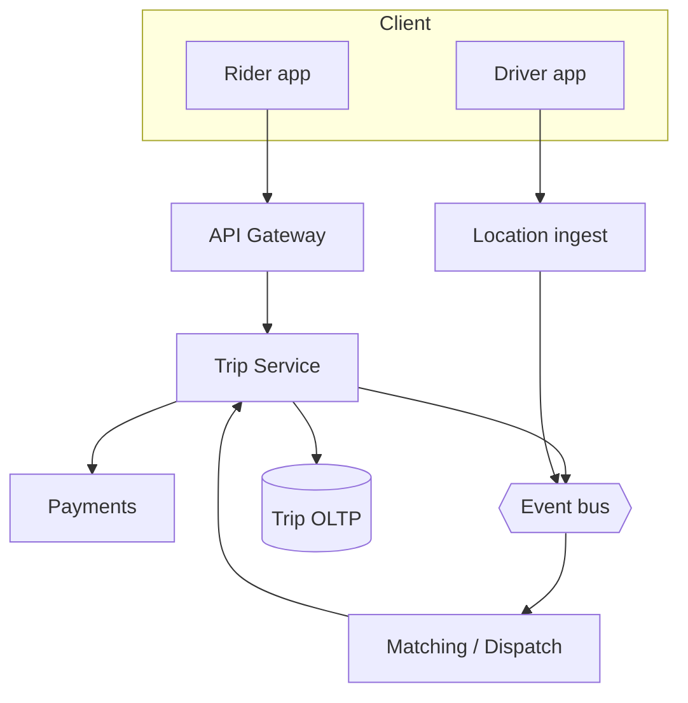
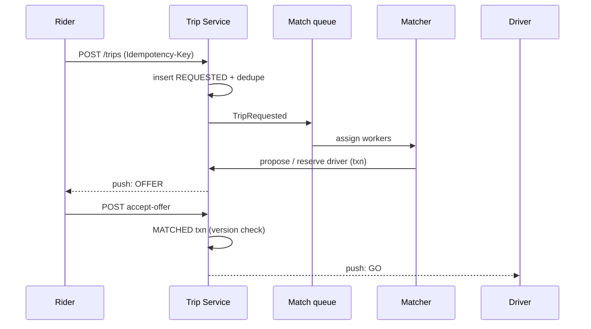

# HLD — Uber Backend / Ride-Sharing Service

## 1. Clarify requirements

### 1.0 Live flow (how to open and steer)

**Opening (~once):** *“I’ll align on **trip lifecycle**, **matching boundary** (in vs out of scope), **payments/fraud**, and **consistency** for *request → offer → accept*; then **scale**, **APIs**, **architecture**, and the **happy path + cancel**. I’ll **pause after the diagram**—depth on **state machine**, **matching handoff**, or **reliability**?”*

**Thinking transitions:** *“**Matching** is usually its own service—I’ll treat **dispatch** as a **client** of this core unless you want it in-box.”* · *“**Accept** has to be **linearizable** enough that we don’t double-book a driver.”*

**Live rule:** **Paraphrase** §1–2 tables; go deep **only if they probe**.

### 1.1 Clarify

| Topic | Say it like this in the room |
|--------------------------|-------------------------------|
| **Scope** | “Are we designing **end-to-end marketplace**—pricing, matching, trip—or the **trip + billing core** with **matching** as a separate box?” |
| **Modes** | “**UberX / Pool / Reserve**—same state machine or different?” |
| **Payments** | “Do I own **auth/capture**, or just **hand off** to Payments with **idempotent** trip ids?” |
| **Regions** | “**Multi-region** active-active, or **primary region** per trip?” |
| **Safety** | “**Share trip**, **emergency**—in scope for APIs or later?” |

**Micro-pauses:** *“So **trip state** is source of truth; **matching** proposes **driver+ETA**; **accept** commits—got it.”*

### 1.2 Functional requirements (FR)

#### Human interaction (FR)

**Habit:** *“**Request**, **offer**, **in progress**, **complete**—money at the boundary.”*

| FR area | Say it like this in the room |
|---------|-------------------------------|
| **Trip** | “Rider **requests** ride with pickup/dropoff; system creates **trip** in `REQUESTED`.” |
| **Matching** | “**Dispatch/matching** returns **candidate driver(s)**; rider **accepts** offer → `MATCHED` / `DRIVER_EN_ROUTE`.” |
| **Lifecycle** | “**Pickup**, **on trip**, **dropoff**, **receipt**; **cancel** with policy.” |
| **Pricing** | “**Fare estimate** may be separate read; **final fare** ties to **metering** rules.” |

**Core**

- Create and track **Trip** with stable `trip_id`, rider, route context, product type, timestamps.  
- Integrate **matching/dispatch** (proposals, driver assignment, ETA updates).  
- Support **cancel** (rider/driver/system) with defined transitions and **fees** if product says so.  
- Emit **events** for analytics, support, downstream billing.

**Out of scope (unless extended)**

- Deep **ML routing** inside matching; **maps** tile serving; **full** payments ledger.

### 1.3 Non-functional requirements (NFR)

#### Human interaction (NFR)

| NFR area | Say it like this in the room |
|----------|-------------------------------|
| **Correctness** | “**One active driver offer** that can **commit**—no silent double-assign.” |
| **Latency** | “**Request** returns fast with **async** matching fan-out; **push** updates for state.” |
| **Availability** | “**Degrade**: show **retry** / **re-match** rather than **lose** trip.” |
| **Durability** | “Trip + money-adjacent fields **durable**; **idempotency** on creates and captures.” |

### 1.4 Invariants

**Invariant:** “A **driver** can have **at most one** **committed** active trip for a given **vehicle session**; **trip state** transitions are **valid** only along the defined **DAG** (no illegal jumps).”

| Beat | Say it like this |
|------|------------------|
| **Bridge** | “**Trip service** owns **state**; **matching** owns **search**; **payments** owns **money**.” |
| **Core split** | “**Write path**: idempotent **request** → **match proposal** → **accept** **transaction**; **read path**: **status** + **ETA** streams.” |

### Key insight (say early)

**Trip state** is the **contract** between rider, driver, and billing; **matching** is **replaceable**; **money** never depends on a **best-effort** cache.

#### Key anchors

1. “**Idempotent** `POST /trips`.”  
2. “**Accept** is the **commit** boundary for driver assignment.”  
3. “**Out-of-band** push (**FCM/APNs**) for state; **client polls** as backup.”  
4. “**Saga** or **choreography** for cancel + payment reversal—define with interviewer.”

---

## 2. Estimate scale

#### Human interaction (estimate scale)

**Habit:** *“**Peaks** around commute; **writes** bursty per city.”*

| Dimension | Illustrative |
|-----------|----------------|
| **Trips/day** | Large metro: **100k–1M+** / day (tune) |
| **State updates** | Many **ETA ticks** / trip—mostly **async** or **throttled** |
| **Read:write** | **Status reads** heavy; **creates** smaller |

**Tie it in one line:** “**Shard** by **region** + **trip_id**; **fan-out** matching workers; **don’t** put **every GPS tick** through the **OLTP** row.”

---

## 3. APIs and data model

#### Human interaction (APIs & data model)

**Habit:** *“Small **command** API; **events** out.”*

### 3.1 APIs (sketch)

| API | Purpose |
|-----|---------|
| `POST /v1/trips` | Idempotent create (client `Idempotency-Key`) |
| `GET /v1/trips/{id}` | Status, driver, fare snapshot |
| `POST /v1/trips/{id}/accept-offer` | Rider accepts proposed match |
| `POST /v1/trips/{id}/cancel` | Cancel with reason |
| `POST /v1/trips/{id}/driver-events` | Pickup started / completed (authZ driver) |

### 3.2 Data model

- **Trip:** `trip_id`, `rider_id`, `driver_id` (nullable until matched), `state`, `product`, `pickup`, `dropoff`, `fare_estimate_id`, `version`, `created_at`.  
- **Assignment / offer:** optional table or embedded **proposal** with TTL.  
- **Event log:** append-only **TripEvent** for audit and replay.

### 3.3 Ownership

| Component | Owns |
|-----------|------|
| **Trip Service** | State machine, idempotency, durable trip |
| **Matching** | Geo search, scoring, offer lifecycle |
| **Payments** | Authorization, capture, disputes |
| **Location** | Raw GPS streams, map-matched traces |

---

## 4. High-level architecture

#### Human interaction (high-level architecture)

| Moment | Say it like this in the room |
|--------|------------------------------|
| **Write** | “**Gateway** → **Trip** persists **REQUESTED** → publishes **TripRequested** → **Matching** workers search.” |
| **Commit** | “**Matching** calls back **ReserveDriver** or **AcceptOffer** **transactionally** with **Trip**.” |
| **Read** | “**ETA** and **map** from **location** pipeline; **trip** reads **denormalized** driver snippet.” |

### 4.1 Phases

| Phase | Ship |
|-------|------|
| **1** | Linear state machine, single-region, sync accept |
| **2** | Async matching queue, offer TTL, idempotent API |
| **3** | Multi-region read replicas, **saga** for payment + cancel |

---

## 5. Deep dive: request → match → accept

#### Human interaction (deep dive)

**Habit:** *“Walk **`POST /trips`** then **accept** like a sequence diagram.”*

### 🎯 Bottleneck Anchor

**Say once:** “**Matching queue depth** + **hot geospatial cells** drive **time-to-first-offer**; **Trip row** contention on **accept** drives **correctness** incidents.”

**Taking a stance:** *“**Optimistic locking** on `trip.version` at **accept**; **matching** uses **short TTL offers** so stale drivers **expire**.”*

### 5.1 Failure modes on path

- **Matcher slow:** rider sees **searching**; **SLO** on time-to-offer; **expand radius** policy.  
- **Double tap accept:** **idempotency** + version.  
- **Driver offline after reserve:** **timeout** → re-offer.

### 5.2 Caching

- **Do not** cache **authoritative** state for **mutations**; **read-through** cache OK for **GET** with **short TTL** + **ETag**.

---

## 6. Scaling and bottlenecks

#### Human interaction (scaling)

| Risk | Mitigation |
|------|------------|
| **Geo hot cells** | Shard matchers by **cell**; **back-pressure** |
| **OLTP hot row** | Minimize columns updated per ETA tick; **separate** **LocationSummary** |
| **Queue lag** | Horizontal workers; **priority** lanes for **almost matched** |

---

## 7. Reliability and failure handling

#### Human interaction (reliability)

- **Partial outage matching:** trips stay **REQUESTED**; **retry** with backoff.  
- **Payments timeout:** **outbox** pattern; **reconcile** job.  
- **Split brain:** prefer **single writer** per `trip_id` (leader partition).

---

## 8. Tradeoffs and alternatives

| Choice | Upside | Downside |
|--------|--------|------------|
| **Sync match** in `POST /trips` | Simple mental model | Bad **p99** at peak |
| **Async match** | Fast return | More **product** complexity (**searching** UX) |
| **Monolith trip+match** | Fewer RPCs | Team + deploy **blast radius** |

---

## 9. Monitoring, observability, and security

**SLIs:** time-to-first-offer, accept **conflict** rate, cancel rate by state, payment **reconciliation** lag.  
**Security:** **AuthZ** on every trip transition; **no IDOR** on `trip_id`; **PII** minimization in logs.

---

## 10. Design patterns, data structures & best practices

| Pattern | Where |
|---------|--------|
| **Saga / outbox** | Trip + payment |
| **State machine** | Trip lifecycle |
| **Partition** | By region / trip_id |
| **Queue** | Match workers |

#### Human interaction (patterns)

**Live:** name **at most four** patterns on the diagram; stop.

---

## Closing notes (where wrap-up human interaction lives)

### Communication (do vs avoid)

| Do | Avoid |
|----|--------|
| **Name matching boundary** | One giant “Uber” box |
| **Idempotency + version** on accept | Hand-wavy “we lock it” |

**60-minute sketch (flex):** clarify+FR+NFR ~8–12 · scale+APIs ~8–12 · architecture ~8–12 · **deep dive ~15–22** · rest ~10–15 · close ~5–8.

---

## Bar-raiser follow-ups

| They ask | Say it like this |
|----------|------------------|
| **Pool** | “Shared **pickup order** + **per-leg** fare allocation—still **one** trip aggregate or **parent/child** trips.” |
| **Cross-region** | “Trip **home region** follows **rider legal** entity; **replicate read** elsewhere.” |

---

## 60-second close

| Beat | Say it like this in the room |
|------|------------------------------|
| **Recap** | “**Trip service** owns **durable state machine**; **matching** **async** proposes; **accept** **txn** + **version**; **payments** **outbox**; scale **geo** + **queues**; **SLIs** on **offer latency** and **accept conflicts**.” |

---
