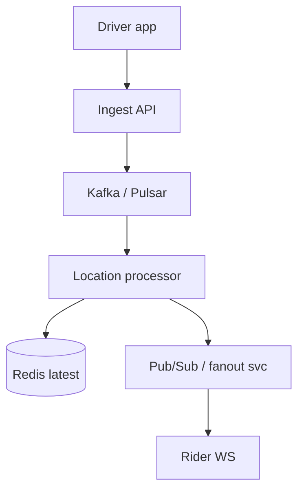
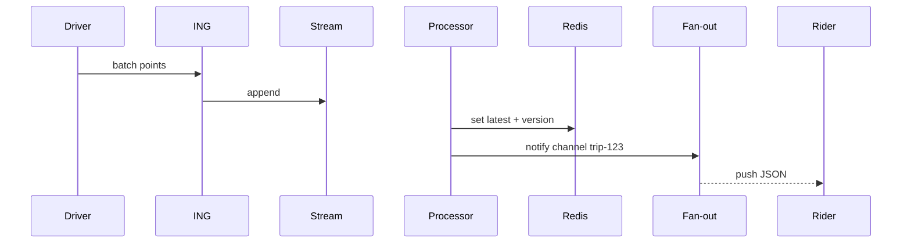

# HLD — Real-Time Driver Tracking System

## 1. Clarify requirements

### 1.0 Live flow

**Opening (~once):** *“I’ll align on **update rate**, **who sees whom** (rider vs ops), **map matching**, and **privacy**; then **ingest**, **fan-out**, **storage**, and **architecture**. **Pause after the diagram**—**WebSockets**, **write path**, or **regional**?”*

**Thinking transitions:** *“Not every **GPS tick** belongs in **OLTP**—**separate hot path** from **trip facts**.”*

### 1.1 Clarify

| Topic | Say it like this in the room |
|--------------------------|-------------------------------|
| **Rate** | “**Hz** from device—1 Hz, 5 Hz—and do we **downsample** server-side?” |
| **Consumers** | “Rider **live map**, **ETA**, **support**, **fraud**—different **SLAs**?” |
| **Accuracy** | “**Snap to road**—in this service or **maps**?” |
| **History** | “How long is **breadcrumb** retention—**minutes** vs **days** (compliance)?” |

### 1.2 Functional requirements (FR)

| FR area | Say it like this |
|---------|-------------------|
| **Ingest** | “Drivers **publish** location updates **authenticated**.” |
| **Distribute** | “Authorized viewers get **near-real-time** position for **active trip**.” |
| **Derive** | “Optional **speed**, **heading**, **on-trip** flag for downstream.” |

**Core**

- Accept high-volume **location events**; validate + **throttle**.  
- **Broadcast** to trip subscribers (rider app, internal tools).  
- Feed **matching** / **ETA** with **latest** snapshot (see also [19-hld-ride-matching-driver-dispatch.md](./19-hld-ride-matching-driver-dispatch.md)).

### 1.3 Non-functional requirements (NFR)

| NFR | Say it like this |
|-----|------------------|
| **Latency** | “End-to-end **< few seconds** worst case for rider map (confirm).” |
| **Scale** | “**Many** concurrent trips × **update rate**—**partition** by **trip** or **driver**.” |
| **Privacy** | “**Only** parties with **trip relationship**; **TTL** on history.” |

### 1.4 Invariants

**Invariant:** “A **location sample** is **delivered** only to **clients authorized** for that **driver+t** context (active trip or ops role); **PII** **minimized** in fan-out payloads.”

| Beat | Say it like this |
|------|------------------|
| **Bridge** | “**Ingest** cheap; **fan-out** bounded per **trip**.” |
| **Core split** | “**Hot path** = append/stream; **cold** = aggregates + compliance export.” |

### Key insight (say early)

**Decouple** high-frequency **telemetry** from **transactional trip DB**—use **stream + short-lived store + pub/sub**.

#### Key anchors

1. “**WebSocket / MQTT** to viewers; **gRPC** internal.”  
2. “**Last-known** in **Redis**; **Kafka** for analytics.”  
3. “**Region-local** ingest.”

---

## 2. Estimate scale

| Dimension | Illustrative |
|-----------|----------------|
| Updates / sec / region | **100k–1M+** at Uber-scale discussion |
| Subscribers / trip | Small (1–5) |
| Payload | **Tens of bytes** compressed |

---

## 3. APIs and data model

### 3.1 APIs

| API | Purpose |
|-----|---------|
| `POST /v1/locations/batch` | Driver upload (batched points) |
| `GET /v1/ws/trips/{trip_id}` | Upgrade to WS for rider |
| `GET /v1/drivers/{id}/latest` | Internal snapshot |

### 3.2 Model

- **LocationEvent:** `driver_id`, `trip_id?`, `ts`, `lat`, `lng`, `accuracy`, `heading`.  
- **LatestSnapshot:** key `driver_id` → last event + **version**.

---

## 4. High-level architecture

### 4.1 Phases

| Phase | Ship |
|-------|------|
| **1** | HTTP batch + long poll |
| **2** | WS + Redis latest + Kafka |
| **3** | Edge POP ingest, regional fan-out |

---

## 5. Deep dive: ingest → fan-out

### 🎯 Bottleneck Anchor

“**Fan-out service** connection count and **Kafka consumer lag**—not raw **ingress** bandwidth alone.”

**Taking a stance:** *“**Coalesce** updates **per trip** to e.g. **2–5 Hz** viewer effective rate even if ingest is higher.”*

---

## 6. Scaling and bottlenecks

| Risk | Mitigation |
|------|------------|
| **WS connection storms** | **Shard** connection gateways; **STUN**/edge |
| **Hot trip** | **Channel** per trip; **cap** message rate |
| **Lag** | **Monitor consumer lag**; **scale** LP |

---

## 7. Reliability and failure handling

- **At-least-once** ingest → **idempotent** write by `(driver_id, seq)`.  
- **Viewer reconnect:** send **last-known** from Redis then **live**.  
- **Partition:** **sticky routing** for WS.

---

## 8. Tradeoffs and alternatives

| Choice | Trade |
|--------|--------|
| **Kafka vs Redis streams** | Durability vs simplicity |
| **Map on device vs server** | Battery vs consistency |

---

## 9. Monitoring, observability, and security

**Metrics:** ingest RPS, **end-to-end latency** (sample timestamp → rider receive), WS **drop rate**, **authz** denials.  
**Security:** **mTLS** or signed tokens; **trip-scoped** channels.

---

## 10. Design patterns, data structures & best practices

| Pattern | Where |
|---------|--------|
| **CQRS** | Telemetry vs trip OLTP |
| **Pub/sub** | Trip channel |
| **Rate limit** | Per driver |

**Live:** max **four** patterns on diagram.

---

## Closing notes

| Do | Avoid |
|----|--------|
| **Separate hot path** | Every GPS in SQL row |
| **AuthZ on subscribe** | Public driver id channels |

---

## Bar-raiser follow-ups

| They ask | Say it like this |
|----------|------------------|
| **Ghost locations** | “**Kalman** / map-match **downstream**; flag **spoof** for fraud.” |
| **Global trip** | “**Roaming**—handoff **region** with **session** token.” |

---

## 60-second close

| Beat | Say it like this |
|------|------------------|
| **Recap** | “**Batch ingest** → **stream** → **latest in Redis** → **WS fan-out** by **trip**; **not OLTP**; **lag** + **connection** SLIs; **privacy** scoped to **relationship**.” |

---
