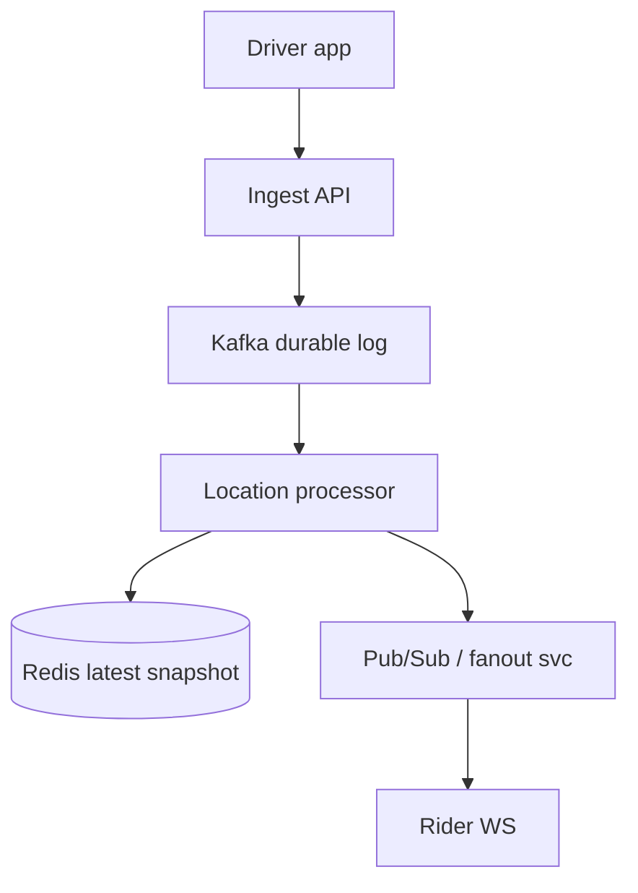
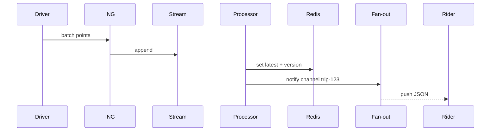

# HLD — Real-Time Driver Tracking System

## 1. Clarify requirements

### 1.0 Live flow

**Opening (~once):** *“I’ll align on **update rate**, **who sees whom** (rider vs ops), **map matching**, and **privacy**; then **ingest**, **fan-out**, **storage**, and **architecture**. **Pause after the diagram**—**WebSockets**, **write path**, or **regional**?”*

**Thinking transitions:** *“Not every **GPS tick** belongs in **OLTP**—**separate hot path** from **trip facts**.”*

**Live rule:** Paraphrase tables; deep on **fan-out** or **consistency** only if steered.

**User journey (once):** say [👤 User journey](#user-journey-framing) **before** the architecture diagram.

### 1.1 Clarify

| Topic | Say it like this in the room |
|--------------------------|-------------------------------|
| **Rate** | “**Hz** from device—1 Hz, 5 Hz—and do we **downsample** server-side?” |
| **Consumers** | “Rider **live map**, **ETA**, **support**, **fraud**—different **SLAs**?” |
| **Accuracy** | “**Snap to road**—in this service or **maps**?” |
| **History** | “How long is **breadcrumb** retention—**minutes** vs **days** (compliance)?” |

### 1.2 Functional requirements (FR)

| FR area | Say it like this |
|---------|-------------------|
| **Ingest** | “Drivers **publish** location updates **authenticated**.” |
| **Distribute** | “Authorized viewers get **near-real-time** position for **active trip**.” |
| **Derive** | “Optional **speed**, **heading**, **on-trip** flag for downstream.” |

**Core**

- Accept high-volume **location events**; validate + **throttle**.  
- **Broadcast** to trip subscribers (rider app, internal tools).  
- Feed **matching** / **ETA** with **latest** snapshot (see also [19-hld-ride-matching-driver-dispatch.md](./19-hld-ride-matching-driver-dispatch.md)).

### 1.3 Non-functional requirements (NFR)

| NFR | Say it like this |
|-----|------------------|
| **Latency** | “End-to-end **< few seconds** worst case for rider map (confirm).” |
| **Scale** | “**Many** concurrent trips × **update rate**—**partition** by **trip** or **driver**.” |
| **Privacy** | “**Only** parties with **trip relationship**; **TTL** on history.” |

### 1.4 Invariants

**Invariant:** “A **location sample** is **delivered** only to **clients authorized** for that **driver+t** context (active trip or ops role); **PII** **minimized** in fan-out payloads.”

| Beat | Say it like this |
|------|------------------|
| **Bridge** | “**Ingest** cheap; **fan-out** bounded per **trip**.” |
| **Core split** | “**Hot path** = append/stream; **cold** = aggregates + compliance export.” |

### Key insight (say early)

**Decouple** high-frequency **telemetry** from **transactional trip DB**—use **durable append log + latest snapshot + pub/sub**; **location** is **eventually consistent**—see [⚖️ Consistency Model](#consistency-model-anchor).

#### Key anchors

1. “**WebSocket / MQTT** to viewers; **gRPC** internal.”  
2. “I’d **default to Kafka** (or Pulsar) for the **location event log**—**durability**, **replay**, **analytics** consumers; **Redis only** for **latest snapshot** + fast read path—not as the **system of record** for history.”  
3. “**Region-local** ingest; **backpressure** when spikes hit—see [🚦 Backpressure](#backpressure-handling).”

---

## 2. Estimate scale

| Dimension | Illustrative |
|-----------|----------------|
| Updates / sec / region | **100k–1M+** at Uber-scale discussion |
| Subscribers / trip | Small (1–5) |
| Payload | **Tens of bytes** compressed |

---

## 3. APIs and data model

### 3.1 APIs

| API | Purpose |
|-----|---------|
| `POST /v1/locations/batch` | Driver upload (batched points) |
| `GET /v1/ws/trips/{trip_id}` | Upgrade to WS for rider |
| `GET /v1/drivers/{id}/latest` | Internal snapshot |

### 3.2 Model

- **LocationEvent:** `driver_id`, `trip_id?`, `ts`, `lat`, `lng`, `accuracy`, `heading`.  
- **LatestSnapshot:** key `driver_id` → last event + **version**.

---

## 👤 User Journey (say once early)

**Say it once early** (before or right after the [architecture diagram](#4-high-level-architecture)):

*“From the **product** side:

**Driver sends location updates** → the system **ingests** and **processes** them → the **latest** position is **stored** → the **rider sees real-time movement** on the map.

So:
- **Write path** = **location ingestion** (validate, authenticate, accept batch)
- **Stream path** = **processing** + **distribution** (consume log, update snapshot, notify fan-out)
- **Read path** = **fan-out** to **authorized viewers** (WS / poll), always scoped to **trip** context”*

👉 **Intuitive** before you draw **Kafka**, **Redis**, and **WS**.

---

## ⚖️ Consistency Model

**Bar Raiser:** *“Is location **strongly** consistent?”*

**Say clearly:**

**Location tracking is eventually consistent.** We optimize for:

- **Freshness** over **strict global ordering** of every point  
- **Latest snapshot** over **perfect historical** replay on the **hot path** (history lives in the **log/lake** with its own SLOs)

**Trip state** (assignment, phase, fare contract) stays **strongly consistent** in **Trip service**—see [18-hld-uber-ride-sharing-backend.md](./18-hld-uber-ride-sharing-backend.md). **Do not** conflate **map pin freshness** with **trip lifecycle correctness**.

**One-liner:** *“**Pin** can lag **seconds**; **‘you have a driver’** cannot be a **cache guess**.”*

---

## 🚦 Backpressure Handling

**If ingest rate spikes** (burst GPS, bad client loop, viral event):

- **Drop or downsample** **intermediate** points—keep **monotonic ‘latest wins’** semantics per `driver_id` / trip.  
- **Prioritize latest location** on the **snapshot** path over persisting **every** sub-second sample to **all** sinks.  
- **Protect fan-out latency** (rider **p99**) over **full** history on the **real-time** pipe—**extra** detail can land in **cold** storage **async**.

👉 Signals **streaming maturity**: **shed** work **gracefully**, don’t **queue unbounded** until the **WS tier** dies.

---

## 👤 UX Awareness

If updates are **delayed**, the rider should still see **last-known** position and a **clear loading / “catching up”** state—**not** a **blank map**, a **jumping pin** with no context, or a **silent** freeze. **Reconnect** = **last-known** from snapshot, then **live** tail—aligns with [§7](#7-reliability-and-failure-handling).

---

## 4. High-level architecture

#### Human interaction (high-level architecture)

| Moment | Say it like this in the room |
|--------|------------------------------|
| **User journey** | “Same beat as [👤 User journey](#user-journey-framing): **driver emits → ingest → process → latest → rider map**.” |
| **Stores** | “**Kafka** = **durable** event log + replay; **Redis** = **latest snapshot** only—[Key anchors](#key-insight-say-early).” |
| **Consistency** | “[⚖️ Location is eventual](#consistency-model-anchor); **Trip** stays **strong** elsewhere.” |
| **Spikes** | “[🚦 Backpressure](#backpressure-handling)—downsample, **latest wins**, protect **WS**.” |

**Default stance:** **Kafka** for the log (**Pulsar** acceptable same role); **not** “Redis Streams as primary history” unless scope is **tiny**—say why if you diverge.

### 4.1 Phases

| Phase | Ship |
|-------|------|
| **1** | HTTP batch + long poll |
| **2** | WS + **Redis latest** + **Kafka** log (**default** split: durability vs snapshot) |
| **3** | Edge POP ingest, regional fan-out |

---

## 5. Deep dive: ingest → fan-out

#### Human interaction (deep dive)

**Habit:** *“Walk **ingest → log → snapshot → push**; name [⚖️ eventual](#consistency-model-anchor) + [🚦 backpressure](#backpressure-handling) if they push.”*

### 🎯 Bottleneck Anchor

“**Fan-out service** connection count and **Kafka consumer lag**—not raw **ingress** bandwidth alone.”

**Taking a stance:** *“**Coalesce** updates **per trip** to e.g. **2–5 Hz** viewer effective rate even if ingest is higher—that’s **backpressure** on the **fan-out** path, not ‘losing’ the driver.”*

---

## 6. Scaling and bottlenecks

| Risk | Mitigation |
|------|------------|
| **WS connection storms** | **Shard** connection gateways; **STUN**/edge |
| **Hot trip** | **Channel** per trip; **cap** message rate |
| **Lag** | **Monitor consumer lag**; **scale** LP |
| **Ingest storm** | [🚦 Downsample / latest wins](#backpressure-handling); **cap** queue depth at ingest |

---

## 7. Reliability and failure handling

- **At-least-once** ingest → **idempotent** write by `(driver_id, seq)`.  
- **Viewer reconnect:** send **last-known** from Redis then **live**—[👤 UX Awareness](#ux-awareness).  
- **Partition:** **sticky routing** for WS.  
- **Processor overload:** apply [🚦 Backpressure](#backpressure-handling); never **unbounded** RAM on fan-out.

---

## 8. Tradeoffs and alternatives

| Choice | Trade |
|--------|--------|
| **Kafka (default) vs Redis Streams as primary log** | **Kafka**: durability + replay + many consumers; **Redis Streams** only if **small** scale / ops simplicity—**Redis** stays **latest snapshot** in the **default** story |
| **Map on device vs server** | Battery vs consistency |

---

## 9. Monitoring, observability, and security

**Metrics:** ingest RPS, **end-to-end latency** (sample timestamp → rider receive), WS **drop rate**, **authz** denials.  
**Security:** **mTLS** or signed tokens; **trip-scoped** channels.

---

## 10. Design patterns, data structures & best practices

| Pattern | Where |
|---------|--------|
| **CQRS** | Telemetry vs trip OLTP |
| **Pub/sub** | Trip channel |
| **Rate limit** | Per driver |

**Live:** max **four** patterns on diagram.

---

## Closing notes

| Do | Avoid |
|----|--------|
| **Separate hot path** | Every GPS in SQL row |
| **AuthZ on subscribe** | Public driver id channels |
| **[⚖️ Say eventual for pins](#consistency-model-anchor)** | Pretend map == **trip** **strong** consistency |
| **[👤 Last-known + loading](#ux-awareness)** | Blank map on slow tail |

---

## Bar-raiser follow-ups

| They ask | Say it like this |
|----------|------------------|
| **Ghost locations** | “**Kalman** / map-match **downstream**; flag **spoof** for fraud.” |
| **Global trip** | “**Roaming**—handoff **region** with **session** token.” |
| **Strong vs eventual** | “[⚖️ Pins eventual](#consistency-model-anchor); **Trip** **strong** for lifecycle.” |
| **Burst traffic** | “[🚦 Downsample, latest wins, protect fan-out](#backpressure-handling).” |

---

## 60-second close

| Beat | Say it like this |
|------|------------------|
| **Recap** | “**User journey**: **driver emits → ingest → process → latest → rider map**. **Write / stream / read** split. **Default: Kafka** = durable log + replay; **Redis** = **latest snapshot** only. [⚖️ **Location eventual**](#consistency-model-anchor); **Trip** **strong** elsewhere. [🚦 **Backpressure**](#backpressure-handling): downsample, **latest wins**, protect **WS**. [👤 **UX**](#ux-awareness): **last-known** + loading, not blank. **SLIs**: fan-out **p99**, consumer **lag**, drops.” |

---
