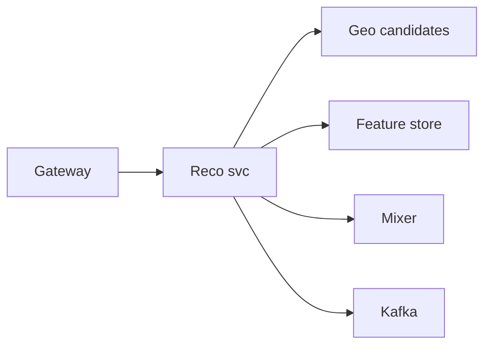
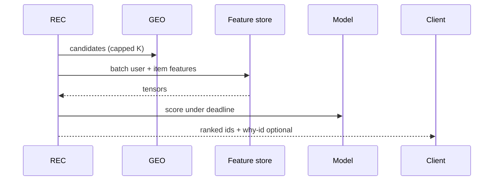

# HLD — Restaurant Recommendation System Based on User Location

## 1. Clarify requirements

### 1.0 Live flow (how to open and steer)

**Opening (~once):** *“I’ll treat this as **ranking under latency**: **geo eligibility**, **personalization**, **cold start**, **experiments**; then **features**, **serving**, **architecture**. **Pause after the diagram**—**features**, **fairness**, or **infra**?”*

**Thinking transitions:** *“Same **read funnel** as homepage—**candidates** capped before **model**.”* (See [11-hld-uber-eats-homepage.md](./11-hld-uber-eats-homepage.md).)

**Live rule:** **Paraphrase** §1–2 tables; don’t read every row. Go deep **only if they probe**.

**When (HLD clock):** the **user-journey script** lives **[just above §4](#user-journey-reco-25)**—say it **once** immediately **before** the architecture diagram so the feed is **user-first**. Optional: **one clause** in clarify if you opened model-first.

### 1.1 Clarify

| Topic | Say it like this in the room |
|--------------------------|-------------------------------|
| **Surface** | “**Home rail**, **search zero-query**, **email**—which?” |
| **Objective** | “**GMV**, **CTR**, **diversity**?” |
| **Privacy** | “**Precise** lat vs **neighborhood** features?” |
| **Sponsored** | “**Mixer** slot?” |

**Micro-pauses:** *“So **retrieval** is **geo candidates**, **rank** is **model + mixer**, and **correctness** is **eligibility**—got it.”*

### 1.2 Functional requirements (FR) — after alignment, say this as "what we must build"

| FR area | Say it like this |
|---------|-------------------|
| **Candidates** | “From **geo index**, pull **eligible** restaurants in **radius/cells**.” |
| **Features** | “User history, **context** (time, weather), **distance**, **popularity**, **merchant** quality.” |
| **Rank** | “Score + **mixer** + **diversity** constraints.” |
| **Log** | “**Impression/click** for **training** and **fairness** audits.” |

### 1.3 Non-functional requirements (NFR) — say as "how it must behave"

| NFR | Say it like this |
|-----|------------------|
| **Latency** | “**Time-box** rank; **fallback** to **distance + popularity**.” |
| **Freshness** | “**Feature** lag **seconds–minutes** acceptable for many signals.” |

### 1.4 Invariants

**Invariant:** “**Recommended** restaurants are always **hard-eligible** to serve the user’s **delivery context**; **rank order** may degrade.”

## ⚖️ Consistency Model

Bar-raiser thread: *“**How fresh** are recommendations?”*

Say it like this:

*“Recommendations are **eventually consistent**:

- **Eligibility** is **always correct** (hard filter—never **ML-overridden**).  
- **Features** may be **slightly stale** (**seconds–minutes**) for many signals—**bounded** and **observed**.  
- **Model outputs** are designed to **tolerate** that lag (**fallback** ranker, **time-box**, **versioned** features).”*

**Purpose:** no second “clarify lecture”—only the **handoff** from answers → design.

| Beat | Say it like this |
|------|------------------|
| **Bridge** | “**I’d start with GBDT** for **interpretability** and **shipping** speed; **move to two-tower** at **scale** when **retrieval** + **embedding** efficiency dominates—**serving** shape (**cap K → features → score → mixer**) stays the same.” |
| **Core split** | “**Offline training** vs **online feature log** vs **real-time** retrieval.” |

### Key insight (say early)

**Location** enters as **both hard filter** and **soft feature**—never let model **override** **ineligibility**.

#### Key anchors

1. “**Cap K**.”  
2. “**Feature store** with **point-in-time** correctness story.”  
3. “**Exploration** slots.”

---

## 2. Estimate scale

| Dimension | Illustrative |
|-----------|----------------|
| Rank QPS | Same order as **homepage** reads |
| Feature cardinality | **High**—**sparse** embeddings |

---

## 3. APIs and data model

### 3.1 APIs

| API | Purpose |
|-----|---------|
| `GET /v1/reco/restaurants?lat=&lng=&user_id=` | Ranked list |
| `POST /v1/reco/events` | Impression/click (async) |

### 3.2 Features (examples)

- **Geo:** distance, cell id, **traffic** band.  
- **User:** **order history**, dietary, **LTV**.  
- **Item:** rating, **prep time**, **popularity**, **new** flag.

---

## 4. High-level architecture

### 👤 User journey (say once—before this diagram)

*“**User opens app** → system **fetches nearby** restaurants → **filters eligible** → **ranks** with **personalization** → **returns feed**.

So:

- **retrieval** = **geo** candidates  
- **ranking** = **ML** + **mixer**  
- **correctness** = **eligibility**.”*

---

### 4.1 Phases

| Phase | Ship |
|-------|------|
| **1** | Heuristic rank |
| **2** | **GBDT** + logged **features** + **batch** train (default **interpretable** path) |
| **3** | **Two-tower** + **online** learning (**after** GBDT baseline proves **traffic**) |

---

## 👤 UX Awareness

If the feed feels **repetitive** or **biased**, **trust** drops—so we **enforce** **diversity** and **exploration** slots in the **mixer** (and **watch** impression share for **cold** merchants). Pair with **transparent** “why” only if product wants it—**never** at the cost of **p99**.

---

## 5. Deep dive: rank request

### 🎯 Bottleneck Anchor

“**Feature fetch fan-out** (K × features) and **model p99**—**batch** embeddings, **deadline** + **fallback**.”

---

## 6. Scaling and bottlenecks

| Risk | Mitigation |
|------|------------|
| **Hot user** | **Cache** user embedding |
| **Model OOM** | **Bulkhead** + **fallback** ranker |

---

## 7. Reliability and failure handling

- **Feature store miss:** **default** features; **down-rank** unknowns.  
- **Model timeout:** **heuristic** sort.

---

## 8. Tradeoffs and alternatives

| Choice | Trade |
|--------|--------|
| **Heavy personalization** | Engagement vs **filter bubble** |
| **GBDT → two-tower** | **GBDT** first for **debuggability** / **ops**; **two-tower** when **candidate scale** + **latency** force **approximate** retrieval—**cost** is **complexity** + **freshness** of **cross** terms |

---

## 9. Monitoring, observability, and security

**Metrics:** **p99** rank latency, **fallback** rate, **new merchant** impression share, **CTR** slice by **distance decile**.  
**Security:** **No** cross-user **feature** leaks; **PII** in **feature store** encrypted.

---

## 10. Design patterns, data structures & best practices

| Pattern | Map |
|---------|-----|
| **Mixer** | Sponsored + organic |
| **Bandits** | Exploration |
| **Cache-aside** | Hot features |

**Live:** max **four** patterns.

---

## Closing notes (where wrap-up human interaction lives)

Endgame is **short**, **confident**, and **conversational**: drive the wrap from [Bar-raiser](#bar-raiser-follow-ups), [Communication (do vs avoid)](#communication-do-vs-avoid), and [60-second close](#60-second-close)—not a second full design pass.

### Communication (do vs avoid)

| Do (sounds senior) | Avoid (sounds rehearsed) |
|--------------------|---------------------------|
| **Eligibility before model** | “ML fixes bad zone” |
| **Time-box** | 10 min on **embedding dim** |

---

## Bar-raiser follow-ups

| They ask | Say it like this |
|----------|------------------|
| **Counterfactual** | “**Logging policy** bias—**IPS** corrections / **randomized** buckets.” |
| **How fresh is reco?** | “[Consistency model](#consistency-model-reco-25): **eligibility** strict; **features** **seconds–minutes** stale **bounded**; **fallback** + **deadline**.” |
| **Filter bubble** | “[UX awareness](#ux-awareness-reco-25): **diversity** + **exploration** in **mixer**, **metrics** on **share**.” |

---

## 60-second close

| Beat | Say it like this |
|------|------------------|
| **Recap** | “**Journey**: open → nearby → **eligible** → rank → feed. **Consistency**: **hard eligibility**; **feature lag** OK **bounded**; **tolerate** in model + **fallback**. **Model path**: **GBDT** first → **two-tower** at scale. **UX**: **diversity** / **exploration** for **trust**.” |

---
