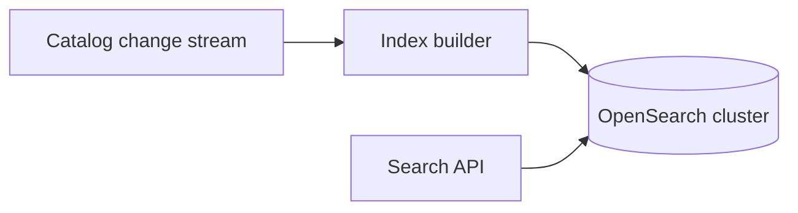
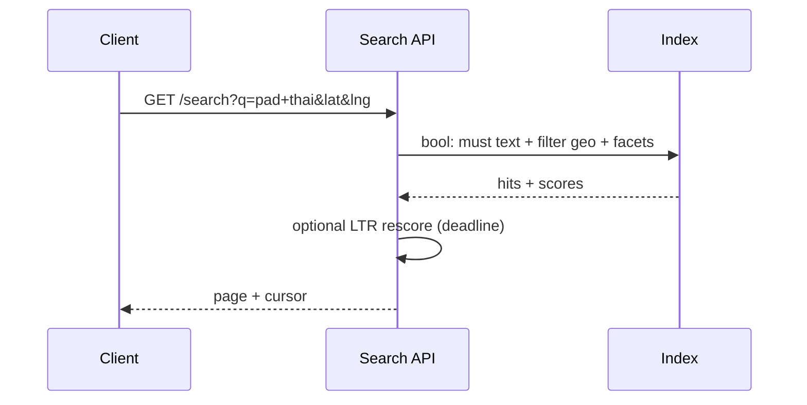

# HLD — Restaurant Search (Nearby Restaurants Service)

<a id="interview-spine-nine-steps"></a>

## 1. Clarify requirements

### 1.0 Live flow

<a id="live-flow-open"></a>

**Opening (~once):** *“I’ll separate **keyword + facets** from **geo filter**; align on **open now**, **sort** (distance vs relevance), and **pagination**; then **index**, **query path**, **architecture**. **Pause after the diagram**—**inverted index**, **geo**, or **ranking**?”*

**Thinking transitions:** *“**Search** is not `LIKE` in SQL—**OpenSearch**-shaped at scale.”*

<a id="say-1-questions-human"></a>
### 1.1 Clarify

| Topic | Say it like this in the room |
|--------------------------|-------------------------------|
| **Language** | “**Stemming**, **synonyms** (cuisine aliases)?” |
| **Geo** | “**Radius** vs **polygon** delivery zone?” |
| **Sort** | “**Best match** vs **distance** default?” |
| **Sponsored** | “**Ad** injection point?” |

### 1.2 Functional requirements (FR)

<a id="say-fr-human"></a>

| FR area | Say it like this |
|---------|-------------------|
| **Query** | “Text + optional **filters**: cuisine, price, rating, fee, open.” |
| **Geo** | “Results constrained to **serviceable** from user point.” |
| **Snippets** | “Return **card** fields for list UI.” |
| **Pagination** | “**Keyset** by `(score, id)` or `(distance, id)`.” |

### 1.3 Non-functional requirements (NFR)

| NFR | Say it like this |
|-----|------------------|
| **Latency** | “**p99** **sub-200ms** typical target (confirm)—**cache** hot queries.” |
| **Recall** | “**Synonym** and **fuzzy** configurable.” |

### 1.4 Invariants

**Invariant:** “Every hit satisfies **geo + eligibility** predicates attached to the **query**; **relevance score** never **bypasses** those filters.”

<a id="say-voice-1"></a>

| Beat | Say it like this |
|------|------------------|
| **Bridge** | “**Inverted index** for text; **spatial** filter for geo; **join** on **restaurant id**.” |
| **Core split** | “**Index build** offline/nearline; **serving** **stateless**.” |

<a id="key-insight-say-early"></a>
### Key insight (say early)

**Unified document** per restaurant in the search index: **text fields**, **facets**, **geo point**, **hours**, **popularity** denorm—**one query** to **serving**.

#### Key anchors

1. “**Geo prefilter** or **combined** field—pick one and defend **latency**.”  
2. “**Replication** per region.”  
3. “**Personalization** as **rescore** layer optional.”

---

## 2. Estimate scale

<a id="say-voice-2"></a>

| Dimension | Illustrative |
|-----------|----------------|
| Documents | **Millions** restaurants + dishes optional |
| QPS | **High** at meal peaks |

---

## 3. APIs and data model

<a id="say-voice-3"></a>

### 3.1 APIs

| API | Purpose |
|-----|---------|
| `GET /v1/search/restaurants?q=&lat=&lng=&filters...&cursor=` | List |
| `GET /v1/search/suggest?q=` | Typeahead (see [27-hld-search-autocomplete.md](./27-hld-search-autocomplete.md)) |

### 3.2 Index document (conceptual)

```json
{
  "restaurant_id": "r1",
  "name": "…",
  "cuisines": ["thai"],
  "location": {"lat": 0, "lng": 0},
  "rating": 4.7,
  "delivery_zone_ids": ["z42"],
  "popularity": 0.83,
  "open_now": true
}
```

---

## 4. High-level architecture

<a id="say-voice-4"></a>



### 4.1 Phases

| Phase | Ship |
|-------|------|
| **1** | Single shard + basic BM25 |
| **2** | Geo + facets + **Learning-to-rank** rescore |
| **3** | **Per-market** indices + **federation** |

---

## 5. Deep dive: query execution

<a id="say-voice-5"></a>

<a id="bottleneck-anchor-once"></a>
### 🎯 Bottleneck Anchor

“**Post-filter geo** that kills recall vs **indexed geo**—measure **latency** and **quality**.”



**Taking a stance:** *“**Filter context** first (**geo + open**), **should** text inside—**prevents** far-away viral names.”*

---

## 6. Scaling and bottlenecks

| Risk | Mitigation |
|------|------------|
| **Hot query** | **CDN** for **zero-query** nearby; **query cache** |
| **Large fanout** | **Replica** scale; **routing** shards |

---

## 7. Reliability and failure handling

- **Index lag:** **stale** ok if **labeled**; **hard** errors **fallback** to **geo-only** list from [11-hld-uber-eats-homepage.md](./11-hld-uber-eats-homepage.md) path.

---

## 8. Tradeoffs and alternatives

| Choice | Trade |
|--------|--------|
| **OpenSearch vs Elastic** | Ops vs features |
| **Separate dish index** | Recall vs **complexity** |

---

## 9. Monitoring, observability, and security

**Metrics:** **null results** rate, **p99**, **click position**, **index lag**.  
**Security:** **Query injection** safe via **parameterized** DSL; **rate limit** abuse.

---

## 10. Design patterns, data structures & best practices

| Pattern | Map |
|---------|-----|
| **CDC** | Catalog → index |
| **CQRS** | OLTP vs search doc |

<a id="say-voice-10"></a>
**Live:** max **four** patterns.

---

## Closing notes

<a id="communication-do-vs-avoid"></a>

| Do | Avoid |
|----|--------|
| **Unified doc** | Join explosion at query time |
| **Keyset pagination** | Offset on deep pages |

---

## Bar-raiser follow-ups

| They ask | Say it like this |
|----------|------------------|
| **Typo-tolerance** | “**Edge n-grams** + **fuzziness** cap for **p99**.” |

---

## 60-second close

| Beat | Say it like this |
|------|------------------|
| **Recap** | “**Search index doc** = text + facets + geo; **query** = filter + BM25 + optional **LTR**; **CDC** from catalog; **bottleneck** **post-filter** vs **indexed geo**; **cross-ref** **15** for **message** search.” |

---
