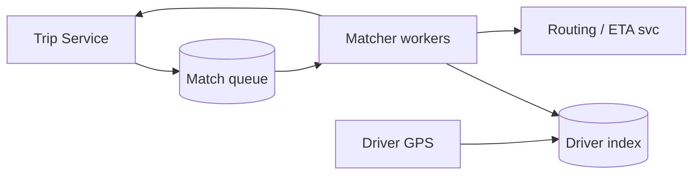
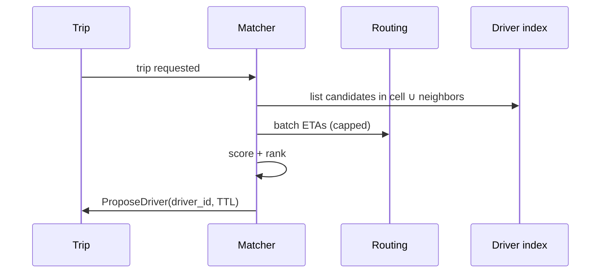

# HLD — Ride Matching / Driver Dispatch System

## 1. Clarify requirements

### 1.0 Live flow

**Opening (~once):** *“I’ll align **objective** (**ETA vs earnings**), **surge** as input, **fairness**, and **latency SLO**; I’ll **default** to **streaming greedy** matching and only add **batch** reassignment if **throughput/optimality** goals force it. Then **scale**, **geo structures**, **architecture**, **one match cycle**. **Pause after the diagram**—**scoring**, **rebalance**, or **load**?”*

**Thinking transitions:** *“This is an **online optimization** problem under **latency SLO**—I’ll **cap candidates** before scoring.”*

**Live rule:** Paraphrase tables; deep on **geo + scoring** only if steered.

**User journey (once):** say [👤 User journey](#user-journey-framing) **before** the architecture diagram so the room hears **product** before boxes.

### 1.1 Clarify

| Topic | Say it like this in the room |
|--------------------------|-------------------------------|
| **Objective** | “Minimize **ETA**, maximize **throughput**, or **blend**—what’s the **default**?” |
| **Batching** | “I’d **default streaming greedy** for **p99**—do you need **periodic batch** reassignment for **global** optimality, or is **continuous** re-offer enough?” |
| **Surge** | “Is **surge** an **input feature** only, or does it change **search radius**?” |
| **Pool** | “**Shared rides** change matching—**in scope**?” |
| **Fairness** | “**Driver starvation**—do we need **rotation** or **throttle** repeat declines?” |

### 1.2 Functional requirements (FR)

#### Human interaction (FR)

| FR area | Say it like this in the room |
|---------|-------------------------------|
| **Ingest** | “**Open trips** + **available drivers** stream into the **matcher**.” |
| **Match** | “Produce **ordered offers** or **single best** driver per trip within **SLO**.” |
| **Rebalance** | “**Reassignment** if driver cancels or stalls—define policy.” |
| **Feedback** | “**Accept / reject / timeout** events train **ranker**.” |

**Core**

- Index **available drivers** by location + product capability.  
- For each **trip request** (**streaming** path by default), select **K candidates**, **score**, emit **offer(s)** with **TTL**; optional **batch** reassignment windows only if product/ops want **pooled** optimization.  
- Handle **driver going offline**, **timeout**, **rider cancel**.

### 1.3 Non-functional requirements (NFR)

| NFR | Say it like this |
|-----|------------------|
| **Latency** | “**p99** for **candidate gen** + **score** bounded—e.g. **<100–200ms** per cycle (confirm).” |
| **Scale** | “Many **concurrent** trips per **cell**; **horizontal** matchers.” |
| **Fairness** | “Avoid **always same** driver wins if product cares.” |

### 1.4 Invariants

**Invariant:** “Every **offer** references a **driver** who was **available** at **offer creation** per our **snapshot** rules; **commit** is **exclusive** (one winning assignment per driver per policy).”

| Beat | Say it like this |
|------|------------------|
| **Bridge** | “**Geo index** → **cap K** → **score** → **offer TTL**.” |
| **Core split** | “**Search** is cheap-ish at K; **scoring** is where models live.” |

### Key insight (say early)

**Cap candidates before expensive scoring**; treat matching as **continuous online** (**default: streaming greedy**) reassignment with a **hard commit boundary**: **matcher proposes → Trip commits** (see [🔒 Commit Boundary](#commit-boundary-anchor)).

#### Key anchors

1. “**Geohash / S2 / H3** cells + **neighbor** lookup.”  
2. “I’d **default streaming greedy** for **latency**; add **batching** only when **optimization** goals (throughput, pooled reassignment) **clearly** justify the **wait** and **complexity**.”  
3. “**TTL offers** + **idempotent** reserve RPC to Trip.”

---

## 2. Estimate scale

| Dimension | Illustrative |
|-----------|----------------|
| Active drivers / metro | **10k–100k+** |
| Match evaluations / sec | **High** during peak—**CPU** + **RPC** bound |
| Candidate cap **K** | **20–80** typical interview range |

**Tie it in one line:** “**Partition** space + **trip**; **scale out** stateless matchers with **sticky** routing or **sharded** driver index.”

---

## 3. APIs and data model

### 3.1 APIs (sketch)

| API | Purpose |
|-----|---------|
| `POST /v1/match/jobs` | Trip service enqueues new/updated trip |
| `POST /v1/drivers/{id}/heartbeat` | Location + availability |
| Matcher → Trip RPC (sketch) | **`ProposeDriver` / `ReserveDriver`**—**conditional** placement; **only Trip** performs **final commit** on rider accept ([🔒 Commit Boundary](#commit-boundary-anchor)) |

### 3.2 Data structures

- **Driver index:** cell → list/set of `driver_id` (availability bit, product tags).  
- **Trip queue:** priority by **wait time**, **SLA**, product.  
- **Scoring features:** ETA from **routing engine**, distance, surge, driver **accept rate**.

---

## 👤 User Journey (say once early)

**Say it once early** (before or right after the [architecture diagram](#4-high-level-architecture)):

*“From the **user** side:

**User requests a ride** → the **trip** enters **matching** → the system **finds nearby drivers** → a **driver receives an offer** → **accepts** → the **Trip service commits** the assignment and the ride moves forward.

So in one line:
- **Matcher** = **search** + **score** + **propose** (offers, TTL)
- **Trip service** = **commit** + **correctness** (no double-book, durable state)”*

👉 **Product-aligned** before you draw **Matcher** vs **Trip**.

---

## 🔒 Commit Boundary (anchor)

**Say this strongly once:**

**Matcher proposes; Trip service commits.**

That is what keeps:

- **No double assignment** of the same driver (and **one** committed trip per driver per policy)  
- **Consistency** across the system—matching can be **wrong or stale** sometimes; **commit** is the **hard gate**

**In the room:** *“I treat **`ProposeDriver`** / **`ReserveDriver`** as **conditional**; **`accept`** on the rider side and the **transactional commit** in **Trip** are the **only** place the marketplace **becomes true**.”*

---

## 🚗 Driver State Consistency

**Bar Raiser probe:** *“What if **driver state** is **stale**?”*

**Driver availability is eventually consistent** (heartbeats, GPS, online bit):

- **TTL** on index entries—**expire** drivers who stop heartbeating.  
- **Re-validate** at **commit** time: Trip / Matcher **reserve** RPC checks **fresh** snapshot or **fails** → **re-offer**.  
- **Final correctness** lives in **Trip service** on commit—see [🔒 Commit Boundary](#commit-boundary-anchor).

**Say aloud:** *“Stale index is **ok for search**; **stale commit** is **not**—so we **expire** and **re-check**.”*

---

## 👤 UX Awareness

**Tie matching behavior to the rider screen:**

- If **no driver** is found quickly, the user should see **“Searching for drivers…”** with **expanding radius** (or equivalent product behavior)—**not** an immediate **hard failure** unless policy truly requires it.  
- **Degrade** with **transparency** (still **honest** ETA bands when we widen search).

---

## 4. High-level architecture

#### Human interaction (high-level architecture)

| Moment | Say it like this in the room |
|--------|------------------------------|
| **User journey** | “Same beat as [👤 User journey](#user-journey-framing): **request → match → offer → driver accept → Trip commits**.” |
| **Commit** | “[🔒 Matcher proposes, Trip commits](#commit-boundary-anchor)—I never ‘finish’ a trip inside the matcher alone.” |
| **Stale drivers** | “[🚗 Heartbeat TTL + re-check at reserve](#driver-state-consistency)—index can lag; **commit** can’t lie.” |

### 4.1 Phases

| Phase | Ship |
|-------|------|
| **1** | **Streaming greedy** nearest + capped ETA calls (**default**) |
| **2** | Richer **online** score + optional **batch** reassignment only if **SLO + product** demand it |
| **3** | Regional **shards**, **simulation** shadow traffic |

---

## 5. Deep dive: one match cycle

#### Human interaction (deep dive)

**Habit:** *“**One cycle** on the board—then anchor [🔒 commit](#commit-boundary-anchor).”*

If they challenge **batch vs streaming**, default: **streaming greedy** for **p99**; **batch** only for **documented** optimality wins—see [Key insight](#key-insight-say-early).

### 🎯 Bottleneck Anchor

“**Routing/ETA RPC** fan-out and **hot cell** contention—watch **p99** and **throttle** parallel ETA calls.”

**Taking a stance:** *“**Streaming** cycle: **Batch ETA** *requests* to routing where the API allows (parallel **capped**), but **don’t wait** on a **global batch** of *trips* unless we’ve agreed that **product tradeoff**—**default greedy per trip** for **latency**.”*

### 5.1 Re-match / rebalance

- Periodic job for **stuck** trips; **ripple** reassign on driver cancel.  
- **Churn** control: don’t ping-pong drivers.

### 5.2 Caching

- Cache **static route chunks** cautiously; **ETA** for **live traffic** is **short TTL**.

---

## 6. Scaling and bottlenecks

| Risk | Mitigation |
|------|------------|
| **Hot cell** | **Subdivide** cells; **load shed** lower-priority products |
| **ETA storm** | **Budget** parallel calls; **approximate** first |
| **Thundering herd** on new surge | **Jitter** + **rate limits** |

---

## 7. Reliability and failure handling

- **Matcher crash:** job **requeued**; **idempotent** propose.  
- **Stale driver list:** **heartbeat TTL** evicts drivers; **re-validate** on **reserve**—full story in [🚗 Driver State Consistency](#driver-state-consistency).  
- **Trip already filled:** **Trip service** rejects reserve—matcher **acks** and stops.  
- **No driver found:** align with [👤 UX Awareness](#ux-awareness)—**searching** + **expand**, not silent fail.

---

## 8. Tradeoffs and alternatives

| Choice | Trade |
|--------|--------|
| **Streaming greedy (default)** | Best **p99** / responsive UX vs **global** optimum |
| **Batch assignment (add later)** | Better pooled objective vs **wait** to batch + **complexity** |
| **Pull vs push offers** | Driver UX vs control |

---

## 9. Monitoring, observability, and security

**Metrics:** time-to-first-offer, **proposal→accept** rate, **ETA error**, per-cell **queue depth**.  
**Security:** **Auth** on matcher callbacks; **no PII** in feature logs if avoidable.

---

## 10. Design patterns, data structures & best practices

| Pattern | Map |
|---------|-----|
| **Spatial index** | H3/S2/Geohash |
| **Priority queue** | Trip urgency |
| **Strangler** | Add **batch** reassignment behind flag without breaking **default** streaming path |

**Live:** at most **four** patterns tied to boxes.

---

## Closing notes

| Do | Avoid |
|----|--------|
| **Cap K** | O(all drivers) scan |
| **Separate Trip commit** | Matcher mutates trip without txn |
| **[🔒 Commit boundary](#commit-boundary-anchor)** | “Matcher figured it out” with no Trip gate |
| **User journey before boxes** | System-only walkthrough |

---

## Bar-raiser follow-ups

| They ask | Say it like this |
|----------|------------------|
| **Bipartite matching** | “**Min-cost flow** offline great; online needs **approximation** under **latency**.” |
| **Multi-leg** | “**OR-Tools** / heuristics for **sequenced** pickups—separate **batch** service.” |
| **Stale driver / split brain** | “**TTL** + **re-check at reserve**; **Trip commit** is **truth**—[🚗 Driver State](#driver-state-consistency).” |
| **“Who commits?”** | “**[Matcher proposes, Trip commits](#commit-boundary-anchor)**—always.” |

---

## 60-second close

| Beat | Say it like this |
|------|------------------|
| **Recap** | “**User journey**: **request → match → offer → accept → Trip commits**. **Matcher** = search + score + propose; **Trip** = **commit** + correctness. **Default streaming greedy**; **batch** only if optimization demands. **Stale drivers**: **TTL** + **re-validate at reserve**. **UX**: **searching** + **expand radius**, not instant fail. **Tech**: **spatial index**, **cap K**, **TTL offers**; watch **ETA RPC** + **hot cells**.” |

---
