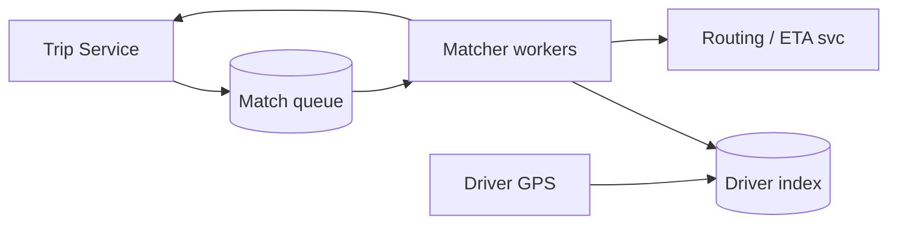
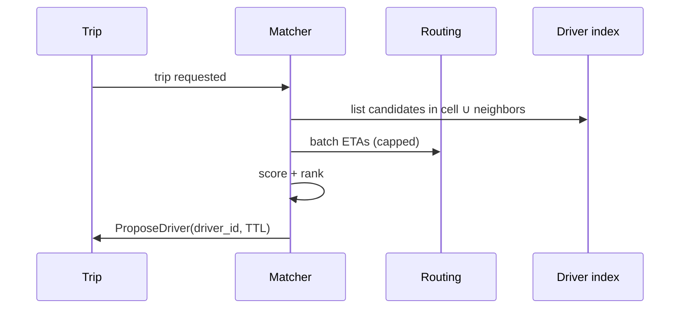

# HLD — Ride Matching (Driver Dispatch System)

## 1. Clarify requirements

### 1.0 Live flow

**Opening (~once):** *“I’ll align on **batching vs greedy**, **ETA vs earnings** objective, **surge** input, and **fairness**; then **scale**, **data structures for geo**, **architecture**, and **one match cycle**. **Pause after the diagram**—**scoring**, **rebalance**, or **load**?”*

**Thinking transitions:** *“This is an **online optimization** problem under **latency SLO**—I’ll **cap candidates** before scoring.”*

**Live rule:** Paraphrase tables; deep on **geo + scoring** only if steered.

### 1.1 Clarify

| Topic | Say it like this in the room |
|--------------------------|-------------------------------|
| **Objective** | “Minimize **ETA**, maximize **throughput**, or **blend**—what’s the **default**?” |
| **Batching** | “Do we **re-match** every **Δt**, or **commit** on first acceptable driver?” |
| **Surge** | “Is **surge** an **input feature** only, or does it change **search radius**?” |
| **Pool** | “**Shared rides** change matching—**in scope**?” |
| **Fairness** | “**Driver starvation**—do we need **rotation** or **throttle** repeat declines?” |

### 1.2 Functional requirements (FR)

#### Human interaction (FR)

| FR area | Say it like this in the room |
|---------|-------------------------------|
| **Ingest** | “**Open trips** + **available drivers** stream into the **matcher**.” |
| **Match** | “Produce **ordered offers** or **single best** driver per trip within **SLO**.” |
| **Rebalance** | “**Reassignment** if driver cancels or stalls—define policy.” |
| **Feedback** | “**Accept / reject / timeout** events train **ranker**.” |

**Core**

- Index **available drivers** by location + product capability.  
- For each **trip request** (or batch window), select **K candidates**, **score**, emit **offer(s)** with **TTL**.  
- Handle **driver going offline**, **timeout**, **rider cancel**.

### 1.3 Non-functional requirements (NFR)

| NFR | Say it like this |
|-----|------------------|
| **Latency** | “**p99** for **candidate gen** + **score** bounded—e.g. **<100–200ms** per cycle (confirm).” |
| **Scale** | “Many **concurrent** trips per **cell**; **horizontal** matchers.” |
| **Fairness** | “Avoid **always same** driver wins if product cares.” |

### 1.4 Invariants

**Invariant:** “Every **offer** references a **driver** who was **available** at **offer creation** per our **snapshot** rules; **commit** is **exclusive** (one winning assignment per driver per policy).”

| Beat | Say it like this |
|------|------------------|
| **Bridge** | “**Geo index** → **cap K** → **score** → **offer TTL**.” |
| **Core split** | “**Search** is cheap-ish at K; **scoring** is where models live.” |

### Key insight (say early)

**Cap candidates before expensive scoring**; treat matching as **continuous online reassignment** with **clear commit boundaries** back to **Trip service**.

#### Key anchors

1. “**Geohash / S2 / H3** cells + **neighbor** lookup.”  
2. “**Batch** windows vs **streaming**—state default + caveat.”  
3. “**TTL offers** + **idempotent** reserve RPC to Trip.”

---

## 2. Estimate scale

| Dimension | Illustrative |
|-----------|----------------|
| Active drivers / metro | **10k–100k+** |
| Match evaluations / sec | **High** during peak—**CPU** + **RPC** bound |
| Candidate cap **K** | **20–80** typical interview range |

**Tie it in one line:** “**Partition** space + **trip**; **scale out** stateless matchers with **sticky** routing or **sharded** driver index.”

---

## 3. APIs and data model

### 3.1 APIs (sketch)

| API | Purpose |
|-----|---------|
| `POST /v1/match/jobs` | Trip service enqueues new/updated trip |
| `POST /v1/drivers/{id}/heartbeat` | Location + availability |
| `POST /v1/match/{trip_id}/commit` | Trip service confirms assignment (callback) |

### 3.2 Data structures

- **Driver index:** cell → list/set of `driver_id` (availability bit, product tags).  
- **Trip queue:** priority by **wait time**, **SLA**, product.  
- **Scoring features:** ETA from **routing engine**, distance, surge, driver **accept rate**.

---

## 4. High-level architecture

### 4.1 Phases

| Phase | Ship |
|-------|------|
| **1** | Greedy nearest with ETA call |
| **2** | Batched reassignment, feature-based score |
| **3** | Regional **shards**, **simulation** shadow traffic |

---

## 5. Deep dive: one match cycle

### 🎯 Bottleneck Anchor

“**Routing/ETA RPC** fan-out and **hot cell** contention—watch **p99** and **throttle** parallel ETA calls.”

**Taking a stance:** *“**Batch ETA** where the **routing** API allows; else **two-phase**: cheap distance prefilter → **few** precise ETAs.”*

### 5.1 Re-match / rebalance

- Periodic job for **stuck** trips; **ripple** reassign on driver cancel.  
- **Churn** control: don’t ping-pong drivers.

### 5.2 Caching

- Cache **static route chunks** cautiously; **ETA** for **live traffic** is **short TTL**.

---

## 6. Scaling and bottlenecks

| Risk | Mitigation |
|------|------------|
| **Hot cell** | **Subdivide** cells; **load shed** lower-priority products |
| **ETA storm** | **Budget** parallel calls; **approximate** first |
| **Thundering herd** on new surge | **Jitter** + **rate limits** |

---

## 7. Reliability and failure handling

- **Matcher crash:** job **requeued**; **idempotent** propose.  
- **Stale driver list:** **heartbeat TTL** evicts drivers.  
- **Trip already filled:** **Trip service** rejects reserve—matcher **acks** and stops.

---

## 8. Tradeoffs and alternatives

| Choice | Trade |
|--------|--------|
| **Greedy online** | Low latency vs global optimum |
| **Batch assignment** | Better objective vs **wait** to batch |
| **Pull vs push offers** | Driver UX vs control |

---

## 9. Monitoring, observability, and security

**Metrics:** time-to-first-offer, **proposal→accept** rate, **ETA error**, per-cell **queue depth**.  
**Security:** **Auth** on matcher callbacks; **no PII** in feature logs if avoidable.

---

## 10. Design patterns, data structures & best practices

| Pattern | Map |
|---------|-----|
| **Spatial index** | H3/S2/Geohash |
| **Priority queue** | Trip urgency |
| **Strangler** | Replace greedy with batch gradually |

**Live:** at most **four** patterns tied to boxes.

---

## Closing notes

| Do | Avoid |
|----|--------|
| **Cap K** | O(all drivers) scan |
| **Separate Trip commit** | Matcher mutates trip without txn |

---

## Bar-raiser follow-ups

| They ask | Say it like this |
|----------|------------------|
| **Bipartite matching** | “**Min-cost flow** offline great; online needs **approximation** under **latency**.” |
| **Multi-leg** | “**OR-Tools** / heuristics for **sequenced** pickups—separate **batch** service.” |

---

## 60-second close

| Beat | Say it like this |
|------|------------------|
| **Recap** | “**Spatial index** + **capped** candidates + **scoring** + **TTL offers**; **Trip** owns **commit**; bottlenecks **ETA RPC** and **hot cells**; **metrics** on **offer latency**.” |

---
