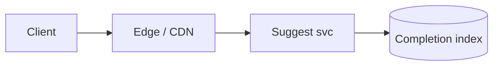
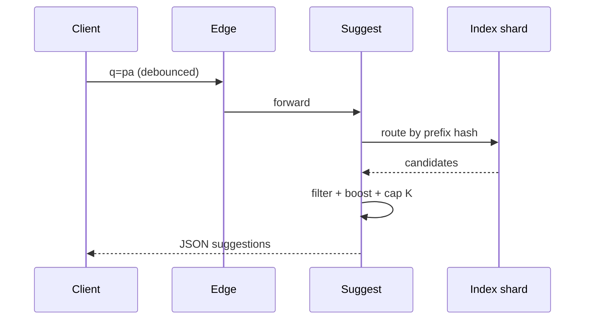

# HLD — Search Autocomplete System

## 1. Clarify requirements

### 1.0 Live flow

**Opening (~once):** *“I’ll align **prefix vs fuzzy**, **personalization**, **abuse**, and **latency** (often **stricter** than full search); then **index shape**, **APIs**, **architecture**. **Pause after the diagram**—**Trie vs n-gram**, **ranking**, or **multi-tenant**?”*

**Thinking transitions:** *“Autocomplete is **read-only**, **prefix-biased**, and **budgeted**—**K small**.”*

### 1.1 Clarify

| Topic | Say it like this in the room |
|--------------------------|-------------------------------|
| **Corpus** | “**Queries**, **places**, **SKUs**—which prefixes?” |
| **Personalization** | “**My recent** searches mixed in?” |
| **Locale** | “Per-language **normalization**?” |
| **P13n policy** | “**Safe** suggestions—block toxic strings?” |

### 1.2 Functional requirements (FR)

| FR area | Say it like this |
|---------|-------------------|
| **Suggest** | “Given **prefix** + **context** (geo, user), return **≤K** completions in **order**.” |
| **Highlight** | “Optional **offsets** for UI bolding.” |
| **Handoff** | “Selecting suggestion runs **full search** (see [26-hld-restaurant-search-nearby.md](./26-hld-restaurant-search-nearby.md)).” |

### 1.3 Non-functional requirements (NFR)

| NFR | Say it like this |
|-----|------------------|
| **Latency** | “Often **p99 < 50ms**—confirm; **edge cache**.” |
| **Correctness** | “**Deterministic** given index version; **no** duplicates.” |

### 1.4 Invariants

**Invariant:** “Suggestions are drawn from an **allowlist corpus** (plus **safe** user history); **blocked** terms **never** appear.”

| Beat | Say it like this |
|------|------------------|
| **Bridge** | “**Completion index** separate from **full-text** index.” |
| **Core split** | “**Retrieve top-K** then **light rank**.” |

### Key insight (say early)

Use a **dedicated completion structure** ( **FSA / trie / edge n-grams** ) with **small K** and **hard timeouts**—do not reuse **heavy** search for **every keystroke**.

#### Key anchors

1. “**Debounced** client + **server rate limit**.”  
2. “**Popular** boosts.”  
3. “**Sharded** by **prefix head**.”

---

## 2. Estimate scale

| Dimension | Illustrative |
|-----------|----------------|
| QPS | **10×** page views (keystrokes) |
| Corpus | **10M–100M+** strings (tune) |

---

## 3. APIs and data model

### 3.1 APIs

| API | Purpose |
|-----|---------|
| `GET /v1/suggest?q=pad&lat=&lng=` | Top-K |
| `POST /v1/suggest/events` | Selected suggestion (async) |

### 3.2 Index

- **Key:** normalized prefix bucket.  
- **Value:** list of `(text, score, type, id)` capped.  
- **FSA** (Finite State Automaton) for **compact** memory.

---

## 4. High-level architecture

### 4.1 Phases

| Phase | Ship |
|-------|------|
| **1** | In-memory trie per host + sticky routing |
| **2** | Distributed FSA + **regional** replicas |
| **3** | **Personal overlay** per user shard |

---

## 5. Deep dive: `GET /v1/suggest`

### 🎯 Bottleneck Anchor

“**Thundering herd** on viral prefix + **rank tail**—**cache** **popular prefixes** at **edge**.”

**Taking a stance:** *“**No fuzzy** on v1 unless interviewer insists—add **max edit distance 1** with **tight** budget later.”*

---

## 6. Scaling and bottlenecks

| Risk | Mitigation |
|------|------------|
| **Hot prefix** | Edge cache + **coalesce** identical in-flight |
| **Memory** | FSA compression |

---

## 7. Reliability and failure handling

- **Shard down:** shorter list from **replica**; never **500** empty if **degraded** list exists.

---

## 8. Tradeoffs and alternatives

| Choice | Trade |
|--------|--------|
| **Trie in RAM** | Speed vs **rebuild** time |
| **OpenSearch completion suggester** | Less ops vs **tail latency** |

---

## 9. Monitoring, observability, and security

**Metrics:** **p99**, **cache hit**, **select rate**, **toxic block** hits.  
**Security:** **Rate limit** per IP/user; **sanitize** logging.

---

## 10. Design patterns, data structures & best practices

| DS | Use |
|----|-----|
| **Trie / FSA** | Prefix completion |
| **Min-heap** | Top-K merge shards |

**Live:** max **four** patterns.

---

## Closing notes

| Do | Avoid |
|----|--------|
| **Dedicated completion index** | Full OpenSearch per keystroke |
| **Small K** | Returning 50 items |

---

## Bar-raiser follow-ups

| They ask | Say it like this |
|----------|------------------|
| **Multi-field** | “**Union** suggestions with **round-robin** by type + **score**.” |

---

## 60-second close

| Beat | Say it like this |
|------|------------------|
| **Recap** | “**FSA/trie**-backed **prefix** retrieval, **K** small, **edge cache**, **rate limits**; **separate** from **full search**; **bottleneck** **hot prefixes**.” |

---

**Related:** keyword / message search — [15-hld-keyword-message-search.md](./15-hld-keyword-message-search.md).

---
