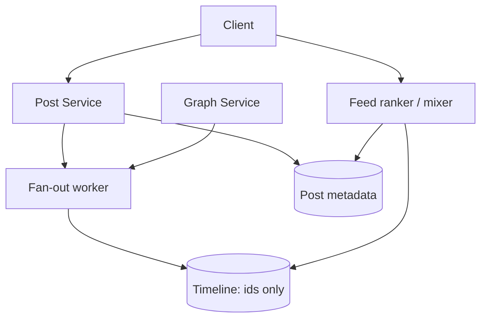
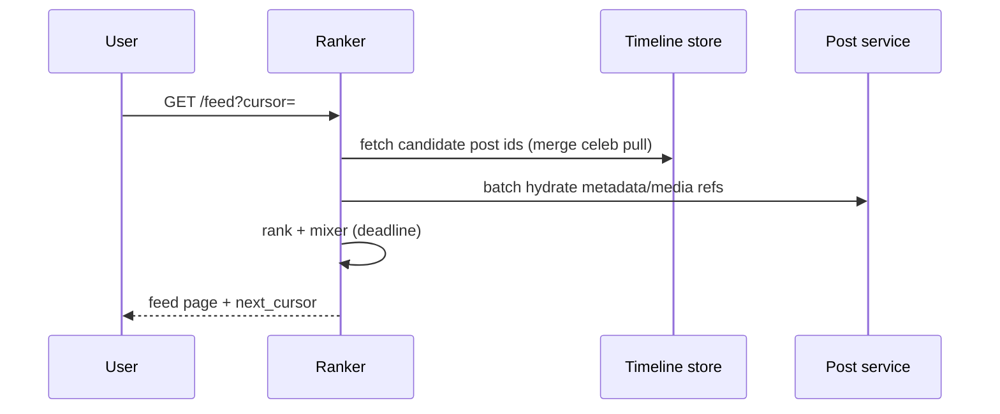

# HLD — Social Network News Feed

> **GitHub README style** — pair with [HLD-README.md](./HLD-README.md).

| | |
|--|--|
| **Round** | 45–60 min |
| **Strong-hire hooks** | **Hybrid fan-out**, **celebrity path**, **ranking timeout + mixer**, **live update** without full refetch |

---

## Table of contents

**Prep**

- [Interview plan](#interview-plan)
- [SDE-2 drive kit (Senior interviewer)](#sde-2-drive-kit-senior-interviewer)
- [Strong-hire signals](#strong-hire-signals)
- [Coverage map](#coverage-map)

**Interview spine (nine steps)**

- [Interview spine (nine steps)](#interview-spine-nine-steps)
- [1. Clarify requirements](#1-clarify-requirements)
- [2. Estimate scale](#2-estimate-scale)
- [3. APIs and data model](#3-apis-and-data-model)
- [4. High-level architecture](#4-high-level-architecture)
- [5. Deep dive: read feed path](#5-deep-dive-read-feed-path)
- [6. Scaling and bottlenecks](#6-scaling-and-bottlenecks)
- [7. Reliability and failure handling](#7-reliability-and-failure-handling)
- [8. Tradeoffs and alternatives](#8-tradeoffs-and-alternatives)
- [9. Monitoring, observability, and security](#9-monitoring-observability-and-security)
- [10. Design patterns, data structures & best practices](#10-design-patterns-data-structures--best-practices)

**Wrap-up**

- [Bar-raiser follow-ups](#bar-raiser-follow-ups)
- [Strong Hire room checklist](#strong-hire-room-checklist)
- [60-second close](#60-second-close)

---

## Interview plan

> “I’ll clarify **follow graph** vs friends-only, **ranked** vs chronological feed, and freshness. I’ll propose **hybrid fan-out**: **push** timeline ids for typical users, **pull/merge** for celebrities. I’ll put **APIs + graph/post/timeline model** on the board, sketch architecture, then deep dive **read path**: ids → hydrate → **time-boxed rank** → return. Stop me for **write fan-out** or **ranking**.”

---

## SDE-2 drive kit (Senior interviewer)

### A. Lock the agenda

Clarify → scale → graph/post/timeline model → architecture → **read path** (ids, hydrate, rank) → **write fan-out** if asked → celebrity → failures → tradeoffs → monitoring/security. **Pause:** “Ranked feed vs **mostly chrono**?”

### B. Questions — **this order**

| # | Ask |
|---|-----|
| 1 | “**Ranked** home vs strict reverse chrono?” |
| 2 | “Threshold: followers count where we **stop pushing**?” |
| 3 | “**Edit/delete** post—invalidate how?” |
| 4 | “**Ads** / injected promos in mixer?” |
| 5 | “**Blocks/mutes**—hard filter everywhere?” |
| 6 | “Live: **WS** nudge vs poll?” |

**Mirror:** “So timeline stores **ids**, bodies hydrated separately.”

### C. Winning line per spine

| Step | Sentence |
|------|----------|
| 1 | “**Hybrid fan-out**: push for normals, **pull/merge cap** for celebs.” |
| 2 | “Reads ≫ writes; **celebrity** is the write amplification trap.” |
| 3 | “Graph shard; posts metadata; **timeline list of ids**.” |
| 4 | “Post→**async fan-out worker**→timelines.” |
| 5 | “GET feed: ids → **batch hydrate** → **time-box rank + mixer**.” |
| 6 | “Fan-out queue depth; **hot timeline** key.” |
| 7 | “Ranker timeout → **chrono** fallback; partial feed policy.” |
| 8 | “More push vs pull; ranking complexity.” |
| 9 | “fan-out **lag**, feed **p99**; authZ; blocklist **version**.” |

### D. Whiteboard order

1. Post service + **Fan-out** + **Timeline store**.  
2. **Read path** sequence.  
3. **Celebrity** branch: “**merge capped** slice.”

### E. Senior probes

| Probe | Answer |
|-------|--------|
| “Celebrity post?” | “**No** O(followers) push; **read-time merge** from author shard with **cap**.” |
| “Consistency graph→feed?” | “Often **eventual** seconds; blocks should be **fast**; optional read tokens.” |

### F. Time crunched

**Hybrid fan-out** + **read path with rank timeout**.

### G. Anti-patterns

- Pushing celeb post to **100M** timelines.  
- Fat timelines storing **full post JSON**.  
- Ranker with **no fallback** under SLO pressure.

---

## Strong-hire signals

- **Celebrity** mitigation **without** being asked.  
- **Timeline = ids**, hydrate separately.  
- **Ranking fallback** on timeout.  
- **Live** = **cursor** nudge, not full feed over WS.

---

## Coverage map

- [ ] [Nine-step spine](#interview-spine-nine-steps)  
- [ ] Compose + distribute  
- [ ] Push / pull / **hybrid**  
- [ ] Ranking + mixer + ads  
- [ ] Celebrity / viral  
- [ ] Graph + post + timeline stores  
- [ ] Cache invalidation  
- [ ] Live updates  
- [ ] Blocks / mutes  

---

## Interview spine (nine steps)

| Step | What you deliver | Section |
|------|------------------|---------|
| **1** | Clarify requirements | [§1](#1-clarify-requirements) |
| **2** | Estimate scale | [§2](#2-estimate-scale) |
| **3** | APIs / data model | [§3](#3-apis-and-data-model) |
| **4** | High-level architecture | [§4](#4-high-level-architecture) |
| **5** | Deep dive critical flow | [§5](#5-deep-dive-read-feed-path) |
| **6** | Scaling / bottlenecks | [§6](#6-scaling-and-bottlenecks) |
| **7** | Reliability / failure handling | [§7](#7-reliability-and-failure-handling) |
| **8** | Tradeoffs / alternatives | [§8](#8-tradeoffs-and-alternatives) |
| **9** | Monitoring / security | [§9](#9-monitoring-observability-and-security) |

---

## 1. Clarify requirements

### 1.1 Questions to ask first

| Question | Why it matters |
|----------|----------------|
| **Ranked** vs strict reverse-chronological? | Ranker complexity |
| Max followers for “normal” vs **celebrity** threshold? | Hybrid fan-out |
| **Edit/delete** post semantics? | Invalidation |
| **Ads** / injected prompts in feed? | Mixer |
| **Media** types and size limits? | CDN, storage |
| **Blocks/mutes**—hard filter everywhere? | Invariant |
| **Multi-region**? | Replication, read routing |

### 1.2 Functional requirements (FR)

**Social graph**

- **Follow** / unfollow; optional friends-only mode if product says so.

**Posting**

- Create **post** with text/media; **distribute** to followers’ feeds (per fan-out policy).

**Feed read**

- **Home feed** paginated; support **ranked** or chronological per product.

**Engagement (optional)**

- Like/comment counts may influence **rank**.

**Safety**

- **Block/mute** must filter **hard** from feed inputs.

### 1.3 Non-functional requirements (NFR)

**Scale**

- Massive **read:write** ratio; **timeline reads** dominate.

**Latency**

- **Low p99** for home feed; **time-box** ranking.

**Durability**

- Posts **durable**; timelines can be **rebuilt** from post log + graph (expensive)—usually **materialized**.

**Availability**

- Prefer **stale feed slice** vs total outage when ranker fails.

**Consistency**

- **Eventual** graph visibility acceptable for seconds if disclosed; **blocks** should propagate quickly (define SLO).

**Security**

- **AuthZ** on all reads; **no IDOR** on private posts; **signed URLs** for media.

### 1.4 Invariant

**Invariant:** “**Blocks/mutes** are **hard filters** on candidate ids; a feed response **version** does not contain **duplicate** post ids.”

---

## 2. Estimate scale

| Dimension | Illustrative |
|-----------|----------------|
| DAU | **100M–500M+** class in “big social” discussion |
| Reads | Orders of magnitude above writes |
| Celebrity | Single post **fan-out** could be **100M+** if naively pushed—**forbidden** path |
| Timeline size | **Trim** to last N thousand ids per user (product) |

---

## 3. APIs and data model

### 3.1 APIs (sketch)

| API | Purpose |
|-----|---------|
| `POST /v1/posts` | Create post |
| `POST /v1/follow/{user_id}` | Follow |
| `GET /v1/feed?cursor=` | Home feed |
| `GET /v1/posts/{id}` | Post detail |

### 3.2 Data model

**Graph:** `following(user_id → list<followee_id>)` sharded by **follower** or **followee** (state access pattern).

**Post:** `post_id, author_id, text_ref, media_refs, created_at, deleted, version`.

**Timeline:** per **viewer** `user_id`: **ordered list of post_ids** (push model) **or** empty if pure pull.

**Hybrid:** timeline stores **non-celeb** ids; **merge** celeb slice at read from **authoritative** celeb post store.

### 3.3 Fan-out policy (part of model)

| User type | Write path | Read path |
|-----------|------------|-----------|
| Typical author | **Push** post id to each follower timeline (async worker) | Simple read |
| **Celebrity** | **No** O(followers) push | **Pull** recent from author + **merge** with cap |

---

## 4. High-level architecture

**Narration:** “**Writes** create post + **async fan-out** to timelines for normal users; **reads** pull **candidate ids**, **hydrate**, **rank** under deadline.”

---

## 5. Deep dive: read feed path

### 5.1 Ranking (inside deep dive)

**Signals:** recency, affinity, engagement velocity, quality, language, diversity.  
**Pipeline:** candidates → features → **blend/model** → **mixer** (ads, prompts).  
**Exploration:** small random slots for cold creators.  
**Fallback:** if ranker exceeds **T** ms → **chronological** slice.

### 5.2 Celebrity path

- **Do not** push to all followers.  
- **Merge** `timeline_ids` with **`fetch_recent(celeb_sources)`** capped (e.g. top K per followed celeb).

### 5.3 Live updates

- **WS/SSE:** “new posts **≥ cursor**” nudge; client **fetches** delta—do not push full ranked page every time.

### 5.4 Caching

- **CDN** for media.  
- **Redis** for recent timeline ids; **SWR** for post body hydration.

---

## 6. Scaling and bottlenecks

| Risk | Mitigation |
|------|------------|
| **Fan-out backlog** | Queue depth monitoring; scale workers; **batch** inserts |
| **Hot timeline** key | Shard timeline rows; rate limit **follow** bursts |
| **Ranker timeout** | Fallback sort; shed mixer slots |
| **Stale blocks** | **Versioned** blocklist in ranker input |

**Optimizations:** fan-out batching; **pre-warm** active users; two-tier cache; approximate graph for **reco** only.

---

## 7. Reliability and failure handling

- **Partial feed:** return available sections if one shard fails (product-dependent).  
- **Idempotent fan-out:** dedupe on `(post_id, follower_id)` insert.  
- **Replay:** rebuild timeline from log in disaster (batch job).  
- **Degrade:** drop ads before core feed on overload.

---

## 8. Tradeoffs and alternatives

### 8.1 Core tradeoffs

| Choice | Upside | Downside |
|--------|--------|----------|
| More push | Fast reads | Celebrity write explosion |
| More pull | Simple writes | Heavy readers suffer |
| Strong ranking | Engagement | Tail latency |

### 8.2 Alternatives

| Area | Option |
|------|--------|
| Timeline store | Redis lists vs Cassandra wide rows |
| Ranking | **Heavy offline** features + light online vs full online model |
| Graph | **Adjacency** in SQL vs distributed k-v |

---

## 9. Monitoring, observability, and security

**Metrics:** fan-out **lag** (post → **p%** followers have id), feed **p99**, rank **fallback** rate, **empty feed** rate.

**Tracing:** `GET /feed` spans for timeline fetch, hydrate, rank.

**Security:** enforce **private** posts; **block** checks server-side; **rate limits**; **signed media URLs**; audit **follow** abuse.

**Privacy:** minimize PII in logs; regional data rules if required.

---

## 10. Design patterns, data structures & best practices

### 10.1 Feed / distributed patterns

| Pattern | Where | Why |
|---------|--------|-----|
| **Hybrid fan-out** | Normal push + celebrity pull | Write amplification control |
| **CQRS / materialized view** | Timeline per user | Read-optimized |
| **Event-driven** | PostCreated → fan-out workers | Async scale |
| **Cache-aside** | Hot timeline in Redis | p99 read |
| **Bulkhead** | Rank vs fetch pools | Ranking stalls do not starve IO |
| **Timeout + fallback** | Ranker SLO | Degrade to recency-only |

### 10.2 Classic patterns

| Pattern | Map |
|---------|-----|
| **Strategy** | Ranker: engagement vs recency vs social proof |
| **Template method** | `GET /feed`: fetch ids → hydrate → rank → mix ads |
| **Decorator** | Mixer layer (inject promoted / live modules) |
| **Iterator** | Merge **k** friend streams for pull model |

### 10.3 Data structures

| Need | Structure |
|------|-----------|
| Timeline | **Append-only** list / wide row `(user_id → post_ids)` |
| Celebrity reads | **Min-heap** or priority queue merge recent from followed |
| Seen state | **Bloom** (approx) or compact bitset per session |
| Live updates | **Pub/sub** channel per user or connection registry |

### 10.4 Best practices

- **Keyset** pagination on `(score, post_id)` or `(time, id)`.  
- **Backfill** jobs idempotent with cursor checkpoints.  
- **Graph ACL** enforced server-side on hydrate.

### 10.5 Trade-offs

| Pick | Trade |
|------|--------|
| Push fan-out | Read cheap vs **write** cost + fan-out lag |
| Pull at read | Write cheap vs **read** latency for heavy consumers |

---

## Bar-raiser follow-ups

**Q: “Graph vs feed consistency?”**  
A: “Often **eventual** for seconds; **follow** changes **eventually** prune; optional **read tokens** for stricter reads.”

**Q: “Global?”**  
A: “**Regional** timelines + **replicate** graph; optimize **read local**.”

---

## Strong Hire room checklist

- [ ] Spine **1→9**  
- [ ] **Hybrid** fan-out explained  
- [ ] **Celebrity** path  
- [ ] **Time-box** rank + fallback  
- [ ] **Blocks** + security  

---

## 60-second close

“**Hybrid fan-out**: **push ids** for most users, **pull/merge** for **celebrities** with **caps**. **Read path** = timeline ids → **batch hydrate** → **time-boxed rank + mixer**; **live** uses **cursor** nudges. **Storage** splits **graph**, **post metadata**, **timeline lists**, **CDN** for media.”
