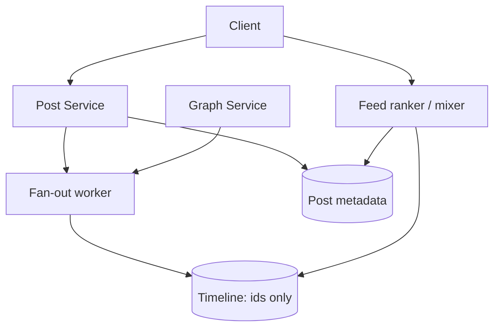
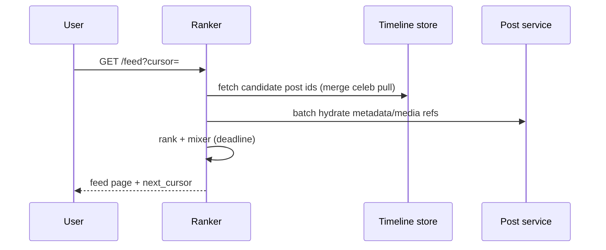

# HLD — Social Network News Feed

## 1. Clarify requirements

### 1.1 Clarify 

| Topic | Say it like this in the room |
|--------------------------|-------------------------------|
| **Feed shape** | “**Ranked** home vs mostly **reverse chrono**?” |
| **Celebrity** | “At what follower count do we **stop pushing** and switch to **read-time merge**?” |
| **Lifecycle** | “**Edit/delete** post—how hard must invalidation be?” |
| **Mixer** | “**Ads** or injected promos in scope?” |
| **Safety** | “**Blocks/mutes**—server-side **hard filter** everywhere?” |
| **Live** | “**WS/SSE nudge** vs polling for freshness?” |
| **Region** | “**Multi-region** from day one?” |

**Micro-pauses:** *“So timelines store **ids**; bodies **hydrate** separately; celebs don’t get **O(followers)** push.”*

### 1.2 Functional requirements (FR) — after alignment, say this as “what we must build”

#### Human interaction (FR — how to explain after alignment)

**Habit:** *“**Graph**, **post**, **distribute**, **read**.”*

| FR area | Say it like this in the room |
|---------|-------------------------------|
| **Graph** | “**Follow** / unfollow; optional friends-only.” |
| **Post** | “Create post; **fan-out policy** depends on author size—**hybrid**.” |
| **Feed** | “**Home feed** paginated; ranked vs chrono per product.” |
| **Safety** | “**Blocks/mutes** enforced on **read path**.” |

**Social graph**

- **Follow** / unfollow; optional friends-only mode if product says so.

**Posting**

- Create **post** with text/media; **distribute** to followers’ feeds (per fan-out policy).

**Feed read**

- **Home feed** paginated; support **ranked** or chronological per product.

**Engagement (optional)**

- Like/comment counts may influence **rank**.

**Safety**

- **Block/mute** must filter **hard** from feed inputs.

### 1.3 Non-functional requirements (NFR) — say as “how it must behave”

#### Human interaction (NFR — how to say “how it must behave”)

**Habit:** *“**Reads ≫ writes**; **rank** gets a **deadline**.”*

| NFR area | Say it like this in the room |
|----------|-------------------------------|
| **Latency** | “**Low p99** on **GET /feed**—I’ll **time-box** ranking.” |
| **Availability** | “**Partial feed** or **chrono fallback** beats a blank **500**.” |
| **Consistency** | “Graph can be **eventual** for seconds; **blocks** should feel **fast**.” |
| **Security** | “**AuthZ** everywhere; **signed** media URLs.” |

**Scale**

- Massive **read:write** ratio; **timeline reads** dominate.

**Latency**

- **Low p99** for home feed; **time-box** ranking.

**Durability**

- Posts **durable**; timelines can be **rebuilt** from post log + graph (expensive)—usually **materialized**.

**Availability**

- Prefer **stale feed slice** vs total outage when ranker fails.

**Consistency**

- **Eventual** graph visibility acceptable for seconds if disclosed; **blocks** should propagate quickly (define SLO).

**Security**

- **AuthZ** on all reads; **no IDOR** on private posts; **signed URLs** for media.

### 1.4 Invariants (one sentence you repeat under pressure)

**Invariant:** “**Blocks/mutes** are **hard filters** on candidate ids; a feed response **version** does not contain **duplicate** post ids.”

**Purpose:** handoff → **hybrid fan-out** + **read funnel**.

| Beat | Say it like this |
|------|------------------|
| **Bridge** | “**Push ids** for normals; **pull/merge with cap** for celebrities—never **O(followers)** push for celebs.” |
| **Read path** | “**Ids → hydrate → rank under deadline → mixer**.” |

---

## 2. Estimate scale

#### Human interaction (estimate scale)

**Habit:** *“**DAU** big; **celebrity** is the write trap.”*

| Topic | Say it like this in the room |
|-------|-------------------------------|
| **Read:write** | “Reads dominate—optimize **timeline read** and **rank tail**.” |
| **Celebrity** | “One post could be **100M+** followers—**hybrid** is non-optional.” |

| Dimension | Illustrative |
|-----------|----------------|
| DAU | **100M–500M+** class in “big social” discussion |
| Reads | Orders of magnitude above writes |
| Celebrity | Single post **fan-out** could be **100M+** if naively pushed—**forbidden** path |
| Timeline size | **Trim** to last N thousand ids per user (product) |

**Tie it in one line:** “**Materialized timelines of ids** + **async fan-out** for normals; **capped merge** for celebs.”

---

## 3. APIs and data model

#### Human interaction (APIs & data model)

**Habit:** *“**Graph**, **post**, **timeline ids**—three stores.”*

| Topic | Say it like this in the room |
|-------|-------------------------------|
| **Model** | “**Timeline** holds **post ids** only; **post service** holds metadata; **graph** owns follows.” |
| **Hybrid** | “Normals get **pushed ids**; celebs **merge at read** from author shard with a **cap**.” |

### 3.1 APIs (sketch)

| API | Purpose |
|-----|---------|
| `POST /v1/posts` | Create post |
| `POST /v1/follow/{user_id}` | Follow |
| `GET /v1/feed?cursor=` | Home feed |
| `GET /v1/posts/{id}` | Post detail |

### 3.2 Data model

**Graph:** `following(user_id → list<followee_id>)` sharded by **follower** or **followee** (state access pattern).

**Post:** `post_id, author_id, text_ref, media_refs, created_at, deleted, version`.

**Timeline:** per **viewer** `user_id`: **ordered list of post_ids** (push model) **or** empty if pure pull.

**Hybrid:** timeline stores **non-celeb** ids; **merge** celeb slice at read from **authoritative** celeb post store.

### 3.3 Fan-out policy (part of model)

| User type | Write path | Read path |
|-----------|------------|-----------|
| Typical author | **Push** post id to each follower timeline (async worker) | Simple read |
| **Celebrity** | **No** O(followers) push | **Pull** recent from author + **merge** with cap |

---

## 4. High-level architecture

#### Human interaction (high-level architecture / HLD)

**Habit:** *“**Write**: post → fan-out → timelines; **Read**: ranker hits timelines + post store.”*

| Moment | Say it like this in the room |
|--------|------------------------------|
| **Write** | “**Post service** writes metadata; **fan-out worker** fans ids into follower timelines for **non-celeb**.” |
| **Read** | “**Feed ranker**: pull **candidate ids**, **batch hydrate**, **rank + mixer**.” |

**Narration:** “**Writes** create post + **async fan-out** to timelines for normal users; **reads** pull **candidate ids**, **hydrate**, **rank** under deadline.”

---

## 5. Deep dive: read feed path

#### Human interaction (deep dive — critical flow)

**Habit:** *“**GET /feed** like the sequence diagram—**deadline** on rank.”*

| Step | Say it like this in the room |
|------|-------------------------------|
| **Fetch** | “Pull **timeline candidate ids**; **merge** capped celeb sources.” |
| **Hydrate** | “**Batch** post metadata; enforce **blocks** server-side.” |
| **Rank** | “**Time-box** model; on timeout → **chrono** fallback; **mixer** for ads if any.” |
| **Live** | “**WS/SSE** nudges new **`cursor`**—don’t push full ranked page every tick.” |

This is **step 5** of the [spine](#interview-spine-nine-steps)—where most Bar Raiser time should go.

### 5.1 Ranking (inside deep dive)

**Signals:** recency, affinity, engagement velocity, quality, language, diversity.  
**Pipeline:** candidates → features → **blend/model** → **mixer** (ads, prompts).  
**Exploration:** small random slots for cold creators.  
**Fallback:** if ranker exceeds **T** ms → **chronological** slice.

### 5.2 Celebrity path

- **Do not** push to all followers.  
- **Merge** `timeline_ids` with **`fetch_recent(celeb_sources)`** capped (e.g. top K per followed celeb).

### 5.3 Live updates

- **WS/SSE:** “new posts **≥ cursor**” nudge; client **fetches** delta—do not push full ranked page every time.

### 5.4 Caching

- **CDN** for media.  
- **Redis** for recent timeline ids; **SWR** for post body hydration.

---

## 6. Scaling and bottlenecks

#### Human interaction (scaling & bottlenecks)

**Habit:** *“**Fan-out queue**, **hot timeline**, **rank tail**.”*

| Topic | Say it like this in the room |
|-------|-------------------------------|
| **Fan-out** | “Watch **queue depth**; **batch** inserts; scale workers.” |
| **Hot timeline** | “**Shard** timeline rows; **rate limit** follow bursts.” |
| **Rank** | “**Timeout + fallback**; shed **mixer** first.” |

| Risk | Mitigation |
|------|------------|
| **Fan-out backlog** | Queue depth monitoring; scale workers; **batch** inserts |
| **Hot timeline** key | Shard timeline rows; rate limit **follow** bursts |
| **Ranker timeout** | Fallback sort; shed mixer slots |
| **Stale blocks** | **Versioned** blocklist in ranker input |

**Optimizations:** fan-out batching; **pre-warm** active users; two-tier cache; approximate graph for **reco** only.

---

## 7. Reliability and failure handling

#### Human interaction (reliability & failure handling)

**Habit:** *“**Partial success**; **idempotent fan-out**.”*

| Topic | Say it like this in the room |
|-------|-------------------------------|
| **Shard fail** | “Return **partial feed** if product allows.” |
| **Fan-out** | “**Dedupe** `(post_id, follower_id)` on insert; **replay** from log in disaster.” |

- **Partial feed:** return available sections if one shard fails (product-dependent).  
- **Idempotent fan-out:** dedupe on `(post_id, follower_id)` insert.  
- **Replay:** rebuild timeline from log in disaster (batch job).  
- **Degrade:** drop ads before core feed on overload.

---

## 8. Tradeoffs and alternatives

#### Human interaction (tradeoffs & alternatives)

**Habit:** *“**Push vs pull**—storage vs write/read complexity.”*

| Topic | Say it like this in the room |
|-------|-------------------------------|
| **Hybrid** | “**Push** makes reads cheap for normals; **celebs** break push at scale.” |
| **Rank** | “Heavy rank = engagement vs **p99** tail.” |

### 8.1 Core tradeoffs

| Choice | Upside | Downside |
|--------|--------|----------|
| More push | Fast reads | Celebrity write explosion |
| More pull | Simple writes | Heavy readers suffer |
| Strong ranking | Engagement | Tail latency |

### 8.2 Alternatives

| Area | Option |
|------|--------|
| Timeline store | Redis lists vs Cassandra wide rows |
| Ranking | **Heavy offline** features + light online vs full online model |
| Graph | **Adjacency** in SQL vs distributed k-v |

---

## 9. Monitoring, observability, and security

#### Human interaction (monitoring, observability & security)

**Habit:** *“**Fan-out lag** and **feed p99** are the headline SLIs.”*

| Topic | Say it like this in the room |
|-------|-------------------------------|
| **Metrics** | “**Lag** until **p%** of followers have id; **fallback** rate; **empty feed**.” |
| **Security** | “**Private** posts; **blocks**; **rate limits**; **signed** media.” |

**Metrics:** fan-out **lag** (post → **p%** followers have id), feed **p99**, rank **fallback** rate, **empty feed** rate.

**Tracing:** `GET /feed` spans for timeline fetch, hydrate, rank.

**Security:** enforce **private** posts; **block** checks server-side; **rate limits**; **signed media URLs**; audit **follow** abuse.

**Privacy:** minimize PII in logs; regional data rules if required.

---

## 10. Design patterns, data structures & best practices

Tie **hybrid fan-out**, **CQRS/materialized view**, **cache-aside**, **timeout+fallback** to boxes.

### 10.1 Feed / distributed patterns

| Pattern | Where | Why |
|---------|--------|-----|
| **Hybrid fan-out** | Normal push + celebrity pull | Write amplification control |
| **CQRS / materialized view** | Timeline per user | Read-optimized |
| **Event-driven** | PostCreated → fan-out workers | Async scale |
| **Cache-aside** | Hot timeline in Redis | p99 read |
| **Bulkhead** | Rank vs fetch pools | Ranking stalls do not starve IO |
| **Timeout + fallback** | Ranker SLO | Degrade to recency-only |

### 10.2 Classic patterns

| Pattern | Map |
|---------|-----|
| **Strategy** | Ranker: engagement vs recency vs social proof |
| **Template method** | `GET /feed`: fetch ids → hydrate → rank → mix ads |
| **Decorator** | Mixer layer (inject promoted / live modules) |
| **Iterator** | Merge **k** friend streams for pull model |

### 10.3 Data structures

| Need | Structure |
|------|-----------|
| Timeline | **Append-only** list / wide row `(user_id → post_ids)` |
| Celebrity reads | **Min-heap** or priority queue merge recent from followed |
| Seen state | **Bloom** (approx) or compact bitset per session |
| Live updates | **Pub/sub** channel per user or connection registry |

### 10.4 Best practices

- **Keyset** pagination on `(score, post_id)` or `(time, id)`.  
- **Backfill** jobs idempotent with cursor checkpoints.  
- **Graph ACL** enforced server-side on hydrate.

### 10.5 Trade-offs

| Pick | Trade |
|------|--------|
| Push fan-out | Read cheap vs **write** cost + fan-out lag |
| Pull at read | Write cheap vs **read** latency for heavy consumers |

#### Human interaction (design patterns, data structures & best practices)

**Habit:** *“**Hybrid fan-out**, **materialized timeline**, **Strategy** rankers, **Decorator** mixer.”*

| You mean… | Say it like this in the room |
|-----------|-------------------------------|
| **Patterns** | “**Event-driven** fan-out; **CQRS** between post truth and timeline read model; **cache-aside** hot timelines; **bulkhead** rank vs IO.” |
| **DS** | “Append-only **timeline** lists; **min-heap** merge for celeb pulls; **Bloom** for seen approx.” |

---

## Closing notes (where wrap-up human interaction lives)

Use **`#### Human interaction`** under [Bar-raiser](#bar-raiser-follow-ups) and [60-second close](#60-second-close).

---

## Bar-raiser follow-ups

#### Human interaction (bar-raiser)

**Habit:** two–four sentences, then **stop**.

| They ask | Say it like this |
|----------|------------------|
| **Graph vs feed** | “Usually **eventual** for seconds; **follow** changes **eventually** prune; optional **read tokens** if stricter.” |
| **Global** | “**Regional** timelines; **replicate** graph; **read local**.” |

---

## 60-second close

#### Human interaction (60-second close)

**Habit:** one **net-net** pass.

| Beat | Say it like this in the room |
|------|------------------------------|
| **Recap** | “**Hybrid fan-out**: **push ids** for normals, **pull/merge cap** for celebs. **Read** = timeline **ids** → **batch hydrate** → **time-boxed rank + mixer**; **live** = **cursor** nudges. **Stores**: **graph**, **posts**, **timelines**, **CDN**.” |

---
