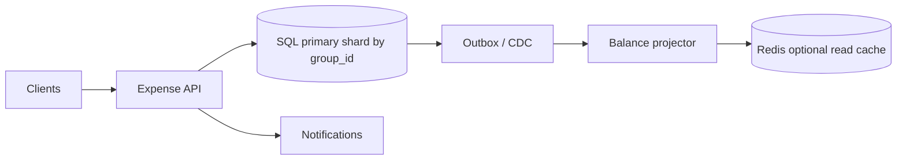
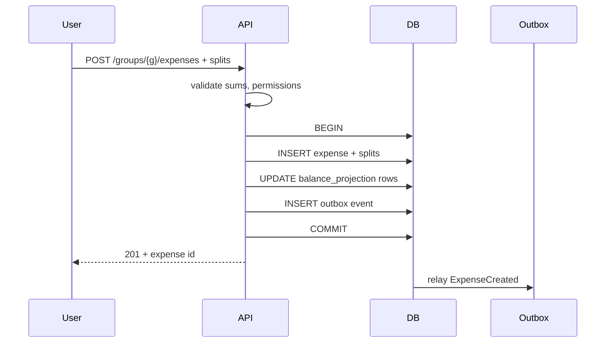

# HLD — Splitwise (Expenses, Balances, Settle-Up)

> **GitHub README style** — pair with [HLD-README.md](./HLD-README.md).

| | |
|--|--|
| **Round** | 45–60 min · Staff angles common |
| **Strong-hire hooks** | **Append-only ledger**, **≤ n−1 settlements**, **per-group serializability**, honest **multi-region** tradeoffs |

---

## Table of contents

**Prep**

- [Interview plan](#interview-plan)
- [SDE-2 drive kit (Senior interviewer)](#sde-2-drive-kit-senior-interviewer)
- [Strong-hire signals](#strong-hire-signals)
- [Coverage map](#coverage-map)

**Interview spine (nine steps)**

- [Interview spine (nine steps)](#interview-spine-nine-steps)
- [1. Clarify requirements](#1-clarify-requirements)
- [2. Estimate scale](#2-estimate-scale)
- [3. APIs and data model](#3-apis-and-data-model)
- [4. High-level architecture](#4-high-level-architecture)
- [5. Deep dive: critical flow](#5-deep-dive-critical-flow)
- [6. Scaling and bottlenecks](#6-scaling-and-bottlenecks)
- [7. Reliability and failure handling](#7-reliability-and-failure-handling)
- [8. Tradeoffs and alternatives](#8-tradeoffs-and-alternatives)
- [9. Monitoring, observability, and security](#9-monitoring-observability-and-security)

**Wrap-up**

- [Bar-raiser follow-ups](#bar-raiser-follow-ups)
- [Strong Hire room checklist](#strong-hire-room-checklist)
- [60-second close](#60-second-close)

---

## Interview plan

> “I’ll clarify currencies, rounding, and permissions, then model **expenses + splits** as an **append-only ledger** and **balances** as **projections**. I’ll cover **settlement simplification** on **net balances**, then **concurrency** with **per-group transactions** or **versioning**. I’ll deep dive **one expense post** end-to-end. Tell me if you want more on **global consistency** or **large groups**.”

---

## SDE-2 drive kit (Senior interviewer)

### A. Lock the agenda

Plan: clarify → scale → APIs/schema → architecture → **POST expense transaction** → settlement math → concurrency → failures → tradeoffs → monitoring/security. **Pause:** “Should I bias depth toward **concurrency** or **settlement** or **multi-region**?”

### B. Questions to ask — **this order**

| # | Ask |
|---|-----|
| 1 | “Split types: **equal / percent / exact**—any **rounding** rules?” |
| 2 | “**Delete** vs **void** vs **reversal**—what’s allowed for audit?” |
| 3 | “**Multi-currency** and FX—who owns rate?” |
| 4 | “**Who** can post expenses—any roles?” |
| 5 | “Max **group** size / history length we should assume?” |
| 6 | “Settlement goal: **min # payments** after netting?” |
| 7 | “**Multi-region** writes or single-region OK?” |

**Mirror back:** “Got it—so balances must stay **correct under concurrency** and **immutable** history.”

### C. Winning line per spine step

| Step | Sentence |
|------|----------|
| 1 | “**Ledger is append-only**; balances are **projections** we can rebuild.” |
| 2 | “Most groups small; worst case needs **pagination** + **O(1)** balance reads.” |
| 3 | “**One transaction**: expense + splits + projection bump (+ outbox).” |
| 4 | “API → SQL **shard by group_id** → optional projector + notify.” |
| 5 | “Deep dive: **BEGIN → insert splits → update nets → outbox → COMMIT**.” |
| 6 | “**Hot group** = lock contention; mitigate with **shard + versioning**.” |
| 7 | “**Idempotency-Key** + unique constraints; projector **lag** surfaced in UX.” |
| 8 | “Transactional projection vs async projector—**pick** with tradeoffs.” |
| 9 | “Metrics: **conflict rate**, **p99 POST**, projector **lag**; security: **no IDOR** on groups.” |

### D. Whiteboard order

1. Entities: **Group, Expense, Split, Payment, Projection**.  
2. **One** sequence on **POST expense**.  
3. Small diagram: **nets → greedy settle → ≤ n−1**.  
4. Concurrency: **version** or **row lock** on group—pick one verbally.

### E. Senior probes

| Probe | Answer |
|-------|--------|
| “CRDT?” | “Not for arbitrary money splits without strong invariants; **leader per group** or **transaction** simpler.” |
| “Global low-latency?” | “**Single writer per group** or accept cross-region latency; **don’t** split-brain balances.” |
| “Rebuild balances?” | “Replay **expenses + payments** from ledger; projection is **cacheable truth** if rebuilt.” |

### F. Time crunched

**POST expense transaction** + **≤ n−1 settlement** only.

### G. Anti-patterns

- Mutable overwrite of expenses.  
- Recomputing balances from **full scan** every GET at scale.  
- Hand-wavy “distributed lock everywhere” with no **shard** story.

---

## Strong-hire signals

- **Immutable expenses**; corrections as **new rows** / reversals.  
- **Net balance** from ledger; **materialized** projections with **rebuild** story.  
- **Settlement** as **≤ n−1** transfers after netting.  
- **Concurrency:** DB transaction boundaries stated clearly.

---

## Coverage map

- [ ] [Nine-step spine](#interview-spine-nine-steps)  
- [ ] Groups, permissions, multi-currency  
- [ ] Expense + splits validation (sums, rounding)  
- [ ] Balances: derived vs stored  
- [ ] **Settlement** graph algorithm  
- [ ] Concurrent posts, **lost updates**  
- [ ] Multi-region / CAP  
- [ ] Large group history pagination  

---

## Interview spine (nine steps)

| Step | What you deliver | Section |
|------|------------------|---------|
| **1** | Clarify requirements | [§1](#1-clarify-requirements) |
| **2** | Estimate scale | [§2](#2-estimate-scale) |
| **3** | APIs / data model | [§3](#3-apis-and-data-model) |
| **4** | High-level architecture | [§4](#4-high-level-architecture) |
| **5** | Deep dive critical flow | [§5](#5-deep-dive-critical-flow) |
| **6** | Scaling / bottlenecks | [§6](#6-scaling-and-bottlenecks) |
| **7** | Reliability / failure handling | [§7](#7-reliability-and-failure-handling) |
| **8** | Tradeoffs / alternatives | [§8](#8-tradeoffs-and-alternatives) |
| **9** | Monitoring / security | [§9](#9-monitoring-observability-and-security) |

---

## 1. Clarify requirements

### 1.1 Questions to ask first

| Question | Why it matters |
|----------|----------------|
| Equal / percent / exact split? | Validation, rounding rules |
| Who can add / edit / void expenses? | Authorization model |
| Multi-currency and FX source? | Schema, settlement |
| Delete vs **void** / reversal? | Audit trail |
| Legal export / tax reporting? | Retention, immutability |
| Max group size / activity feed? | Pagination, hot keys |
| Settlement objective: **min # payments** vs **min cash moved**? | Algorithm narrative |

### 1.2 Functional requirements (FR)

**Groups and membership**

- Create/join/leave **group**; list members; permissions for posting and viewing.

**Expenses**

- Create **expense** with **payer**, **amount**, currency, description, attachments optional.  
- **Splits:** equal shares, exact amounts, or percentages—**validate** sum matches total (with defined **rounding**).

**Balances**

- Show **per-member net** in a group (who owes whom in aggregate).  
- Optional **per-currency** nets if multi-currency.

**Settlements**

- Record **payments** between members; suggest **simplified** settlement plan (few transfers).  
- Activity feed / comments if in scope.

### 1.3 Non-functional requirements (NFR)

**Correctness (dominant)**

- **No silent corruption** of balances under concurrent posts; **audit** who changed what.

**Consistency**

- **Per-group** writes should be **linearizable** or **serializable** relative to balance updates (choose transaction vs projector and say so).

**Availability**

- Reads may use **replicas** with **bounded staleness** for feed; **balances** after write: **read-your-writes** or **primary read**.

**Durability**

- Expenses and payments **durable**; **outbox** for downstream notifications.

**Scalability**

- Most groups **small**; optimize for **O(1)** balance read via **projection**; **pagination** for history.

**Security**

- **AuthZ**: only members see group; only allowed roles post.  
- **Idempotency** on POST expense to prevent double-submit.

### 1.4 Invariant and out-of-scope

**Invariant:** “**Posted economic events** are not silently rewritten; **corrections** are explicit **void/reversal** entries.”

**Out of scope (unless asked):** bank integrations, actual money movement rails—focus on **ledger + UX**.

---

## 2. Estimate scale

| Scenario | Notes |
|----------|--------|
| Typical group | **3–20** members, low write QPS |
| Large group / trip | Thousands of expenses over time → **keyset pagination**, **archive** |
| Read pattern | **Balance** read **much** more than expense append after trip settles |
| Hot group | Same group **many concurrent** posts → **contention** on shard |

**Implication:** optimize **GET balances** via **projection**; avoid **full rescan** of expenses on every read.

---

## 3. APIs and data model

### 3.1 Public APIs (sketch)

| API | Purpose |
|-----|---------|
| `POST /groups` | Create group |
| `POST /groups/{id}/members` | Invite / add |
| `POST /groups/{id}/expenses` | Add expense + splits |
| `GET /groups/{id}/balances` | Net balances |
| `GET /groups/{id}/settlements/suggested` | Suggested transfers |
| `POST /groups/{id}/payments` | Record settlement |
| `GET /groups/{id}/activity?cursor=` | Feed (optional) |

**Headers:** `Idempotency-Key` on **POST expense**.

### 3.2 Schema (conceptual)

- `expenses(id, group_id, payer_user_id, amount_cents, currency, description, created_at, version)`  
- `expense_splits(expense_id, user_id, owed_cents)` — **CHECK** sum matches (DB or app).  
- `payments(id, group_id, from_user, to_user, amount_cents, created_at)`  
- `group_members(group_id, user_id, role, joined_at)`  
- Optional **`balance_projection(group_id, user_id, net_cents, version)`** for fast reads.

**Framing:** **append-only ledger** of expenses/payments → **projections** rebuildable.

### 3.3 Settlement logic (data shape)

- Compute **net** per user in group from ledger + payments.  
- **Greedy** match largest debtor to largest creditor until zero.  
- **≤ n−1** payments for **n** nonzero balances (standard netting argument).

---

## 4. High-level architecture

**Narration:** “**Writes** commit to **authoritative SQL**; **outbox** drives **notifications** and optional **async projector**; **Redis** only for **read acceleration** with TTL/version awareness.”

---

## 5. Deep dive: critical flow

### 5.1 Add expense (happy path)

**Talk track:** “Single **transaction** keeps splits and projection **atomic** until scale forces **append-only + projector**.”

### 5.2 Suggested settlements (read path)

- Read **nets** from projection (or compute from ledger if small).  
- Run **greedy** pairing in **app** or **cached** result invalidated on new expense/payment.

### 5.3 Concurrency (same section as “what breaks”)

- **Optimistic locking** on `balance_projection.version`.  
- **Pessimistic** `SELECT … FOR UPDATE` on group row—simple, **hot group** risk.  
- **Shard by `group_id`** to co-locate contention.

---

## 6. Scaling and bottlenecks

| Risk | Mitigation |
|------|------------|
| **Hot group** writes | Shard + queue writes; reduce lock scope; eventual projector |
| **Large history** | Keyset pagination; **archive** cold expenses |
| **Balance read** cost | **Projection table** O(members) not O(expenses) |
| **Settlement recompute** | Invalidate on change; cache suggested transfers briefly |
| **Outbox backlog** | Monitor relay lag; scale relay workers |

---

## 7. Reliability and failure handling

- **Duplicate POST:** `Idempotency-Key` + unique `(client_key)` or dedupe table.  
- **Split sum mismatch:** reject in transaction; never partial insert.  
- **Projector lag:** “**Updating…**” UX or **read primary** after write for balances.  
- **Failover:** HA replicas; **RPO/RTO** for regional outage; **single writer per group** for clarity in multi-region.

**Chaos / drills:** replay outbox, rebuild projections from ledger in staging.

---

## 8. Tradeoffs and alternatives

### 8.1 Architecture tradeoffs

| Approach | Upside | Downside |
|----------|--------|----------|
| Transactional projection | Simple correct reads | Write contention on hot group |
| Append-only + async projector | Faster writes, cleaner audit | Temporary read lag |
| Recalc from scratch each read | Always consistent view | Fails at large **n** |

### 8.2 Alternatives

| Area | Option |
|------|--------|
| DB | Cockroach / Spanner vs Postgres—**geo + HA** needs |
| Settlement UI | Show **pairwise** minimal vs **user-friendly** flows |
| Multi-region | **Leader per group** vs **CRDT** (usually **not** for money splits) |

---

## 9. Monitoring, observability, and security

**Metrics:** p99 **POST expense**, **409 conflict** rate, projector **lag**, outbox **depth**, balance read errors.

**Security:** strict **group ACL**; no **IDOR** on `group_id`; audit log for money-like events; **encrypt at rest**; **TLS** in transit.

**Compliance:** export/delete user data per regulation; retention policy on **comments** vs **expenses**.

---

## Bar-raiser follow-ups

**Q: “Global low latency writes?”**  
A: “**Leader per group** or accept cross-region latency; **CRDT** poor fit for arbitrary splits without constraints.”

**Q: “Rounding?”**  
A: “**Integer cents**; explicit remainder rule; tests on off-by-one.”

**Q: “Delete expense?”**  
A: “**Void** + offsetting entry preserves **audit**.”

---

## Strong Hire room checklist

- [ ] Spine **1→9**  
- [ ] Ledger + projection story  
- [ ] **≤ n−1** settlement  
- [ ] Concurrency + **hot group**  
- [ ] Security **IDOR** / audit  

---

## 60-second close

“**Expenses + splits** are **source of truth** in **SQL** (ideally **one transaction** with **projection** updates). **Settlement** is **netting + ≤ n−1** transfers. **Concurrency** is **per-group** ordering or **versioning**; **multi-region** favors **single writer per group**. **Outbox** for side effects; **metrics** on lag and conflicts.”
