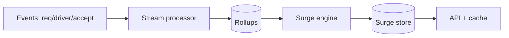
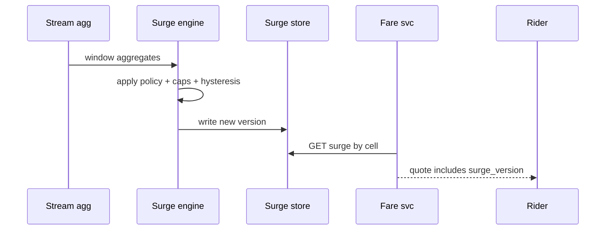

# HLD — Surge Pricing System

## 1. Clarify requirements

### 1.0 Live flow

**Opening (~once):** *“I’ll align on **geo unit** (hex vs zone), **inputs** (supply/demand/exog), **staleness vs fairness**, and **UX cap**; then **compute pipeline**, **serving**, **architecture**. **Pause after the diagram**—**algorithm**, **cache**, or **incidents**?”*

**Thinking transitions:** *“Surge is a **published multiplier** with a **freshness SLO**—not a hidden **rank** score.”*

### 1.1 Clarify

| Topic | Say it like this in the room |
|--------------------------|-------------------------------|
| **Objective** | “**Elasticity** / **wait reduction** / **driver incentive**—what’s primary?” |
| **Transparency** | “Show **exact** multiplier or **range**?” |
| **Caps** | “**Legal/product** max surge?” |
| **Cold start** | “New city—**defaults**?” |
| **Eats vs Rides** | “Same engine or **separate**?” |

### 1.2 Functional requirements (FR)

| FR area | Say it like this |
|---------|-------------------|
| **Compute** | “Per **cell** and **product**, output **multiplier** (or additive fee) on a cadence.” |
| **Serve** | “Riders/drivers **read** current surge for **location**.” |
| **Audit** | “Explainability snapshot for **support** / **regulators**.” |

**Core**

- Ingest **signals**: open requests, idle drivers, ETA to accept, weather, events.  
- Emit **surge record** versioned by `(cell, product, window)`.  
- **Fare service** consumes surge for **estimate** and **final** (see [22-hld-eta-fare-estimation.md](./22-hld-eta-fare-estimation.md)).

### 1.3 Non-functional requirements (NFR)

| NFR | Say it like this |
|-----|------------------|
| **Latency** | “Reads **cached**—**ms**; recompute **async** **5s–60s** cadence (confirm).” |
| **Correctness** | “**Monotonic version** per cell; **no** silent flip mid-ride unless product allows.” |
| **Fairness** | “Avoid **oscillation**—**hysteresis** / **smoothing**.” |

### 1.4 Invariants

**Invariant:** “Every **fare quote** references a **surge_version** (or **explicit default**) so we can **reconcile** what the user was **shown**.”

| Beat | Say it like this |
|------|------------------|
| **Bridge** | “**Stream in** aggregates → **model** → **versioned** **surge table**.” |
| **Core split** | “**Offline / nearline** calibration vs **online** **serving**.” |

### Key insight (say early)

**Separate** **signal collection** from **policy computation** from **edge serving**—smooth, version, and **cap** in **one place**.

#### Key anchors

1. “**Hysteresis** stops flip-flop.”  
2. “**Version** tied to **quotes**.”  
3. “**Shadow** deploy new formulas.”

---

## 2. Estimate scale

| Dimension | Illustrative |
|-----------|----------------|
| Cells globally | **Millions** active; **hot** subset recomputed often |
| Read QPS | **Very high**—**CDN/edge cache** unrealistic for personalized—**regional Redis** |

**Tie it in one line:** “**O(cells)** recompute cost controlled by **hierarchy** (coarse → refine hot).”

---

## 3. APIs and data model

### 3.1 APIs

| API | Purpose |
|-----|---------|
| `GET /v1/surge?lat=&lng=&product=` | Current multiplier + `version` |
| *internal* | `POST /v1/surge/recompute` batch job trigger |

### 3.2 Model

- **SurgeRecord:** `cell_id`, `product`, `multiplier`, `version`, `valid_until`, `inputs_hash`.  
- **Signals rollup:** time-windowed counts in **OLAP** or **stream processor**.

---

## 4. High-level architecture

### 4.1 Phases

| Phase | Ship |
|-------|------|
| **1** | Rule-based: demand/supply ratio |
| **2** | ML layer + hysteresis + caps |
| **3** | Multi-objective + **A/B** flags |

---

## 5. Deep dive: compute + serve

### 🎯 Bottleneck Anchor

“**Oscillation** and **wrong cold inputs** cause **trust** incidents—**smooth** + **version** + **monitor** delta.”

**Taking a stance:** *“**Fare** stores **surge_version** on the **quote** artifact—**idempotent** replays.”*

---

## 6. Scaling and bottlenecks

| Risk | Mitigation |
|------|------------|
| **All-cell recompute** | **Tiered**: metro → hex; **skip** stable cells |
| **Thundering herd** on spike | **Pre-warm**; **jitter** cadence |
| **Stale reads** | **TTL** + **version** mismatch → **refresh** |

---

## 7. Reliability and failure handling

- **Engine down:** **last good** multiplier with **max age**; **fallback** to **1.0** if expired (product).  
- **Bad deploy:** **kill switch** to formula v-1.

---

## 8. Tradeoffs and alternatives

| Choice | Trade |
|--------|--------|
| **Fine hex** | Responsive vs compute cost |
| **Personalized surge** | Revenue vs **fairness** perception |

---

## 9. Monitoring, observability, and security

**Metrics:** multiplier **distribution**, **churn** rate version-to-version, **ETA** under surge, **quote** vs **trip** reconciliation diff.  
**Security:** **no** user-specific surge **leak** across sessions if policy forbids.

---

## 10. Design patterns, data structures & best practices

| Pattern | Map |
|---------|-----|
| **Lambda architecture** | Stream + batch reconcile |
| **Feature flags** | Formula rollout |
| **Versioned config** | Policy caps |

**Live:** max **four** patterns.

---

## Closing notes

| Do | Avoid |
|----|--------|
| **Hysteresis + version** | Mystery multipliers |
| **Quote linkage** | Surge changes **retroactive** fare with no artifact |

---

## Bar-raiser follow-ups

| They ask | Say it like this |
|----------|------------------|
| **Pooling** | “**Cross-side** externalities—sometimes **objective** is **system throughput**, not single-trip revenue.” |
| **Regulation** | “**Audit log** of inputs + formula id per **cell** window.” |

---

## 60-second close

| Beat | Say it like this |
|------|------------------|
| **Recap** | “**Signals** → **engine** → **versioned** surge; **quotes** carry **version**; **smooth/hysteresis**; scale with **tiered** cells; **watch oscillation**.” |

---
