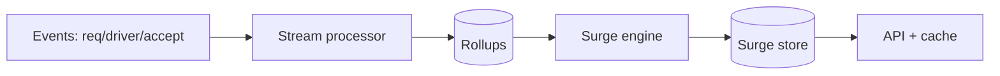
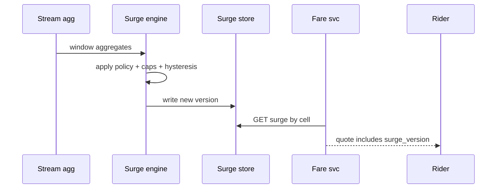

# HLD — Surge Pricing System

## 1. Clarify requirements

### 1.0 Live flow

**Opening (~once):** *“I’ll align on **geo unit** (hex vs zone), **inputs** (supply/demand/exog), **staleness vs fairness**, and **UX cap**; then **compute pipeline**, **serving**, **architecture**. **Pause after the diagram**—**algorithm**, **cache**, or **incidents**?”*

**Thinking transitions:** *“Surge is a **published multiplier** with a **freshness SLO**—not a hidden **rank** score.”*

**Live rule:** Paraphrase tables; deep on **policy** or **consistency** only if steered.

**User journey (once):** say [👤 User journey](#user-journey-framing) **before** the architecture diagram.

### 1.1 Clarify

| Topic | Say it like this in the room |
|--------------------------|-------------------------------|
| **Objective** | “**Elasticity** / **wait reduction** / **driver incentive**—what’s primary?” |
| **Transparency** | “Show **exact** multiplier or **range**?” |
| **Caps** | “**Legal/product** max surge?” |
| **Cold start** | “New city—**defaults**?” |
| **Eats vs Rides** | “Same engine or **separate**?” |

### 1.2 Functional requirements (FR)

| FR area | Say it like this |
|---------|-------------------|
| **Compute** | “Per **cell** and **product**, output **multiplier** (or additive fee) on a cadence.” |
| **Serve** | “Riders/drivers **read** current surge for **location**.” |
| **Audit** | “Explainability snapshot for **support** / **regulators**.” |

**Core**

- Ingest **signals**: open requests, idle drivers, ETA to accept, weather, events.  
- Emit **surge record** versioned by `(cell, product, window)`.  
- **Fare service** consumes surge for **estimate** and **final** (see [22-hld-eta-fare-estimation.md](./22-hld-eta-fare-estimation.md)).

### 1.3 Non-functional requirements (NFR)

| NFR | Say it like this |
|-----|------------------|
| **Latency** | “Reads **cached**—**ms**; recompute **async** **5s–60s** cadence (confirm).” |
| **Correctness** | “**Version** on **quotes**; **mid-trip** surge rules per product—spell [⚖️ Consistency Model](#consistency-model-anchor).” |
| **Fairness** | “Avoid **oscillation**—**hysteresis** / **smoothing**.” |

### 1.4 Invariants

**Invariant:** “Every **fare quote** references a **surge_version** (or **explicit default**) so we can **reconcile** what the user was **shown**; **no silent** retroactive change after **confirmation** without a **new** quote artifact—see [⚖️ Consistency Model](#consistency-model-anchor).”

| Beat | Say it like this |
|------|------------------|
| **Bridge** | “**Stream in** aggregates → **model** → **versioned** **surge table**.” |
| **Core split** | “**Offline / nearline** calibration vs **online** **serving**.” |

### Key insight (say early)

**Separate** **signal collection** from **policy computation** from **edge serving**—smooth, version, and **cap** in **one place**; **ship rules + hysteresis first**, add **ML** when **signals** are **trustworthy** ([👤 UX](#ux-awareness), [🚦 inputs](#input-quality-backpressure)).

#### Key anchors

1. “**Hysteresis** stops flip-flop.”  
2. “**Version** tied to **quotes**.”  
3. “**Shadow** deploy new formulas.”  
4. “I’d **start rule-based** with **hysteresis** + caps; add **ML** only once **signal pipelines** are **reliable** and **observable**—not as v1 magic.”

---

## 2. Estimate scale

| Dimension | Illustrative |
|-----------|----------------|
| Cells globally | **Millions** active; **hot** subset recomputed often |
| Read QPS | **Very high**—**CDN/edge cache** unrealistic for personalized—**regional Redis** |

**Tie it in one line:** “**O(cells)** recompute cost controlled by **hierarchy** (coarse → refine hot).”

---

## 3. APIs and data model

### 3.1 APIs

| API | Purpose |
|-----|---------|
| `GET /v1/surge?lat=&lng=&product=` | Current multiplier + `version` |
| *internal* | `POST /v1/surge/recompute` batch job trigger |

### 3.2 Model

- **SurgeRecord:** `cell_id`, `product`, `multiplier`, `version`, `valid_until`, `inputs_hash`.  
- **Signals rollup:** time-windowed counts in **OLAP** or **stream processor**.

---

## 👤 User Journey (say once early)

**Say it once early** (before or right after the [architecture diagram](#4-high-level-architecture)):

*“From the **rider** side:

**User opens app** → **requests a ride** → the system **fetches surge** for their **location** → the **fare quote** includes the **multiplier** (and **`surge_version`**) → user **confirms** → the **trip** continues to reference that **same `surge_version`** for anything **locked** at quote time (per product).

So:
- **Compute path** = **signals** → **surge engine** → **versioned** `SurgeRecord`
- **Read path** = **surge lookup** when building a **quote**
- **Correctness** = **version consistency** between what we **showed** and what we **charge** on”*

👉 **Product-aware** before the **pipeline** boxes.

---

## ⚖️ Consistency Model

**Bar Raiser:** *“Can **surge change mid-trip**?”*

**Say clearly:**

**Surge is eventually consistent** across cells and caches (staleness SLO is OK for the **published** multiplier **read**), but the **contract** with the user is **stricter** on **money**:

- **Quote** must be **consistent** with the **`surge_version`** it embeds—auditable.  
- **No silent change** after **user confirmation** on an **upfront** or **locked** fare: if surge moves, it applies to **new quotes** / **next trip**, not by **mutating** the old artifact in place.  
- **Metered** trips: align with interviewer—often **rate card** + **rules version** at trip start; **surge** may be **fixed** for that trip or **float** per policy—**state the default** and **never** hand-wave.

**One-liner:** *“**Eventual** on the **wall**; **explicit versions** on the **receipt path**.”*

---

## 🚦 Input Quality / Backpressure

**If signals are noisy, delayed, or spiky:**

- **Smooth** with **windowed** aggregates and **hysteresis**—don’t let one bad tick move the multiplier.  
- **Outlier rejection** / caps on absurd input spikes (GPS glitch, counter bug, replay storm).  
- Prefer **stable** behavior over **hyper-reactive** noise—pairs with [👤 UX Awareness](#ux-awareness).

**Backpressure:** shed **non-critical** exogenous inputs first under load; **extend** recompute cadence for **cold** cells before dropping **hot-cell** freshness.

👉 Shows **robustness**: **trust** beats **chasing every twitch** in the raw stream.

---

## 👤 UX Awareness

If **surge** changes **too often**, **user trust** drops—so we **prioritize stability** (smoothing, hysteresis, clear **version** / “updated just now” copy) over **chasing perfect instantaneous accuracy**. **Oscillation** is a **product** failure, not only an **algo** bug.

---

## 4. High-level architecture

#### Human interaction (high-level architecture)

| Moment | Say it like this in the room |
|--------|------------------------------|
| **User journey** | “[👤 Quote includes `surge_version`](#user-journey-framing); trip **locks** per **product** rules.” |
| **Consistency** | “[⚖️ Eventual serve vs explicit quote contract](#consistency-model-anchor).” |
| **Signals** | “[🚦 Window, reject outliers, backpressure](#input-quality-backpressure)—bad input ≠ wild multiplier.” |
| **Evolution** | “[Rule-based + hysteresis first](#key-insight-say-early); **ML** when pipelines **earn** it.” |

### 4.1 Phases

| Phase | Ship |
|-------|------|
| **1** | **Rule-based** demand/supply (or similar) + **hysteresis** + **caps**—**default MVP** |
| **2** | Harden **signal** quality, **dashboards**, **shadow**; then add **ML** layer **on top**—not before pipelines are **trusted** |
| **3** | Multi-objective + **A/B** flags + **strong** audit |

---

## 5. Deep dive: compute + serve

#### Human interaction (deep dive)

**Habit:** *“**Window** → **policy** → **version write** → **quote read**—tie [⚖️ consistency](#consistency-model-anchor) and [🚦 inputs](#input-quality-backpressure) if they probe.”*

### 🎯 Bottleneck Anchor

“**Oscillation** and **wrong cold inputs** cause **trust** incidents—**smooth** + **version** + **monitor** delta.”

**Taking a stance:** *“**Fare** stores **surge_version** on the **quote** artifact—**idempotent** replays; **mid-trip** behavior is a **policy** answer, not an implementation accident—[⚖️ spell it](#consistency-model-anchor).”*

---

## 6. Scaling and bottlenecks

| Risk | Mitigation |
|------|------------|
| **All-cell recompute** | **Tiered**: metro → hex; **skip** stable cells |
| **Thundering herd** on spike | **Pre-warm**; **jitter** cadence |
| **Stale reads** | **TTL** + **version** mismatch → **refresh** |

---

## 7. Reliability and failure handling

- **Engine down:** **last good** multiplier with **max age**; **fallback** to **1.0** if expired (product).  
- **Bad deploy:** **kill switch** to formula v-1.  
- **Poison signals:** fall back to **last stable** window per [🚦 Input Quality](#input-quality-backpressure); **alert** on anomaly rate.  
- **Quote / trip mismatch:** reconcile using **`surge_version`** on artifact—[⚖️ Consistency Model](#consistency-model-anchor).

---

## 8. Tradeoffs and alternatives

| Choice | Trade |
|--------|--------|
| **Fine hex** | Responsive vs compute cost |
| **Personalized surge** | Revenue vs **fairness** perception |
| **Rule + hysteresis first vs ML v1** | **Ship fast, debuggable** vs **opaque** model on **dirty** signals—**default** the former ([Key anchors](#key-insight-say-early)) |

---

## 9. Monitoring, observability, and security

**Metrics:** multiplier **distribution**, **churn** rate version-to-version, **ETA** under surge, **quote** vs **trip** reconciliation diff.  
**Security:** **no** user-specific surge **leak** across sessions if policy forbids.

---

## 10. Design patterns, data structures & best practices

| Pattern | Map |
|---------|-----|
| **Lambda architecture** | Stream + batch reconcile |
| **Feature flags** | Formula rollout |
| **Versioned config** | Policy caps |

**Live:** max **four** patterns.

---

## Closing notes

| Do | Avoid |
|----|--------|
| **Hysteresis + version** | Mystery multipliers |
| **Quote linkage** | Surge changes **retroactive** fare with no artifact |
| **[⚖️ Mid-trip without a contract](#consistency-model-anchor)** | “It changes” with no product rule |
| **[👤 Chasing accuracy over trust](#ux-awareness)** | **Oscillating** multiplier UX |

---

## Bar-raiser follow-ups

| They ask | Say it like this |
|----------|------------------|
| **Pooling** | “**Cross-side** externalities—sometimes **objective** is **system throughput**, not single-trip revenue.” |
| **Regulation** | “**Audit log** of inputs + formula id per **cell** window.” |
| **Mid-trip surge** | “[⚖️ Default: no **silent** change to **locked** quote](#consistency-model-anchor); **metered** = **rate card** rule **explicit**.” |
| **Noisy demand signal** | “[🚦 Window + outlier cap + hysteresis](#input-quality-backpressure); don’t let one tick move price.” |

---

## 60-second close

| Beat | Say it like this |
|------|------------------|
| **Recap** | “**User journey**: **open → request → surge on quote → confirm → same `surge_version`** where locked. **Compute** = signals → engine → version; **read** = lookup for quote; **correctness** = **version contract** ([⚖️ eventual serve, strict quote](#consistency-model-anchor)). **[🚦 Inputs](#input-quality-backpressure)**: smooth, reject spikes, backpressure. **Default**: **rule-based + hysteresis**; **ML** after **reliable** pipelines. **[👤 UX](#ux-awareness)**: **stability** over twitchy accuracy. **Scale**: tiered cells; **watch oscillation**.” |

---
