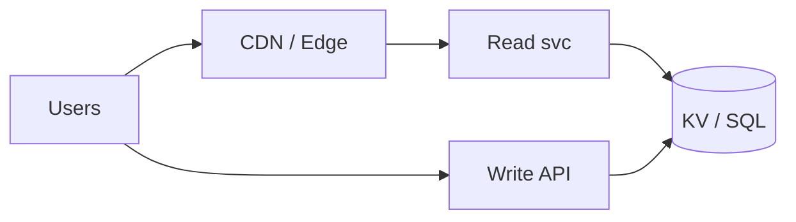
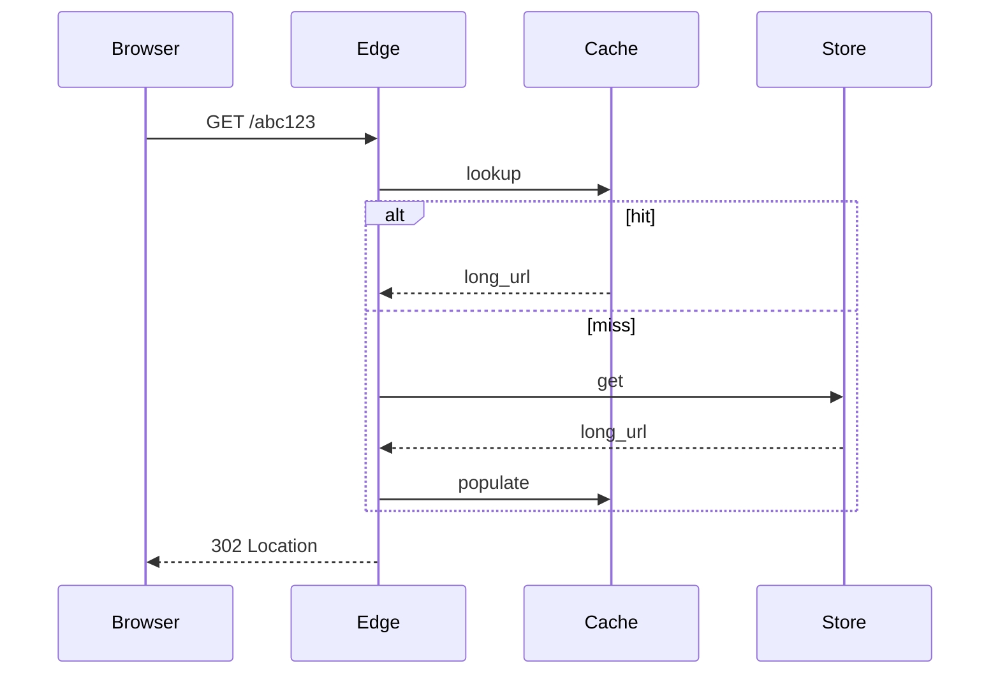

# HLD — URL Shortener (TinyURL)

## 1. Clarify requirements

### 1.0 Live flow

**Opening (~once):** *“I’ll align **custom vs random** slugs, **TTL**, **analytics**, **abuse**, and **read:write ratio**; then **ID generation**, **storage**, **redirect path**. **Pause after the diagram**—**collision**, **scale**, or **security**?”*

**Thinking transitions:** *“**Reads dominate**—**cache** + **edge**; **writes** need **unique** id strategy.”*

### 1.1 Clarify

| Topic | Say it like this in the room |
|--------------------------|-------------------------------|
| **Length** | “**7-character** Base62 ok?” |
| **Private** | “**Auth** links?” |
| **Preview** | “**Unfurl** safety / malware scan?” |
| **Deletion** | “**GDPR** erase mapping?” |

### 1.2 Functional requirements (FR)

| FR area | Say it like this |
|---------|-------------------|
| **Create** | “`POST /shorten` → **short URL**.” |
| **Resolve** | “`GET /{slug}` → **302** to long URL.” |
| **Optional** | “Click analytics async.” |

### 1.3 Non-functional requirements (NFR)

| NFR | Say it like this |
|-----|------------------|
| **Latency** | “Redirect **p99** **ms** at edge.” |
| **Scale** | “**Billions** mappings; **400M+** reads/day classic interview number.” |

### 1.4 Invariants

**Invariant:** “A published **slug** maps to **at most one** **active** long URL at a time; **redirect** is **idempotent** for readers (until **revoked**).”

| Beat | Say it like this |
|------|------------------|
| **Bridge** | “**Counter / snowflake** → **Base62** → **KV**.” |
| **Core split** | “**Generate** separate from **serve**.” |

### Key insight (say early)

**Pre-generated** blocks of random IDs from a **central allocator** OR **base62 hash** of **snowflake**—avoid **DB uniqueness retry storm**.

#### Key anchors

1. “**302** vs **301**—**analytics** vs **permanent** semantics.”  
2. “**Bloom** optional for **abuse**.”  
3. “**CDN** for **redirect** at scale.”

---

## 2. Estimate scale

| Dimension | Illustrative |
|-----------|----------------|
| Writes / sec | **1k–10k** |
| Reads / sec | **100k–1M+** |
| Storage | **Billions** rows—**sharding** by **slug** |

---

## 3. APIs and data model

### 3.1 APIs

| API | Purpose |
|-----|---------|
| `POST /v1/urls` | Create `{long_url}` → `{slug}` |
| `GET /{slug}` | Redirect |

### 3.2 Model

- **UrlMapping:** `slug (PK)`, `long_url`, `owner_id?`, `created_at`, `expires_at?`, `revoked`.

---

## 4. High-level architecture

### 4.1 Phases

| Phase | Ship |
|-------|------|
| **1** | Single DB + app |
| **2** | **Redis** cache + **sharded** KV |
| **3** | **Geo** **edge redirects** |

---

## 5. Deep dive: redirect

### 🎯 Bottleneck Anchor

“**Cache stampede** on **hot slug**—**coalesce** + **long TTL** for **immutable** mappings.”

**Taking a stance:** *“**Base62** of **64-bit id** from **Snowflake**—**no** collision **check** on happy path.”*

---

## 6. Scaling and bottlenecks

| Risk | Mitigation |
|------|------------|
| **Hot key** | **Edge cache** |
| **Skew** | **Consistent hash** shards |

---

## 7. Reliability and failure handling

- **Origin miss:** **404** vs **fallback** page.  
- **Phishing:** **blocklist** + **Safe Browsing** API hook.

---

## 8. Tradeoffs and alternatives

| Choice | Trade |
|--------|--------|
| **Random slug** | Unguessable vs **custom** vanity |
| **Hash of URL** | Deterministic vs **enumeration** risk |

---

## 9. Monitoring, observability, and security

**Metrics:** **redirect p99**, **cache hit**, **create** conflict rate.  
**Security:** **Rate limit** creates; **malware** scan on **long_url**; **SSRF** guard for internal URLs.

---

## 10. Design patterns, data structures & best practices

| Pattern | Map |
|---------|-----|
| **Counter service** | Slug allocation |
| **Bloom filter** | Abuse precheck (optional) |
| **Cache-aside** | Redirect |

**Live:** max **four** patterns.

---

## Closing notes

| Do | Avoid |
|----|--------|
| **ID generation story** | Random until DB unique works |
| **Abuse** | Ignoring phishing use case |

---

## Bar-raiser follow-ups

| They ask | Say it like this |
|----------|------------------|
| **Custom slug race** | “**Unique index** + **409** or **retry**.” |

---

## 60-second close

| Beat | Say it like this |
|------|------------------|
| **Recap** | “**Write-light**, **read-heavy**; **Snowflake/Base62** or **preallocated** blocks; **KV** sharded by **slug**; **edge cache**; **302** semantics + **abuse** controls.” |

---
