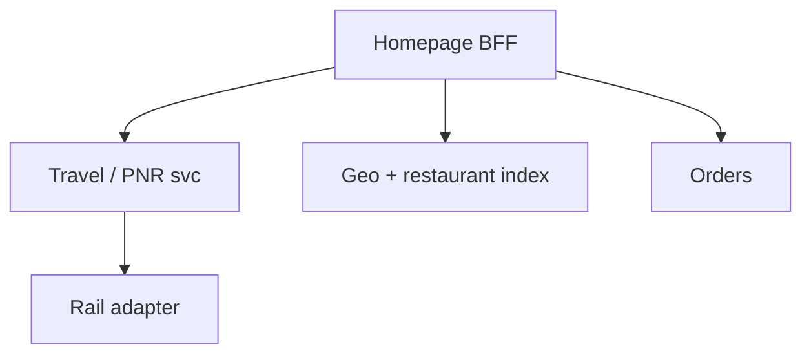
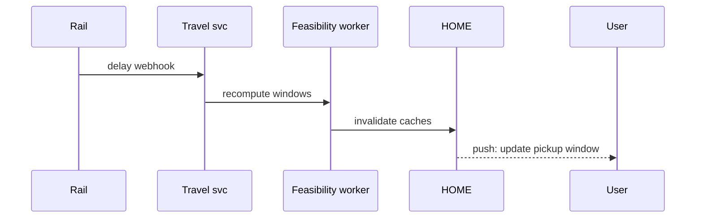

# HLD — Uber Eats Homepage / Delivery for Customer on Train (PNR + Station)

## 1. Clarify requirements

### 1.0 Live flow (how to open and steer)

**Opening (~once):** *“This extends **geo delivery** with **train context**: **PNR**, **route/stations**, **arrival window**, and **handoff** at a **station**; I’ll align **eligibility** (which stops are serviceable), **timing** (prep vs dwell time), then **APIs** and **architecture**. **Pause after the diagram**—**rail data**, **ETA**, or **trust**?”*

**When (HLD clock):** the **full user-journey script** lives **[just above §4](#user-journey-train-pnr)**—say it **once out loud** immediately **before** you draw the architecture diagram so the room is **user-first**. Optional: tee up **one clause** during clarify if you opened systems-heavy; don’t read the **whole** block twice.

**Thinking transitions:** *“Same spine as [11-hld-uber-eats-homepage.md](./11-hld-uber-eats-homepage.md)—but **location** is **derived from PNR + schedule**, not only GPS.”*

**Live rule:** **Paraphrase** §1–2 tables; don’t read every row. Go deep **only if they probe**.

### 1.1 Clarify

| Topic | Say it like this in the room |
|--------------------------|-------------------------------|
| **PNR trust** | “**I’d default verified PNR** with the **carrier** API for **trust**; **fallback** to **manual** station + time **only** with **clear UX disclosure** (risk banner, no silent downgrade).” |
| **Stations** | “**Static** station list per operator vs **live** platform changes?” |
| **Dwell** | “Minimum **minutes** at stop to **hand off** food?” |
| **Failure** | “Train **late**—**re-anchor** delivery stop or **cancel policy**?” |
| **Overlap** | “Is **standard home** still in scope on same **home API**?” |

**Micro-pauses:** *“So **context** is **PNR + itinerary**; **eligibility** is **station feasibility**; **commit** locks a **validated window**—got it.”*

### 1.2 Functional requirements (FR) — after alignment, say this as "what we must build"

| FR area | Say it like this |
|---------|-------------------|
| **Context** | “User binds **PNR** (or ticket id); system resolves **train**, **direction**, **next stops**.” |
| **Station picker** | “Show **serviceable stations** ahead on route with **ETA to stop** + **order-by** cutoff.” |
| **Homepage** | “Same **sections** as standard home but **ranking** uses **station arrival** and **walk from platform** rules.” |
| **Order** | “Delivery address becomes **station + platform + time window** artifact.” |

**Core**

- **Default: carrier-verified PNR** where integrated; then **enrich** → **itinerary** + **live delays** (if available); **manual** path only with **disclosure** (aligns with clarify table).  
- Filter restaurants that can **prepare + dispatch** to meet **dwell window**.  
- **Countdown** UX driven by **schedule + delay** feed.

**Cross-ref:** Browse/rank/cache patterns in [11-hld-uber-eats-homepage.md](./11-hld-uber-eats-homepage.md); dispatch timing in [24-hld-food-delivery-order-dispatch.md](./24-hld-food-delivery-order-dispatch.md).

### 1.3 Non-functional requirements (NFR) — say as "how it must behave"

| NFR | Say it like this |
|-----|------------------|
| **Correctness** | “**Never** promise delivery to a stop the train **won’t** reach in time **without** user reconfirm.” |
| **Latency** | “Home **p99** similar to standard; **PNR resolve** may be **cached**.” |
| **Availability** | “If **rail API** down—**degrade** to manual station + time **with disclosure**.” |

### 1.4 Invariants

**Invariant:** “A **checkout** or **commit** for **station delivery** includes a **validated service window** `(station_id, t_min, t_max)` that satisfies **restaurant prep + courier travel** constraints under **published delay assumptions**.”

## ⚖️ Consistency Model

Bar-raiser thread: *“What if **delay** changes **after** order?”*

Say it like this:

*“The system is **eventually consistent** on **live delays**, but:

- **Order commit** locks a **validated service window** that was **true at commit** (versioned **itinerary snapshot** on the order).  
- **Changes after commit** trigger a **re-evaluation workflow** (feasibility, restaurant, courier)—**never** a silent guarantee breach.  
- If we **can’t** hold the window, we **notify** the user and branch to **re-select station / widen window / cancel+comp** per **policy**—not a quiet miss.”*

**Purpose:** no second “clarify lecture”—only the **handoff** from answers → design.

| Beat | Say it like this |
|------|------------------|
| **Bridge** | “**PNR → itinerary → candidate stops → restaurant time feasibility**.” |
| **Core split** | “**Schedule truth** upstream; **marketplace** downstream.” |

### Key insight (say early)

**Train mode** is **eligibility + timing** on top of the same **read funnel** as homepage—**fail closed** when **uncertainty** exceeds **SLA**.

#### Key anchors

1. “**Feasibility check** before **show** orderable.”  
2. “**Recompute** on **delay events**.”  
3. “**Version** the **itinerary snapshot** on the **order**.”

---

## 2. Estimate scale

| Dimension | Illustrative |
|-----------|----------------|
| PNR lookups / day | Smaller than total **Eats DAU** but **spiky** around travel holidays |
| Station catalog | **Thousands** per country—**CDN** friendly |

---

## 3. APIs and data model

### 3.1 APIs (sketch)

| API | Purpose |
|-----|---------|
| `POST /v1/travel-contexts` | Bind PNR / ticket → `travel_context_id` |
| `GET /v1/travel-contexts/{id}/stops` | Serviceable upcoming stops + cutoffs |
| `GET /v1/home?travel_context_id=` | Homepage rail-aware |
| `GET /v1/itinerary/stream` | SSE/poll for **delays** |

### 3.2 Model

- **TravelContext:** `user_id`, `pnr_hash`, `operator`, `train_id`, `expires_at`, `status`.  
- **StopFeasibility:** `station_id`, `t_arrival_est`, `t_depart_est`, `serviceable_restaurant_ids` (precomputed or on demand).  
- **Order:** `travel_context_id`, `handoff_station_id`, `window`.

---

## 4. High-level architecture

### 👤 User journey (say once—before this diagram)

*“**User enters PNR** → system **fetches itinerary** → shows **upcoming serviceable stations** → user **selects a station** → sees **homepage** → **places order** → **delivery** happens in the **station dwell window**.

So:

- **context** = PNR + itinerary  
- **eligibility** = station feasibility  
- **delivery** = **timed handoff** at the platform window.”*

---

### 4.1 Phases

| Phase | Ship |
|-------|------|
| **1** | Manual station + static timetable |
| **2** | **Verified** PNR + delay stream + feasibility |
| **3** | **Multi-leg** + **partner** exclusive menus |

---

## 👤 UX awareness

If **feasibility** becomes **uncertain** (delay, short dwell, kitchen slip), we **proactively notify** the user and offer **re-selection** of station/window or a **controlled cancel path**—**not** a silent delivery failure or a **moving goalpost** ETA with no audit trail.

---

## 5. Deep dive: delay → re-feasibility

### 🎯 Bottleneck Anchor

“**Stale delay** + **tight dwell** → **missed handoff**—watch **feasibility recompute lag** and **push** to user.”

**Taking a stance:** *“**Orders in prep** get **automatic** **window widen** only if **restaurant+courier** still feasible—else **branch** to support playbook.”*

---

## 6. Scaling and bottlenecks

| Risk | Mitigation |
|------|------------|
| **Rail API rate limits** | **Cache** itinerary; **webhook** push |
| **Feasibility CPU** | **Precompute** per **train instance** × **top stations** |

## 🚦 Feasibility Scaling (backpressure & load)

To handle **feasibility** load without melting **CPU** or **rail** quotas:

- **Precompute** feasibility for **top stations** / high-volume **corridors** (warm paths).  
- **Cache** results **per train instance** (or `(train_id, service_date, direction)`), keyed so **delay events** trigger **targeted invalidation**, not full recompute every read.  
- **Recompute** on **delay webhooks** and **meaningful schedule deltas**—not on every homepage **GET** (read path stays **thin**).  
- **Rate-limit** and **queue** heavy recompute; **shed** to **degraded** station list + disclosure if the feasibility tier is **overloaded** (see [UX awareness](#ux-awareness-train-pnr) above).

---

## 7. Reliability and failure handling

- **PNR invalid:** clear **error** + **fallback** to GPS home.  
- **Missed stop:** **no-show** policy; **credit** workflow.

---

## 8. Tradeoffs and alternatives

| Choice | Trade |
|--------|--------|
| **Verified PNR (default)** | **Trust** + fewer **false stops** vs **carrier integration** cost |
| **GPS assist** | Accuracy vs **battery** |

---

## 9. Monitoring, observability, and security

**Metrics:** PNR **verify success**, **feasibility false positive** rate (missed handoff), **delay** handling latency.  
**Security:** **PNR** is sensitive—**encrypt at rest**, **minimal** echo in logs.

---

## 10. Design patterns, data structures & best practices

| Pattern | Map |
|---------|-----|
| **Adapter** | Per rail operator |
| **Event-driven** | Delay webhooks |
| **Saga** | Re-anchor order |

**Live:** max **four** patterns.

---

## Closing notes (where wrap-up human interaction lives)

Endgame is **short**, **confident**, and **conversational**: use **`#### Human interaction`** under [Bar-raiser](#bar-raiser-follow-ups), [Communication (do vs avoid)](#communication-do-vs-avoid), and [60-second close](#60-second-close)—not a second full design pass.

### Communication (do vs avoid)

| Do (sounds senior) | Avoid (sounds rehearsed) |
|--------------------|---------------------------|
| **Feasibility fail-closed** | Optimistic “we’ll make it” |
| **Link to homepage doc** | Rebuilding 11 from scratch in hour |

---

## Bar-raiser follow-ups

| They ask | Say it like this |
|----------|------------------|
| **Fraud** | “**Velocity** limits on PNR changes; **device** binding.” |
| **Cross-border** | “**Operator** plugins + **currency** per **leg**.” |
| **Delay after commit** | “[Consistency model](#consistency-model-train-pnr): **re-evaluate**, **notify**, **re-select / cancel**—**no** silent guarantee.” |

---

## 60-second close

| Beat | Say it like this |
|------|------------------|
| **Recap** | “**User journey**: PNR → itinerary → **serviceable** stations → home → order → **timed handoff**. **Feasibility** precompute/cache + **recompute on delays**. **Consistency**: commit locks **versioned window**; post-commit delay → **workflow**, **notify**, never **silent** breach. **UX**: uncertain feasibility → **re-select**, not ghosting.” |

---
