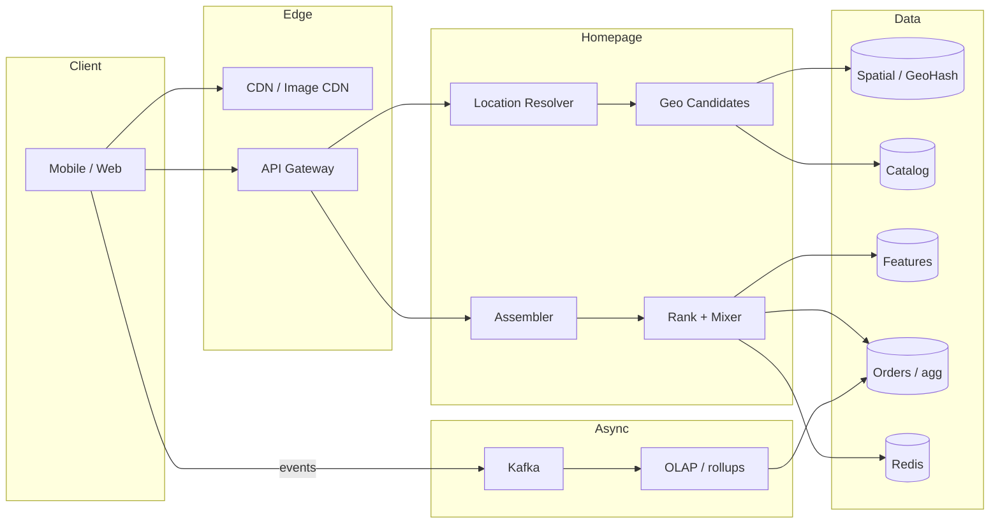
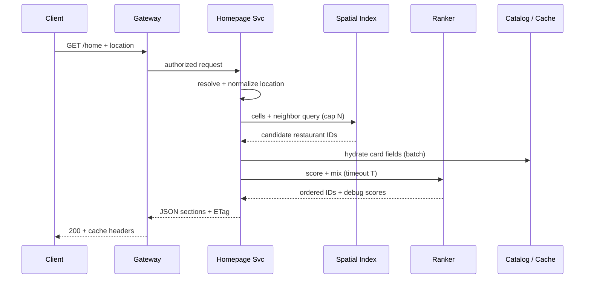

# HLD — Uber Eats Homepage

> **GitHub README style:** use this as a single scrollable brief—diagrams render in GitHub’s markdown preview. Practice **out loud** using [HLD-README.md](./HLD-README.md) for the global “Strong Hire” playbook.

| | |
|--|--|
| **Round** | 45–60 min · Bar Raiser favorite |
| **Strong-hire hooks** | Geo correctness + boundary cells, ranking **timeouts + fallback**, cache **freshness vs SLO**, metrics from **facts** not cache |

---

## Table of contents

**Prep (before whiteboard)**

- [How to drive the round (natural conversation)](#how-to-drive-the-round-natural-conversation)
- [Key insight (say early)](#key-insight-say-early)
- [Interview plan (first 60-90 seconds)](#interview-plan-first-60-90-seconds)
- [SDE-2 drive kit (Senior interviewer)](#sde-2-drive-kit-senior-interviewer)
- [Strong-hire signals for this problem](#strong-hire-signals-for-this-problem)
- [Coverage map](#coverage-map)

**Interview spine (follow this order in the room)**

- [Interview spine (nine steps)](#interview-spine-nine-steps)
- [1. Clarify requirements](#1-clarify-requirements)
- [2. Estimate scale](#2-estimate-scale)
- [3. APIs and data model](#3-apis-and-data-model)
- [4. High-level architecture](#4-high-level-architecture)
- [5. Deep dive: critical flow](#5-deep-dive-critical-flow)
- [6. Scaling and bottlenecks](#6-scaling-and-bottlenecks)
- [7. Reliability and failure handling](#7-reliability-and-failure-handling)
- [8. Tradeoffs and alternatives](#8-tradeoffs-and-alternatives)
- [9. Monitoring, observability, and security](#9-monitoring-observability-and-security)

**Wrap-up**

- [Bar-raiser follow-ups](#bar-raiser-follow-ups)
- [Strong Hire room checklist](#strong-hire-room-checklist)
- [Communication: DO vs AVOID](#communication-do-vs-avoid)
- [60-second close](#60-second-close)
- [Honest rating: can you drive from this doc?](#honest-rating-can-you-drive-from-this-doc)

---

## How to drive the round (natural conversation)

**Rating (honest):** if you deliver the *ideas* in this file with **structure + pauses**, you are in **Strong Hire** territory for a typical Uber HLD homepage prompt. The risk is sounding **memorized**—so use this doc as a **skeleton**, then **paraphrase** like you are explaining to a teammate.

### Skeleton vs speech

| Skeleton (from this doc) | How it should sound in the room |
|---------------------------|----------------------------------|
| Fixed paragraphs | Same **logic**, your **words** |
| One long monologue | **Layers**: geo → *pause* → ranking → *pause* → cache |
| Every buzzword | Plain English first, **one** precise term where it earns its keep |

**Rule of thumb:** if you can say the same thing **three different ways**, you are safe from “scripted.”

---

### Opening — robotic vs human

**Sounds like a memorized speech (avoid):**

> “I will clarify requirements and assumptions, then estimate scale briefly. After that I will define APIs and data model…”

**Sounds like a real senior IC (aim here):**

> “Happy to take this wherever you want—but here’s how I’d run the next forty minutes if that works. I’d like to **nail down scope** first—what counts as homepage, how tight inventory has to be—then do a **quick scale pass** so we’re not designing in a vacuum. Then I’d put **APIs and a thin data model** on the board, sketch the **read path**, and probably spend the most time on **geo + ranking** because that’s where latency and correctness usually fight. We can end on **tradeoffs and what breaks**.”

**Then actually stop:**

> “Does that work on your side? And if you already care about one slice—like **multi-region** or **experiments**—tell me now and I’ll weight that.”

---

### Sample back-and-forth (first few minutes)

Use this to **feel** the rhythm—not to memorize line by line.

**Interviewer:** “Go ahead.”

**You:** “Cool. When you say homepage, I’m picturing the usual rails—**near you**, maybe **reorder**, **trending**, **promos**, maybe a bit of **personalization**. Is that roughly what you have in mind, or is this intentionally narrower?”

**Interviewer:** “That’s fine.”

**You:** “Great. Two things I want to align on because they change the design. **One:** on the **list** itself, is it okay if popularity or ‘open now’ is **a little stale**—like tens of seconds or a couple minutes—or do you want that basically **real time**? **Two:** are we pretending **search** is in scope, or is that a **different** service and we just link out?”

**Interviewer:** “Staleness is okay on browse.”

**You:** “Perfect—that lets me be **aggressive on caching** and on **precomputed** scores without feeling guilty. I’ll still keep **hard eligibility**—like actually in zone and not hard-closed—much tighter, because that’s the kind of thing that turns into a trust issue if we’re wrong.”

That last beat is your **eligibility vs ranking** split, but **woven into** a normal sentence.

---

### Clarifying — short spoken lines (pick what fits)

Say these like questions, not an interrogation:

- “For **browsing**, are we okay with **eventual** freshness on things like trending, or do you want that tighter?”  
- “Roughly where’s **p99** supposed to land for the **server side**—are we talking **sub‑100ms** or more like **hundreds of ms**?”  
- “Is **personalization** in scope for v1, or generic + trending for now?”  

---

### Read pipeline — say it while you draw (one breath)

You do not need perfect wording. Any of these is fine:

- “Big picture it’s a **pipeline**: figure out **where** the user is, pull a **candidate set** from geo, **filter** what’s actually allowed, **score** what’s left, **assemble** the page.”  
- “Think **funnel**: wide at geo, narrow by the time we hit the ranker.”

---

### Geo — how a human says the strong part

Do not dump H3 *and* geohash *and* S2 unless they ask. One clear version:

> “I’d bucket the world into **cells**—geohash or H3, either way—and pull restaurants from **this cell plus the ring around it**, because otherwise you always lose people who are **right on the edge**. In a **dense** downtown I’d also **cap** how many candidates we even send to ranking, otherwise we’re doing heavy work on thousands of rows for no reason.”

---

### Data, cache, metrics — one layer at a time

**Data (when they ask where things live):**

> “Orders and anything **money-ish** I’d keep **relational**. Menus are messy—I’m fine with **documents** or fat JSON for the **read model**. Text search is almost always its **own index**.”

**Cache (when it comes up—don’t lead with Redis):**

> “Images obviously **CDN**. For the hot ‘near you’ lists I’d use something fast like **Redis**, but I care more about **TTL + invalidation** than the brand name. If we see stampedes we’d do **single-flight** and **jitter**.”

**Metrics (say it like you mean it):**

> “If we’re talking **most ordered restaurant** or **top dishes**, I’d treat **orders in the warehouse** as truth—**Kafka out of OLTP**, **OLAP**—and maybe **mirror** a denormalized number for speed, but I wouldn’t let **Redis be the definition** of the metric.”

---

### The five ideas — say them *your* way (same truth, different words)

You do not need all five every time; **land them once each** somewhere natural.

| Idea | One natural way to say it |
|------|---------------------------|
| **Eligibility vs ranking** | “I’m strict about **who’s allowed on the list**; I’m flexible about **the order** if we’re up against latency.” |
| **Neighbor cells** | “I always pull **neighbors**, otherwise geo feels ‘random’ near cell boundaries.” |
| **Time-boxed rank + fallback** | “Ranking gets a **budget**; if we blow it we **degrade** to something dumb but safe—distance, popularity.” |
| **Cap candidates** | “Especially downtown, I’d **cap** candidates before we do anything expensive.” |
| **Metrics from facts / OLAP** | “**Business numbers** come from **orders in analytics**, not from whatever happened to be in cache.” |

---

### When they interrupt (stay structured, sound calm)

**“What if traffic 10x?”**

> “Same shape—**more partition-friendly reads**, **more cache**, and I’d be ruthless about **capping** geo candidates and **time-boxing** rank. The **eligibility rules** don’t change; we just get cheaper at applying them.”

**“Multi-region?”**

> “I’d try to keep **user reads local** to a region, accept **eventual** for global aggregates unless you tell me otherwise, and be careful anything **ranking** uses is **consistent enough** for the SLO we picked.”

**“Consistency?”**

> “I’d split it: **browse** can be **softer**; anything that implies **you can actually place this order** has to be **tighter**—that’s where I’d use **stronger reads** or **version checks** at checkout even if the homepage is looser.”

---

### Wrap-up — conversational (30–90 seconds)

Pick your speed; do not rush.

> “Yeah—so net net, homepage for me is a **read-heavy funnel**. **Geo + hard filters** are where I refuse to be sloppy; **ranking** is where I spend money but with a **timeout** and a **fallback**. We scale with **partitioning**, **caching**, and **not doing dumb work** on huge candidate sets. And anything we call a **business metric** should trace back to **orders**, not cache.”

---

## Key insight (say early)

You can say the formal version **or** the casual version—same signal.

**Formal:**

> “I split **eligibility** from **ranking**: who’s **allowed** vs how we **sort**. Eligibility has to stay **right**; ranking can **degrade** under pressure.”

**Over coffee:**

> “I’m not willing to be wrong about **‘can this restaurant actually serve you’**; I *am* willing to be a little wrong about **‘is it third or fifth on the list’** if the clock is yelling at me.”

---

## Interview plan (first 60-90 seconds)

Default: use the **human opening** in [How to drive the round](#how-to-drive-the-round-natural-conversation) (section **Opening — robotic vs human**).

**Shorter variant** if time is tight:

> “I’ll clarify scope and scale, sketch APIs and storage, draw the read pipeline, then go deep on **geo + ranking + failure modes**—does that work for you?”

**Alignment checkpoint** (after architecture sketch): “Before I go deeper on **ranking**, does this match how you’re thinking about scope?”

---

## SDE-2 drive kit (Senior interviewer)

Use this with [How to drive the round](#how-to-drive-the-round-natural-conversation) (tone) + [nine-step spine](#interview-spine-nine-steps) (structure). **Paraphrase**; do not sound like a script.

### A. Lock the room in 30 seconds

1. Say your **plan** (clarify → scale → model → diagram → **read path deep dive** → scale/failures → monitoring).  
2. **Stop talking**: “Does that sequencing work—and is there anywhere you want **extra** depth?”  
3. If they say “ranking” or “geo,” mentally **star** that for §5.

### B. Questions to ask — **this order** (skip only if they already answered)

| # | Ask exactly (intent) |
|---|----------------------|
| 1 | “What counts as **homepage** for this prompt—nearby only, or also reorder / trending / promos?” |
| 2 | “For **browsing**, how stale can **trending / popularity** be—seconds, minutes?” |
| 3 | “What **p99** server latency should I assume for the home payload?” |
| 4 | “Is **search** in scope or a **separate** service we integrate with?” |
| 5 | “**Personalization** in v1 or generic rails first?” |
| 6 | “**Location** sources—GPS, saved address, IP fallback—and any **disclosure** rules?” |
| 7 | “Any **hard** rules on **open / in-zone / paused** that must never be wrong on the list?” |
| 8 | “**Multi-region** or single-region mental model?” |
| 9 | “**Experiments** on ranking—should I reserve a **mixer** slot?” |

**After each answer:** one sentence **“So that means for design I will …”** (forces alignment).

### C. What to explain — **this order** (one winning sentence per beat)

| Spine | Land this sentence (then details only if they nod) |
|-------|---------------------------------------------------------|
| 1 | “I separate **eligibility** (who may appear) from **ranking** (order under latency).” |
| 2 | “This is **read-heavy**; I’ll assume **high RPS** and **tight p99**, so I **cap** work per request.” |
| 3 | “**APIs** are thin; **orders** stay relational; **menus** are read-shaped documents; **search** is its own index.” |
| 4 | “Draw a **funnel**: location → geo candidates → filter → rank → assemble.” |
| 5 | “**Geo** = cell + **neighbors** + **cap**; **rank** = two-stage + **timeout + fallback**; **hydrate** in batch.” |
| 6 | “Hot risks: **dense cell**, **rank tail**, **stampede**—each has a mitigation.” |
| 7 | “I **degrade** sections and **time-out** rank before I violate **eligibility** correctness.” |
| 8 | “Trade **freshness** on browse for **latency**; never trade **wrong in-zone** for speed.” |
| 9 | “**Metrics** = **order facts → Kafka → OLAP**; Redis is **not** the definition of revenue truth.” |

### D. Whiteboard sequence (reduces “random boxes”)

1. **Client → Gateway → Home service** (one row).  
2. Under Home: **Location | Geo | Filter | Rank | Assemble** (pipeline).  
3. Data row: **Spatial | Catalog | Features | Redis | Kafka→OLAP**.  
4. **One** sequence diagram on **`GET /home`**.  
5. Only then deep boxes for **rank** or **geo** if pushed.

### E. Senior / Bar Raiser probes — **answer in 2–4 sentences**

| They say / ask | You answer |
|----------------|------------|
| “Why not SQL for everything?” | “**Orders** need joins and invariants → SQL. **Menu read shape** is flexible and denormalized → document/JSON or Mongo for velocity; not a dogma.” |
| “Consistency?” | “**Tiered**: hard **eligibility** stricter; list **ranking** eventual; checkout can be **stronger** than browse if product ties them.” |
| “Ranking fairness / new stores?” | “**Exploration** slots + cold-start features; monitor **impression share** by tenure; separate **business** constraints from the model.” |
| “Cache invalidation?” | “**Versioned** keys for catalog; short TTL for **open/closed**; **event** driven for menu; **never** infinite TTL on price.” |
| “What if ranker is down?” | “**Timeout** then **fallback** order; still respect **eligibility**; monitor **fallback rate**.” |
| “What if geo index is wrong?” | “**Neighbor expansion** + **max scan**; **cross-check** distance on final shortlist if needed (cost tradeoff).” |
| “Multi-region?” | “**Regional** reads for catalog/geo; **eventual** global aggregates; avoid **split brain** on writes with clear ownership.” |
| “Security?” | “**AuthZ** on user data; **rate limits**; minimal **PII** in logs; **signed** URLs for media.” |
| “How do you test this?” | “Contract tests on **eligibility**; load tests on **geo cap** + rank **deadline**; chaos on ranker timeout.” |

### F. If time is short (pick **two** deep dives only)

Default: **(1) geo + eligibility** and **(2) rank timeout + fallback**. Say: “If we only have time for two deep dives, I’ll do **geo** and **ranking**—cool?”

### G. Staff-level phrases (sprinkle, do not stack)

- “The **latency budget** forces…”  
- “I’d **time-box** this stage…”  
- “The **invariant** I’m protecting is…”  
- “I’d **instrument** fallback rate because…”

### H. Anti-patterns (Senior IC will downgrade)

- Leading with **Redis/Kafka** before **problem shape**.  
- **No** eligibility vs ranking split.  
- **No** neighbor cells / cap on geo.  
- Metrics “from **cache**” as **definition**.  
- **No** pause for alignment—monologue for 25 minutes.

---

## Strong-hire signals for this problem

- You separate **eligibility** (must be correct) from **ordering** (best-effort under latency).  
- You name **geohash boundary** expansion and **max scan cap** without being asked.  
- You define **metrics** from **order facts** / OLAP, not from Redis alone.  
- You give a **fallback** ranker path when the model times out.

---

## Coverage map

Check these in the room (tick mentally):

- [ ] Walk the [nine-step spine](#interview-spine-nine-steps) in order (do not skip to boxes first)  
- [ ] User flows: first open, repeat user, bad GPS, saved address  
- [ ] **Geo**: indexing, neighbors, dense-city hot cells  
- [ ] **APIs**: home, nearby, search handoff, restaurant detail  
- [ ] **Schema**: restaurant, dish, order line; denormalization for reads  
- [ ] **SQL vs NoSQL vs search index** with **access pattern** justification  
- [ ] **Caching** layers + invalidation + stampede risk  
- [ ] **Ranking** signals, two-stage retrieve + re-rank, experiments  
- [ ] **Metrics**: most ordered restaurant/dish, orders per restaurant  
- [ ] **Failures**: ranker down, spatial shard hot, stale menu  

---

## Interview spine (nine steps)

Drive the hour in this order; each section below is numbered the same way.

| Step | What you deliver | Section |
|------|------------------|---------|
| **1** | Clarify requirements | [§1](#1-clarify-requirements) |
| **2** | Estimate scale | [§2](#2-estimate-scale) |
| **3** | APIs / data model | [§3](#3-apis-and-data-model) |
| **4** | High-level architecture | [§4](#4-high-level-architecture) |
| **5** | Deep dive critical flow | [§5](#5-deep-dive-critical-flow) |
| **6** | Scaling / bottlenecks | [§6](#6-scaling-and-bottlenecks) |
| **7** | Reliability / failure handling | [§7](#7-reliability-and-failure-handling) |
| **8** | Tradeoffs / alternatives | [§8](#8-tradeoffs-and-alternatives) |
| **9** | Monitoring / security | [§9](#9-monitoring-observability-and-security) |

---

## 1. Clarify requirements

### 1.1 Questions to ask first (conversation, not a checklist attack)

| Question | Why it matters |
|----------|----------------|
| What is **in** homepage: carousels, cuisines, reorder, promos, sponsored rails? | Scope |
| Location: GPS, saved address, IP fallback—**disclosure** and **privacy**? | Geo pipeline + trust |
| Is **list** / browse inventory allowed to be **eventually** consistent vs kitchen real-time? | Cache + NFR |
| **Latency**: target **p99** for server work (e.g. &lt;100ms vs 200–300ms)? | Rank budget + caching |
| Is **text search** in scope or owned by a **separate** search team? | API boundaries |
| **Personalization** depth in v1 vs generic + trending? | Feature store + complexity |
| **Multi-region** or single-region exercise? | Replication story |
| **Experiments** / A-B on ranking in scope? | Mixer + assignment |

### 1.2 Functional requirements (FR) — after alignment, say this as “what we must build”

**Location and serviceability**

- Resolve a **delivery context**: lat/lng and/or **saved address id**, with defined fallbacks (e.g. IP only when product allows).  
- Produce the set of restaurants that are **eligible** to show for that context: **in delivery zone**, **not hard-closed**, **not paused** per business rules, compliance flags if any.

**Homepage composition**

- Return a **structured homepage payload**: ordered **sections** (e.g. reorder strip, promos, cuisine chips, **near you** list, trending rails).  
- Each section has a **type**, **title**, **cursor** or pagination hint where needed, and **items** (restaurant summaries or promos).

**Restaurant cards (list + detail handoff)**

- Card fields typically include: **name**, **hero image**, **rating aggregate**, **ETA band** or distance, **delivery fee** display, **tags** (cuisine, offers), **open/closed** or “opens at” state, **merchant id** for deep link.  
- Support **pagination** or infinite scroll for long lists (`cursor` / `next_page_token`).

**Search (boundary)**

- Either **delegate** to Search Service (`GET /search?q=&lat=&lng=`) or define minimal in-scope **typeahead**—state which you chose.

**Personalization and promos (if in scope)**

- Inject **user-specific** rails (history, dietary preferences) when v1 allows.  
- Apply **sponsored** or **contractual** placements via a **mixer** layer without breaking eligibility rules.

**Events (downstream, not on critical read path)**

- Client or server emits **impression / click** events for analytics and ranking feedback (async).

**Explicit out-of-scope (unless interviewer expands)**

- **Checkout**, payment, cart—only mention as **tighter consistency** handoff.  
- **Driver dispatch**—not homepage.

### 1.3 Non-functional requirements (NFR) — say as “how it must behave”

**Performance and latency**

- **Read-heavy** workload; homepage path should avoid **O(n)** work on unbounded **n**.  
- Define a rough **end-to-end** budget (client + network + server); on server, allocate sub-budgets: **auth**, **location**, **geo**, **hydration**, **rank**, **assemble**.  
- **p99** stricter than **p50**; tail driven by **ranking** and **cache misses**.

**Availability**

- Degrade to **fewer sections** or **simpler rank** rather than **hard fail** the whole page when a dependency is slow.  
- Target **high availability** for the **read path**; brief staleness preferred over **outage** for non-critical sections.

**Consistency (tiered — strong hire)**

- **Hard eligibility** (zone, paused, hard closure): **must not** be wrong in a way that misleads “you can order” if product ties list to checkout.  
- **Ranking order**, **trending scores**, **cached ETAs**: may be **eventually** consistent with explicit **staleness** SLO.  
- **Menu price / item availability** on browse: align with interviewer—often **soft** on list, **stricter** at **menu load** or cart.

**Durability and correctness of business data**

- **Orders** and order lines are **durable** and **ACID** in OLTP; used for **metrics** and training data.  
- **Idempotency** on write paths (orders) if ever touched from same BFF—usually out of scope but mention at boundary.

**Scalability and elasticity**

- Horizontal scale of **stateless** API tier; **partition** spatial and catalog data by **region** / shard key.  
- **Elastic** capacity for lunch/dinner peaks; **queue** or shed load on **noncritical** work.

**Operability and change safety**

- **Feature flags** and **experiments** for ranking and section toggles.  
- **Safe rollout**: cache versioning, **dark launch** for rank changes.

**Cost**

- **CDN** for images; minimize **over-fetching** on home; **denormalize** read models to avoid expensive joins per request.

**Compliance and trust (high level)**

- **Location** handling and user-visible **disclosure** when coarse location used.  
- **Data residency** if multi-region (where PII and logs live).

### 1.4 Invariants (one sentence you repeat under pressure)

**Invariant:** “We never present a restaurant as **orderable** (or equivalently **misleadingly in-service**) if it fails **hard eligibility** for that user context. **Ranking** may **degrade** or reorder; **eligibility** cannot **lie**.”

---

## 2. Estimate scale

Order-of-magnitude talk track (tune with interviewer):

| Dimension | Illustrative assumption | Implication |
|-----------|-------------------------|-------------|
| **Users** | Millions of **DAU** in a large market | Regional peaks |
| **Read RPS** | **10k–100k** homepage reads/sec per large **region** at lunch/dinner | Cache, partition, cap work |
| **Read : write** | **100:1** or higher vs orders + impressions | Optimize read path |
| **Candidates / request** | **Hundreds to a few thousand** before **hard cap** | Geo + rank must be bounded |
| **Payload** | Kilobytes–tens of KB JSON + images via CDN | Pagination, section trimming |
| **Latency budget** | Server-side **p99** often **100–300ms** (confirm with interviewer) | Time-box ranking |

**Tie it in one line:** “So we optimize for **read latency**, **cap work per request**, and **avoid heavy scoring** on an uncapped candidate set.”

---

## 3. APIs and data model

### 3.1 Public APIs (sketch)

| API | Purpose |
|-----|---------|
| `GET /v1/home?lat=&lng=&addr_id=` | Full homepage; optional `section=` to lazy-load heavy rails |
| `GET /v1/restaurants/nearby?cursor=` | Paginated list for “near you” |
| `GET /v1/search?q=&lat=&lng=` | Usually **delegated** to Search Service |
| `GET /v1/restaurants/{id}` | Detail; **menu** often `GET /v1/restaurants/{id}/menu?cursor=` |

**Headers / contract (mention):** auth token, **If-None-Match** / **ETag**, **trace id**, optional **experiment** cohort.

### 3.2 Core entities (who owns what)

- **User**, **Address**, **Restaurant**, **Menu / Dish**, **Order**, **OrderLine**, **Promotion**, **ImpressionEvent** (async).  
- **DeliveryZone** or polygon reference tied to restaurant.

### 3.3 Schema highlights (conceptual)

**Restaurant** — `id`, `name`, `geo`, `zone_ids` or polygon ref, `hours`, `cuisines[]`, `fee_rules`, `rating_agg`, `status` (open/paused), `image_urls`, `merchant_tier`, `updated_at` / **version**.  
**Dish** — `id`, `restaurant_id`, `name`, `price`, `tags`, `availability`, `popularity_denorm` (optional, stream-updated).  
**Order** — `id`, `user_id`, `restaurant_id`, `created_at`, `status`, `currency`, totals.  
**OrderLine** — `order_id`, `dish_id`, `qty`, `price_snapshot`.

### 3.4 Storage by access pattern

| Store | Holds | Why |
|-------|--------|-----|
| OLTP SQL | Orders, money-adjacent, strong invariants | ACID |
| Document / JSON column | Menu read models, modifiers | Flexible schema |
| Search index | Text + facets + geo filter | Inverted index |
| Redis / memory | Hot geo lists, featured sets, rate limits | Speed |
| OLAP / lake | Metrics, training, BI | Cheap scans |

### 3.5 Business metrics (definition lives here, not in cache)

- **Most ordered restaurant**, **most ordered dish**, **orders per restaurant** — computed from **Order / OrderLine** facts in **warehouse** (e.g. **Kafka → OLAP**); optional **denormalized** counters for speed with **documented lag**.

---

## 4. High-level architecture

**Human narration:** “This is a **read funnel**: cheap **geo filter** widens to a capped set, then **expensive scoring** runs only on that set. Writes to orders stay on the **async** path feeding **aggregates**.”

---

## 5. Deep dive: critical flow

This is **step 5** of the [spine](#interview-spine-nine-steps)—where most Bar Raiser time should go.

### 5.1 Step-by-step walkthrough

1. **AuthN/Z** at gateway; attach **user** and **device**.  
2. **Location resolver** picks coordinates; log which **source** was used.  
3. **Spatial lookup:** geohash/H3 cells + **adjacent ring** until enough candidates or **distance cap**.  
4. **Hard filters (eligibility):** not hard-closed, in zone, basic compliance.  
5. **Hydration:** batch fetch restaurant rows / cache; avoid N+1.  
6. **Ranker:** two-stage—cheap score for K′, richer re-rank for K; **deadline** + **fallback ordering** (distance, popularity).  
7. **Assembler:** sections, promos slots, **experiment** flags.  
8. **Response:** **ETag** / version for **conditional** GET; CDN for images.

**Races / edge cases:** menu changed mid-request—**version** on card; rank used **snapshot** of feature flags at request start.

### 5.2 Bar Raiser callouts (say without being asked)

| Step | Say this unprompted |
|------|---------------------|
| Location | “We log **which source** (GPS vs saved vs fallback) for debugging **quality** and incidents.” |
| Geo fetch | “**Neighbor cells** avoid boundary misses; we **cap** candidates in **dense** areas.” |
| Eligibility | “**Eligibility must stay correct** even if ranking fails or times out.” |
| Hydration | “**Batch** fetches to avoid **N+1** on cards.” |
| Ranking | “**Two-stage** retrieve/rerank; ranking is **time-boxed**—on timeout we **fallback** to distance or popularity.” |
| Assembly | “**Mixer** handles promos and **experiments** without polluting core rank invariants.” |

### 5.3 Ranking pipeline (inside the critical path)

**Signals:** distance/ETA, CTR/CVR history, rating, business rules, inventory hints, user affinity.  
**Offline + online:** batch aggregates to **feature store**; online **blend** + **re-rank**; reserve slots for **exploration**.  
**Optimization:** **retrieve wide, rank narrow**; **precompute** heavy aggregates.

### 5.4 Read-path caching (part of the same request story)

| Layer | Content | Notes |
|-------|---------|--------|
| CDN | Images, static campaigns | Purge + TTL |
| Edge/API cache | Section fragments | Short TTL; **vary by location bucket** |
| Redis | Per-cell lists, featured sets | **Stampede:** single-flight / jitter |
| App | Config, flags | Minutes |

**Policy:** “Trending” can be **stale**; **open/closed** uses **short TTL** + **version**; never use cache as **source of truth** for **business metrics** (see [§3](#3-apis-and-data-model) and [§9](#9-monitoring-observability-and-security)).

---

## 6. Scaling and bottlenecks

### 6.1 Geo indexing and optimizations

- **Geohash / H3 / S2:** pre-index `restaurant_id → cell`; query **cell + neighbors** to fix **boundary** misses.  
- **Max candidates** + **distance early exit**; **dense cell** splitting or **sub-zones** for hotspots.  
- **Open now:** **bitmap** or **next_open_at** to avoid feeding obviously closed venues into expensive rank.

### 6.2 Bottleneck matrix (name these before they ask)

| Risk | What breaks | Mitigation |
|------|----------------|------------|
| **Hot geocell** | Tail latency, shard overload | Sub-partition, read replicas, **strict cap** on candidates, backoff |
| **Ranker tail** | **p99** SLO miss | **Time-box**, **circuit breaker**, **fallback** ordering |
| **Cache stampede** | DB collapse on expiry | **Single-flight**, **TTL jitter**, early refresh, **request coalescing** |
| **Stale menu / price** | Trust, support tickets | **Version** keys on card payload; short TTL; event-driven invalidation |
| **Bad GPS** | Wrong geo results | UX fallback + saved addresses; log source |
| **Thundering herd** on deploy | Cold cache | **Warm** critical keys, gradual rollout |

---

## 7. Reliability and failure handling

### 7.1 Dependency behavior

- **Timeouts** with sane defaults on **ranker**, **spatial**, **catalog** calls; fail **closed** on eligibility sources if unsure, fail **open** only where product accepts it.  
- **Retries** with **exponential backoff + jitter** on idempotent reads; avoid retry storms on **timeouts** (cap retries).  
- **Circuit breakers** around ranker and flaky feature stores; **bulkhead** thread pools so one slow dependency does not exhaust all workers.

### 7.2 Graceful degradation

- Return **partial homepage** (drop heavy rails) rather than **500** when a noncritical dependency fails.  
- **Load shed:** prioritize **near you** + **eligibility** over **personalization** blocks under pressure.

### 7.3 Data and correctness failures

- **Replication lag** on catalog: prefer **version** checks or **read-after-write** stickiness for merchant edits if showing wrong price is unacceptable.  
- **Duplicate events** (analytics): **at-least-once** consumers with **idempotent** aggregation keys.

### 7.4 Operational readiness (short)

- **Runbooks:** ranker fallback spike, Kafka lag, empty geo cell incidents.  
- **Capacity:** autoscale on **CPU**, **queue depth**, and **p99** SLO burn rate.

---

## 8. Tradeoffs and alternatives

### 8.1 Product / system tradeoffs

| Decision | Upside | Downside |
|----------|--------|----------|
| Heavy **online** ranking | Fresher personalization | **p99** tail risk |
| More **Redis** on geo | Fast reads | Stale/incorrect if invalidation is weak |
| Strong **inventory** on list | User trust | More joins, harder cache |
| **Two-stage** rank | Latency control | More moving parts to test |

### 8.2 Credible alternatives (say “we could also…”)

| Area | Alternative | When you’d consider it |
|------|-------------|-------------------------|
| Menu storage | **All SQL** + JSON columns | Strong reporting on menu; fewer systems |
| Homepage assembly | **BFF monolith** vs **separate** Home / Rank / Catalog services | Org boundaries, team scale |
| Geo | **PostGIS** vs **Redis GEO** vs **search geo** | Ops maturity, query shape, existing stack |
| Ranking | **Precomputed** lists per cell vs **mostly online** | Traffic pattern, freshness needs |
| Fan-out of experiments | **Server-side assignment** vs **client** hints | Consistency of experiment analysis |

---

## 9. Monitoring, observability, and security

### 9.1 Monitoring and SLIs / SLOs

- **SLIs:** homepage **p99** latency, **error rate** by section, ranker **latency** and **timeout rate**, spatial query **p95**, cache **hit ratio**, **Kafka consumer lag** for aggregates.  
- **SLOs:** agree **p99** target with PM/engineering; **error budget** drives how aggressive ranking can be.  
- **Tracing:** one **trace** per `GET /home` with spans: `auth`, `location`, `geo`, `hydrate`, `rank`, `assemble`.  
- **Dashboards:** fallback rate, empty results rate, **geo source** distribution (quality).  
- **Alerts:** sustained ranker failures, **empty-cell** anomalies, cache **miss storm**, OLAP **pipeline delay** vs SLA.

### 9.2 Business metrics pipeline (ties to §3.5)

1. **Most ordered restaurant** — `orders.restaurant_id` in warehouse.  
2. **Most ordered dish** — `order_lines.dish_id`.  
3. **Orders per restaurant** — same fact table; optional **Redis mirror** for ops with **documented lag**.

**Strong hire line:** “**Definitions** live in **OLTP + warehouse**; **Redis** is at best a **cache** of aggregates.”

### 9.3 Security and abuse (homepage read surface)

- **AuthN** on personalized endpoints; **rate limiting** per user/IP/API key; **WAF** for common web attacks on public APIs.  
- **Scraping / bot** traffic: throttle, **proof-of-work** or device attestation only if product requires—mention **cost control**.  
- **Location and PII:** minimize logging of raw coordinates; **retention** policy on access logs; **TLS** everywhere.  
- **Authorization:** user A must not see user B’s **saved addresses** or **order history** rails.  
- **Supply-chain:** signed URLs for images; **content integrity** where relevant.

### 9.4 Compliance (mention if interviewer opens)

- **Regional** data residency for PII and logs if required.  
- **Merchant** and **consumer** data separation in logs and traces (**no secrets** in query strings).

---

## Bar-raiser follow-ups

**Q: “How do you know ranking is not biased against new restaurants?”**  
A: “**Exploration** slots + **cold-start** features; monitor **share of impressions** by tenure; separate **business** constraints from model.”

**Q: “Multi-region?”**  
A: “**Regional** datasets for catalog + spatial; **async** replication for analytics; user reads **local**; accept **eventual** for global aggregates unless specified.”

**Q: “Search same index as nearby?”**  
A: “Often **separate** inverted index with geo filter; same **restaurant id** space; **join** in application layer.”

---

## Strong Hire room checklist

Use this in the last two minutes of practice—or mentally in the room.

- [ ] **Structured flow ([spine](#interview-spine-nine-steps)):** 1 clarify → 2 scale → 3 APIs/model → 4 architecture → 5 **critical path** → 6 bottlenecks → 7 reliability → 8 tradeoffs → 9 monitoring/security  
- [ ] **Key insight stated early:** eligibility vs ranking split  
- [ ] **Deep dive**, not only boxes: walk **one** request end-to-end with **timeouts** and **fallback**  
- [ ] **Bottlenecks named** with mitigations: hot geocell, ranker tail, stampede  
- [ ] **Tradeoffs explicit:** freshness vs latency; online rank vs precompute  
- [ ] **Metrics** grounded in **order facts** + **Kafka → OLAP**, not “whatever Redis says”  
- [ ] **Language of ownership:** “critical path,” “latency budget,” “bottleneck,” “fallback,” “SLO”

---

## Communication: DO vs AVOID

**Do**

- Speak in **short blocks**; pause for alignment.  
- Every cache or Redis mention tied to **access pattern** and **staleness**.  
- End sections with **“So the main bottleneck here is …”** when true.

**Avoid**

- Jumping randomly between topics without a **plan**.  
- Listing technologies without **why this workload**.  
- Saying “we’ll use Redis” with no **key design**, **TTL**, or **invalidation** story.

**Mindset:** you do not need a **perfect** design—you need **clear thinking**, **explicit tradeoffs**, and **calm** adaptation when the interviewer adds constraints.

For **layering** (geo, then ranking, then cache—not all at once), see [How to drive the round](#how-to-drive-the-round-natural-conversation).

---

## 60-second close

**Short (use if clock is tight):**

“Homepage is a **read funnel**: **geo** produces a **capped** candidate set with **neighbor cells**; **ranking** is **time-boxed** with **fallback**; **catalog** hydrates in **batch**. **Orders** stay **ACID** in SQL; **metrics** come from **facts** streamed to **OLAP**; **Redis** is an accelerator with explicit **staleness** rules.”

**Longer variant:** use the **Wrap-up — conversational** block in [How to drive the round](#how-to-drive-the-round-natural-conversation) when you have extra time at the end.

---

## Honest rating: can you drive from this doc?

**Short answer:** yes. This file is **Strong Hire–shaped** if you **sound like yourself**—not like you are reading a press release.

| Dimension | Note |
|-----------|------|
| **Structure** | Matches a clean **nine-step** spine: clarify → scale → APIs/model → architecture → **critical path** → scaling → reliability → tradeoffs → monitoring/security. |
| **Depth** | Geo boundary + cap, rank timeout + fallback, metrics from **facts**, stampede mitigations—these are **senior** signals, not textbook filler. |
| **Risk** | **Memorization.** If you recite blocks word-for-word, you slide toward “prepared” instead of “owns the room.” **Paraphrase**; use [natural conversation](#how-to-drive-the-round-natural-conversation). |
| **Drive** | You can **lead** with the opening + checkpoints; the doc is the **rail**, your mouth is the **train**. |

**Interviewer-level take:** roughly **9/10** material **if delivered** with pauses, adaptation, and plain-English first. The gap to 10/10 is usually **live follow-ups** (weird edge cases, org-specific constraints)—you earn those in the room, not on paper.
