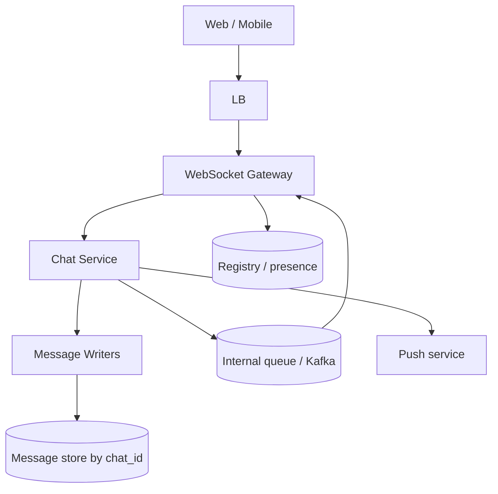
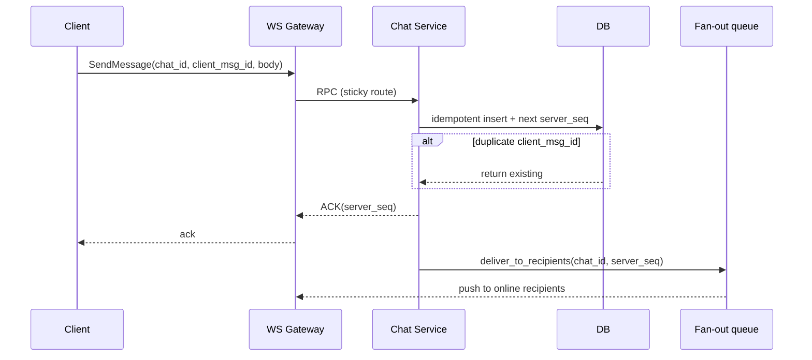

# HLD — WhatsApp Web / Messaging

## 1. Clarify requirements

### 1.1 Clarify 

| Topic | Say it like this in the room |
|--------------------------|-------------------------------|
| **Trust model** | “Are we designing **E2E**—or **TLS to server** so the server can index and moderate?” |
| **Chat shape** | “**1:1 only** or **groups**—and what’s the max **group** size for fan-out?” |
| **Retention** | “**Retention**, legal hold, **delete**—what does the product promise?” |
| **Multi-device** | “**Independent** sessions per device vs **phone-tethered** Web?” |
| **Features** | “**Read receipts**, **typing**, **presence**—in scope or nice-to-have?” |
| **Media** | “Max **payload** size, malware scan—anything that changes upload path?” |

**Micro-pauses:** *“So **ordering is per chat** via **server seq**, and **`client_msg_id`** handles dedupe.”*

### 1.2 Functional requirements (FR) — after alignment, say this as “what we must build”

#### Human interaction (FR — how to explain after alignment)

**Habit:** *“**Send**, **order**, **sync**—three beats.”*

| FR area | Say it like this in the room |
|---------|-------------------------------|
| **Messaging** | “Send/receive in a **chat**; **server** assigns **monotonic `server_seq`** per chat.” |
| **History** | “**REST** (or similar) **catch-up** with `after_seq`; all devices converge on **server order**.” |
| **Media** | “**Pre-signed URL** upload; message holds **handle + metadata**.” |
| **States** | “Delivery / read (if in scope); **typing** as **ephemeral**, best-effort.” |

**Messaging**

- Send/receive **messages** in a **chat** (1:1 or group).  
- **Server-assigned** monotonic **sequence** per chat for total order of delivery.  
- **Delivery** and **read** states (optional **typing**).

**History and sync**

- **Fetch history** with cursor (`after_seq`); **multi-device** convergence to same order.  
- **Offline:** persist locally; **push** notification when offline (product dependent).

**Media**

- Upload via **pre-signed URL** to object store; message references **handle + metadata**.

**Account / safety (high level)**

- Block/report flows if asked; **delete message** / **tombstone** semantics.

### 1.3 Non-functional requirements (NFR) — say as “how it must behave”

#### Human interaction (NFR — how to say “how it must behave”)

**Habit:** *“**Durability before ACK**; **at-least-once** with a dedupe story.”*

| NFR area | Say it like this in the room |
|----------|-------------------------------|
| **Durability** | “I only **ACK** after the message is **durably** committed—or I’m explicit about WAL tradeoffs.” |
| **Ordering** | “**Total order per `chat_id`**—I don’t pretend **global** order across chats.” |
| **Scale** | “**Billions/day** ⇒ **shard by chat_id**; expect **hot chats**.” |
| **Availability** | “**Typing** can drop before **messages** under pressure.” |
| **Security** | “**AuthZ** per chat; **rate limits** on send.” |

**Latency**

- Low latency for **online** delivery; typing can be **best-effort**.

**Durability**

- Messages **durable** after ACK policy you state (commit before ACK).

**Scalability**

- **Billions** of messages/day → **shard by chat_id**; horizontal gateways and consumers.

**Ordering**

- **Total order** per `chat_id` for what users see as “the thread.”

**Availability**

- Gateways and chat service **HA**; **degrade** typing before dropping messages.

**Security**

- **AuthN** on WS; **authZ** per chat membership; **rate limits**; abuse controls.

### 1.4 Invariants (one sentence you repeat under pressure)

**Invariant:** “For a given chat, **server-assigned order** is the **canonical** order for delivery; clients **dedupe** using **`client_msg_id`** (or equivalent).”

**Purpose:** handoff → **persist → seq → fan-out** diagram.

| Beat | Say it like this |
|------|------------------|
| **Bridge** | “**Effectively-once**: **at-least-once** transport + **idempotent** insert on `client_msg_id` + UI dedupe on **`server_seq`**.” |
| **Hot chat** | “Fan-out is **partitioned** by **`chat_id`**—I’ll rate-limit or **materialize** if the room pushes me there.” |

---

## 2. Estimate scale

#### Human interaction (estimate scale)

**Habit:** *“**Billions/day** is the mental default—tune down if they want.”*

| Topic | Say it like this in the room |
|-------|-------------------------------|
| **Shard** | “Writes and storage keyed by **`chat_id`**.” |
| **Hot chat** | “Viral thread ⇒ **partition tail**, **sub-queue**, or **materialized fan-out**.” |
| **Read path** | “History pulls plus live—**catch-up** must be **keyset** by seq.” |

| Dimension | Illustrative |
|-----------|----------------|
| Messages/day | **Billions** at WhatsApp scale (tune down if interviewer wants) |
| Shard key | **`chat_id`** for writes and storage |
| Hot chat | World Cup / viral → **rate limit**, **sub-queue**, or **materialized fan-out** |
| Read:write | History pulls + live mix |

**Tie it in one line:** “**Partition by chat**; optimize **send + catch-up**; plan for **hot partition** explicitly.”

---

## 3. APIs and data model

#### Human interaction (APIs & data model)

**Habit:** *“**WS** for live; **REST** for history; **keys** are `(chat_id, server_seq)`.”*

| Topic | Say it like this in the room |
|-------|-------------------------------|
| **APIs** | “**Connect** over WS; **SendMessage** with **`client_msg_id`**; **GET** messages with **`after_seq`**.” |
| **Model** | “Message row is **`chat_id` + `server_seq`**; device tracks **last ack’d seq**.” |

### 3.1 APIs (sketch)

| API | Purpose |
|-----|---------|
| `WS /v1/connect` | Authenticate; heartbeat |
| `SendMessage(chat_id, client_msg_id, body)` | Over WS or gRPC from GW |
| `GET /v1/chats/{id}/messages?after_seq=&limit=` | History / catch-up |
| `POST /v1/media/upload-url` | Pre-signed upload |

### 3.2 Data model

**Message:** `(chat_id, server_seq, client_msg_id, sender_id, body_ref, ts, flags)` — **primary key** `(chat_id, server_seq)` or partition + ordering key.

**Chat / membership:** `chat_id`, members, roles.

**Device state:** `last_delivered_seq`, `last_read_seq` per `(user, chat, device)`.

---

## 4. High-level architecture

#### Human interaction (high-level architecture / HLD)

**Habit:** *“**Sticky gateways** (or registry), **stateless-ish chat service**, **queue** closes the loop.”*

| Moment | Say it like this in the room |
|--------|------------------------------|
| **Path** | “Client → **LB** → **WS gateway** → **chat service** → **DB** by **`chat_id`**.” |
| **Fan-out** | “After commit, enqueue **deliver_to_recipients**; queue pushes back to **gateways**.” |
| **Registry** | “**Redis** maps user → gateway for the right **push** box.” |

**Media:** pre-signed **object storage**; message stores **pointer** only.

---

## 5. Deep dive: critical flow

#### Human interaction (deep dive — critical flow)

**Habit:** *“Trace **SendMessage** like the sequence diagram—no ACK fairy tales.”*

| Step | Say it like this in the room |
|------|-------------------------------|
| **Persist** | “**Idempotent** insert on **`client_msg_id`**; allocate **`server_seq`**.” |
| **ACK** | “Return **ACK** only after **durable** commit (or say WAL explicitly).” |
| **Deliver** | “Enqueue fan-out; **at-least-once** to gateways—clients **dedupe**.” |
| **Anchor** | “First metrics: **send p99**, queue **depth**, **duplicate** rate.” |

This is **step 5** of the [spine](#interview-spine-nine-steps)—where most Bar Raiser time should go.

### 5.1 Send message (sequence)

**Say:** “ACK after **durable** commit (or state your WAL/fsync tradeoff).”

### 5.2 WebSockets and sessions

- **Sticky** to gateway or **Redis registry** `user → gateway`.  
- **Heartbeat**; **reconnect** with backoff; **session takeover** with resume token.

### 5.3 Delivery and multi-device

- **At-least-once** delivery; **dedupe** on `(chat_id, client_msg_id)` or `server_seq`.  
- **Catch-up:** `GET …?after_seq=`; all devices **converge** on server order.

---

## 6. Scaling and bottlenecks

#### Human interaction (scaling & bottlenecks)

**Habit:** *“**Hot chat** partition is the headline risk.”*

| Topic | Say it like this in the room |
|-------|-------------------------------|
| **Hot chat** | “**Rate limit**, internal **sub-queue**, or **materialized inbox**.” |
| **Gateways** | “**Horizontal** replicas; **connection** limits per box.” |
| **Queue** | “Scale consumers; **shed typing** before messages.” |

| Risk | Mitigation |
|------|------------|
| **Hot chat** partition | Rate limit; internal sharding of fan-out; **materialized inbox** for huge groups |
| **Gateway** connection limit | Many nodes; **DRY** connection routing |
| Queue backlog | Scale consumers; **shed** typing |
| Storage size | **Tiering** cold chats to cheaper store; compaction |

**Optimizations:** batch small messages; **compress**; **keyset** pagination; typing **non-durable** path.

---

## 7. Reliability and failure handling

#### Human interaction (reliability & failure handling)

**Habit:** *“**Reconnect + replay**; **DLQ** for poison.”*

| Topic | Say it like this in the room |
|-------|-------------------------------|
| **GW crash** | “Client **reconnects**, **replays** from last **ACK’d seq**.” |
| **Dupes** | “Server **idempotent** insert; client **dedupe** on `server_seq`.” |
| **Multi-region** | “**Leader per chat** or eat latency; **fencing** if failover writers.” |

- **Gateway crash:** client **reconnect**, **replay** from last **ACK’d seq**.  
- **Duplicate delivery:** idempotent UI + server dedupe on `client_msg_id`.  
- **Partial fan-out failure:** retry with backoff; **DLQ** for poison.  
- **Multi-region (short):** **leader per chat** or higher latency global consistency; **fencing** for writer failover if needed.

---

## 8. Tradeoffs and alternatives

#### Human interaction (tradeoffs & alternatives)

**Habit:** *“**Push fan-out** vs **inbox materialization**—storage vs write complexity.”*

| Topic | Say it like this in the room |
|-------|-------------------------------|
| **Ordering** | “Strong per-chat order is simple; cost is **hot shard**.” |
| **Inbox** | “Materialize per-user inbox—**fast read home**, **write amplification**.” |

| Choice | Upside | Downside |
|--------|--------|----------|
| Strong per-chat order | Simple mental model | Hot shard |
| Per-user inbox materialization | Read cheap | Write amplification |
| Long poll vs WS | Simpler infra | Higher latency, more requests |

**Alternatives:** **gRPC streaming** instead of WS; **CRDT** for limited metadata (not full message body) if interviewer goes there.

---

## 9. Monitoring, observability, and security

#### Human interaction (monitoring, observability & security)

**Habit:** *“Trace **send → persist → deliver**.”*

| Topic | Say it like this in the room |
|-------|-------------------------------|
| **SLIs** | “Send **p99**, delivery **lag**, **disconnect** rate, queue **depth**.” |
| **Security** | “TLS; **token** scoped to chat; **GDPR delete** = tombstone + async scrub.” |

**SLIs:** send **p99**, delivery lag **p99**, WS **disconnect rate**, queue **depth**, DB write errors.

**Security:** TLS; **token** scoped to chat; **rate limit** sends; **content abuse** pipeline (async); **GDPR delete** = tombstone + async scrub from object store.

**Tracing:** span `send → persist → enqueue → push`.

---

## 10. Design patterns, data structures & best practices

Say **where** each pattern lives—registry, outbox, idempotent consumer—not a laundry list.

### 10.1 Distributed / real-time patterns

| Pattern | Where | Why |
|---------|--------|-----|
| **Connection registry** | Gateway ↔ user session | Route push to correct box |
| **Back-pressure** | WS send path | Avoid OOM when client slow |
| **Circuit breaker** | Downstream DB / push | Fail fast; shed load |
| **Bulkhead** | Separate pools for **send** vs **presence** | One path cannot starve the other |
| **Outbox / WAL** | After DB commit enqueue delivery | No lost messages on crash |
| **Idempotent consumer** | Delivery worker | At-least-once safe |
| **Leader election** | Per-chat writer (optional) | Ordering + failover without split brain |

### 10.2 Classic patterns

| Pattern | Map |
|---------|-----|
| **State machine** | Message: accepted → persisted → delivered → read (optional) |
| **Command** | `SendMessage` handler isolates validation + persist |
| **Observer** | Presence / typing fan-out (careful: rate limit) |
| **Strategy** | Long-poll vs WS vs SSE per client capability |

### 10.3 Data structures

| Need | Structure |
|------|-----------|
| Per-chat order | Monotonic **server_seq** (bigint) |
| Dedupe | **Set** or DB unique on `(chat_id, client_msg_id)` |
| Unread counts | **Counter** per user+chat or materialized inbox row |
| Hot fan-out | **Partitioned** outbox queue by `chat_id` |

### 10.4 Best practices

- **Persist before push**; ack only after durable write.  
- **Client idempotency** + server sequence for ordering UI.  
- **Pagination** keyset on `(server_seq)` not offset.

### 10.5 Trade-offs

| Pick | Trade |
|------|--------|
| Per-user inbox materialization | Fast read home vs **write amplification** |
| Pull (catch-up API) | Simple recovery vs **latency** vs push |

#### Human interaction (design patterns, data structures & best practices)

**Habit:** *“**Registry**, **outbox/WAL**, **idempotent consumer**, **circuit breaker**—one line each.”*

| You mean… | Say it like this in the room |
|-----------|-------------------------------|
| **Patterns** | “**Connection registry** routes push; **outbox** after commit; **breaker** on flaky deps; **bulkhead** typing vs send.” |
| **DS** | “**`(chat_id, server_seq)`** key; dedupe set on **`client_msg_id`**; **keyset** history.” |

---

## Closing notes (where wrap-up human interaction lives)

Use **`#### Human interaction`** under [Bar-raiser](#bar-raiser-follow-ups) and [60-second close](#60-second-close).

---

## Bar-raiser follow-ups

#### Human interaction (bar-raiser)

**Habit:** two–four sentences, then **stop**.

| They ask | Say it like this |
|----------|------------------|
| **Exactly-once?** | “**Effectively-once**: at-least-once + **idempotent** writes + client **dedupe** on **`server_seq`**.” |
| **Cross-region?** | “**Leader region per chat** or accept latency; **consistent routing**.” |

---

## 60-second close

#### Human interaction (60-second close)

**Habit:** one **net-net** pass.

| Beat | Say it like this in the room |
|------|------------------------------|
| **Recap** | “**WS gateways** + **registry**; **durable** write then **`server_seq`**; **ACK**; **queue fan-out**; **at-least-once** + **`client_msg_id`** dedupe; **catch-up** by seq; **hot chat** = partition + limits + maybe **materialized fan-out**.” |

---
