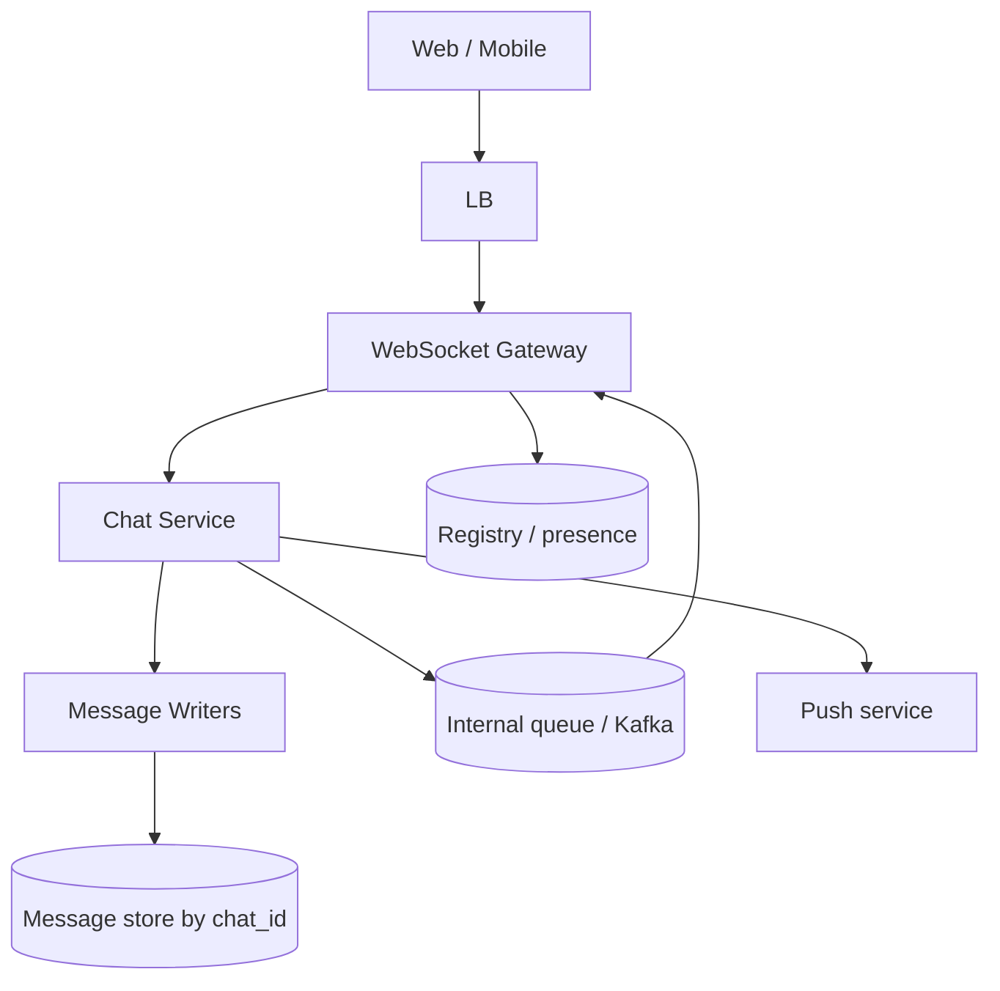
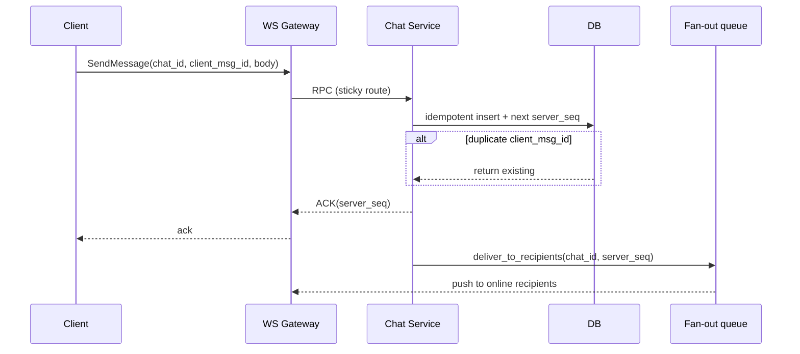

# HLD — WhatsApp Web / Messaging

> **GitHub README style** — pair with [HLD-README.md](./HLD-README.md).

| | |
|--|--|
| **Round** | 45–60 min |
| **Strong-hire hooks** | **WebSockets + connection registry**, **at-least-once + client dedupe**, **per-chat ordering**, **gateway failover replay** |

---

## Table of contents

**Prep**

- [Interview plan](#interview-plan)
- [SDE-2 drive kit (Senior interviewer)](#sde-2-drive-kit-senior-interviewer)
- [Strong-hire signals](#strong-hire-signals)
- [Coverage map](#coverage-map)

**Interview spine (nine steps)**

- [Interview spine (nine steps)](#interview-spine-nine-steps)
- [1. Clarify requirements](#1-clarify-requirements)
- [2. Estimate scale](#2-estimate-scale)
- [3. APIs and data model](#3-apis-and-data-model)
- [4. High-level architecture](#4-high-level-architecture)
- [5. Deep dive: critical flow](#5-deep-dive-critical-flow)
- [6. Scaling and bottlenecks](#6-scaling-and-bottlenecks)
- [7. Reliability and failure handling](#7-reliability-and-failure-handling)
- [8. Tradeoffs and alternatives](#8-tradeoffs-and-alternatives)
- [9. Monitoring, observability, and security](#9-monitoring-observability-and-security)
- [10. Design patterns, data structures & best practices](#10-design-patterns-data-structures--best-practices)

**Wrap-up**

- [Bar-raiser follow-ups](#bar-raiser-follow-ups)
- [Strong Hire room checklist](#strong-hire-room-checklist)
- [60-second close](#60-second-close)

---

## Interview plan

> “I’ll clarify **E2E scope**—I’ll assume **TLS to server** unless you want full E2E—group sizes, and retention. Architecture: **stateful WS gateways**, **chat service** for **durability**, **per-chat shard** for ordering, **Kafka/internal queue** for fan-out. I’ll deep dive **send message**: persist → assign **server seq** → ACK → deliver. Pause me if you want **multi-region** or **group fan-out** first.”

---

## SDE-2 drive kit (Senior interviewer)

### A. Lock the agenda

Clarify → scale → APIs/model → diagram → **send path** (persist, seq, ack, fan-out) → **sync/read** → scale hot chat → reliability → tradeoffs → observability/security. **Pause:** “Depth on **delivery semantics**, **groups**, or **multi-device** first?”

### B. Questions — **this order**

| # | Ask |
|---|-----|
| 1 | “**E2E** encryption in scope or **TLS to server** assumption?” |
| 2 | “Max **group** size / fan-out expectations?” |
| 3 | “**Retention** / legal hold / delete semantics?” |
| 4 | “**Multi-device**—independent sessions vs phone-tethered?” |
| 5 | “Delivery: **read receipts** / typing required?” |
| 6 | “Media max size / malware scanning?” |

**Mirror:** “So ordering is **per chat**, and duplicates are handled with **client_msg_id**.”

### C. Winning line per spine

| Step | Sentence |
|------|----------|
| 1 | “**Server owns total order** per chat via **monotonic seq**.” |
| 2 | “Billions/day ⇒ **shard by chat_id**; expect **hot chats**.” |
| 3 | “WS + **REST** for history; messages keyed by `(chat_id, server_seq)`.” |
| 4 | “Gateways **stateful**; chat service **stateless** aside from DB.” |
| 5 | “**Persist before ACK**; then **queue fan-out**; **at-least-once** + dedupe.” |
| 6 | “Hot partition: **rate limit**, **sub-queue**, maybe **materialized fan-out**.” |
| 7 | “Reconnect **replay** from last ack’d seq; typing is **ephemeral**.” |
| 8 | “Push fan-out vs **inbox materialization** trade storage for read.” |
| 9 | “Trace **send→persist→deliver**; authZ per chat; abuse **rate limits**.” |

### D. Whiteboard order

1. Client–LB–**WS GW**–Chat–DB + **Queue** loop to GW.  
2. Sequence **SendMessage** only until stable.  
3. Add **registry** (Redis) if time.

### E. Senior probes

| Probe | Answer |
|-------|--------|
| “Exactly-once?” | “**Effectively-once**: at-least-once + **idempotent** insert on `client_msg_id` + UI dedupe on `server_seq`.” |
| “Ordering across shards?” | “**Don’t**—ordering scoped to **chat**; cross-chat irrelevant.” |
| “Cross-region?” | “**Leader region per chat** or higher latency global ordering; **fencing** if failover writers.” |

### F. Time crunched

**Send path** + **dedupe/replay** only.

### G. Anti-patterns

- ACK before **durable** write without stating policy.  
- Ignoring **hot group** fan-out.  
- “We’ll use Kafka” with no **partition key** (`chat_id`).

---

## Strong-hire signals

- **Persist before fan-out** (or WAL) explicit.  
- **`client_msg_id`** for **idempotency** / dedupe.  
- **Reconnect** with `after_seq` + **replay**.  
- **Backpressure:** typing drops before messages.

---

## Coverage map

- [ ] [Nine-step spine](#interview-spine-nine-steps)  
- [ ] WS vs long poll  
- [ ] Sticky routing / connection registry  
- [ ] Per-chat **monotonic seq**  
- [ ] At-least-once + dedupe  
- [ ] Offline + push  
- [ ] Media signed URL path  
- [ ] Group fan-out vs 1:1  
- [ ] GDPR / delete  

---

## Interview spine (nine steps)

| Step | What you deliver | Section |
|------|------------------|---------|
| **1** | Clarify requirements | [§1](#1-clarify-requirements) |
| **2** | Estimate scale | [§2](#2-estimate-scale) |
| **3** | APIs / data model | [§3](#3-apis-and-data-model) |
| **4** | High-level architecture | [§4](#4-high-level-architecture) |
| **5** | Deep dive critical flow | [§5](#5-deep-dive-critical-flow) |
| **6** | Scaling / bottlenecks | [§6](#6-scaling-and-bottlenecks) |
| **7** | Reliability / failure handling | [§7](#7-reliability-and-failure-handling) |
| **8** | Tradeoffs / alternatives | [§8](#8-tradeoffs-and-alternatives) |
| **9** | Monitoring / security | [§9](#9-monitoring-observability-and-security) |

---

## 1. Clarify requirements

### 1.1 Questions to ask first

| Question | Why it matters |
|----------|----------------|
| Full **E2E** vs **TLS to server**? | Server visibility, indexing |
| 1:1 only vs **groups**? | Fan-out |
| Max **group size**? | Delivery architecture |
| Message types: text, image, video, system? | Upload path, quotas |
| **Retention** / legal hold / export? | Storage, deletion |
| **Multi-device** independent vs phone-tethered? | Sync model |
| Read receipts / typing / presence in scope? | Traffic class |

### 1.2 Functional requirements (FR)

**Messaging**

- Send/receive **messages** in a **chat** (1:1 or group).  
- **Server-assigned** monotonic **sequence** per chat for total order of delivery.  
- **Delivery** and **read** states (optional **typing**).

**History and sync**

- **Fetch history** with cursor (`after_seq`); **multi-device** convergence to same order.  
- **Offline:** persist locally; **push** notification when offline (product dependent).

**Media**

- Upload via **pre-signed URL** to object store; message references **handle + metadata**.

**Account / safety (high level)**

- Block/report flows if asked; **delete message** / **tombstone** semantics.

### 1.3 Non-functional requirements (NFR)

**Latency**

- Low latency for **online** delivery; typing can be **best-effort**.

**Durability**

- Messages **durable** after ACK policy you state (commit before ACK).

**Scalability**

- **Billions** of messages/day → **shard by chat_id**; horizontal gateways and consumers.

**Ordering**

- **Total order** per `chat_id` for what users see as “the thread.”

**Availability**

- Gateways and chat service **HA**; **degrade** typing before dropping messages.

**Security**

- **AuthN** on WS; **authZ** per chat membership; **rate limits**; abuse controls.

### 1.4 Invariant

**Invariant:** “For a given chat, **server-assigned order** is the **canonical** order for delivery; clients **dedupe** using **`client_msg_id`** (or equivalent).”

---

## 2. Estimate scale

| Dimension | Illustrative |
|-----------|----------------|
| Messages/day | **Billions** at WhatsApp scale (tune down if interviewer wants) |
| Shard key | **`chat_id`** for writes and storage |
| Hot chat | World Cup / viral → **rate limit**, **sub-queue**, or **materialized fan-out** |
| Read:write | History pulls + live mix |

---

## 3. APIs and data model

### 3.1 APIs (sketch)

| API | Purpose |
|-----|---------|
| `WS /v1/connect` | Authenticate; heartbeat |
| `SendMessage(chat_id, client_msg_id, body)` | Over WS or gRPC from GW |
| `GET /v1/chats/{id}/messages?after_seq=&limit=` | History / catch-up |
| `POST /v1/media/upload-url` | Pre-signed upload |

### 3.2 Data model

**Message:** `(chat_id, server_seq, client_msg_id, sender_id, body_ref, ts, flags)` — **primary key** `(chat_id, server_seq)` or partition + ordering key.

**Chat / membership:** `chat_id`, members, roles.

**Device state:** `last_delivered_seq`, `last_read_seq` per `(user, chat, device)`.

---

## 4. High-level architecture

**Media:** pre-signed **object storage**; message stores **pointer** only.

---

## 5. Deep dive: critical flow

### 5.1 Send message (sequence)

**Say:** “ACK after **durable** commit (or state your WAL/fsync tradeoff).”

### 5.2 WebSockets and sessions

- **Sticky** to gateway or **Redis registry** `user → gateway`.  
- **Heartbeat**; **reconnect** with backoff; **session takeover** with resume token.

### 5.3 Delivery and multi-device

- **At-least-once** delivery; **dedupe** on `(chat_id, client_msg_id)` or `server_seq`.  
- **Catch-up:** `GET …?after_seq=`; all devices **converge** on server order.

---

## 6. Scaling and bottlenecks

| Risk | Mitigation |
|------|------------|
| **Hot chat** partition | Rate limit; internal sharding of fan-out; **materialized inbox** for huge groups |
| **Gateway** connection limit | Many nodes; **DRY** connection routing |
| Queue backlog | Scale consumers; **shed** typing |
| Storage size | **Tiering** cold chats to cheaper store; compaction |

**Optimizations:** batch small messages; **compress**; **keyset** pagination; typing **non-durable** path.

---

## 7. Reliability and failure handling

- **Gateway crash:** client **reconnect**, **replay** from last **ACK’d seq**.  
- **Duplicate delivery:** idempotent UI + server dedupe on `client_msg_id`.  
- **Partial fan-out failure:** retry with backoff; **DLQ** for poison.  
- **Multi-region (short):** **leader per chat** or higher latency global consistency; **fencing** for writer failover if needed.

---

## 8. Tradeoffs and alternatives

| Choice | Upside | Downside |
|--------|--------|----------|
| Strong per-chat order | Simple mental model | Hot shard |
| Per-user inbox materialization | Read cheap | Write amplification |
| Long poll vs WS | Simpler infra | Higher latency, more requests |

**Alternatives:** **gRPC streaming** instead of WS; **CRDT** for limited metadata (not full message body) if interviewer goes there.

---

## 9. Monitoring, observability, and security

**SLIs:** send **p99**, delivery lag **p99**, WS **disconnect rate**, queue **depth**, DB write errors.

**Security:** TLS; **token** scoped to chat; **rate limit** sends; **content abuse** pipeline (async); **GDPR delete** = tombstone + async scrub from object store.

**Tracing:** span `send → persist → enqueue → push`.

---

## 10. Design patterns, data structures & best practices

### 10.1 Distributed / real-time patterns

| Pattern | Where | Why |
|---------|--------|-----|
| **Connection registry** | Gateway ↔ user session | Route push to correct box |
| **Back-pressure** | WS send path | Avoid OOM when client slow |
| **Circuit breaker** | Downstream DB / push | Fail fast; shed load |
| **Bulkhead** | Separate pools for **send** vs **presence** | One path cannot starve the other |
| **Outbox / WAL** | After DB commit enqueue delivery | No lost messages on crash |
| **Idempotent consumer** | Delivery worker | At-least-once safe |
| **Leader election** | Per-chat writer (optional) | Ordering + failover without split brain |

### 10.2 Classic patterns

| Pattern | Map |
|---------|-----|
| **State machine** | Message: accepted → persisted → delivered → read (optional) |
| **Command** | `SendMessage` handler isolates validation + persist |
| **Observer** | Presence / typing fan-out (careful: rate limit) |
| **Strategy** | Long-poll vs WS vs SSE per client capability |

### 10.3 Data structures

| Need | Structure |
|------|-----------|
| Per-chat order | Monotonic **server_seq** (bigint) |
| Dedupe | **Set** or DB unique on `(chat_id, client_msg_id)` |
| Unread counts | **Counter** per user+chat or materialized inbox row |
| Hot fan-out | **Partitioned** outbox queue by `chat_id` |

### 10.4 Best practices

- **Persist before push**; ack only after durable write.  
- **Client idempotency** + server sequence for ordering UI.  
- **Pagination** keyset on `(server_seq)` not offset.

### 10.5 Trade-offs

| Pick | Trade |
|------|--------|
| Per-user inbox materialization | Fast read home vs **write amplification** |
| Pull (catch-up API) | Simple recovery vs **latency** vs push |

---

## Bar-raiser follow-ups

**Q: “Exactly-once?”**  
A: “**Effectively-once**: at-least-once transport + **idempotent** writes + client **dedupe**.”

**Q: “Cross-region chat?”**  
A: “**Leader region per chat** or accept latency; route users consistently.”

---

## Strong Hire room checklist

- [ ] Spine **1→9**  
- [ ] **Persist before fan-out**  
- [ ] `client_msg_id` + **server_seq**  
- [ ] Hot chat + fan-out plan  
- [ ] Security: membership + rate limits  

---

## 60-second close

“**WS gateways** + **registry**; **chat service** assigns **monotonic server_seq** per chat after **durable** write; **at-least-once** delivery with **client dedupe**; **seq catch-up** + **queue fan-out**; **hot chats** via **partition affinity**, **limits**, optional **materialized fan-out**.”
